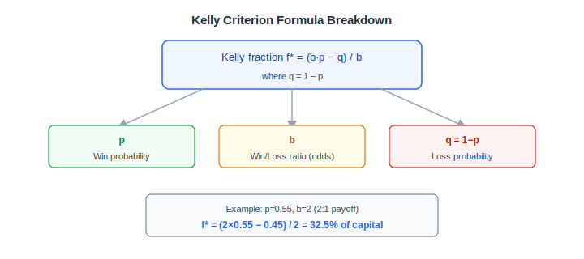
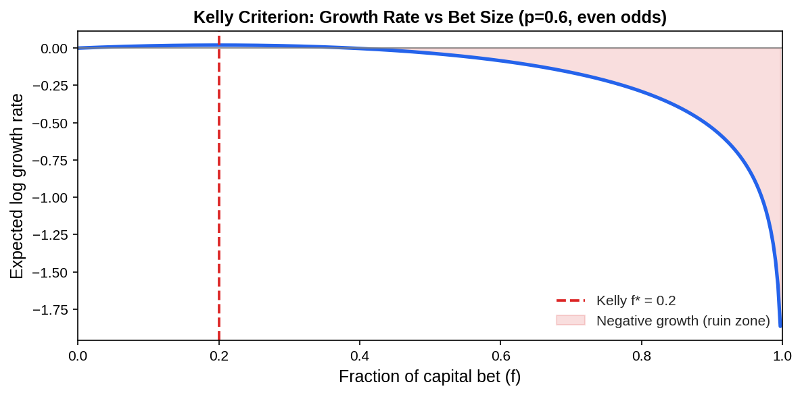
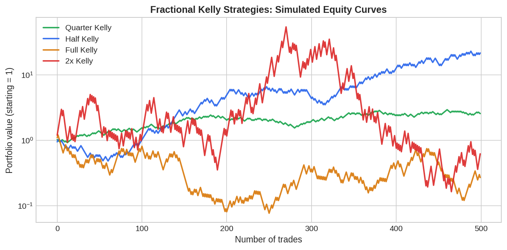

# Kelly Criterion: Position Sizing for Algo Traders

The Kelly Criterion is a mathematical formula that tells you the optimal fraction of your capital to risk on each trade to maximise long-run portfolio growth. Developed by physicist John Kelly Jr. at Bell Labs in 1956, it has become a cornerstone of position sizing in algorithmic trading because it uniquely balances aggressive growth against the risk of catastrophic drawdown. Unlike fixed-percent or fixed-dollar sizing, the Kelly Criterion adapts to the statistical edge of your strategy.

## What Is the Kelly Criterion?

The Kelly Criterion gives the fraction $f^*$ of capital to allocate to a single bet or trade:

$$f^* = \frac{b \cdot p - q}{b}$$

where:
- $p$ = probability of a winning trade
- $q = 1 - p$ = probability of a losing trade
- $b$ = ratio of average win to average loss (the "odds")

For a strategy with $p = 0.55$ and a 2:1 payoff ratio ($b = 2$):

$$f^* = \frac{2 \times 0.55 - 0.45}{2} = \frac{0.65}{2} = 0.325$$

You would size each trade at 32.5% of current equity.



## How It Works

The Kelly formula is derived by maximising the expected value of the **logarithm** of wealth — not wealth itself. This is the key insight: because compounding is multiplicative, a sequence of trades multiplies your equity. Maximising $E[\log(W)]$ is equivalent to maximising the long-run geometric growth rate.

The expected log growth per trade at fraction $f$ is:

$$G(f) = p \cdot \ln(1 + b \cdot f) + q \cdot \ln(1 - f)$$

Setting $\frac{dG}{df} = 0$ yields the Kelly fraction. Over-betting beyond $f^*$ **reduces** long-term growth and eventually leads to ruin. The chart below shows this clearly — growth peaks at $f^*$ and turns negative once you bet too aggressively.



## Python Implementation

Here is a complete, runnable Kelly position sizer you can drop into any backtesting pipeline:

```python
import numpy as np
import pandas as pd


def kelly_fraction(win_rate: float, win_loss_ratio: float) -> float:
    """
    Compute the full Kelly fraction.

    Parameters
    ----------
    win_rate : float
        Fraction of trades that are winners (0 < win_rate < 1).
    win_loss_ratio : float
        Average win / average loss (must be > 0).

    Returns
    -------
    float
        Optimal fraction of capital to risk per trade.
        Clipped to [0, 1] — never short, never all-in.
    """
    q = 1 - win_rate
    f = (win_loss_ratio * win_rate - q) / win_loss_ratio
    return float(np.clip(f, 0.0, 1.0))


def fractional_kelly(
    returns: pd.Series,
    fraction: float = 0.5,
    lookback: int = 100,
) -> pd.Series:
    """
    Rolling fractional Kelly position sizes from a return series.

    Parameters
    ----------
    returns : pd.Series
        Per-trade or per-bar returns (decimal, e.g. 0.02 for +2%).
    fraction : float
        Multiplier applied to the full Kelly (0.5 = half Kelly).
    lookback : int
        Rolling window (number of observations) to estimate statistics.

    Returns
    -------
    pd.Series
        Position size as a fraction of capital at each step.
    """
    sizes = []
    for i in range(len(returns)):
        window = returns.iloc[max(0, i - lookback):i]
        if len(window) < 20:
            sizes.append(0.0)
            continue
        wins = window[window > 0]
        losses = window[window < 0]
        if len(wins) == 0 or len(losses) == 0:
            sizes.append(0.0)
            continue
        win_rate = len(wins) / len(window)
        avg_win = wins.mean()
        avg_loss = abs(losses.mean())
        wl_ratio = avg_win / avg_loss if avg_loss > 0 else 1.0
        f = kelly_fraction(win_rate, wl_ratio)
        sizes.append(f * fraction)
    return pd.Series(sizes, index=returns.index)


# --- Quick demo ---
if __name__ == "__main__":
    np.random.seed(42)
    # Simulate strategy with slight edge
    raw_returns = np.where(
        np.random.rand(500) < 0.55,
        np.random.exponential(0.01, 500),   # wins
        -np.random.exponential(0.008, 500), # losses
    )
    ret = pd.Series(raw_returns)

    # Full Kelly
    f_full = kelly_fraction(0.55, 1.25)
    print(f"Full Kelly: {f_full:.1%}")

    # Half Kelly rolling
    sizes = fractional_kelly(ret, fraction=0.5)
    print(f"Mean rolling half-Kelly size: {sizes.mean():.1%}")
```

## Fractional Kelly: The Practical Standard

Full Kelly sizing is theoretically optimal but produces extreme volatility — drawdowns of 50%+ are common even with a genuine edge. In practice, algo traders almost always use **fractional Kelly**: multiply the raw Kelly output by 0.25–0.5.

The chart below shows simulated equity curves over 500 trades (p=0.55, even odds) for different Kelly multiples:



Key takeaways:
- **Quarter Kelly** grows slowly but smoothly — preferred for live trading.
- **Half Kelly** balances growth and drawdown well — the most common choice.
- **Full Kelly** maximises terminal wealth but with gut-wrenching volatility.
- **2× Kelly** (overbetting) looks good short-term but destroys wealth long-term.

## Key Parameters and Variants

| Variant | Formula | Use Case |
|---|---|---|
| Full Kelly | $f^* = (bp - q)/b$ | Theoretical maximum growth |
| Fractional Kelly | $f = \alpha \cdot f^*$, $\alpha \in (0,1)$ | Reduced volatility, live trading |
| Multi-asset Kelly | Covariance matrix solution | Portfolio of correlated strategies |
| Continuous Kelly | $f^* = \mu / \sigma^2$ | For normally distributed returns |

For a portfolio of $n$ uncorrelated strategies, the Kelly fractions are computed independently and summed — but when strategies are correlated you need the matrix generalisation: $\mathbf{f}^* = \mathbf{C}^{-1} \boldsymbol{\mu}$, where $\mathbf{C}$ is the covariance matrix of returns and $\boldsymbol{\mu}$ is the vector of expected returns.

## Limitations and Risks

**Estimation error is the biggest danger.** The Kelly formula is extremely sensitive to the inputs $p$ and $b$. A 5% overestimate of your win rate can push you well past the optimal and into ruin territory. Always use conservative estimates or apply shrinkage.

**Kelly assumes independent, identically distributed bets.** Real strategies have autocorrelated returns, regime changes, and fat tails — all of which violate the Kelly assumptions. This is another reason to use fractional Kelly.

**It ignores transaction costs and slippage.** In live trading, each rebalance has a cost. High Kelly fractions that suggest frequent large position changes may be impractical.

**It does not account for margin constraints.** When $f^* > 1$, Kelly implies leverage. This requires a broker that offers margin and exposes you to forced liquidation.

For a deeper theoretical treatment, Thorp (2006) "The Kelly Criterion in Blackjack, Sports Betting and the Stock Market" remains the definitive reference.

## Conclusion

The Kelly Criterion provides a rigorous, mathematically optimal answer to position sizing when you have a quantifiable edge. In practice, half-Kelly is the go-to choice for algo traders: it retains most of the growth benefit while cutting drawdowns roughly in half. The most important step is estimating your edge honestly — over-confidence in your backtest win rate is far more dangerous than ignoring Kelly altogether.

---

**Explore further on PapersWithBacktest:**
- Browse [backtested position sizing strategies](https://paperswithbacktest.com/strategies) with Python code and performance metrics
- Access [clean historical market data](https://paperswithbacktest.com/datasets) for equities, crypto, and futures
- Take the [algo trading course](https://paperswithbacktest.com/course) — 60+ video lessons and notebooks
- Related wiki pages: [Sharpe Ratio](https://paperswithbacktest.com/wiki/sharpe-ratio) · [Risk Management in Algo Trading](https://paperswithbacktest.com/wiki/risk-management) · [Backtesting](https://paperswithbacktest.com/wiki/backtesting)
