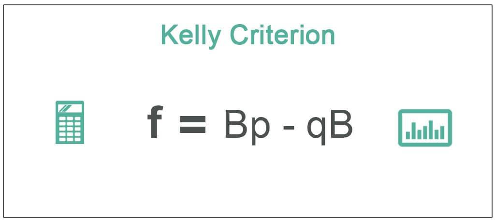

The Kelly Criterion, a pivotal concept in probability theory, is vital for decision-making in betting and investments. Introduced by John Larry Kelly Jr. in 1956, while working at Bell Labs, the Kelly Criterion provides a formula for determining the optimal size of a series of bets. This approach is groundbreaking because it offers a scientifically grounded method for maximizing the long-term expected geometric growth rate of wealth, particularly when outcomes are uncertain.

The significance of the Kelly Criterion lies in its mathematical elegance and practical application in various fields. By focusing on maximizing geometric rather than arithmetic returns, it acknowledges the compounded nature of real-world gains and losses. This distinction is crucial: while arithmetic returns can suggest a simple average gain per period, geometric returns take into account the effects of compounding, which is more reflective of actual wealth growth over time.



Kelly's original work was framed in the context of information theory and communications, but the implications extended far beyond. The criterion's ability to dictate the fraction of capital to wager based on the probability of a favorable outcome and the payoff odds makes it a valuable tool not only in gambling but also in investment and financial markets.

In essence, the Kelly Criterion addresses the fundamental question of how much to bet in a repeated game to ensure the highest possible long-term growth rate of capital. It does this by identifying a betting strategy that balances risk and reward, allowing participants to remain solvent and maximize wealth over time. The formula takes into consideration the probability of winning, losing, and the ratio of losses to wins, providing a clear directive for optimal capital allocation.

## Table of Contents

## The Kelly Criterion Formula

The Kelly Criterion Formula offers a strategic method for determining the optimal fraction of capital to invest or bet on a particular outcome to maximize the logarithm of wealth. At its core, for binary outcomes, the formula is expressed as:

$$
f^* = \frac{bp - q}{b}
$$

where:

- $f^*$ represents the fraction of the capital to wager,
- $p$ is the probability of winning,
- $q$ is the probability of losing, which is $1 - p$,
- $b$ denotes the odds received on the wager.

This formula essentially calculates the size of a bet that will maximize expected logarithmic growth, striking a balance between taking advantage of favorable odds and limiting exposure to risk.

In practical terms, if the odds (b) are favorable and the probability of winning (p) is high, the Kelly Criterion suggests a larger bet, whereas unfavorable odds or lower probabilities of winning will result in a smaller advised wager.

The Kelly Criterion also adapts well to situations involving partial losses, which are commonplace in investments as opposed to simple binary bets. It achieves this by accommodating fractional outcomes and returns. In these scenarios, the criterion takes into account not just winning or losing, but the partial returns involved, adjusting the strategy to align with the varying nature of investment risk and reward. 

In investment contexts, the formula may be utilized to determine the proportion of an investment in assets with positive expected returns while accounting for the variability and risk associated with partial losses. By considering fractional Kelly strategies, investors can mitigate risks of overexposure to volatile assets while optimizing their portfolio for long-term growth. This nuanced adaptation underscores the criterion’s flexibility and robustness in managing diverse financial scenarios.

## Application of the Kelly Criterion in Algorithmic Trading

The Kelly Criterion is a mathematical formula used to determine the optimal size of a series of bets, which can be directly applied to [algorithmic trading](/wiki/algorithmic-trading) strategies. By calculating the proportion of capital to allocate to a given investment based on the expected return and probability of success, traders can maximize their long-term growth potential. This approach, especially in the highly structured environment of algorithmic trading, helps in determining the proportion of the portfolio to risk on each trade. 

To integrate the Kelly Criterion in diversification strategies, it is used alongside other portfolio management strategies to balance the risk across different investments. By allocating funds according to the Kelly Criterion, traders can effectively manage their risk exposure and optimize their returns. As a result, a portfolio can be constructed that is not only diversified in terms of asset types and sectors but also in terms of risk profile and expected returns. This means using the Kelly Criterion allows for a dynamic adjustment of investment weights based on changing market conditions, ensuring that the portfolio remains optimized for long-term growth.

For automated trading systems, integrating the Kelly Criterion simplifies the decision-making process for trade sizing. Given the Criterion’s ability to mathematically balance risk and reward, it provides a systematic approach to risk management, which is essential in the fast-paced environment of algorithmic trading. The formulas and calculations can be embedded in the trading algorithms to automatically adjust the size of the positions to maintain the optimal balance dictated by the Kelly Criterion.

```python
def kelly_criterion(prob_win, odds):
    """
    Calculate the Kelly Criterion.

    :param prob_win: Probability of winning
    :param odds: Net odds received on the wager (b in traditional formula)
    :return: Optimal fraction of bankroll to wager
    """
    return (prob_win * (odds + 1) - 1) / odds

# Example usage
prob_win = 0.55  # 55% chance of winning
odds = 1         # Even odds
optimal_fraction = kelly_criterion(prob_win, odds)
print(f"Optimal Fraction to Invest: {optimal_fraction:.2%}")
```

Finally, adopting Kelly's methods in automated trading systems offers several benefits, including enhanced performance through statistically guided trade sizing, which contributes to a more disciplined and systematic investment approach. By focusing on the long-term growth potential and optimal risk management, trading algorithms can achieve higher efficiency and resilience against market fluctuations. Consequently, traders and investors can witness sustained growth and improved risk-adjusted returns, making the Kelly Criterion a valuable component of any sophisticated trading strategy.

## Advantages of Using the Kelly Criterion

The Kelly Criterion stands out for its mathematical rigor in maximizing the growth of one's wealth over the long term. It is rooted in the principle of optimizing the geometric mean of wealth, which ensures sustainable growth by reinvesting a calculated portion of available capital. By leveraging a formula that [factor](/wiki/factor-investing)s in probabilities and outcomes, the Kelly Criterion allows investors to balance their risk with potential reward effectively.

The central approach of the Kelly Criterion is to identify the optimal fraction of capital to wager or invest in an activity with uncertain outcomes. This optimal fraction $f^*$ is determined by the formula:

$$
f^* = \frac{bp - q}{b}
$$

where:

- $p$ is the probability of a winning outcome,
- $q$ is the probability of a losing outcome (i.e., $1 - p$),
- $b$ is the odds or the ratio of the profit to the stake.

This formula mathematically ensures that gains are maximized in such a way that the compounding effect of returns can work over the long term. Essentially, it advises scaling back investments as the risk increases, maintaining a balance between maximizing expected returns and protecting against significant losses.

Moreover, the beauty of the Kelly Criterion is its application to maintaining a delicate balance between risk and reward. By adjusting the fraction of the capital invested based on changing probabilities and odds, it prevents overly aggressive betting that could result in significant short-term losses. This built-in conservatism helps in managing the [volatility](/wiki/volatility-trading-strategies) of returns, providing a smoother growth curve for capital over time.

Prominent investors, such as Warren Buffett and Bill Gross, have reportedly applied principles akin to the Kelly Criterion in their investment strategies. Buffett’s principle of betting big when the odds are in his favor echoes the core premise of Kelly's approach — to capitalize on the most favorable bets rather than spreading resources thinly. This philosophy has contributed to his long-term success, demonstrating the practical applicability of this mathematical approach beyond just theoretical constructs.

In summary, the Kelly Criterion provides a framework that combines mathematical precision with practical investment strategies, ensuring that investors can achieve sustained growth while managing risks effectively.

## Challenges and Criticisms

The Kelly Criterion, while a powerful tool for maximizing long-term wealth growth, is not without its challenges and criticisms. One major challenge in applying the Kelly Criterion is the necessity for accurate probability estimates. The formula's efficacy depends heavily on precise inputs regarding the probability of winning (denoted as $p$) and the odds offered (denoted as $b$). These probabilities are often dynamic and difficult to estimate accurately, leading to a significant risk of incorrect calculation. This uncertainty can result in either overbetting or underbetting relative to the true optimal strategy.

Economists have critiqued the Kelly Criterion for its foundation on theoretical assumptions that may not hold true for all investors. One major point of contention is its compatibility with utility theory. The Kelly Criterion inherently assumes that investors have logarithmic utility, focusing solely on maximizing the geometric growth of wealth. This assumption may not align with individual risk preferences, which vary widely. Many individuals prioritize risk aversion or derive utility from steady income rather than maximal growth potential, rendering the Kelly Criterion unsuitable in such cases.

Additionally, the Kelly Criterion faces criticism because of its potential for severe miscalculations if model inputs are incorrect. Overestimating one's edge can result in aggressive betting, potentially leading to significant losses. Thus, fractional Kelly strategies have been advocated as a more cautious approach. By betting only a fraction of the suggested amount, investors can mitigate the risk associated with inaccurate estimates while still enjoying some benefits of the Kelly approach.

In practice, fractional Kelly strategies are employed to accommodate for varying degrees of uncertainty and individual preferences. By reducing the bet size, say to half or a quarter of the full Kelly bet, investors aim to reduce volatility and drawdowns, making the strategy more palatable and applicable across different market conditions.

Overall, while the Kelly Criterion provides a mathematical framework for maximizing returns, its application is challenging. It requires precise probability estimates and often conflicts with individual utility preferences, calling for adaptations like fractional Kelly betting to bridge the gap between theory and practice.

## Practical Examples and Illustrations

To understand the Kelly Criterion's practical application in algorithmic trading, let's consider a hypothetical example. Imagine an algorithm that trades based on a predictive model which estimates the probability of a stock price rising (p) as 0.6, with a complementary probability of falling (q) as 0.4. Assume that if the prediction is correct, the model yields a return (b) of 1:1 (i.e., doubling the investment).

The Kelly Criterion formula is given by:

$$
f^* = \frac{bp - q}{b}
$$

Substituting the values into the formula:

$$
f^* = \frac{(1)(0.6) - 0.4}{1} = 0.2
$$

This indicates that 20% of the trading capital should be allocated to this particular trade for optimal growth.

### Behavioral Experiments

Behavioral experiments underscore the effectiveness of using the Kelly Criterion in practice. Studies show that traders who adopt Kelly's methods often outperform those who do not, primarily due to disciplined risk management. In one study, algorithmic traders utilizing a fractional Kelly strategy—investing half of the suggested fraction—had a higher likelihood of weathering market volatility while still achieving substantial long-term growth.

### Visual Illustrations

To visualize the Kelly Criterion's effect, consider the following Python code, which simulates the growth of capital over time using different betting fractions:

```python
import matplotlib.pyplot as plt
import numpy as np

# Parameters
p = 0.6
b = 1
q = 0.4
kelly_fraction = (b * p - q) / b
bet_fractions = [kelly_fraction, 0.5 * kelly_fraction, 0.1, 0.3, 0.4]  # various strategies

# Simulation settings
initial_capital = 1000
n_periods = 100
prob_returns = np.random.rand(n_periods) < p

def simulate_growth(fraction):
    capital = initial_capital
    capital_history = [capital]
    for outcome in prob_returns:
        if outcome:
            capital += capital * fraction
        else:
            capital -= capital * fraction
        capital_history.append(capital)
    return capital_history

plt.figure(figsize=(10, 6))
for f in bet_fractions:
    plt.plot(simulate_growth(f), label=f'Fraction: {f:.2f}')

plt.title('Capital Growth with Different Betting Fractions')
plt.xlabel('Trading Period')
plt.ylabel('Capital ($)')
plt.legend()
plt.grid(True)
plt.show()
```

This code plots the growth of capital over 100 trading periods using different betting strategies. The graph visually highlights that using the optimal Kelly fraction results in substantial growth compared to more conservative or aggressive betting fractions.

This example exemplifies how the Kelly Criterion can serve as a powerful tool for optimizing capital allocation in algorithmic trading. Properly applied, it balances the potential for growth against the risk of losses, helping traders to enhance their strategy's performance.

## Conclusion

The Kelly Criterion stands as a robust method for optimizing gains in trading by focusing on maximizing the long-term expected geometric growth rate of wealth. This approach not only provides a mathematical guarantee for growth but also ensures a balanced risk-reward ratio, making it particularly valuable in the uncertain and dynamic environment of algorithmic trading. To effectively leverage the Kelly Criterion, understanding probabilities and odds is crucial. These elements define the variables in the formula, directly influencing the optimal fraction to bet or invest. Misjudging them can lead to suboptimal outcomes, emphasizing the need for accurate probability assessments.

When integrating the Kelly Criterion into trading strategies, it's important to consider it alongside other risk management practices. By doing so, traders can create a more comprehensive strategy that accounts for market volatility, investment duration, and individual risk tolerance. Such integration allows for better decision-making, potentially improving the overall performance of algorithmic trading systems. While the Kelly Criterion provides a theoretical foundation for maximizing growth, its real-world application requires adaptability and precise execution, reinforcing its role not just as a standalone approach but as a vital component of a broader investment strategy.

## References & Further Reading

[1]: Kelly, J. L. (1956). ["A New Interpretation of Information Rate."](https://www.princeton.edu/~wbialek/rome/refs/kelly_56.pdf) Bell System Technical Journal, 35(4), 917-926.

[2]: MacLean, L. C., Thorp, E. O., & Ziemba, W. T. (2011). ["The Kelly Capital Growth Investment Criterion: Theory and Practice."](https://www.tandfonline.com/doi/full/10.1080/14697688.2011.619561) World Scientific Publishing Company.

[3]: Vince, R. (1992). ["The Mathematics of Money Management: Risk Analysis Techniques for Traders."](https://archive.org/download/mathematics_202103/Mathematics%20Of%20Money%20Management.%20Ralph%20Vince.pdf) Wiley.

[4]: Thorp, E. O. (1969). ["Optimal Gambling Systems for Favorable Games."](https://www.jstor.org/stable/1402118) Review of the International Statistical Institute, 37(3), 273-293.

[5]: Ed Thorp's website, [ED THORP](http://www.edwardothorp.com/), containing various resources and writings on the Kelly Criterion and its applications.