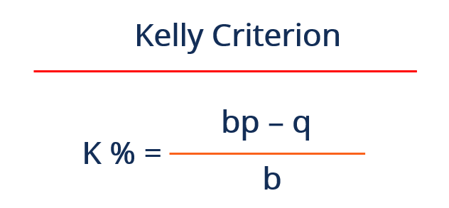

## Table of Contents

## What is the Kelly criterion?

The Kelly criterion is a formula used to decide how much money to bet when gambling or investing. It helps you figure out the best amount to bet so you can grow your money over time without risking too much. The basic idea is to bet a fraction of your money based on how likely you are to win and how much you can win. If you bet too little, you might not make as much money as you could. If you bet too much, you risk losing a lot of money.

The formula for the Kelly criterion is: (bp - q) / b, where b is the net odds received on the wager, p is the probability of winning, and q is the probability of losing, which is 1 - p. For example, if you have a 60% chance of winning and the odds are 1:1, you would bet 20% of your money each time. This way, you balance the risk and reward to grow your money steadily. While the Kelly criterion can be useful, it's important to use it carefully because it assumes you know the exact probabilities and odds, which can be hard to know for sure.

## Who developed the Kelly criterion and when?

The Kelly criterion was developed by John L. Kelly Jr. He was a scientist who worked at Bell Laboratories. Kelly came up with the formula in 1956. He wrote about it in a paper called "A New Interpretation of Information Rate." 

Kelly's work was actually building on earlier ideas from other people. One of those people was Claude Shannon, who is famous for his work in information theory. Kelly used Shannon's ideas to create a way to make better bets. His formula helps people figure out how much money to bet to grow their money over time without taking too much risk.

## What is the basic formula of the Kelly criterion?

The Kelly criterion is a way to figure out how much money to bet when gambling or investing. It tells you to bet a certain part of your money based on how likely you are to win and how much you can win. The basic formula for the Kelly criterion is (bp - q) / b. Here, b is how much you can win compared to what you bet, p is the chance you will win, and q is the chance you will lose. Since q is just 1 minus p, you can also write the formula as (bp - (1 - p)) / b, which simplifies to (bp + p - 1) / b.

For example, if you have a 60% chance of winning and the odds are 1:1 (so you win the same amount you bet), then b is 1, p is 0.6, and q is 0.4. Plugging these numbers into the formula gives (1 * 0.6 - 0.4) / 1, which equals 0.2. So, the Kelly criterion says you should bet 20% of your money each time. This way, you balance the risk and reward to grow your money over time without losing too much.

## How does the Kelly criterion help in managing bets or investments?

The Kelly criterion helps in managing bets or investments by telling you the best amount of money to bet or invest. It uses a simple formula that looks at how likely you are to win and how much you can win. By using this formula, you can figure out a percentage of your money to bet that will help you grow your money over time without risking too much. For example, if you have a good chance of winning and the reward is big, the Kelly criterion might tell you to bet more. But if the chances are not so good or the reward is small, it will tell you to bet less.

This method helps you avoid big losses because it stops you from betting too much at once. If you bet too much and lose, you could lose a lot of money. But if you bet the right amount according to the Kelly criterion, you can keep betting even if you lose sometimes. Over time, this can help your money grow steadily. However, it's important to remember that the Kelly criterion assumes you know the exact chances of winning and losing, which can be hard to know for sure. So, while it's a useful tool, you should use it carefully and think about other things too.

## What are the advantages of using the Kelly criterion?

Using the Kelly criterion can help you make smarter bets or investments. It tells you how much of your money to bet based on how likely you are to win and how much you can win. This way, you can grow your money over time without risking too much. If you follow the Kelly criterion, you bet more when the chances of winning are good and the reward is big. But you bet less when the chances are not so good or the reward is small. This helps you avoid big losses and keeps you in the game even if you lose sometimes.

The Kelly criterion also helps you balance risk and reward. It stops you from betting too much at once, which can lead to big losses. Instead, it suggests betting a smaller part of your money, which lets you keep betting even if you lose sometimes. Over time, this can help your money grow steadily. While the Kelly criterion is a useful tool, it's important to remember that it assumes you know the exact chances of winning and losing, which can be hard to know for sure. So, you should use it carefully and think about other things too.

## What are the potential risks and limitations of the Kelly criterion?

Using the Kelly criterion can be risky because it assumes you know the exact chances of winning and losing. In real life, it's hard to know these numbers for sure. If your guesses about the chances are wrong, you might bet too much or too little. Betting too much can lead to big losses, and betting too little means you might not make as much money as you could. Also, the Kelly criterion can tell you to bet a lot of your money at once, which can be scary and hard to do in practice.

Another problem with the Kelly criterion is that it doesn't think about how you feel about risk. Some people don't like to take big risks, even if the math says it's okay. The Kelly criterion might tell you to bet a lot, but if you lose that bet, it can be hard to keep going. Also, the Kelly criterion works best over a long time. If you only bet a few times, it might not help you grow your money as much as you hope. So, while the Kelly criterion can be a good tool, you need to use it carefully and think about other things too.

## How can the Kelly criterion be applied in real-world scenarios?

The Kelly criterion can be used in real life for things like betting on sports or investing in the stock market. Imagine you like to bet on football games. You think your team has a 60% chance of winning, and if they win, you get back double your bet. The Kelly criterion helps you figure out how much of your money to bet. It tells you to bet 20% of your money each time. This way, you balance the risk of losing with the chance to make more money over time. But remember, the Kelly criterion works best if you know the exact chances of winning, which can be hard to know for sure.

In the stock market, the Kelly criterion can help you decide how much money to invest in different stocks. Let's say you think a certain stock has a good chance of going up and you know how much it might go up. The Kelly criterion can tell you what part of your money to put into that stock. For example, if the stock has a 70% chance of going up by 10%, the Kelly criterion might tell you to invest 40% of your money in it. This way, you can grow your money without risking too much. But you have to be careful because the stock market can be unpredictable, and the chances of winning can change a lot.

## What modifications or variations exist of the original Kelly criterion?

One common change to the Kelly criterion is called the fractional Kelly. Instead of betting the full amount the Kelly criterion suggests, you bet a smaller part of it. For example, if the Kelly criterion says to bet 20% of your money, you might choose to bet only half of that, which is 10%. This makes the bets safer because you're not risking as much money at once. It's a good choice if you don't want to take big risks or if you're not sure about the chances of winning.

Another change is the Kelly criterion for multiple bets. This version helps you figure out how to spread your money across different bets or investments. Instead of betting on just one thing, you can bet on several things at the same time. This can help you balance the risk and reward better. For example, if you're betting on different sports games or investing in different stocks, the multiple bets version of the Kelly criterion can tell you how much to bet on each one to grow your money over time.

## How does the Kelly criterion compare to other betting or investment strategies?

The Kelly criterion is different from other betting or investment strategies because it tells you exactly how much to bet based on the chances of winning and how much you can win. Other strategies might tell you to always bet the same amount or to bet based on how you feel about the risk. For example, a fixed bet strategy says to bet the same amount every time, no matter what. This can be simpler but might not help your money grow as fast as the Kelly criterion. The Kelly criterion tries to balance risk and reward better by changing how much you bet based on the situation.

Another common strategy is the Martingale system, which tells you to double your bet after every loss until you win. This can be risky because if you keep losing, you might run out of money before you win. The Kelly criterion is safer because it doesn't tell you to bet more just because you lost. It keeps your bets steady and based on the chances of winning. While the Kelly criterion can be a good tool, it's important to use it carefully because it assumes you know the exact chances of winning, which can be hard to know for sure.

## Can you provide an example of calculating the Kelly criterion for a simple bet?

Imagine you want to bet on a coin flip. You think the coin is fair, so there's a 50% chance you'll win. If you win, you get back double your bet. Let's use the Kelly criterion to figure out how much of your money you should bet. The formula for the Kelly criterion is (bp - q) / b. In this case, b is 1 because you win the same amount you bet, p is 0.5 because there's a 50% chance of winning, and q is 0.5 because there's a 50% chance of losing. Plugging these numbers into the formula gives (1 * 0.5 - 0.5) / 1, which equals 0. So, the Kelly criterion says you should bet 0% of your money each time. This means you shouldn't bet at all because the bet is fair and you won't make any money over time.

Now, let's change the example a bit. Imagine the coin is not fair, and you think there's a 60% chance you'll win. The odds are still the same: if you win, you get back double your bet. Using the Kelly criterion again, b is still 1, p is now 0.6, and q is 0.4. Plugging these numbers into the formula gives (1 * 0.6 - 0.4) / 1, which equals 0.2. So, the Kelly criterion says you should bet 20% of your money each time. This way, you balance the risk and reward to grow your money over time without losing too much.

## What are the psychological challenges in applying the Kelly criterion?

Using the Kelly criterion can be tough because it might tell you to bet a lot of your money at once. This can be scary, especially if you lose that bet. Even if the math says it's okay to bet a big part of your money, it can be hard to do in real life. People often feel more comfortable betting less, even if it means they might not make as much money over time. So, even though the Kelly criterion can help you grow your money, it can be hard to follow because it goes against how people usually feel about risk.

Another challenge is that the Kelly criterion assumes you know the exact chances of winning and losing. In real life, it's hard to know these numbers for sure. If you're not sure about the chances, you might bet too much or too little. This can make you feel stressed or worried about making the wrong bet. Also, the Kelly criterion works best over a long time. If you only bet a few times, it might not help you grow your money as much as you hope. So, while the Kelly criterion can be a good tool, you need to use it carefully and think about how you feel about risk and uncertainty.

## How can one adjust the Kelly criterion for different levels of risk tolerance?

To adjust the Kelly criterion for different levels of risk tolerance, you can use something called the fractional Kelly. Instead of betting the full amount the Kelly criterion suggests, you bet a smaller part of it. For example, if the Kelly criterion tells you to bet 20% of your money, you might choose to bet only half of that, which is 10%. This way, you're not risking as much money at once, which can feel safer if you don't like taking big risks. By using a smaller fraction of the Kelly bet, you can still grow your money over time but with less chance of losing a lot.

Another way to adjust the Kelly criterion for risk tolerance is to think about how you feel about losing money. Some people don't mind losing a little bit if it means they can win more in the long run. Others might want to be very careful and not lose any money at all. If you're more cautious, you might choose a smaller fraction of the Kelly bet, like 25% or even 10%. This helps you feel more comfortable with the bets you're making. Remember, the Kelly criterion works best over a long time, so it's important to think about how you feel about risk and how long you plan to keep betting or investing.

## What is the Kelly Criterion Formula?

The Kelly Criterion Formula offers a strategic method for determining the optimal fraction of capital to invest or bet on a particular outcome to maximize the logarithm of wealth. At its core, for binary outcomes, the formula is expressed as:

$$
f^* = \frac{bp - q}{b}
$$

where:

- $f^*$ represents the fraction of the capital to wager,
- $p$ is the probability of winning,
- $q$ is the probability of losing, which is $1 - p$,
- $b$ denotes the odds received on the wager.

This formula essentially calculates the size of a bet that will maximize expected logarithmic growth, striking a balance between taking advantage of favorable odds and limiting exposure to risk.

In practical terms, if the odds (b) are favorable and the probability of winning (p) is high, the Kelly Criterion suggests a larger bet, whereas unfavorable odds or lower probabilities of winning will result in a smaller advised wager.

The Kelly Criterion also adapts well to situations involving partial losses, which are commonplace in investments as opposed to simple binary bets. It achieves this by accommodating fractional outcomes and returns. In these scenarios, the criterion takes into account not just winning or losing, but the partial returns involved, adjusting the strategy to align with the varying nature of investment risk and reward. 

In investment contexts, the formula may be utilized to determine the proportion of an investment in assets with positive expected returns while accounting for the variability and risk associated with partial losses. By considering fractional Kelly strategies, investors can mitigate risks of overexposure to volatile assets while optimizing their portfolio for long-term growth. This nuanced adaptation underscores the criterion’s flexibility and robustness in managing diverse financial scenarios.

## What are the advantages of using the Kelly Criterion?

The Kelly Criterion stands out for its mathematical rigor in maximizing the growth of one's wealth over the long term. It is rooted in the principle of optimizing the geometric mean of wealth, which ensures sustainable growth by reinvesting a calculated portion of available capital. By leveraging a formula that [factor](/wiki/factor-investing)s in probabilities and outcomes, the Kelly Criterion allows investors to balance their risk with potential reward effectively.

The central approach of the Kelly Criterion is to identify the optimal fraction of capital to wager or invest in an activity with uncertain outcomes. This optimal fraction $f^*$ is determined by the formula:

$$
f^* = \frac{bp - q}{b}
$$

where:

- $p$ is the probability of a winning outcome,
- $q$ is the probability of a losing outcome (i.e., $1 - p$),
- $b$ is the odds or the ratio of the profit to the stake.

This formula mathematically ensures that gains are maximized in such a way that the compounding effect of returns can work over the long term. Essentially, it advises scaling back investments as the risk increases, maintaining a balance between maximizing expected returns and protecting against significant losses.

Moreover, the beauty of the Kelly Criterion is its application to maintaining a delicate balance between risk and reward. By adjusting the fraction of the capital invested based on changing probabilities and odds, it prevents overly aggressive betting that could result in significant short-term losses. This built-in conservatism helps in managing the [volatility](/wiki/volatility-trading-strategies) of returns, providing a smoother growth curve for capital over time.

Prominent investors, such as Warren Buffett and Bill Gross, have reportedly applied principles akin to the Kelly Criterion in their investment strategies. Buffett’s principle of betting big when the odds are in his favor echoes the core premise of Kelly's approach — to capitalize on the most favorable bets rather than spreading resources thinly. This philosophy has contributed to his long-term success, demonstrating the practical applicability of this mathematical approach beyond just theoretical constructs.

In summary, the Kelly Criterion provides a framework that combines mathematical precision with practical investment strategies, ensuring that investors can achieve sustained growth while managing risks effectively.

## Can you provide practical examples and illustrations?

To understand the Kelly Criterion's practical application in [algorithmic trading](/wiki/algorithmic-trading), let's consider a hypothetical example. Imagine an algorithm that trades based on a predictive model which estimates the probability of a stock price rising (p) as 0.6, with a complementary probability of falling (q) as 0.4. Assume that if the prediction is correct, the model yields a return (b) of 1:1 (i.e., doubling the investment).

The Kelly Criterion formula is given by:

$$
f^* = \frac{bp - q}{b}
$$

Substituting the values into the formula:

$$
f^* = \frac{(1)(0.6) - 0.4}{1} = 0.2
$$

This indicates that 20% of the trading capital should be allocated to this particular trade for optimal growth.

### Behavioral Experiments

Behavioral experiments underscore the effectiveness of using the Kelly Criterion in practice. Studies show that traders who adopt Kelly's methods often outperform those who do not, primarily due to disciplined risk management. In one study, algorithmic traders utilizing a fractional Kelly strategy—investing half of the suggested fraction—had a higher likelihood of weathering market volatility while still achieving substantial long-term growth.

### Visual Illustrations

To visualize the Kelly Criterion's effect, consider the following Python code, which simulates the growth of capital over time using different betting fractions:

```python
import matplotlib.pyplot as plt
import numpy as np

# Parameters
p = 0.6
b = 1
q = 0.4
kelly_fraction = (b * p - q) / b
bet_fractions = [kelly_fraction, 0.5 * kelly_fraction, 0.1, 0.3, 0.4]  # various strategies

# Simulation settings
initial_capital = 1000
n_periods = 100
prob_returns = np.random.rand(n_periods) < p

def simulate_growth(fraction):
    capital = initial_capital
    capital_history = [capital]
    for outcome in prob_returns:
        if outcome:
            capital += capital * fraction
        else:
            capital -= capital * fraction
        capital_history.append(capital)
    return capital_history

plt.figure(figsize=(10, 6))
for f in bet_fractions:
    plt.plot(simulate_growth(f), label=f'Fraction: {f:.2f}')

plt.title('Capital Growth with Different Betting Fractions')
plt.xlabel('Trading Period')
plt.ylabel('Capital ($)')
plt.legend()
plt.grid(True)
plt.show()
```

This code plots the growth of capital over 100 trading periods using different betting strategies. The graph visually highlights that using the optimal Kelly fraction results in substantial growth compared to more conservative or aggressive betting fractions.

This example exemplifies how the Kelly Criterion can serve as a powerful tool for optimizing capital allocation in algorithmic trading. Properly applied, it balances the potential for growth against the risk of losses, helping traders to enhance their strategy's performance.

## References & Further Reading

[1]: Kelly, J. L. (1956). ["A New Interpretation of Information Rate."](https://www.princeton.edu/~wbialek/rome/refs/kelly_56.pdf) Bell System Technical Journal, 35(4), 917-926.

[2]: MacLean, L. C., Thorp, E. O., & Ziemba, W. T. (2011). ["The Kelly Capital Growth Investment Criterion: Theory and Practice."](https://www.tandfonline.com/doi/full/10.1080/14697688.2011.619561) World Scientific Publishing Company.

[3]: Vince, R. (1992). ["The Mathematics of Money Management: Risk Analysis Techniques for Traders."](https://archive.org/download/mathematics_202103/Mathematics%20Of%20Money%20Management.%20Ralph%20Vince.pdf) Wiley.

[4]: Thorp, E. O. (1969). ["Optimal Gambling Systems for Favorable Games."](https://www.jstor.org/stable/1402118) Review of the International Statistical Institute, 37(3), 273-293.

[5]: Ed Thorp's website, [ED THORP](http://www.edwardothorp.com/), containing various resources and writings on the Kelly Criterion and its applications.