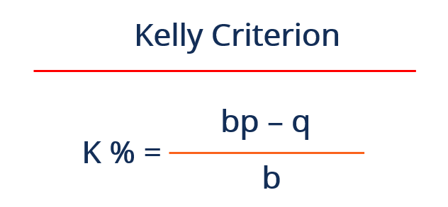

## Table of Contents

## What is the Kelly formula?

The Kelly formula, also known as the Kelly criterion, is a way to figure out how much money to bet on something to make the most money over time. It was made by a man named John Kelly in the 1950s. The formula looks at how likely you are to win and how much you could win or lose. It tells you to bet a certain part of your money, not all of it, to grow your money the fastest.

Using the Kelly formula, you can avoid betting too much and losing everything. It helps you be smart about how much to bet. If you follow the formula, you can keep betting and growing your money without taking too big of a risk. But remember, the formula works best when you know the exact chances of winning, which is hard to know for sure in real life.

## Who developed the Kelly formula and when?

The Kelly formula was developed by a man named John Kelly. He worked at Bell Laboratories and came up with the formula in 1956. John Kelly was trying to solve a problem about how to bet on horse races to make the most money over time. He found that if you bet a certain part of your money, you could grow your money faster than if you bet all of it or too little.

John Kelly's work was important because it showed people a way to manage their bets better. His formula is now used not just for betting on horse races, but also in other areas like investing in the stock market. Even though the formula needs you to know the exact chances of winning, which can be hard, it still helps people make smarter choices about how much to bet or invest.

## What is the basic principle behind the Kelly formula?

The basic principle behind the Kelly formula is to help you decide how much to bet to make your money grow the fastest over time. It tells you to bet a part of your money, not all of it, based on how likely you are to win and how much you could win or lose. This way, you can keep betting and growing your money without taking too big of a risk.

The formula works by balancing the chance of winning against the amount you could win. If you bet too much, you risk losing everything. If you bet too little, you won't grow your money as fast as you could. The Kelly formula finds the sweet spot in the middle, telling you the best amount to bet to make the most money over time while keeping your risk low.

## How do you calculate the Kelly criterion?

The Kelly criterion helps you figure out how much to bet to grow your money the fastest over time. To calculate it, you need to know two things: the chance of winning and the amount you could win or lose. If you're betting on something with a 60% chance of winning and you could win twice your bet, you'd use those numbers in the formula. The formula is: (Win Probability x (Amount Won - Amount Bet)) ÷ Amount Won. So for our example, it would be (0.60 x (2 - 1)) ÷ 2 = 0.30. This means you should bet 30% of your money.

Using the Kelly criterion can help you make smart bets. It tells you to bet a part of your money, not all of it, to keep growing your money without risking too much. But remember, the formula works best when you know the exact chances of winning, which can be hard in real life. If you're not sure about the chances, you might want to bet less than what the formula says to be safe.

## What are the key variables used in the Kelly formula?

The Kelly formula uses two key variables to figure out how much you should bet. The first variable is the chance of winning, which is how likely you are to win your bet. This is usually written as a number between 0 and 1, where 1 means you're sure to win and 0 means you're sure to lose. The second variable is the amount you could win or lose, which is how much more you get back if you win compared to what you bet.

These two variables are used in the Kelly formula to find the best part of your money to bet. The formula looks at the chance of winning and the amount you could win to decide if you should bet a little or a lot of your money. By using these variables, the Kelly formula helps you make smart bets and grow your money over time without taking too big of a risk.

## Can you provide a simple example of applying the Kelly formula in betting?

Let's say you're betting on a coin flip where you have a 50% chance of winning. If you win, you get back twice what you bet. So, if you bet $1 and win, you get $2 back, which means you make a profit of $1. If you lose, you lose the $1 you bet. To use the Kelly formula, you need to know the chance of winning and the amount you could win or lose. For this coin flip, the chance of winning is 0.50 and the amount you could win is 2 times your bet.

Now, let's put these numbers into the Kelly formula. The formula is (Win Probability x (Amount Won - Amount Bet)) ÷ Amount Won. So, for our coin flip, it would be (0.50 x (2 - 1)) ÷ 2 = 0.25. This means you should bet 25% of your money. If you have $100, you should bet $25 on the coin flip. By betting this amount, you're using the Kelly formula to grow your money over time without taking too big of a risk.

## What are the advantages of using the Kelly formula for investment decisions?

Using the Kelly formula for investment decisions can help you make your money grow faster over time. The formula tells you how much to invest based on how likely you are to make money and how much you could make or lose. By following the Kelly formula, you can avoid investing too much and losing everything. Instead, you'll invest just the right amount to keep growing your money without taking too big of a risk. This way, you can keep investing and making more money over time.

Another advantage of the Kelly formula is that it helps you be smart about your investments. It makes you think about the chances of making money and how much you could make. This can stop you from making quick, risky decisions that could lose you a lot of money. By using the Kelly formula, you can make steady, careful choices that help your money grow slowly but surely. Even though it's hard to know the exact chances of making money in real life, the Kelly formula still gives you a good guide to follow.

## What are the potential risks and limitations of the Kelly formula?

Using the Kelly formula can be risky because it's hard to know the exact chances of winning. If you guess wrong about how likely you are to win, you might bet too much and lose a lot of money. The formula works best when you know the exact chances, but in real life, it's often hard to be sure. If you're not careful, you could end up betting more than you should and losing everything.

Another problem with the Kelly formula is that it can be too aggressive for some people. It tells you to bet a lot of your money if the chances of winning are good. But betting that much can be scary and stressful. Some people might not feel comfortable betting so much, even if the formula says it's the best way to grow their money. So, they might want to bet less than what the formula says to be safe.

## How does the Kelly formula differ from other betting and investment strategies?

The Kelly formula is different from other betting and investment strategies because it tells you exactly how much to bet to make your money grow the fastest over time. Other strategies might tell you to bet a fixed amount, like always betting $10, or to bet a certain part of your money, like 5% each time. But the Kelly formula looks at how likely you are to win and how much you could win or lose. It says to bet a part of your money that changes depending on these chances. This way, you can keep betting and growing your money without taking too big of a risk.

Another way the Kelly formula is different is that it can be more aggressive than other strategies. It might tell you to bet a lot of your money if the chances of winning are good. Other strategies might be more careful and tell you to bet less to be safe. Some people might not like how much the Kelly formula says to bet because it can be scary to bet so much. But if you follow the Kelly formula and know the exact chances of winning, it can help you make the most money over time.

## How can the Kelly formula be adjusted for more conservative betting or investing?

If you want to be more careful with your bets or investments, you can change the Kelly formula to bet less than it tells you. Instead of betting the full amount the formula says, you could bet half of it or even less. For example, if the Kelly formula says to bet 20% of your money, you might choose to bet only 10% or 5%. This way, you're still using the Kelly formula to guide your bets, but you're being safer by betting less money.

Using a smaller part of the Kelly formula can help you feel more comfortable and avoid losing too much money if things don't go as planned. It's a good idea to be careful, especially when you're not sure about the exact chances of winning. By betting less, you can still grow your money over time, but you won't risk as much. This way, you can enjoy betting or investing without worrying too much about losing everything.

## What are some real-world applications of the Kelly formula outside of gambling?

The Kelly formula is not just for betting on horse races or playing games. It's also used in the world of money and investing. People who invest in the stock market use the Kelly formula to decide how much money to put into different stocks or other investments. By figuring out how likely a stock is to go up and how much it could go up, they can use the Kelly formula to choose the best amount to invest. This helps them grow their money over time without taking too big of a risk.

Another place where the Kelly formula is used is in managing money for big groups, like pension funds or insurance companies. These groups need to be careful with their money because they're looking after it for a lot of people. The Kelly formula helps them decide how much to invest in different things, like stocks or bonds, to make the most money over time while keeping their risk low. By using the Kelly formula, they can make smart choices about where to put their money and help it grow safely.

## How can advanced statistical methods enhance the application of the Kelly formula?

Advanced statistical methods can make the Kelly formula work better by helping you guess the chances of winning more accurately. These methods can look at a lot of data and find patterns that are hard to see with just simple math. For example, they can use something called [machine learning](/wiki/machine-learning) to learn from past bets or investments and predict what might happen next. By using these advanced tools, you can get a better idea of how likely you are to win, which makes the Kelly formula more useful. This way, you can bet or invest the right amount to grow your money faster and safer.

Another way advanced statistical methods help is by dealing with the ups and downs of betting or investing. The Kelly formula can be risky if you bet too much, but these methods can help you figure out how much to bet to keep things steady. They can use something called risk management to make sure you're not betting too much at once. By combining these advanced methods with the Kelly formula, you can make smarter bets or investments and avoid big losses. This makes it easier to keep growing your money over time without taking too big of a risk.

## What is the Kelly Formula and how does it work?

The Kelly Formula is a mathematical formula aimed at optimizing the growth of wealth through strategic betting or investment, specifically by maximizing the expected value of the logarithm of wealth. This approach, often referred to as the Kelly Criterion, aids traders in determining the optimal fraction of capital to wager on a given trade or investment, balancing potential returns with associated risks.

The formula is represented as:

$$
f^* = \frac{bp - q}{b}
$$

where $f^*$ represents the fraction of the total capital to wager, $b$ is the odds ratio (i.e., the ratio of potential gain to the amount wagered), $p$ signifies the probability of winning the investment, and $q$ reflects the probability of losing, such that $q = 1 - p$.

This formula inherently focuses on ensuring that the capital invested in each opportunity is optimal for maximizing wealth over time while minimizing the risk of significant losses. By calculating the fraction $f^*$, investors can systematically decide how much capital should be allocated toward an individual trade, maintaining a balance between aggressive and conservative investment strategies.

For instance, in a scenario where the probability of a favorable outcome of a trade is high, the Kelly Formula will suggest a larger fraction of the available capital to be invested. Conversely, if the probability of success is lower, the formula indicates a reduced investment to mitigate risk. This strategic guidance is particularly valuable in [algorithmic trading](/wiki/algorithmic-trading), where data-driven decisions are crucial.

Overall, the Kelly Formula provides a structured approach to capital allocation, prioritizing long-term growth by carefully weighing the probability of success against potential risks in trading environments. Despite its practical benefits, its application requires accurate probability estimations and a comprehensive understanding of market dynamics.

## What is an Example and how is it Implemented in Python?

Applying the Kelly Criterion in stock trading involves estimating probabilities of price movements based on historical performance data. Consider a stock with a 70% probability (p = 0.7) of increasing in price and a 30% probability (q = 0.3) of decreasing. The Kelly Formula, given by $f^* = \frac{{bp - q}}{b}$, helps determine the optimal fraction of capital to invest.

In this example, assume the odds ratio b (return per unit wagered) is 1.5. Substituting the values into the formula gives:

$$
f^* = \frac{{1.5 \times 0.7 - 0.3}}{1.5} = \frac{1.05 - 0.3}{1.5} = \frac{0.75}{1.5} = 0.5
$$

This indicates that to optimize growth while managing risk, 50% of available capital should be invested in this stock. If the calculated $f^*$ were negative, it would signify that the investment is not favorable under current conditions.

A Python implementation can automate this process, simulating trades to assess strategy performance over time. Below is a sample script that calculates the Kelly fraction and simulates trading based on these parameters:

```python
import numpy as np

# Define odds, probabilities, and capital
odds_ratio = 1.5
prob_win = 0.7
prob_loss = 0.3
initial_capital = 10000
num_simulations = 1000

def kelly_criterion(p_win, p_loss, odds):
    return (odds * p_win - p_loss) / odds

# Calculate Kelly fraction
kelly_fraction = kelly_criterion(prob_win, prob_loss, odds_ratio)

def simulate_trading(kelly_fraction, initial_capital, odds_ratio, prob_win, num_steps):
    capital = initial_capital
    capital_history = [capital]

    for _ in range(num_steps):
        # Simulate win or loss
        if np.random.rand() < prob_win:
            capital += capital * kelly_fraction * odds_ratio
        else:
            capital -= capital * kelly_fraction
        capital_history.append(capital)

    return capital_history

# Run simulation
capital_over_time = simulate_trading(kelly_fraction, initial_capital, odds_ratio, prob_win, num_simulations)

# Visualization (e.g., using Matplotlib)
import matplotlib.pyplot as plt

plt.plot(capital_over_time)
plt.title('Capital Growth over Time using Kelly Criterion')
plt.xlabel('Trade Number')
plt.ylabel('Capital')
plt.show()
```

This script demonstrates the use of the Kelly Formula by simulating capital growth across multiple trades, providing traders empirical evidence of the strategy's effectiveness.

## What is Backtesting in Algorithmic Trading?

Backtesting plays a critical role in validating trading strategies reliant on the Kelly Formula by offering a methodology to evaluate how a strategy would have performed using historical data. This process involves simulating past trades and applying the Kelly fraction to understand how well the strategy might perform in future market conditions. The purpose of this simulation is to identify strategies that not only have been successful historically but also possess robustness against market fluctuations.

A practical example can include [backtesting](/wiki/backtesting) a trading strategy on the SPY.US index. The SPY is an [ETF](/wiki/etf-trading-strategies) that tracks the performance of the S&P 500, making it an ideal candidate for strategies seeking broad market exposure. To conduct a backtest, traders can set parameters based on historical [volatility](/wiki/volatility-trading-strategies) and price changes to estimate the probability of market movements. These probabilities are then input into the Kelly Formula, expressed as:

$$
f^* = \frac{bp - q}{b}
$$

Here, $b$ is the odds ratio, $p$ is the probability of the stock price increasing, and $q$ is the probability of the price decreasing. Using this formula, traders can determine the optimal position size for each trade within the backtest.

A Python script can automate this process. Below is an example snippet for backtesting a strategy on the SPY:

```python
import numpy as np
import pandas as pd
import yfinance as yf  # For more datasets, visit: https://paperswithbacktest.com/datasets

# Download historical data for SPY
data = yf.download('SPY', start='2010-01-01', end='2023-01-01')
returns = data['Adj Close'].pct_change().dropna()

# Estimate probabilities
probability_of_up = (returns > 0).mean()
probability_of_down = 1 - probability_of_up
odds_ratio = (returns[returns > 0].mean()) / (-returns[returns < 0].mean())

# Calculate the Kelly fraction
kelly_fraction = (odds_ratio * probability_of_up - probability_of_down) / odds_ratio

# Backtest the strategy
initial_capital = 100000
capital = initial_capital

for ret in returns:
    bet_size = capital * kelly_fraction
    capital += bet_size * ret

print(f'Final capital after backtest: ${capital:.2f}')
```

This code fetches historical price data for the SPY, calculates the average returns for up and down movements, and estimates the probabilities required to compute the Kelly fraction. By iterating over daily returns, it recalculates the capital based on the Kelly-suggested bet size. The outcome provides a final capital figure, indicating the potential effectiveness of the strategy under the specified conditions.

While backtesting provides valuable insights, it is essential to recognize its limitations. Results are sensitive to input data and assumptions, and past performance is not always indicative of future results. Therefore, combining backtesting with other risk management techniques can help create more robust trading strategies.

## References & Further Reading

[1]: Kelly, J. L. (1956). ["A New Interpretation of Information Rate."](https://www.princeton.edu/~wbialek/rome/refs/kelly_56.pdf) Bell System Technical Journal.

[2]: Thorp, E. O. (1969). ["Optimal Gambling Systems for Favorable Games."](https://www.jstor.org/stable/1402118) Revue de Statistique Appliquée.

[3]: MacLean, L. C., Thorp, E. O., & Ziemba, W. T. (2011). ["The Kelly Capital Growth Investment Criterion: Theory and Practice"](https://www.tandfonline.com/doi/full/10.1080/14697688.2011.619561) by Cambridge University Press.

[4]: Poundstone, W. (2005). ["Fortune's Formula: The Untold Story of the Scientific Betting System that Beat the Casinos and Wall Street"](https://www.amazon.com/Fortunes-Formula-Scientific-Betting-Casinos/dp/0809045990) by Hill and Wang.

[5]: Rotando, L. M., & Thorp, E. O. (1992). ["The Kelly Criterion and the Stock Market."](https://www.jstor.org/stable/pdf/2324484.pdf) The American Mathematical Monthly.

[6]: Vince, R. (2007). ["The Handbook of Portfolio Mathematics: Formulas for Optimal Allocation & Leverage"](https://www.wiley.com/en-us/The+Handbook+of+Portfolio+Mathematics%3A+Formulas+for+Optimal+Allocation+and+Leverage-p-9780470410509) by Wiley.