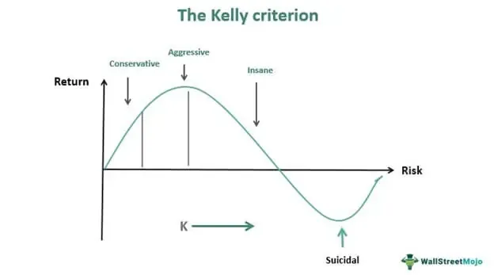

The Kelly Formula, introduced by John L. Kelly Jr. in 1956, presents a systematic approach to managing investments and trades. Initially conceived for gambling applications, this mathematical formula aids in determining the optimal size of a bet to maximize the long-term growth of wealth. The core principle of the Kelly Criterion is to balance the size of bets or investments to ensure the greatest logarithmic growth potential, effectively managing risks while optimizing returns.

In the modern financial landscape, particularly within algorithmic trading, the Kelly Criterion has gained prominence for its utility in strategizing investment allocations. Algorithmic trading, characterized by the use of complex algorithms and quantitative models to make trading decisions, benefits significantly from the Kelly Formula's ability to guide investment sizes based on statistical probabilities.



This article aims to explore the use of the Kelly Formula within algorithmic trading, discussing its calculations and the advantages it offers in optimizing trading strategies. It also addresses the limitations inherent in its assumptions, providing a comprehensive overview of its applicability. To enhance the practical understanding of this approach, examples and a Python script will be included, demonstrating how the Kelly Criterion can be implemented and tested for effective capital growth management.

## Table of Contents

## Understanding the Kelly Formula

The Kelly Formula is a mathematical formula aimed at optimizing the growth of wealth through strategic betting or investment, specifically by maximizing the expected value of the logarithm of wealth. This approach, often referred to as the Kelly Criterion, aids traders in determining the optimal fraction of capital to wager on a given trade or investment, balancing potential returns with associated risks.

The formula is represented as:

$$
f^* = \frac{bp - q}{b}
$$

where $f^*$ represents the fraction of the total capital to wager, $b$ is the odds ratio (i.e., the ratio of potential gain to the amount wagered), $p$ signifies the probability of winning the investment, and $q$ reflects the probability of losing, such that $q = 1 - p$.

This formula inherently focuses on ensuring that the capital invested in each opportunity is optimal for maximizing wealth over time while minimizing the risk of significant losses. By calculating the fraction $f^*$, investors can systematically decide how much capital should be allocated toward an individual trade, maintaining a balance between aggressive and conservative investment strategies.

For instance, in a scenario where the probability of a favorable outcome of a trade is high, the Kelly Formula will suggest a larger fraction of the available capital to be invested. Conversely, if the probability of success is lower, the formula indicates a reduced investment to mitigate risk. This strategic guidance is particularly valuable in [algorithmic trading](/wiki/algorithmic-trading), where data-driven decisions are crucial.

Overall, the Kelly Formula provides a structured approach to capital allocation, prioritizing long-term growth by carefully weighing the probability of success against potential risks in trading environments. Despite its practical benefits, its application requires accurate probability estimations and a comprehensive understanding of market dynamics.

## Assumptions of the Kelly Criterion

The Kelly Criterion operates under several key assumptions, which guide its application in trading and investment strategies. Firstly, traders are required to accurately estimate the probabilities of winning and losing. This accuracy is crucial, as the formula's effectiveness hinges on reliable probability assessments. Misestimations can lead to suboptimal betting fractions, potentially resulting in financial losses.

Secondly, the criterion assumes that each trade or investment is an independent event. This implies that the outcome of one trade does not influence or is influenced by another. In real market conditions, however, this assumption may not always hold true due to interconnected factors affecting market dynamics.

Thirdly, the Kelly Criterion presupposes infinite capital. While this assumption facilitates theoretical modeling, in practical scenarios, traders and investors have finite resources. This discrepancy can lead to over-betting, putting one’s capital at greater risk than anticipated.

Finally, the assumption of logarithmic utility suggests that wealth growth is expected to be exponential. This assumption aligns with the goal of maximizing the expected logarithm of wealth, but in practice, market conditions and investment constraints often preclude such exponential growth.

Understanding these assumptions is vital for traders using the Kelly Criterion, as deviations in these areas can significantly impact the criterion’s applicability and effectiveness. Adjustments to the standard formula may be necessary to align the assumptions more closely with real-world trading environments, enhancing risk management and investment outcomes.

## Applying the Kelly Criterion in Algo Trading

In algorithmic trading, the Kelly Criterion serves as a key tool for determining optimal position sizing to balance risk and profitability. The approach begins with the evaluation of historical market data and the application of statistical models to estimate the probabilities of different price movements. This estimation is central to applying the Kelly Formula effectively. By leveraging large datasets and advanced computational techniques, traders approximate the likelihood of asset price increases or decreases, enabling a clearer picture of expected returns.

The formula for the optimal bet size according to the Kelly Criterion is $f^* = \frac{bp - q}{b}$, where $f^*$ denotes the fraction of total capital to be wagered, $b$ represents the odds ratio, $p$ is the probability of winning, and $q$ is the probability of losing. This formula guides traders in choosing how much of their capital to allocate to a given trade, maximizing expected logarithmic returns while managing downside risks.

The integration of the Kelly Criterion within algorithmic trading frameworks allows for the automation of investment size calculations. Predefined strategies can be programmed into trading algorithms, letting these systems execute trades with precision, continuously adjusting to new information and data. This automation is especially beneficial in high-frequency trading environments, where rapid decision-making is essential, and the ability to quickly process and respond to market changes provides a competitive advantage.

Overall, the application of the Kelly Criterion in algorithmic trading helps streamline decision-making processes, supports disciplined risk management, and enhances the potential for profit maximization through calculated investment sizing. However, the inherent assumptions of the formula, as well as the need for precise probability estimates, emphasize the importance of robust data analysis and risk assessment techniques in its application.

## Example and Python Implementation

Applying the Kelly Criterion in stock trading involves estimating probabilities of price movements based on historical performance data. Consider a stock with a 70% probability (p = 0.7) of increasing in price and a 30% probability (q = 0.3) of decreasing. The Kelly Formula, given by $f^* = \frac{{bp - q}}{b}$, helps determine the optimal fraction of capital to invest.

In this example, assume the odds ratio b (return per unit wagered) is 1.5. Substituting the values into the formula gives:

$$
f^* = \frac{{1.5 \times 0.7 - 0.3}}{1.5} = \frac{1.05 - 0.3}{1.5} = \frac{0.75}{1.5} = 0.5
$$

This indicates that to optimize growth while managing risk, 50% of available capital should be invested in this stock. If the calculated $f^*$ were negative, it would signify that the investment is not favorable under current conditions.

A Python implementation can automate this process, simulating trades to assess strategy performance over time. Below is a sample script that calculates the Kelly fraction and simulates trading based on these parameters:

```python
import numpy as np

# Define odds, probabilities, and capital
odds_ratio = 1.5
prob_win = 0.7
prob_loss = 0.3
initial_capital = 10000
num_simulations = 1000

def kelly_criterion(p_win, p_loss, odds):
    return (odds * p_win - p_loss) / odds

# Calculate Kelly fraction
kelly_fraction = kelly_criterion(prob_win, prob_loss, odds_ratio)

def simulate_trading(kelly_fraction, initial_capital, odds_ratio, prob_win, num_steps):
    capital = initial_capital
    capital_history = [capital]

    for _ in range(num_steps):
        # Simulate win or loss
        if np.random.rand() < prob_win:
            capital += capital * kelly_fraction * odds_ratio
        else:
            capital -= capital * kelly_fraction
        capital_history.append(capital)

    return capital_history

# Run simulation
capital_over_time = simulate_trading(kelly_fraction, initial_capital, odds_ratio, prob_win, num_simulations)

# Visualization (e.g., using Matplotlib)
import matplotlib.pyplot as plt

plt.plot(capital_over_time)
plt.title('Capital Growth over Time using Kelly Criterion')
plt.xlabel('Trade Number')
plt.ylabel('Capital')
plt.show()
```

This script demonstrates the use of the Kelly Formula by simulating capital growth across multiple trades, providing traders empirical evidence of the strategy's effectiveness.

## Backtesting in Algorithmic Trading

Backtesting plays a critical role in validating trading strategies reliant on the Kelly Formula by offering a methodology to evaluate how a strategy would have performed using historical data. This process involves simulating past trades and applying the Kelly fraction to understand how well the strategy might perform in future market conditions. The purpose of this simulation is to identify strategies that not only have been successful historically but also possess robustness against market fluctuations.

A practical example can include [backtesting](/wiki/backtesting) a trading strategy on the SPY.US index. The SPY is an [ETF](/wiki/etf-trading-strategies) that tracks the performance of the S&P 500, making it an ideal candidate for strategies seeking broad market exposure. To conduct a backtest, traders can set parameters based on historical [volatility](/wiki/volatility-trading-strategies) and price changes to estimate the probability of market movements. These probabilities are then input into the Kelly Formula, expressed as:

$$
f^* = \frac{bp - q}{b}
$$

Here, $b$ is the odds ratio, $p$ is the probability of the stock price increasing, and $q$ is the probability of the price decreasing. Using this formula, traders can determine the optimal position size for each trade within the backtest.

A Python script can automate this process. Below is an example snippet for backtesting a strategy on the SPY:

```python
import numpy as np
import pandas as pd
import yfinance as yf  # For more datasets, visit: https://paperswithbacktest.com/datasets

# Download historical data for SPY
data = yf.download('SPY', start='2010-01-01', end='2023-01-01')
returns = data['Adj Close'].pct_change().dropna()

# Estimate probabilities
probability_of_up = (returns > 0).mean()
probability_of_down = 1 - probability_of_up
odds_ratio = (returns[returns > 0].mean()) / (-returns[returns < 0].mean())

# Calculate the Kelly fraction
kelly_fraction = (odds_ratio * probability_of_up - probability_of_down) / odds_ratio

# Backtest the strategy
initial_capital = 100000
capital = initial_capital

for ret in returns:
    bet_size = capital * kelly_fraction
    capital += bet_size * ret

print(f'Final capital after backtest: ${capital:.2f}')
```

This code fetches historical price data for the SPY, calculates the average returns for up and down movements, and estimates the probabilities required to compute the Kelly fraction. By iterating over daily returns, it recalculates the capital based on the Kelly-suggested bet size. The outcome provides a final capital figure, indicating the potential effectiveness of the strategy under the specified conditions.

While backtesting provides valuable insights, it is essential to recognize its limitations. Results are sensitive to input data and assumptions, and past performance is not always indicative of future results. Therefore, combining backtesting with other risk management techniques can help create more robust trading strategies.

## Limitations and Considerations

The Kelly Criterion, while valuable for capital management, presents significant limitations when applied to algorithmic trading. Its simplicity, originating from gambling strategies, often fails to address the complex dynamics and risk factors inherent in financial markets. The formula's reliance on accurate probability estimation for winning and losing introduces a critical challenge, as these probabilities are difficult to ascertain precisely within fluctuating markets. Moreover, the assumption of independent events, which is more suitable in gambling, does not always hold true in trading, where events can be interdependent due to market conditions and broader economic factors.

One fundamental simplification of the Kelly Criterion is its full allocation strategy. The formula suggests significant parts of capital should be placed on seemingly favorable trades, potentially exposing the trader to high risk if the estimations are inaccurate. Traders might encounter unsustainable volatility and potential losses. Implementing a modification like the fractional Kelly strategy, where a fraction of the full Kelly bet is employed (often half), can help manage volatility and drawdowns, allowing for more consistent growth over time.

Risk-adjusted strategies are another alternative to improve the criterion's applicability. These strategies involve adjusting the bet fraction based on volatility measures or other risk assessments, ensuring that investment strategies remain aligned with the trader's risk tolerance and capital preservation goals. By incorporating such modifications, traders can mitigate the weaknesses of the Kelly Criterion, achieving a more robust and realistic trading strategy.

## Conclusion

The Kelly Formula remains a pivotal tool in capital management for algorithmic traders. Its fundamental advantage lies in its ability to provide a clear, mathematical framework for determining optimal bet sizes that aim to maximize the logarithm of wealth growth over time. By systematically calculating the fraction of capital to invest based on the edge and probability of the investment outcome, traders can efficiently manage risk while seeking enhanced returns.

Understanding the limitations of the Kelly Formula is crucial for its effective implementation. The formula's assumptions, such as precise probability estimation, independence of trades, unlimited capital, and logarithmic utility, may not always align with real market conditions. This disconnect necessitates modifications like the fractional Kelly method, which involves betting only a portion of the recommended size to reduce exposure to risk and account for potential estimation inaccuracies.

Algorithmic traders can enhance their risk-reward outcomes by considering these limitations and accordingly adjusting their strategies. The integration of the Kelly Criterion within algorithmic systems allows for automation of position sizing, facilitating quicker and more disciplined trade executions. Moreover, through vigilant backtesting and scenario analysis, traders can refine their estimations and calibrate their models to accommodate market dynamics more effectively. In doing so, they not only harness the theoretical strengths of the Kelly Formula but also adapt it for pragmatic and resilient trading strategies.

## References & Further Reading

[1]: Kelly, J. L. (1956). ["A New Interpretation of Information Rate."](https://www.princeton.edu/~wbialek/rome/refs/kelly_56.pdf) Bell System Technical Journal.

[2]: Thorp, E. O. (1969). ["Optimal Gambling Systems for Favorable Games."](https://www.jstor.org/stable/1402118) Revue de Statistique Appliquée.

[3]: MacLean, L. C., Thorp, E. O., & Ziemba, W. T. (2011). ["The Kelly Capital Growth Investment Criterion: Theory and Practice"](https://www.tandfonline.com/doi/full/10.1080/14697688.2011.619561) by Cambridge University Press.

[4]: Poundstone, W. (2005). ["Fortune's Formula: The Untold Story of the Scientific Betting System that Beat the Casinos and Wall Street"](https://www.amazon.com/Fortunes-Formula-Scientific-Betting-Casinos/dp/0809045990) by Hill and Wang.

[5]: Rotando, L. M., & Thorp, E. O. (1992). ["The Kelly Criterion and the Stock Market."](https://www.jstor.org/stable/pdf/2324484.pdf) The American Mathematical Monthly.

[6]: Vince, R. (2007). ["The Handbook of Portfolio Mathematics: Formulas for Optimal Allocation & Leverage"](https://www.wiley.com/en-us/The+Handbook+of+Portfolio+Mathematics%3A+Formulas+for+Optimal+Allocation+and+Leverage-p-9780470410509) by Wiley.