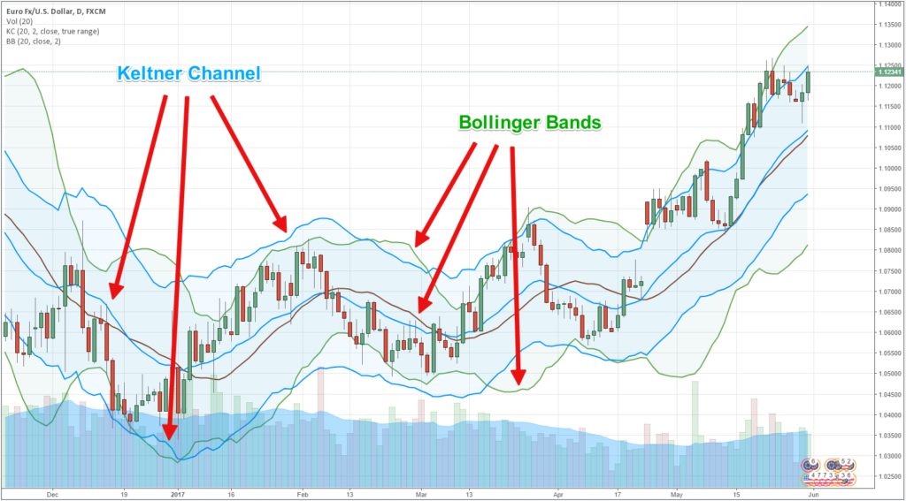

## Table of Contents

## What are Keltner Bands and how do they work?

Keltner Bands are a type of technical indicator used in stock trading to help traders see how a stock is moving and predict where it might go next. They look like three lines on a chart: one in the middle, which is usually a moving average of the stock's price, and two outer bands. The outer bands are set a certain distance away from the middle line, and this distance is based on the stock's recent price changes, called the Average True Range (ATR).

The way Keltner Bands work is by showing when a stock's price might be too high or too low. If the price of the stock goes above the top band, it might mean the stock is overbought and could soon go down. If the price goes below the bottom band, it might mean the stock is oversold and could soon go up. Traders use these signals to decide when to buy or sell a stock. The middle line can also act as a guide for where the stock's price might return to over time.

## How are Keltner Bands calculated?

Keltner Bands are made up of three lines on a chart. The middle line is a moving average of the stock's price, usually over 20 days. This means it takes the average price of the stock over the last 20 days and plots it as a line. The middle line helps show the general direction the stock is moving.

The other two lines, called the upper and lower bands, are set a certain distance away from the middle line. This distance is based on something called the Average True Range (ATR), which measures how much the stock's price has been moving around lately. To find the upper band, you add a multiple of the ATR (often 2 times the ATR) to the middle line. To find the lower band, you subtract the same multiple of the ATR from the middle line. These bands help traders see when a stock might be too high or too low and could be ready to move back towards the middle line.

## What is the difference between Keltner Bands and Bollinger Bands?

Keltner Bands and Bollinger Bands are both used by traders to see how a stock is moving, but they are calculated differently. Keltner Bands use the Average True Range (ATR) to set the distance between the middle line and the upper and lower bands. This means the bands move based on how much the stock's price has been changing lately. On the other hand, Bollinger Bands use the standard deviation of the stock's price to set the distance. This means the bands move based on how much the stock's price has been going up and down compared to its average.

Because of these different calculations, Keltner Bands and Bollinger Bands can give different signals to traders. Keltner Bands might be smoother because they use the ATR, which can make them less jumpy when the stock's price is changing a lot. Bollinger Bands can get wider or narrower quickly because they use standard deviation, which can make them more sensitive to recent price changes. Traders might choose one over the other depending on what kind of signals they want to see and how they like to trade.

## How can beginners use Keltner Bands to identify market trends?

Beginners can use Keltner Bands to identify market trends by looking at the position of the stock's price relative to the bands. If the price is consistently above the middle line and often touching or going beyond the upper band, it might mean the stock is in an uptrend. This is because the price is showing strength by staying above the average and even pushing the limits of what's considered normal movement. On the other hand, if the price is consistently below the middle line and often touching or going beyond the lower band, it might mean the stock is in a downtrend. This shows the price is weak and falling below what's considered normal.

Another way beginners can use Keltner Bands is to look for breakouts. If the price breaks above the upper band and stays there, it could be a sign that the stock is starting a new uptrend. This might be a good time to buy the stock. If the price breaks below the lower band and stays there, it could be a sign that the stock is starting a new downtrend. This might be a good time to sell or avoid buying the stock. By paying attention to these signals, beginners can get a better sense of when the market might be moving in a certain direction and make smarter trading decisions.

## What are the basic trading signals provided by Keltner Bands?

Keltner Bands give traders signals about when to buy or sell a stock. One basic signal is when the price of the stock goes above the upper band. This might mean the stock is overbought, which means it's been going up a lot and could soon go down. Traders might see this as a signal to sell the stock or wait for a better time to buy. On the other hand, if the price goes below the lower band, it might mean the stock is oversold, which means it's been going down a lot and could soon go up. Traders might see this as a signal to buy the stock or get ready for it to go up.

Another signal from Keltner Bands is when the price breaks out of the bands. If the price breaks above the upper band and stays there, it could mean a new uptrend is starting. This might be a good time for traders to buy the stock because it looks like it will keep going up. If the price breaks below the lower band and stays there, it could mean a new downtrend is starting. This might be a good time for traders to sell the stock or avoid buying it because it looks like it will keep going down. By watching these signals, traders can make better decisions about when to buy or sell.

## How can Keltner Bands be used to set stop-loss and take-profit levels?

Keltner Bands can help traders decide where to set their stop-loss and take-profit levels. A stop-loss is a price where a trader will sell a stock to avoid losing too much money. A take-profit is a price where a trader will sell a stock to make a profit. When using Keltner Bands, traders might set their stop-loss just below the lower band if they are buying the stock. This is because if the price falls below the lower band, it might keep going down, and the trader wants to get out before losing too much. On the other hand, if traders are selling the stock, they might set their stop-loss just above the upper band. This is because if the price goes above the upper band, it might keep going up, and the trader wants to get out before losing too much.

For take-profit levels, traders can use Keltner Bands to see where the price might go next. If they are buying the stock, they might set their take-profit near the upper band. This is because if the price reaches the upper band, it might be overbought and could soon go down, so the trader wants to take their profit before that happens. If they are selling the stock, they might set their take-profit near the lower band. This is because if the price reaches the lower band, it might be oversold and could soon go up, so the trader wants to take their profit before that happens. By using Keltner Bands this way, traders can set their stop-loss and take-profit levels to manage their trades better.

## What are some common Keltner Bands trading strategies for intermediate traders?

Intermediate traders often use Keltner Bands to find good times to buy and sell stocks. One common strategy is called the "Breakout Strategy." With this strategy, traders look for the stock's price to break above the upper band or below the lower band. If the price breaks above the upper band and stays there, it might mean the stock is starting a new uptrend. This could be a good time to buy the stock. If the price breaks below the lower band and stays there, it might mean the stock is starting a new downtrend. This could be a good time to sell the stock or avoid buying it. By waiting for these breakouts, intermediate traders can try to catch the start of new trends and make more money.

Another strategy intermediate traders use is called the "Mean Reversion Strategy." With this strategy, traders look for the stock's price to move away from the middle line and then come back to it. If the price goes above the upper band, it might be overbought and could soon come back down to the middle line. This could be a good time to sell the stock or get ready to buy it when it comes back down. If the price goes below the lower band, it might be oversold and could soon come back up to the middle line. This could be a good time to buy the stock or get ready to sell it when it comes back up. By watching how the price moves around the middle line, intermediate traders can try to make money from these up and down swings.

## How can Keltner Bands be combined with other technical indicators for better results?

Intermediate traders can get better results by using Keltner Bands along with other technical indicators. One common way is to use them with the Relative Strength Index (RSI). The RSI helps traders see if a stock is overbought or oversold. If the RSI shows the stock is overbought and the price is also above the upper Keltner Band, it might be a good time to sell. If the RSI shows the stock is oversold and the price is below the lower Keltner Band, it might be a good time to buy. By using both indicators together, traders can feel more confident in their decisions.

Another way to use Keltner Bands with other indicators is with the Moving Average Convergence Divergence (MACD). The MACD helps traders see if a stock's trend is getting stronger or weaker. If the MACD shows the trend is getting stronger and the price breaks above the upper Keltner Band, it might mean the stock will keep going up. If the MACD shows the trend is getting weaker and the price breaks below the lower Keltner Band, it might mean the stock will keep going down. By looking at both the Keltner Bands and the MACD, traders can get a clearer picture of what the stock might do next.

## What are the limitations and potential pitfalls of using Keltner Bands?

Keltner Bands can be useful, but they have some limitations. One big problem is that they can give false signals. This means the bands might say it's a good time to buy or sell, but the stock does something different. For example, if the price goes above the upper band, it might look like a good time to sell, but the price could keep going up. This can make traders lose money if they follow the signal without thinking more about it. Another problem is that Keltner Bands are based on past data. They use the stock's price history to make the bands, but what happened in the past doesn't always tell us what will happen in the future. This can make the bands less helpful when the market changes a lot.

Another limitation is that Keltner Bands work better in some markets than others. They can be good for stocks that move in a clear trend, but not so good for stocks that jump around a lot. If a stock's price is very up and down, the bands might give too many signals, making it hard for traders to decide what to do. Also, traders need to be careful not to rely only on Keltner Bands. Using them with other tools and looking at the bigger picture of the market can help avoid some of these problems. By understanding these limitations, traders can use Keltner Bands more wisely and avoid some common pitfalls.

## How can advanced traders optimize Keltner Bands settings for different markets?

Advanced traders can optimize Keltner Bands settings by changing the length of the moving average and the multiplier used for the Average True Range (ATR). For example, in a fast-moving market, traders might use a shorter moving average, like 10 days instead of 20, to make the bands react quicker to price changes. They might also use a smaller multiplier, like 1.5 times the ATR instead of 2, to keep the bands closer to the price and catch smaller trends. In a slower market, traders might use a longer moving average, like 50 days, to smooth out the bands and avoid false signals. They might also use a larger multiplier, like 2.5 times the ATR, to give the price more room to move before signaling a trend.

Another way advanced traders optimize Keltner Bands is by adjusting them for different types of assets. For stocks that move a lot, traders might use wider bands to avoid getting too many signals. For stocks that move less, they might use narrower bands to catch smaller price changes. Traders can also change the settings based on the time frame they are trading. For short-term trading, they might use a shorter moving average and a smaller multiplier to react quickly to price changes. For long-term trading, they might use a longer moving average and a larger multiplier to see bigger trends. By tweaking these settings, advanced traders can make Keltner Bands work better for the specific market and time frame they are trading in.

## What are some advanced Keltner Bands trading strategies used by expert traders?

Expert traders often use a strategy called "Squeeze Play" with Keltner Bands. They look for times when the bands are very close together, which means the stock's price isn't moving much. This can be a sign that the stock is getting ready for a big move. When the bands start to spread out and the price breaks out of the bands, it might mean a new trend is starting. If the price breaks above the upper band, expert traders might buy the stock, hoping it will keep going up. If the price breaks below the lower band, they might sell the stock or short it, hoping it will keep going down. By waiting for these squeezes and breakouts, expert traders can try to catch big moves in the market.

Another advanced strategy is called "Band Width Analysis." Expert traders use this to see how wide the Keltner Bands are compared to the stock's price. When the bands are wide, it means the stock's price has been moving a lot, and when the bands are narrow, it means the price hasn't been moving much. Traders can use this information to predict when the stock might start moving again. If the bands have been narrow for a while and start to widen, it might be a good time to get ready for a big move. If the bands have been wide and start to narrow, it might mean the stock's price is getting ready to calm down. By watching the width of the bands, expert traders can make better guesses about what the stock might do next.

## How can Keltner Bands be integrated into an automated trading system?

Expert traders can use Keltner Bands in an automated trading system by setting up rules that tell the system when to buy or sell a stock based on the bands. They can program the system to look for times when the price breaks above the upper band or below the lower band. If the price goes above the upper band, the system can be set to buy the stock because it might be starting a new uptrend. If the price goes below the lower band, the system can be set to sell the stock or short it because it might be starting a new downtrend. The system can also be set to use other signals from the bands, like when they are very close together or very far apart, to decide when to make a trade.

To make the automated trading system work better, expert traders can also tell it to use other technical indicators along with Keltner Bands. For example, they might set the system to check the Relative Strength Index (RSI) or the Moving Average Convergence Divergence (MACD) before making a trade. If the RSI shows the stock is overbought and the price is above the upper band, the system might decide to sell. If the MACD shows the trend is getting stronger and the price breaks above the upper band, the system might decide to buy. By combining Keltner Bands with other indicators, the automated system can make smarter trading decisions and help traders make more money.

## What are Keltner Channels and how do they work?

Keltner Channels are a technical analysis tool used by traders to assess market conditions and identify potential trading opportunities. They are particularly effective at signaling overbought and oversold conditions. Developed by Chester Keltner in the 1960s, these channels are constructed using three essential components: the Exponential Moving Average (EMA), the Average True Range (ATR), and the price itself.

The central line of the Keltner Channel is the EMA, which serves as the basis around which the channel lines are plotted. The EMA is favored over the simple moving average due to its ability to give more weight to recent price data, making it more responsive to market changes. The equation for the EMA is given by:

$$
\text{EMA}_t = \left( \frac{P_t - \text{EMA}_{t-1}}{n+1} \right) + \text{EMA}_{t-1}
$$

where $P_t$ is the price at time $t$, and $n$ is the number of periods considered.

The width of the Keltner Channel is determined by the ATR, which measures market [volatility](/wiki/volatility-trading-strategies) by looking at the range of price movements over a set number of periods. The ATR is calculated by taking the average of the true ranges over the desired time frame.

The upper and lower bands of the Keltner Channel are then plotted at a specified distance above and below the EMA. This distance is typically set as a multiple of the ATR:

$$
\text{Upper Band} = \text{EMA} + k \times \text{ATR}
$$

$$
\text{Lower Band} = \text{EMA} - k \times \text{ATR}
$$

where $k$ is a constant multiplier, often set between 2 to 3, which can be adjusted based on the trader's preference for capturing different levels of volatility.

The dynamic nature of Keltner Channels allows them to expand and contract in response to evolving market conditions. During periods of high volatility, the ATR increases, causing the bands to widen, which helps in identifying the strength and direction of price movements. Conversely, in stable markets with lower volatility, the bands contract, signaling potential periods of consolidation. This adaptability provides traders with critical insights into current market dynamics, allowing them to make more informed trading decisions.

## References & Further Reading

[1]: Kaufman, P. J. (2013). ["Trading Systems and Methods"](https://onlinelibrary.wiley.com/doi/book/10.1002/9781119202561) (5th ed.). Wiley. 

[2]: J. Welles Wilder. (1978). ["New Concepts in Technical Trading Systems."](https://www.amazon.com/New-Concepts-Technical-Trading-Systems/dp/0894590278) Trend Research.

[3]: Schwager, J. D. (1995). ["Technical Analysis"](https://books.google.com/books/about/Technical_Analysis.html?id=h0AfBRLrkJYC). Wiley.

[4]: Pratt, S. P. (2000). ["The Trader's Guide to Key Economic Indicators"](https://onlinelibrary.wiley.com/doi/book/10.1002/9781118532461), Wiley. 

[5]: Chande, T. S., & Kroll, S. (1994). ["The New Technical Trader: Boost Your Profit by Plugging into the Latest Indicators"](https://www.amazon.com/New-Technical-Trader-Plugging-Indicators/dp/0471597805). Wiley.