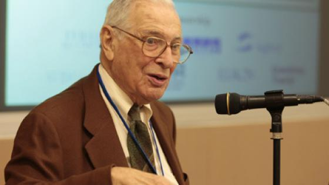

Kenneth Arrow, a towering figure in the field of economics, is celebrated for his transformative contributions to economic theory and its application in diverse areas. His work has left an indelible mark on both theoretical constructs and practical implementations across economic disciplines. Arrow's groundbreaking theories, particularly the Impossibility Theorem, have been instrumental in shaping the landscape of social choice theory. This theorem, also known as Arrow's paradox, asserts that no rank-order electoral system can universally satisfy a set of fairness criteria when voters have three or more options. This insight has profound implications for understanding democratic voting systems and decision-making processes in social and political contexts.

In addition to its impact on social choice, Arrow's work has significantly influenced the development of algorithmic trading. This modern financial practice involves using automated algorithms to execute trades at huge speeds and volumes, revolutionizing the financial markets. Arrow's insights into market equilibrium and informational asymmetries have indirectly informed the algorithms employed in these systems. By integrating economic theories into algorithmic frameworks, financial institutions can optimize trading strategies and enhance market efficiencies.

The modern economic and trading systems continue to reflect Arrow's intellectual legacy. His contributions to welfare economics and general equilibrium theory remain foundational to contemporary economic models. Arrow's work underscores the importance of understanding the complexities of information in markets, guiding the development of financial technologies and risk management strategies.

Arrow's theories are crucial to comprehending current economic challenges and opportunities presented by technological advancements. His insights offer invaluable perspectives on optimizing markets and making informed policy decisions. Consequently, Kenneth Arrow's work remains highly relevant and continues to inspire future explorations in economic theory and practice.

## Table of Contents

## Kenneth Arrow and His Theories

Kenneth Arrow was a highly influential economist, renowned for his pioneering contributions that reshaped economic theory. Born on August 23, 1921, in New York City, Arrow's academic journey began with a Bachelor of Science degree from the City College of New York, followed by a Ph.D. in economics from Columbia University in 1951. Arrow's profound impact on economics was recognized with the Nobel Memorial Prize in Economic Sciences in 1972, which he shared with Sir John Hicks. This accolade honored his groundbreaking work in general equilibrium theory and welfare economics.

One of Arrow's most famous contributions to economics is the Impossibility Theorem, also known as Arrow's Paradox. Formulated in his 1951 monograph "Social Choice and Individual Values," the theorem addresses the difficulty of crafting a fair voting system. Arrow's criteria for fair elections include:

1. **Non-dictatorship**: No single voter should possess the power to dictate the group's preference.
2. **Universal Admissibility**: Voters can freely rank alternatives in any order.
3. **Independence of Irrelevant Alternatives**: Preferences between two options should not be influenced by a third, unrelated option.
4. **Pareto Efficiency**: If every voter prefers one option over another, then the final group preference must reflect the same.
5. **Transitivity**: Collective preferences should remain consistent and not lead to any paradoxical cycles.

Arrow demonstrated that no voting system could simultaneously fulfill all these criteria if the decision involves three or more options. The theorem has profound implications, highlighting intrinsic limitations in aggregating individual preferences into collective decisions. It has further applications in economics and social justice, pointing out the challenges in achieving fair and equitable decision-making processes within societies and institutions.

In addition to social choice theory, Arrow made significant contributions to general equilibrium theory. His work formalized the conditions under which markets reach equilibrium, where supply and demand balance each other. Arrow's extension of Léon Walras' model provided profound insights into the efficiency and stability of markets.

Arrow was instrumental in shaping welfare economics, a branch of economics that focuses on the economic well-being of individuals within a society. His contributions emphasized the role of externalities, incomplete markets, and uncertainty in assessing economic welfare. Arrow's insights have been crucial in understanding the allocation of resources and crafting policies aimed at enhancing social welfare.

Kenneth Arrow's work remains pivotal to modern economic thought, laying the groundwork for various contemporary economic models and policy evaluation tools. His legacy endures through the continued relevance and application of his theories across diverse fields of economics.

## Arrow’s Impact on Economic Theory

Kenneth Arrow's work has significantly shaped modern economic theory, particularly through his influence on social choice theory, voting systems, democracy, welfare economics, and the economics of information.

Arrow's Impossibility Theorem, one of his most notable contributions, is central to social choice theory. This theorem demonstrates the inherent challenges in designing a voting system that consistently reflects the preferences of individuals in a fair manner. According to the theorem, no voting system can simultaneously fulfill all of the following criteria: non-dictatorship, unrestricted domain, Pareto efficiency, and independence of irrelevant alternatives, when there are three or more choices. This revelation has profound implications for how democratic systems and collective decision-making processes are understood and evaluated. Arrow's insights have prompted economists and political scientists to explore alternative systems and reforms that might better capture the preferences of individuals within a society.

In the context of welfare economics, Arrow's work laid down significant theoretical foundations. His collaboration with Gérard Debreu on the existence of a general competitive equilibrium is crucial. The Arrow-Debreu model forms a fundamental part of economic theory, demonstrating the conditions under which markets can reach an equilibrium where supply matches demand. This idealized model of economic efficiency has influenced a wide array of policies aimed at maximizing social welfare. Arrow's contributions also extend to the second welfare theorem, which states that any efficient allocation can be achieved by a competitive equilibrium given an appropriate reallocation of initial endowments. This theorem underscores the potential for markets to achieve socially desirable outcomes, provided that the initial distribution of resources is equitable.

Arrow's exploration into the economics of information has equally transformative implications. He illuminated how information asymmetries—situations where one party has more or better information than the other—can lead to market failures. This insight is crucial for understanding phenomena such as adverse selection and moral hazard, which occur in markets ranging from insurance to financial services. Arrow's analysis of information economics not only enhances comprehension of these challenges but also informs the development of mechanisms and policies, like signaling and screening, designed to mitigate the inefficiencies caused by information imbalances.

Overall, Kenneth Arrow's contributions to economic theory underscore the complex interplay between individual choices, market dynamics, and information flow. His work continues to inspire and challenge economists, providing a foundation for ongoing research and development in various fields.

## The Rise of Algorithmic Trading

Algorithmic trading, or algo trading, refers to the use of computer algorithms to automate the process of buying and selling financial instruments. These algorithms execute trading orders based on pre-defined criteria such as timing, price, or quantity, often exploiting market inefficiencies faster than human traders. The use of [algorithmic trading](/wiki/algorithmic-trading) has grown significantly since the late 20th century with advancements in computing power, improvements in trading infrastructure, and the availability of extensive market data.

Economic theories have played an influential role in the development of these algorithms. Concepts from Kenneth Arrow and other economists help inform strategies and predictive models used within algorithmic trading systems. For instance, the theory of market equilibrium, a cornerstone of classical economics advanced by Arrow's work in general equilibrium theory, aids in designing algorithms that predict price movements by considering the supply and demand dynamics of financial markets. Formulas derived from equilibrium models help identify price variances that can be exploited for profit.

**Advantages of Algorithmic Trading:**

1. **Speed and Efficiency:** Algorithms can process market data and execute trades much faster than a human, typically in milliseconds or even microseconds. This speed allows traders to take advantage of tiny price fluctuations and arbitrage opportunities.

2. **Accuracy:** Automated systems eliminate human errors associated with trading, such as misplacing a trade or emotional decision-making, ensuring precise implementation of trading strategies.

3. **Backtesting:** Algorithms can be tested against historical market data to assess how they would've performed in the real market, allowing for optimization before actual deployment.

4. **Reduced Costs:** By executing trades rapidly and without human intervention, algorithmic trading can significantly reduce transaction costs and improve liquidity in the financial markets.

**Challenges of Algorithmic Trading:**

1. **Market Impact:** High-frequency trading, a subset of algorithmic trading, can lead to increased market volatility. Algorithms may inadvertently cause "flash crashes," wherein prices plummet or skyrocket within seconds before stabilizing.

2. **Complexity and Transparency:** The design of trading algorithms involves sophisticated models and programming, which can lack transparency. This opacity can pose risks of unforeseen behavior and complicate regulatory oversight.

3. **Technological Dependence:** The reliance on cutting-edge technology means that any technical glitches or cyber threats can disrupt trading operations and potentially lead to significant financial losses.

4. **Ethical and Regulatory Issues:** The rapid and automated nature of algo trading raises ethical concerns regarding market fairness and the potential for manipulative practices. Consequently, regulatory bodies are continually evolving frameworks to monitor and control algorithmic trading activities.

The integration of economic theory, including insights from Arrow's work, into algorithmic trading reflects the continuous fusion of established academic knowledge with modern technological advancements. This amalgamation helps traders and financial institutions optimize their strategies in increasingly complex and dynamic markets.

## Connecting Arrow's Theories to Modern Trading Algorithms

Kenneth Arrow's theories have provided a profound basis for modern trading algorithms, particularly through the principles of social choice and optimization. Arrow's Impossibility Theorem, which highlights the challenges of aggregating individual preferences into a social welfare function, parallels certain optimization problems encountered in algorithmic strategies. In algorithmic trading, optimization is essential for decision-making processes, such as portfolio selection and balancing risk and return. This requires algorithms that can consider multiple competing preferences or constraints, much like Arrow's theoretical perspective on social choice.

Arrow's influence extends to market equilibrium models, which are foundational in automated trading systems. His work in general equilibrium theory, which explores how supply and demand across various markets reach a state of balance, is pivotal for the algorithms that simulate and predict market behavior. These algorithms often rely on equilibrium concepts to identify [arbitrage](/wiki/arbitrage) opportunities, forecast price movements, and assess the impact of trades on market stability. The complexity inherent in reaching equilibrium mirror challenges identified in Arrow's theoretical frameworks.

Furthermore, Arrow's exploration of information asymmetry - where the distribution of information among different parties is unequal - is particularly relevant in algorithmic risk assessments. Information asymmetry can influence market efficiency and stability, aspects that trading algorithms must account for to mitigate potential risks. Algorithms are designed to gather, interpret, and respond to market data swiftly, attempting to level the informational playing field. Arrow's insights into how information asymmetry can distort market outcomes inform these algorithms, allowing them to better anticipate adverse market movements and adjust trading strategies accordingly.

In essence, Arrow's theories of social choice, market equilibrium, and information asymmetry are crucial to understanding and developing advanced algorithmic trading strategies that strive for efficiency, stability, and optimized decision-making in financial markets.

## Legacy and Continuing Influence

Kenneth Arrow's contributions have left an indelible mark on economics, influencing both theoretical frameworks and practical applications across various sectors. His profound insights into social choice mechanisms and welfare economics have continued to guide contemporary economic theory and policy-making.

One of Arrow's most significant legacies is his Impossibility Theorem, which has permanently altered how we perceive voting systems and collective decision-making. Despite its theoretical origins, this theorem has pragmatic implications, offering a critical lens through which policymakers evaluate voting systems, thus influencing democratic processes worldwide. Its principles challenge the assumptions of creating a perfectly fair electoral system, leading to more realistic designs and evaluations of electoral processes.

Arrow's work on general equilibrium theory has also had lasting implications. His models are foundational in understanding how markets reach equilibrium, influencing everything from resource allocation to government policy. These models provide a crucial basis for assessing economic efficiency and welfare distribution, concepts central to both policy-making and economic research. By integrating Arrow's insights into market behaviors and equilibrium, economists have developed more sophisticated tools to predict and manage economic phenomena.

In addition to political and economic policies, Arrow's theories hold significant relevance in today's technology-driven markets. His examination of information asymmetry—where one party in a transaction has more or better information than the other—has become crucial in the context of financial markets. In particular, the rise of algorithmic trading and automated investing systems draws upon these theories to manage risks and optimize trading strategies. Arrow's contributions guide the development of algorithms that assess market conditions and participant behavior, ensuring more informed decision-making in transactions.

Arrow's influence extends beyond economic models, affecting interdisciplinary fields like data science and [artificial intelligence](/wiki/ai-artificial-intelligence), where decision-making algorithms echo his emphasis on optimization and efficiency. The principles embedded in Arrow's work support strategies to enhance data processing techniques and [machine learning](/wiki/machine-learning) algorithms, both of which are vital in handling the complexities of modern markets.

As technology continues to evolve, so too does the application of Arrow's theories, which remain integral to the development of policies and systems that drive economic growth and stability. His pioneering insights into the interconnectedness of information, equity, and efficiency ensure that his work will continue to resonate, informing future generations of economists and policymakers. Arrow’s theoretical innovations underscore ongoing research and technological advances, bridging the gap between economic theory and practice in a digitally dominant world.

## Conclusion

Kenneth Arrow's economic theories have left a lasting legacy that continues to resonate in the domain of modern algorithmic trading. His Impossibility Theorem, which provides insights into the challenges of creating fair electoral systems, has sparked broader discussions around collective decision-making processes. These insights are not just confined to political science but extend to economic models and market dynamics, informing the algorithms that drive today's automated trading systems.

Arrow's work lays the groundwork for understanding optimization and resource allocation, which are crucial in developing sophisticated trading strategies. His contributions to understanding market equilibrium and information asymmetry are particularly relevant, as they underpin the mechanisms that anticipate and react to market behaviors in algorithmic trading.

Further exploration of Arrow's work could yield significant advancements across different disciplines. His theories on information economics are especially pertinent in today's data-driven environment, where understanding information flow and asymmetries is crucial for both economic stability and profitable trading. Researchers and practitioners are encouraged to examine how these foundational concepts can be adapted and expanded for new applications, including artificial intelligence and machine learning, in economic modeling and financial technology.

Looking forward, the integration of Arrow's theories with cutting-edge technologies offers exciting possibilities for future trends in economics and technology. As markets become more intertwined and complex, Arrow's insights into optimization, social choice, and information economics will likely guide the development of algorithms that can manage this complexity with greater precision. Moreover, as policymakers grapple with the challenges presented by rapid technological advancements, Arrow’s work continues to provide a theoretical framework for balancing efficiency and equity in economic systems.

## References

1. Arrow, K. J. (1963). "Social Choice and Individual Values." Wiley. This work is fundamental in understanding Kenneth Arrow’s contributions to social choice theory and his formulation of Arrow's Impossibility Theorem, establishing the limits of voting systems in capturing social preferences.

2. Debreu, G., & Arrow, K. J. (1954). "Existence of an Equilibrium for a Competitive Economy." Econometrica, 22(3), 265-290. This paper lays out the foundation for general equilibrium theory, significantly contributing to welfare economics and highlighting the interconnectedness of economic agents.

3. Arrow, K. J. (1971). "Essays in the Theory of Risk-Bearing." North-Holland Publishing Company. Arrow’s writings on risk include pioneering work on information asymmetry, which is central to understanding market behaviors and decision-making under uncertainty.

4. Blackwell, D., & Girshick, M. A. (1954). "Theory of Games and Statistical Decisions." Wiley. While not authored by Arrow, this book provides context to the game theoretical frameworks that underlie Arrow's and others' economic theories.

5. Varian, H. R. (1984). "Microeconomic Analysis." W.W. Norton & Company. A highly cited text in economics literature that explores concepts influenced by Arrow’s theories, especially in microeconomic models.

6. MacKenzie, D. (2019). "Trading at the Speed of Light: How Ultrafast Algorithms Are Transforming Financial Markets." Princeton University Press. This book discusses the integration of economic theories, including those of Arrow, into algorithmic trading systems.

7. Biais, B., & Woolley, P. (2011). "High-Frequency Trading." Scholarpedia. Retrieved from https://www.scholarpedia.org/article/High-frequency_trading. An article that investigates into the effects of high-frequency trading on markets, informed by economic theories such as those of Arrow. 

8. Gigerenzer, G., & Selten, R. (2002). "Bounded Rationality: The Adaptive Toolbox." MIT Press. An exploration of decision-making processes that echoes Arrow’s investigations into information asymmetry and rational economic behavior.

9. "Algorithmic Trading: Theory and Practice" by Drakoln, H. & Drakoln, H. (2015). Wiley. This book provides practical applications of theoretical frameworks, including Arrow's contributions, in modern trading algorithms.

10. Thaler, R. H. (1980). "Toward a Positive Theory of Consumer Choice." Journal of Economic Behavior & Organization, 1(1), 39-60. This seminal paper, while not directly linked to Arrow, further develops theories on decision-making that Arrow’s work helped inspire.

These references encompass significant works by Kenneth Arrow as well as literature that expands upon and applies his theories, particularly in modern economic practices such as algorithmic trading.

## References & Further Reading

[1]: Arrow, K. J. (1963). ["Social Choice and Individual Values."](https://www.jstor.org/stable/j.ctt1nqb90) Wiley.

[2]: Debreu, G., & Arrow, K. J. (1954). ["Existence of an Equilibrium for a Competitive Economy."](https://www.semanticscholar.org/paper/EXISTENCE-OF-AN-EQUILIBRIUM-FOR-A-COMPETITIVE-Arrow-Debreu/e937fc6b51ab16bfdb3d7cde90a13c7e12e2c641) Econometrica, 22(3), 265-290.

[3]: Arrow, K. J. (1971). "Essays in the Theory of Risk-Bearing." North-Holland Publishing Company.

[4]: MacKenzie, D. (2019). ["Trading at the Speed of Light: How Ultrafast Algorithms Are Transforming Financial Markets."](https://ieeexplore.ieee.org/document/9647710) Princeton University Press.

[5]: Biais, B., & Woolley, P. (2011). ["High-Frequency Trading."](https://www.tse-fr.eu/publications/high-frequency-trading) Scholarpedia.

[6]: Gigerenzer, G., & Selten, R. (2002). ["Bounded Rationality: The Adaptive Toolbox."](https://direct.mit.edu/books/edited-volume/4232/Bounded-RationalityThe-Adaptive-Toolbox) MIT Press.