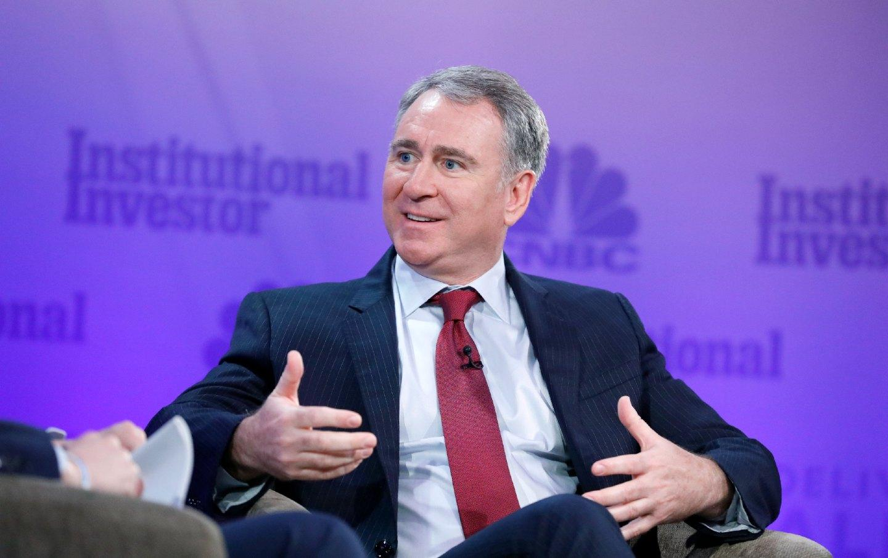

## Table of Contents

## Who is Kenneth C. Griffin?

Kenneth C. Griffin is a businessman from the United States. He was born on October 15, 1968, in Florida. He is famous for starting a big company called Citadel LLC. Citadel is a hedge fund, which means it's a type of investment company. Griffin started Citadel when he was very young, right after he finished college at Harvard University. He is known for being very smart with money and investments.

Griffin has become very rich because of his work with Citadel. He is one of the richest people in the world. Besides running his company, he also gives a lot of money to help schools and other good causes. For example, he has given a lot of money to his old school, Harvard. He also helps support science and technology projects. People look up to him not just for his business success, but also for his efforts to help others.

## Where and when was Kenneth C. Griffin born?

Kenneth C. Griffin was born in Florida. His birthday is on October 15, 1968.

He grew up in Florida before he went to college.

## What is Kenneth C. Griffin's educational background?

Kenneth C. Griffin went to Boca Raton Community High School in Florida. He did well in school and was good at math and science. He was also interested in computers and started learning about them when he was young.

After high school, Griffin went to Harvard University. He studied economics there. While at Harvard, he started his own investment company, which later became Citadel. He graduated from Harvard in 1989 with a degree in economics.

## How did Kenneth C. Griffin start his career in finance?

Kenneth C. Griffin started his career in finance while he was still a student at Harvard University. He used money he got from his grandparents to start trading from his dorm room. He used a computer to make trades and was good at figuring out how to make money from the stock market. He started his own company, which he called Citadel, in 1990, right after he graduated from Harvard.

At first, Citadel was just Griffin and a few other people working together. But he was smart and worked hard, and his company grew quickly. Citadel became a big [hedge fund](/wiki/hedge-fund-trading-strategies), which means it's a company that manages money for rich people and big organizations. Griffin's success came from being good at understanding the market and making smart investments.

## What is Citadel LLC and how was it founded by Kenneth C. Griffin?

Citadel LLC is a big company that manages money for rich people and big organizations. It's called a hedge fund. This means it tries to make money by investing in different things like stocks, bonds, and other financial stuff. Kenneth C. Griffin started Citadel when he was very young, right after he finished college at Harvard University. He used money he got from his grandparents to start trading from his dorm room. He was good at figuring out how to make money from the stock market using a computer.

Griffin officially started Citadel in 1990. At first, it was just him and a few other people working together. But Citadel grew quickly because Griffin was smart and worked hard. He was good at understanding the market and making smart investments. Over time, Citadel became a very big and successful company. It's now one of the biggest hedge funds in the world, and Griffin is known as a very successful businessman.

## What are some of the major achievements of Citadel under Kenneth C. Griffin's leadership?

Under Kenneth C. Griffin's leadership, Citadel has grown to become one of the biggest and most successful hedge funds in the world. The company manages a lot of money for rich people and big organizations. Citadel has been very good at making money for its clients. It has done well even when the economy was not doing well. This shows that Griffin and his team are good at understanding the market and making smart investments.

Citadel has also been recognized for its technology and trading systems. The company uses computers and math to help make decisions about where to invest money. This has helped Citadel stay ahead of other companies. Griffin has also built a strong team of smart people who work together to keep Citadel successful. Because of all these things, Citadel is known as a leader in the finance world.

## What role does Kenneth C. Griffin play in philanthropy?

Kenneth C. Griffin is known for giving a lot of money to help others. He believes in using his wealth to make the world a better place. He has given money to many different causes, but he focuses a lot on education. For example, he has donated billions of dollars to his old school, Harvard University. This money helps students who need financial help to go to college.

Griffin also supports science and technology projects. He thinks these areas are important for the future. He has given money to help build new research centers and to fund studies that could lead to new discoveries. His philanthropy is not just about giving money; he wants to help create opportunities for people and make a positive impact on society.

## How has Kenneth C. Griffin influenced the financial industry?

Kenneth C. Griffin has had a big impact on the financial industry. He started Citadel, which became one of the biggest hedge funds in the world. A hedge fund is a company that manages money for rich people and big organizations. Griffin's success with Citadel showed that you could use computers and math to make smart investments. This idea changed how many people in the financial industry thought about investing. They started to use technology more to help them make decisions.

Griffin also showed that you could make money even when the economy was not doing well. Citadel did well during times when other companies struggled. This made people in the financial industry pay more attention to risk management and how to protect their investments. Griffin's approach to using technology and managing risk has influenced many other companies in the financial world.

## What are some of the controversies or challenges faced by Kenneth C. Griffin and Citadel?

Kenneth C. Griffin and Citadel have faced some challenges and controversies over the years. One big issue was during the 2008 financial crisis. Citadel lost a lot of money, and people were worried that it might go out of business. But Griffin and his team worked hard to fix things, and Citadel got better. This showed that even big companies can have problems, but they can also recover if they have a good leader.

Another challenge was in 2021, when Citadel was involved in the GameStop stock situation. A lot of people on the internet started buying GameStop stock, and it made the price go up a lot. Citadel had to deal with this because it was connected to another company, Melvin Capital, that was losing money on GameStop. Some people thought Citadel and other big companies were trying to stop the small investors from making money. This led to a lot of talk and some people were not happy with Citadel.

## What is Kenneth C. Griffin's approach to investing and risk management?

Kenneth C. Griffin's approach to investing is all about using technology and math to make smart choices. He started Citadel and used computers to help him understand the stock market. He believes in looking at a lot of information and using it to find the best places to put money. Griffin is known for being good at figuring out patterns and trends that others might miss. He doesn't just guess where to invest; he uses data and numbers to guide his decisions.

When it comes to risk management, Griffin is very careful. He knows that the market can change quickly, and he wants to be ready for anything. Citadel uses different strategies to protect its money. For example, they might spread their investments across many different things so that if one goes down, the others can help balance it out. Griffin also pays close attention to what's happening in the world and adjusts his plans to keep Citadel safe. His careful planning has helped Citadel do well even during tough times.

## How has Kenneth C. Griffin's leadership style evolved over the years?

Kenneth C. Griffin's leadership style has changed a lot over the years. When he first started Citadel, he was very hands-on. He did a lot of the work himself and made most of the decisions. He was young and wanted to prove that he could build a successful company. As Citadel grew bigger, Griffin had to learn how to lead a larger team. He started to trust other people more and let them take on bigger roles. He became better at listening to his team and using their ideas to help the company grow.

Now, Griffin's leadership style is more about guiding and supporting his team. He focuses on setting the big goals for Citadel and making sure everyone knows what they need to do to reach them. He still keeps a close eye on the company, but he lets his team handle a lot of the day-to-day work. Griffin has learned that being a good leader means helping others do their best work. He also tries to stay calm and make smart decisions, even when things get tough. This has helped Citadel become a strong and successful company.

## What are the future plans or visions of Kenneth C. Griffin for Citadel and beyond?

Kenneth C. Griffin wants Citadel to keep growing and being a leader in the financial world. He plans to use more technology and smart math to make even better investment choices. Griffin thinks that by using computers and data, Citadel can find new ways to make money for its clients. He also wants to help more people and big organizations with their money. Griffin believes that Citadel can keep getting bigger and better by always learning and trying new things.

Beyond Citadel, Griffin has big plans for helping the world. He wants to give more money to schools and science projects. He thinks education is very important and wants to help more students go to college. Griffin also wants to support new ideas in technology and science that can make life better for everyone. He believes that by using his money and influence, he can help solve big problems and make the world a better place.

## References & Further Reading

[1]: Kuleli, T. (2018). ["Algorithmic Trading of Futures via Machine Learning"](https://resources.caih.jhu.edu/textbook-solutions/publication/download/algorithmic_trading_of_futures_via_machine_learning.pdf). SSRN.

[2]: ["Advances in Financial Machine Learning"](https://www.amazon.com/Advances-Financial-Machine-Learning-Marcos/dp/1119482089) by Marcos Lopez de Prado

[3]: Aldridge, I. (2013). ["High-Frequency Trading: A Practical Guide to Algorithmic Strategies and Trading Systems"](https://onlinelibrary.wiley.com/doi/pdf/10.1002/9781119203803.fmatter) (2nd ed.). Wiley.

[4]: ["Quantitative Trading: How to Build Your Own Algorithmic Trading Business"](https://books.google.com/books/about/Quantitative_Trading.html?id=j70yEAAAQBAJ) by Ernest P. Chan

[5]: Patterson, S. (2012). ["Dark Pools: The Rise of AI Trading Machines and the Looming Threat to Wall Street"](https://archive.org/details/darkpoolsriseofa0000patt). Crown Business.