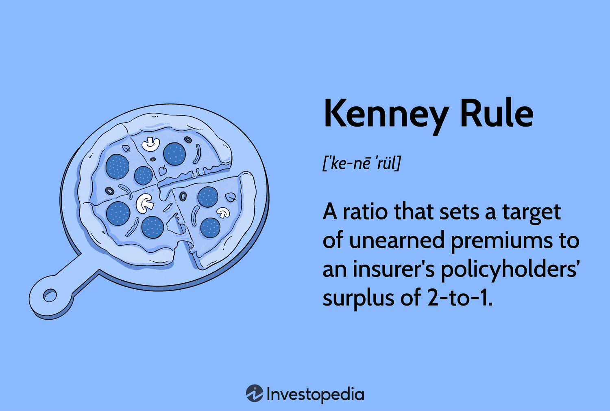

The world of finance is undergoing a significant transformation, with algorithmic trading emerging as a crucial element of the securities market. This transformation is marked by the integration of technology and finance, where computer algorithms are used to execute trades at remarkable speed and volume. As this trend continues, the focus on regulatory frameworks becomes imperative to ensure market integrity and financial stability.

Algorithmic trading dynamically influences global markets, offering benefits such as increased efficiency, cost reduction, and minimized human error. However, it also introduces complexities and risks, such as potential market manipulation and systemic instability. To address these challenges, regulatory measures are essential, ensuring transparency, accountability, and the safeguarding of public interest.



In this context, an exploration of the Kenney Rule provides valuable insights. Traditionally applied in the insurance sector, the Kenney Rule establishes a guideline for insurers, promoting financial solvency through a 2-to-1 target ratio of unearned premiums to policyholders' surplus. This rule's focus on mitigating insolvency risks within insurance providers underscores the importance of robust risk management—a principle that resonates with the needs of algorithmic trading.

By examining how these frameworks strive to achieve market integrity and financial stability, we can better understand the evolving landscape of algorithmic trading. The interplay of regulations, technological advances, and financial strategies forms a complex ecosystem that demands vigilance and continuous adaptation from market participants.

## Table of Contents

## Understanding the Kenney Rule and Its Impact

The Kenney Rule establishes a key guideline within the insurance industry by setting a 2-to-1 target ratio of unearned premiums to policyholders' surplus. This ratio is crucial in the property and casualty insurance sectors where it serves to mitigate insolvency risks. By maintaining this ratio, insurers can ensure that they have sufficient surplus to cover their liabilities, thus enhancing financial stability.

This rule is designed to safeguard against the potential for claims to exceed the available capital, which can lead to insolvency. Unearned premiums represent the portion of the premiums received that have not yet been earned by providing coverage; it acts as a buffer, ensuring that insurers have a substantial reserve to draw upon if claims arise. Meanwhile, the policyholders' surplus is the amount by which assets exceed liabilities, functioning as a financial safety net.

In mathematical terms, if we let $UP$ denote the unearned premiums and $PS$ represent the policyholders' surplus, the Kenney Rule seeks to maintain:

$$
\text{Ratio} = \frac{UP}{PS} \leq 2
$$

Adherence to such a framework prevents insurance companies from over-leveraging their liabilities compared to their surplus, thereby protecting them from potential financial distress arising from unforeseen insurance claims.

The implications of the Kenney Rule extend beyond traditional insurance sectors. In the context of [algorithmic trading](/wiki/algorithmic-trading), the rule's emphasis on maintaining a balanced reserve parallels the need for effective risk management strategies. In algorithmic trading, where rapid execution and high volumes are inherent, maintaining a cushion of reserves or equivalent mechanisms is crucial to manage trading risks and ensure operations remain solvent.

By advocating for structured financial reserves and prudent risk management, the Kenney Rule provides a model that can be mirrored in the practices of algorithmic trading firms. This similarity underscores the universal applicability of sound financial principles across sectors, reinforcing the importance of solvency as a foundation for sustainable business operations.

## Overview of Algorithmic Trading

Algorithmic trading, often referred to as algo trading, involves the use of computer algorithms to execute trades in financial markets. These algorithms are designed to make decisions regarding the timing, pricing, and quantity of trades without human intervention, thus operating at speeds and volumes that are unreachable by manual trading processes. The sophistication of these algorithms varies, ranging from simple rules-based systems to complex, data-driven models utilizing [machine learning](/wiki/machine-learning) techniques.

The key efficiency brought by algorithmic trading is cost reduction. By minimizing the need for human traders and optimizing trading processes, firms can significantly cut operational expenses. Furthermore, algorithms operate continuously without fatigue, reducing the likelihood of human errors and taking advantage of fleeting market opportunities. For instance, high-frequency trading ([HFT](/wiki/high-frequency-trading-strategies)), a subset of algorithmic trading, executes orders of immense volumes in milliseconds, capitalizing on minor price discrepancies.

Despite its efficiencies, algo trading carries inherent risks, primarily the potential for market manipulation and systemic [volatility](/wiki/volatility-trading-strategies). Instances such as the 2010 Flash Crash, where a rapid, deep fall in stock prices occurred within minutes, exemplifies the drastic market impacts that poorly regulated or erroneous algorithms can cause. Unintended trading behaviors, such as triggered automated sell-offs, can amplify market volatility, undermining stability.

Regulatory oversight is pivotal in safeguarding against these risks. In the United States, prominent bodies such as the Securities and Exchange Commission (SEC) and the Commodity Futures Trading Commission (CFTC) are tasked with regulating algorithmic trading. The SEC, through its Market Access Rule, ensures pre-trade risk checks and continual surveillance to mitigate risks associated with algorithmic strategies. Similarly, the CFTC implements Regulation Automated Trading (Reg AT), promoting transparency and strong risk management practices within trading systems. These regulations aim to prevent market abuse and ensure that algorithmic trading enhances rather than disrupts market integrity. 

In conclusion, while algorithmic trading presents a paradigm shift in trading by optimizing efficiency and accuracy, it necessitates stringent regulatory frameworks to manage its complexities and inherent risks effectively.

## Regulatory Frameworks in Algorithmic Trading

The regulation of algorithmic trading primarily involves ensuring that trading activities are conducted in a manner that upholds market integrity and stability. The U.S. Securities and Exchange Commission (SEC) has established the Market Access Rule, formally known as Rule 15c3-5, which mandates pre-trade risk controls and post-trade surveillance for firms utilizing algorithmic trading. This rule requires registered broker-dealers to implement adequate risk management controls that can handle the speed and [volume](/wiki/volume-trading-strategy) associated with high-frequency trading. These controls are designed to prevent erroneous trades that may arise from algorithm malfunctions and to ensure that trading activities do not expose the market to excessive risks.

According to the SEC, pre-trade risk controls must include automated systems that can immediately prevent orders that would breach regulatory requirements or exceed preset credit or capital thresholds. Likewise, post-trade surveillance involves ongoing monitoring to detect potentially abusive trading patterns or compliance issues. These measures are crucial for maintaining market stability and investor confidence in the integrity of the trading system.

The Commodity Futures Trading Commission (CFTC), another pivotal regulatory body, has proposed Regulation Automated Trading (Reg AT), which aims to tighten the oversight of automated trading in futures markets. Reg AT emphasizes transparency and risk management by requiring developers of trading algorithms to register with the CFTC and submit their source code for review if requested. Additionally, it enforces compliance with risk management requirements, obligating traders to implement systems that can manage and mitigate potential disruptions.

Both the SEC and CFTC frameworks are aligned with principles similar to the Kenney Rule, which in the insurance industry emphasizes maintaining a balance between unearned premiums and policyholders' surplus to mitigate financial instability. Similarly, in algorithmic trading, these regulations aim to hedge against systemic risks by enforcing strict compliance and risk management standards.

By establishing such regulations, the SEC and CFTC seek to protect the markets from the potential fallout of rapid algorithmic strategies, ensuring that technological advancements do not erode market fairness or stability. This regulatory oversight is essential as algorithmic trading continues to grow, demanding vigilance and adaptation from both regulators and market participants.

## Financial Risk Management and Compliance

Effective risk management is paramount in both the insurance and trading sectors to maintain financial solvency and uphold market integrity. In algorithmic trading, this involves implementing comprehensive risk control measures akin to those advocated by the Kenney Rule within the insurance industry. The Kenney Rule, by establishing a 2-to-1 target ratio of unearned premiums to policyholders' surplus, highlights the necessity of safeguarding against insolvency through prudent risk management. This concept can be extrapolated to algorithmic trading, where the rapid execution of trades at high speeds and volumes necessitates stringent risk controls.

To manage financial risk effectively, algorithmic traders deploy various risk control strategies, which may include setting predefined loss limits, leveraging statistical models to identify potential market anomalies, and using circuit breakers to halt trading during periods of extreme volatility. Furthermore, implementing stop-loss orders and adjusting algorithmic models in response to market feedback are crucial practices.

The compliance dimension plays a critical role in ensuring adherence to guidelines set forth by regulatory bodies such as the Securities and Exchange Commission (SEC) and the Commodity Futures Trading Commission (CFTC). Compliance involves rigorous monitoring of trading activities, maintaining accurate records of transactions, and ensuring transparency of algorithmic strategies to regulatory authorities.

Incorporating machine learning and data analytics also bolsters risk management frameworks. For instance, machine learning algorithms can be employed to predict market trends and detect irregular trading patterns, thereby allowing traders to mitigate potential risks proactively. By using Python libraries such as pandas for data manipulation, scikit-learn for implementing machine learning models, and matplotlib for visualizing data trends, traders can enhance their risk management capabilities.

```python
# Sample python code for risk management using a simple moving average strategy
import pandas as pd
import numpy as np

# Generate sample data
data = {'price': [100, 102, 101, 105, 107, 110, 108, 111, 115, 118]}
df = pd.DataFrame(data)

# Calculate moving average
df['moving_average'] = df['price'].rolling(window=3).mean()

# Identify trading signals based on moving average
df['signal'] = np.where(df['price'] > df['moving_average'], 'Buy', 'Sell')

print(df)
```

By embracing these tools and methodologies, companies can confidently navigate regulatory landscapes, akin to how the Kenney Rule guides insurers in mitigating insolvency risks. This alignment not only protects firms and investors but also fosters an environment where financial stability and market integrity are prioritized.

## Challenges and Opportunities

Regulatory measures, while essential for ensuring market integrity and financial stability, impose significant constraints on both the algorithmic trading industry and the insurance sector. These guidelines are designed to prevent systemic risks and maintain solvency, akin to the Kenney Rule's objectives. However, they often present challenges for firms striving to navigate complex regulatory environments.

The primary challenge lies in the strict compliance requirements that demand substantial resources and continuous monitoring. Algorithmic trading firms need to develop sophisticated systems capable of integrating real-time compliance checks, which can be costly and technically demanding. Similarly, insurance companies adhering to the Kenney Rule must maintain an adequate balance between unearned premiums and policyholders' surplus, a task that involves meticulous financial oversight and advanced risk modeling.

Despite these challenges, regulatory frameworks offer diverse opportunities for innovation. Compliance with regulations necessitates the development of cutting-edge technologies and methodologies that can lead to significant operational improvements. For instance, algorithmic trading firms can leverage machine learning and [artificial intelligence](/wiki/ai-artificial-intelligence) to enhance predictive analytics, thus optimizing trade strategies while remaining compliant with SEC and CFTC regulations. In the insurance sector, companies can integrate advanced data analytics to better assess risks and maintain the required solvency ratios, as mandated by the Kenney Rule.

Moreover, these regulatory constraints encourage transparency and accountability, which are pivotal for building investor trust and long-term sustainability. By adhering to robust risk management practices, firms not only safeguard themselves against potential regulatory penalties but also position themselves as reliable players in the market.

Balancing risk management and opportunity cost remains a perpetual task across both sectors. This balance involves optimizing resources to meet regulatory mandates while also pursuing growth and innovation. Companies must continuously evaluate the trade-offs between compliance costs and the benefits of technological advancements. A strategic approach involves investing in technology that not only meets regulatory demands but also enhances competitive advantage. 

In conclusion, while regulations present certain limitations, they also drive innovation and strategic development. By addressing these challenges proactively and exploring the opportunities within regulatory frameworks, companies in both the algorithmic trading and insurance sectors can thrive in a controlled yet dynamic market environment.

## Conclusion

In summary, the intersection of the Kenney Rule's principles with algorithmic trading provides a framework for sustainable operations in financial markets. By emulating the Kenney Rule's emphasis on maintaining a balance between unearned premiums and policyholders' surplus, algorithmic trading firms can similarly focus on maintaining a balanced risk-to-reward ratio, ensuring solvency and continuity. This approach allows for the application of insurance industry standards to the fast-paced arena of algorithmic trading.

Regulatory frameworks like the SEC's Market Access Rule and the CFTC's Regulation Automated Trading are continually evolving to keep pace with technological advancements. This evolution requires firms to stay vigilant, adapting their strategies and compliance measures to adhere to these changing regulations. The ongoing adaptation is crucial to mitigating emerging risks and leveraging new technologies effectively, ensuring that algorithmic trading contributes positively to market stability without sacrificing compliance or ethical considerations.

By prioritizing financial stability and market integrity, companies engaged in algorithmic trading can thrive. Balancing innovation with regulatory compliance ensures that firms not only remain competitive in the evolving financial landscape but also protect their operations from systemic risks. Embracing the dual goals of innovation and regulation will lead to more controlled, sustainable trading environments, allowing for both growth and stability in financial markets.

## References & Further Reading

[1]: Bergstra, J., Bardenet, R., Bengio, Y., & Kégl, B. (2011). ["Algorithms for Hyper-Parameter Optimization."](https://dl.acm.org/doi/10.5555/2986459.2986743) Advances in Neural Information Processing Systems 24.

[2]: ["Advances in Financial Machine Learning"](https://www.amazon.com/Advances-Financial-Machine-Learning-Marcos/dp/1119482089) by Marcos Lopez de Prado

[3]: Financial Stability Board (2017). ["Artificial Intelligence and Machine Learning in Financial Services - Market Developments and Financial Stability Implications."](https://www.fsb.org/2017/11/artificial-intelligence-and-machine-learning-in-financial-service/)

[4]: Aldridge, I. (2013). ["High-Frequency Trading: A Practical Guide to Algorithmic Strategies and Trading Systems"](https://www.amazon.com/High-Frequency-Trading-Practical-Algorithmic-Strategies/dp/1118343506) (2nd ed.). Wiley.

[5]: U.S. Securities and Exchange Commission. ["Market Access Rule (Rule 15c3-5)"](https://www.sec.gov/files/rules/final/2010/34-63241.pdf)