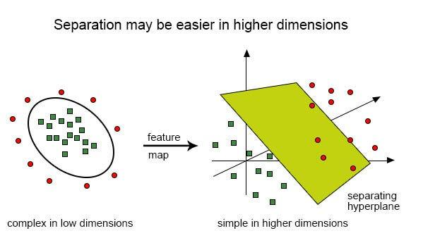

## Table of Contents

## What are kernel methods in machine learning?

Kernel methods are a type of algorithm used in machine learning to find patterns in data. They work by transforming the data into a higher-dimensional space where it's easier to separate different groups or classes. This transformation is done using a function called a kernel. The kernel calculates the similarity between data points, which helps the algorithm make predictions or classifications. A common kernel used is the Gaussian kernel, also known as the radial basis function (RBF) kernel, which can be defined as $$K(x, y) = \exp\left(-\frac{\|x - y\|^2}{2\sigma^2}\right)$$. This formula shows how the kernel measures the similarity between two points, $x$ and $y$, based on their distance and a parameter $\sigma$.

One of the main benefits of kernel methods is that they can handle complex, non-linear relationships in the data without needing to explicitly compute the transformation into the higher-dimensional space. This is known as the "kernel trick." Instead of transforming the data directly, the kernel function computes the dot product of the data points in the higher-dimensional space, which saves a lot of computational effort. This makes kernel methods very useful for tasks like classification, regression, and clustering. For example, in Support Vector Machines (SVMs), kernel methods are used to find the best boundary that separates different classes of data. This boundary, or hyperplane, is chosen to maximize the margin between the classes, making the classification more robust.

## How do kernel methods relate to the concept of feature spaces?

Kernel methods and feature spaces are closely related because kernel methods work by transforming data into a higher-dimensional feature space. In this space, it's easier to find patterns or separate different groups of data. The transformation is done using a kernel function, which calculates how similar two data points are. For example, the Gaussian kernel, also known as the radial basis function (RBF) kernel, can be defined as $$K(x, y) = \exp\left(-\frac{\|x - y\|^2}{2\sigma^2}\right)$$. This formula shows how the kernel measures the similarity between two points, $x$ and $y$, based on their distance and a parameter $\sigma$.

The key idea behind kernel methods is that they don't need to actually transform the data into the higher-dimensional space to work. Instead, they use the kernel function to compute the dot product of the data points in this higher-dimensional space. This is called the "kernel trick." By doing this, kernel methods can handle complex, non-linear relationships in the data without needing a lot of computational power. This makes them very useful for tasks like classification, regression, and clustering, where understanding the relationships in the data is important.

## What is the kernel trick and why is it important?

The kernel trick is a clever way to work with data in machine learning. It lets us look at data in a new, higher-dimensional space without actually moving the data there. Instead of changing the data, we use a special function called a kernel to figure out how similar two pieces of data are. This kernel function does the math for us in the new space, so we don't have to do the hard work of moving the data. For example, the Gaussian kernel, also known as the radial basis function (RBF) kernel, can be defined as $$K(x, y) = \exp\left(-\frac{\|x - y\|^2}{2\sigma^2}\right)$$. This formula shows how the kernel measures the similarity between two points, $x$ and $y$, based on their distance and a parameter $\sigma$.

The kernel trick is important because it saves a lot of time and computer power. Without it, we would have to move all our data to a new space, which can be very slow and hard, especially if the new space has a lot of dimensions. By using the kernel trick, we can still see the patterns and relationships in the data without doing all that extra work. This makes it easier to do things like classify data, predict outcomes, or group similar data points together. It's like having a shortcut that lets us understand complex data without getting bogged down in the details.

## Can you explain the difference between linear and non-linear kernels?

Linear kernels are the simplest type of kernel. They work by looking at the data in its original form and figuring out how similar two pieces of data are by using a simple calculation. For example, the linear kernel can be defined as $$K(x, y) = x \cdot y$$, which just means it multiplies the two pieces of data together. This is good for data where the patterns are easy to see and the relationships between the data points are straightforward. If you want to see how this works in code, here's a simple example in Python:

```python
import numpy as np

def linear_kernel(x, y):
    return np.dot(x, y)

# Example usage
x = np.array([1, 2, 3])
y = np.array([4, 5, 6])
result = linear_kernel(x, y)
print(result)  # Output: 32
```

Non-linear kernels, on the other hand, are used when the data has more complex patterns that are hard to see in the original form. They transform the data into a higher-dimensional space where these patterns become easier to spot. A common non-linear kernel is the Gaussian kernel, also known as the radial basis function (RBF) kernel, which can be defined as $$K(x, y) = \exp\left(-\frac{\|x - y\|^2}{2\sigma^2}\right)$$. This formula shows how the kernel measures the similarity between two points, $x$ and $y$, based on their distance and a parameter $\sigma$. Non-linear kernels are great for tasks like classification where the data might be twisted or spread out in ways that a simple linear kernel can't handle. Here's how you might use a Gaussian kernel in Python:

```python
import numpy as np

def gaussian_kernel(x, y, sigma=1.0):
    return np.exp(-np.linalg.norm(x - y) ** 2 / (2 * sigma ** 2))

# Example usage
x = np.array([1, 2, 3])
y = np.array([4, 5, 6])
result = gaussian_kernel(x, y)
print(result)  # Output will depend on sigma, but typically a value between 0 and 1
```

## What are some common types of kernels used in machine learning?

In machine learning, there are several common types of kernels that help us understand and work with data. One of the simplest is the linear kernel, which looks at the data in its original form and calculates how similar two pieces of data are by multiplying them together. The formula for the linear kernel is $$K(x, y) = x \cdot y$$. This kernel is great for data where the patterns are easy to see and the relationships between the data points are straightforward. If you want to see how this works in code, here's a simple example in Python:

```python
import numpy as np

def linear_kernel(x, y):
    return np.dot(x, y)

# Example usage
x = np.array([1, 2, 3])
y = np.array([4, 5, 6])
result = linear_kernel(x, y)
print(result)  # Output: 32
```

Another common kernel is the Gaussian kernel, also known as the radial basis function (RBF) kernel. This kernel is used when the data has more complex patterns that are hard to see in the original form. It transforms the data into a higher-dimensional space where these patterns become easier to spot. The formula for the Gaussian kernel is $$K(x, y) = \exp\left(-\frac{\|x - y\|^2}{2\sigma^2}\right)$$. This kernel measures the similarity between two points, $x$ and $y$, based on their distance and a parameter $\sigma$. Non-linear kernels like the Gaussian kernel are great for tasks like classification where the data might be twisted or spread out in ways that a simple linear kernel can't handle. Here's how you might use a Gaussian kernel in Python:

```python
import numpy as np

def gaussian_kernel(x, y, sigma=1.0):
    return np.exp(-np.linalg.norm(x - y) ** 2 / (2 * sigma ** 2))

# Example usage
x = np.array([1, 2, 3])
y = np.array([4, 5, 6])
result = gaussian_kernel(x, y)
print(result)  # Output will depend on sigma, but typically a value between 0 and 1
```

## How does the Neural Tangent Kernel (NTK) work and what is its significance?

The Neural Tangent Kernel (NTK) is a special kind of kernel that helps us understand how neural networks learn. It's like a map that shows how changes in the input data affect the output of the neural network. When we train a neural network, we adjust its weights to make it better at its job. The NTK helps us see how these adjustments happen by looking at the network's behavior as if it were a kernel method. The formula for the NTK can be a bit complex, but it basically measures how similar two inputs are based on how the network processes them. For example, if we have two inputs, x and y, the NTK can be defined as $$K(x, y) = \sum_{i,j} \frac{\partial f(x)}{\partial w_i} \frac{\partial f(y)}{\partial w_j} \frac{\partial L}{\partial f(x)} \frac{\partial L}{\partial f(y)}$$, where f is the network's output, w are the weights, and L is the loss function.

The significance of the NTK is that it helps us understand why deep neural networks can be so good at learning. It shows that, under certain conditions, training a neural network is similar to using a kernel method. This means that even though neural networks can be very complicated, they can still be analyzed and understood using simpler tools from kernel methods. This insight is really helpful for researchers because it gives them a way to predict how well a neural network will perform without having to train it fully. It also helps in designing better neural networks by understanding how different architectures and training methods affect the NTK.

## What is StreaMRAK and how does it apply kernel methods in streaming data scenarios?

StreaMRAK is a way to use kernel methods for data that keeps coming in, like a stream. It's useful when you have a lot of data coming in all the time and you want to understand it quickly. StreaMRAK uses something called the "kernel trick" to look at the data in a new way without actually moving it to a new space. This trick helps StreaMRAK see patterns in the data as it comes in, even if the data is complex and hard to understand at first. For example, if you're trying to predict the weather based on a constant stream of temperature and humidity data, StreaMRAK can help you find patterns and make predictions without waiting for all the data to come in.

In streaming data scenarios, StreaMRAK applies kernel methods by using a special kind of kernel called the Gaussian kernel, which can be defined as $$K(x, y) = \exp\left(-\frac{\|x - y\|^2}{2\sigma^2}\right)$$. This formula shows how the kernel measures the similarity between two pieces of data, x and y, based on their distance and a parameter σ. By using this kernel, StreaMRAK can quickly calculate how similar new data is to the data it has already seen. This helps it update its understanding of the data in real-time, making it very useful for tasks like predicting stock prices or monitoring network traffic. StreaMRAK's ability to handle streaming data with kernel methods makes it a powerful tool for many real-world applications where data is constantly changing.

## How can kernel methods be used for classification and regression tasks?

Kernel methods are really helpful for classifying things and making predictions. When we want to classify data, like figuring out if an email is spam or not, we use kernel methods to find a line or a curve that separates the different groups. This line, called a hyperplane, is chosen to be as far away from the groups as possible, which makes the classification more accurate. The kernel trick helps us do this without moving the data to a new space. For example, the Gaussian kernel, which is defined as $$K(x, y) = \exp\left(-\frac{\|x - y\|^2}{2\sigma^2}\right)$$, measures how similar two pieces of data are. This helps us find the best hyperplane to separate the data, even if the groups are mixed up in a complicated way.

For regression tasks, like predicting house prices based on features like size and location, kernel methods help us find a smooth curve that fits the data. The kernel trick allows us to see the data in a new way, making it easier to find this curve. The same Gaussian kernel can be used to calculate how similar two data points are, which helps us understand how the input features affect the output. By using kernel methods, we can make better predictions even when the relationship between the features and the output is not a simple straight line. This makes kernel methods very useful for many real-world problems where the data can be complex and hard to understand.

## What are the computational challenges associated with kernel methods and how can they be addressed?

Kernel methods can be really helpful for understanding complex data, but they can also be slow and use a lot of computer memory. This is because they need to calculate how similar every piece of data is to every other piece, which can be a lot of work when you have a lot of data. For example, if you're using the Gaussian kernel, defined as $$K(x, y) = \exp\left(-\frac{\|x - y\|^2}{2\sigma^2}\right)$$, you have to do this calculation for every pair of data points. This can make things slow and hard to handle, especially if you're working with big datasets.

To make kernel methods faster and use less memory, we can use a few tricks. One way is to use something called "sparse approximations," which means we only look at a small part of the data to do our calculations. Another way is to use "low-rank approximations," which simplify the math so it's easier for the computer to handle. These methods help make kernel methods more practical for big datasets, so we can still use them to understand complex data without waiting forever for the computer to finish its work.

## How do kernel methods compare to deep learning approaches in terms of performance and interpretability?

Kernel methods and deep learning approaches both have their strengths and weaknesses when it comes to performance and interpretability. Kernel methods, like using the Gaussian kernel defined as $$K(x, y) = \exp\left(-\frac{\|x - y\|^2}{2\sigma^2}\right)$$, are good at handling complex data without needing a lot of data to train on. They can be very accurate for tasks like classifying data or making predictions, especially when the data isn't too big. However, they can be slow and use a lot of computer memory because they need to look at every piece of data to figure out how similar things are. This can make them less practical for really big datasets.

Deep learning approaches, on the other hand, are great at handling huge amounts of data and can learn very complex patterns. They often perform better than kernel methods when you have a lot of data to work with, like in tasks such as image recognition or natural language processing. But deep learning models can be like black boxes - it's hard to understand why they make the decisions they do. This makes them less interpretable than kernel methods, which are easier to understand because they work by finding patterns in a way that's similar to simpler math problems.

In summary, if you need a model that's easy to understand and works well with smaller datasets, kernel methods might be the better choice. But if you're working with a lot of data and need the best possible performance, even if it means the model is harder to understand, deep learning could be the way to go. Both approaches have their place in machine learning, and choosing between them depends on what you need for your specific problem.

## Can you discuss any recent advancements or research in kernel methods?

Recent advancements in kernel methods have focused on improving their efficiency and applicability to larger datasets. One notable development is the use of random Fourier features, which help approximate kernel methods more quickly. This technique transforms the data into a new space using random features, making it possible to handle big datasets without the need for computing the full kernel matrix. For example, the Gaussian kernel, defined as $$K(x, y) = \exp\left(-\frac{\|x - y\|^2}{2\sigma^2}\right)$$, can be approximated using random Fourier features, which speeds up the computation and makes kernel methods more practical for real-world applications.

Another area of research involves combining kernel methods with deep learning to leverage the strengths of both approaches. This hybrid approach, sometimes called "deep kernel learning," uses neural networks to learn the kernel function, allowing for more flexible and powerful models. Researchers have found that by integrating deep learning with kernel methods, they can create models that are both highly accurate and more interpretable than traditional deep learning models alone. This is particularly useful in fields like healthcare and finance, where understanding the model's decisions is as important as the accuracy of the predictions.

## What are the limitations of kernel methods and potential areas for future development?

Kernel methods are really good at finding patterns in data, but they have some problems. One big issue is that they can be slow and use a lot of computer memory. This is because they need to look at every piece of data to see how similar things are. For example, when using the Gaussian kernel, defined as $$K(x, y) = \exp\left(-\frac{\|x - y\|^2}{2\sigma^2}\right)$$, you have to do this calculation for every pair of data points. This can make things slow and hard to handle, especially if you're working with big datasets. Another problem is that kernel methods can be hard to understand when the data is very complex. They work well for simple patterns, but when the data gets twisted or spread out in weird ways, it can be tough to figure out what the kernel is doing.

There are some exciting areas where kernel methods could get better in the future. One idea is to make them faster and use less memory. Researchers are working on ways to do this, like using random Fourier features to approximate the kernel. This can help handle big datasets without needing to compute the full kernel matrix. Another area is combining kernel methods with deep learning. This could make models that are both accurate and easier to understand. By using neural networks to learn the kernel function, we might be able to create models that are good at finding complex patterns but still let us see how they work. This could be really helpful in fields like healthcare and finance, where understanding the model's decisions is important.