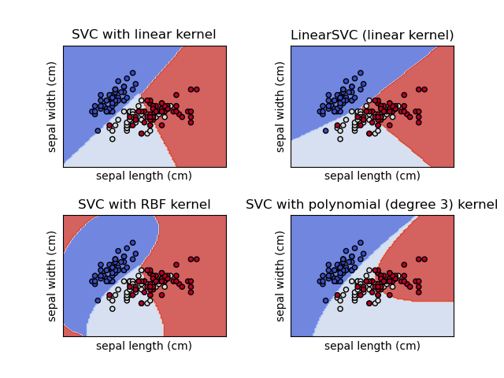

## Table of Contents

## What is a Kernel Support Vector Machine (KSVM)?

A Kernel Support Vector Machine, or KSVM, is a type of machine learning algorithm used for classification and regression tasks. It works by finding the best way to separate different groups of data points. Imagine you have a bunch of red and blue dots on a piece of paper, and you want to draw a line to separate them. KSVM helps you find the best line, or in more complex cases, the best curve or surface, to do this. The key idea is to use something called a "kernel" which helps the algorithm work in higher dimensions without actually having to compute all those dimensions.

The kernel in KSVM is a function that takes two data points and returns a value that represents how similar they are. This allows the algorithm to work in a higher-dimensional space without actually having to transform the data into that space. A common kernel used is the radial basis function (RBF) kernel, which can be written as $$ K(x, y) = \exp(-\gamma \| x - y \|^2) $$. This kernel helps the algorithm find non-linear boundaries between classes. By using different kernels, KSVM can handle a wide variety of data types and patterns, making it a powerful tool in machine learning.

In practice, using KSVM involves choosing the right kernel and tuning its parameters. For example, in the RBF kernel, you need to choose the value of $$\gamma$$. This can be done through a process called cross-validation, where you try different values and see which one works best on your data. Once you have the right settings, KSVM can be very effective at classifying new data points, making it useful in fields like image recognition, text classification, and more.

## How does a KSVM differ from a standard SVM?

A standard Support Vector Machine (SVM) works by finding the best line or hyperplane to separate different groups of data points in a straightforward way. It looks at the data in its original space and tries to draw a straight line or a flat surface to divide the groups. If the data can be separated by a straight line or a flat surface, a standard SVM works well. But if the data is more complex and cannot be separated easily with a straight line, the standard SVM might struggle.

A Kernel Support Vector Machine (KSVM) solves this problem by using a special trick called a "kernel." The kernel helps the KSVM look at the data in a higher-dimensional space without actually moving the data into that space. This allows the KSVM to find more complex boundaries, like curves or surfaces, to separate the data. For example, the radial basis function (RBF) kernel, which is often used, can be written as $$ K(x, y) = \exp(-\gamma \| x - y \|^2) $$. This kernel helps the KSVM find non-linear boundaries, making it much more flexible and able to handle more complex patterns in the data.

In simple terms, the main difference between a standard SVM and a KSVM is that a KSVM can handle more complex data patterns by using kernels to work in higher dimensions. This makes KSVM a more powerful tool for classification and regression tasks when the data cannot be easily separated by straight lines or flat surfaces.

## What are the main types of kernels used in KSVMs?

The main types of kernels used in KSVMs are the linear kernel, the polynomial kernel, and the radial basis function (RBF) kernel. The linear kernel is the simplest and is used when the data can be separated by a straight line or a flat surface. It's like using a standard SVM, where the kernel function is just $$ K(x, y) = x \cdot y $$. This kernel works well for data that is already linearly separable.

The polynomial kernel is used when the data can be separated by a curve or a more complex surface. It allows the KSVM to find non-linear boundaries by using the formula $$ K(x, y) = (x \cdot y + c)^d $$, where $$ c $$ and $$ d $$ are parameters you can choose. This kernel can handle data that forms more complicated patterns, making it useful for a wider range of problems.

The radial basis function (RBF) kernel is one of the most popular kernels because it can handle even more complex data patterns. It uses the formula $$ K(x, y) = \exp(-\gamma \| x - y \|^2) $$, where $$ \gamma $$ is a parameter you can tune. The RBF kernel can find boundaries that are very flexible and can fit almost any shape of data, making it a powerful tool for many types of classification and regression tasks.

## How do kernels help in handling non-linearly separable data?

Kernels help in handling non-linearly separable data by allowing the KSVM to work in a higher-dimensional space without actually moving the data into that space. Imagine you have a bunch of red and blue dots on a piece of paper, and you can't draw a straight line to separate them. By using a kernel, the KSVM can look at the dots in a way that's like adding more dimensions, where a straight line in this new space can separate the dots. This trick lets the KSVM find a curve or a surface that separates the data in the original space.

A common kernel used is the radial basis function (RBF) kernel, which can be written as $$ K(x, y) = \exp(-\gamma \| x - y \|^2) $$. This kernel helps the KSVM find non-linear boundaries by measuring how similar two data points are. When the KSVM uses this kernel, it can handle data that forms complex patterns, making it easier to separate the dots that couldn't be separated with a straight line. By choosing the right kernel and tuning its parameters, like the value of $$\gamma$$ in the RBF kernel, the KSVM becomes a powerful tool for classifying data that is not linearly separable.

## What is the kernel trick and how does it work in KSVMs?

The kernel trick is a clever way to help KSVMs handle data that can't be separated easily with straight lines or flat surfaces. Imagine you have red and blue dots on a piece of paper, and you can't draw a straight line to keep them apart. The kernel trick lets the KSVM look at these dots in a higher-dimensional space without actually moving the dots there. This is like adding more dimensions to the paper, where a straight line in this new space can separate the dots. By using a kernel, the KSVM can find a curve or a surface that separates the dots in the original space, making it easier to classify them.

A common kernel used in KSVMs is the radial basis function (RBF) kernel, which can be written as $$ K(x, y) = \exp(-\gamma \| x - y \|^2) $$. This kernel helps the KSVM figure out how similar two dots are. When the KSVM uses this kernel, it can handle data that forms complex patterns, making it easier to separate the dots that couldn't be separated with a straight line. By choosing the right kernel and tuning its parameters, like the value of $$\gamma$$ in the RBF kernel, the KSVM becomes a powerful tool for classifying data that is not linearly separable.

## How do you choose the right kernel for a specific problem?

Choosing the right kernel for a specific problem involves understanding the nature of your data and the patterns you're trying to identify. If your data can be separated by a straight line or a flat surface, a linear kernel, which is written as $$ K(x, y) = x \cdot y $$, might be the best choice. This is the simplest kernel and works well when the problem is straightforward. However, if your data forms more complex patterns and can't be separated easily with a straight line, you might need a more flexible kernel. 

For data that forms curves or more complicated shapes, a polynomial kernel, written as $$ K(x, y) = (x \cdot y + c)^d $$, could be a good option. This kernel allows the KSVM to find non-linear boundaries by adjusting the parameters $$ c $$ and $$ d $$. If your data has even more complex patterns, the radial basis function (RBF) kernel, which is $$ K(x, y) = \exp(-\gamma \| x - y \|^2) $$, might be the best choice. This kernel is very flexible and can handle almost any shape of data by tuning the parameter $$ \gamma $$. 

To decide which kernel to use, you can try different kernels and see which one works best on your data. This process is called cross-validation. You split your data into parts, use some parts to train the KSVM with different kernels, and then test it on the other parts to see how well it performs. By comparing the results, you can choose the kernel that gives the best performance for your specific problem.

## What are the advantages of using KSVMs over other machine learning algorithms?

KSVMs are great because they can handle data that's hard to separate with straight lines. Imagine you have red and blue dots on a piece of paper, and you can't draw a straight line to keep them apart. KSVMs use something called a kernel, like the radial basis function (RBF) kernel, which is $$ K(x, y) = \exp(-\gamma \| x - y \|^2) $$, to look at these dots in a higher-dimensional space. This trick lets KSVMs find curves or surfaces that can separate the dots, making it easier to classify them. This flexibility means KSVMs can work well with all sorts of data, even when other methods might struggle.

Another big advantage of KSVMs is that they can handle high-dimensional data without actually moving the data into those higher dimensions. This makes them efficient and powerful, especially when you have a lot of features or variables in your data. By choosing the right kernel and tuning its parameters, like the value of $$\gamma$$ in the RBF kernel, KSVMs can be very effective at classifying new data points. This makes them useful in many fields, like image recognition, text classification, and more, where data can be complex and hard to separate with simpler methods.

## How do you implement a KSVM in a programming language like Python?

To implement a Kernel Support Vector Machine (KSVM) in Python, you can use the popular machine learning library scikit-learn. First, you need to import the necessary modules and load your data. Then, you split your data into training and testing sets. After that, you create an instance of the SVC (Support Vector Classifier) class, which can use different kernels like the radial basis function (RBF) kernel. The RBF kernel is defined as $$ K(x, y) = \exp(-\gamma \| x - y \|^2) $$. You can set the kernel and its parameters, like the value of $$\gamma$$, when you create the SVC object. Finally, you fit the model to your training data and use it to make predictions on your test data.

Here's a simple example of how to implement a KSVM using the RBF kernel in Python:

```python
from sklearn import datasets
from sklearn.model_selection import train_test_split
from sklearn.svm import SVC
from sklearn.metrics import accuracy_score

# Load the iris dataset
iris = datasets.load_iris()
X = iris.data
y = iris.target

# Split the data into training and testing sets
X_train, X_test, y_train, y_test = train_test_split(X, y, test_size=0.3, random_state=42)

# Create an SVC object with the RBF kernel
svm = SVC(kernel='rbf', gamma='scale')

# Fit the model to the training data
svm.fit(X_train, y_train)

# Make predictions on the test data
y_pred = svm.predict(X_test)

# Calculate the accuracy of the model
accuracy = accuracy_score(y_test, y_pred)
print(f"Accuracy: {accuracy}")
```

This code shows how to load the iris dataset, split it into training and testing sets, create an SVC object with the RBF kernel, fit the model to the training data, make predictions on the test data, and calculate the accuracy of the model. By adjusting the kernel and its parameters, you can fine-tune the KSVM to work better with your specific data.

## What are the hyperparameters of KSVMs and how do you tune them?

The main hyperparameters of KSVMs are the kernel type, the kernel parameters like $$\gamma$$ for the radial basis function (RBF) kernel, the regularization parameter $$C$$, and the degree $$d$$ for the polynomial kernel. The kernel type decides how the KSVM looks at your data, like using the RBF kernel, which is $$ K(x, y) = \exp(-\gamma \| x - y \|^2) $$. The parameter $$\gamma$$ controls how much the KSVM cares about the distance between data points, and $$C$$ decides how much the KSVM should try to fit the training data perfectly versus keeping the model simple.

To tune these hyperparameters, you can use a method called cross-validation. This means you split your data into parts, use some parts to train the KSVM with different settings, and then test it on the other parts to see how well it works. For example, you might try different values of $$\gamma$$ and $$C$$ with the RBF kernel to see which combination gives the best results. You can do this using a grid search, where you try all possible combinations, or a random search, where you try random combinations. In Python, you can use the scikit-learn library to do this easily:

```python
from sklearn.model_selection import GridSearchCV
from sklearn.svm import SVC

# Define the parameter grid
param_grid = {'C': [0.1, 1, 10, 100], 'gamma': [1, 0.1, 0.01, 0.001], 'kernel': ['rbf']}

# Create a grid search object
grid = GridSearchCV(SVC(), param_grid, refit=True, verbose=3)

# Fit the grid search to the data
grid.fit(X_train, y_train)

# Print the best parameters and the best score
print(grid.best_params_)
print(grid.best_score_)
```

By trying different settings and seeing which ones work best, you can find the right hyperparameters for your KSVM and make it work well with your data.

## How do KSVMs handle overfitting and underfitting?

KSVMs handle overfitting and underfitting by adjusting their hyperparameters, like the regularization parameter $$C$$ and the kernel parameter $$\gamma$$. Overfitting happens when the KSVM fits the training data too well and can't work with new data. To prevent this, you can use a smaller value of $$C$$. A smaller $$C$$ makes the KSVM focus more on keeping the model simple, which helps it work better with new data. Underfitting happens when the KSVM is too simple and can't fit the data well. To fix this, you can use a larger value of $$C$$ to make the KSVM try harder to fit the training data.

The kernel parameter $$\gamma$$ also affects overfitting and underfitting. A larger $$\gamma$$ makes the KSVM pay more attention to the details in the data, which can lead to overfitting. If you see your KSVM is overfitting, you can try using a smaller $$\gamma$$ to make it focus less on the details and more on the overall pattern. On the other hand, a smaller $$\gamma$$ can make the KSVM too simple and lead to underfitting. If your KSVM is underfitting, you can try using a larger $$\gamma$$ to make it pay more attention to the details in the data.

To find the right balance between overfitting and underfitting, you can use a method called cross-validation. This means you split your data into parts, use some parts to train the KSVM with different settings, and then test it on the other parts to see how well it works. By trying different values of $$C$$ and $$\gamma$$ and seeing which ones work best, you can find the right hyperparameters for your KSVM and make it work well with your data.

## What are some real-world applications of KSVMs?

Kernel Support Vector Machines (KSVMs) are used in many real-world situations because they can handle complex data patterns. For example, in the field of image recognition, KSVMs help computers tell the difference between different objects in pictures. They do this by using a special trick called a kernel, like the radial basis function (RBF) kernel, which is $$ K(x, y) = \exp(-\gamma \| x - y \|^2) $$. This kernel lets the KSVM find curves or surfaces that can separate different parts of the image, making it easier to classify them. KSVMs are also used in medical diagnosis, where they help doctors tell if someone has a disease by looking at their test results. The KSVM can find patterns in the data that a human might miss, making it a powerful tool for doctors.

Another common use of KSVMs is in text classification, where they help sort emails into different folders or identify if a message is spam. KSVMs can look at the words in the text and use the kernel trick to find patterns that show if a message is important or not. They are also used in financial forecasting, where they help predict stock prices or detect fraud by looking at lots of data. By using the right kernel and tuning its parameters, like the value of $$\gamma$$ in the RBF kernel, KSVMs can handle all sorts of data and make accurate predictions, making them useful in many different fields.

## How do you evaluate the performance of a KSVM model?

To evaluate the performance of a KSVM model, you can use different ways to see how well it works. One common way is to use a test set, which is data the model hasn't seen before. You use the KSVM to make predictions on this test set and then compare those predictions to the real answers. If the KSVM gets a lot of them right, it's doing well. A popular measure for this is accuracy, which is the percentage of correct predictions. You can also use other measures like precision, recall, and F1-score, which give more detailed information about how well the KSVM is doing.

Another way to evaluate the KSVM is to use cross-validation. This means you split your data into parts, use some parts to train the KSVM, and then test it on the other parts. You do this many times with different splits of the data. This helps you see if the KSVM works well on different parts of the data, not just one part. By trying different settings for the KSVM, like the kernel and its parameters, you can find the best way to make it work well. For example, if you're using the radial basis function (RBF) kernel, which is $$ K(x, y) = \exp(-\gamma \| x - y \|^2) $$, you can change the value of $$\gamma$$ to see if it makes the KSVM perform better.