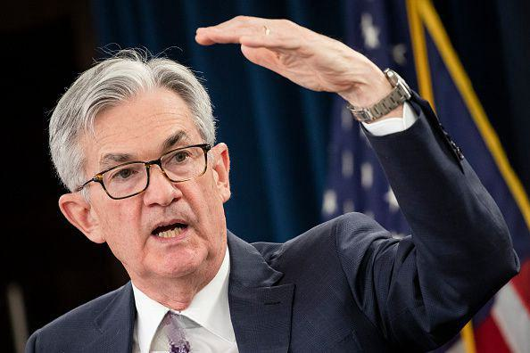

Jerome Kerviel is a name that resonates within the financial world, known for orchestrating one of the most notorious trading scandals in history. His actions at Société Générale, a major French bank, not only highlighted individual misconduct but also sparked broader discussions concerning the mechanisms of algorithmic trading and the robustness of risk management protocols within financial institutions.

Algorithmic trading, often characterized by high-speed and high-volume transactions executed through complex computer algorithms, has transformed the financial markets. It aims to capitalize on minute price discrepancies across various asset classes, achieving feats beyond the capacity of human traders. Despite its advantages, the Kerviel saga underscores the risks that arise when such powerful systems are not adequately supervised.

This article sets out to examine Kerviel's involvement in algorithmic trading, unravel the sequence of events that culminated in the scandal, and assess the subsequent impact on the financial sector. His story exemplifies the dangerous potential of algorithm-driven trading when left unchecked and unregulated. By analyzing this case, the article highlights the urgent need for robust controls to manage technology-driven trading strategies, ensuring they are executed within the bounds of ethical and responsible finance.

## Table of Contents

## Who is Jerome Kerviel?

Jerome Kerviel is a renowned figure in the history of finance, primarily due to his involvement in one of the most significant trading scandals. He was born in Pont-l'Abbé, Brittany, France, and pursued his higher education at Lumière University Lyon 2, where he earned a Master of Finance degree. Kerviel's early career at Société Générale, one of France's largest banks, began in the compliance department, which is crucial for ensuring adherence to internal and external regulations.

During the early 2000s, Kerviel demonstrated a keen understanding of the bank's internal operations and risk management protocols. This knowledge, albeit initially unremarkable in terms of academic brilliance or notable early career achievements, paved the way for his transition from the compliance sector to the world of trading. As a junior derivatives trader, Kerviel was responsible for exploiting financial opportunities in the market, focusing on the intricate dynamics between different financial instruments.

Despite not having an extraordinary academic background, Kerviel's ascent to the trading desk exemplified his proficiency with the bank's systems and a strategic approach to the complexities of financial markets. His ability to navigate the sophisticated trading environment at Société Générale was instrumental in executing trades that were both innovative and concealed, factors that would later contribute to his notorious exploits.

## Understanding Algorithmic Trading

Algorithmic trading, often called 'algo trading', utilizes computer algorithms for executing trades with remarkable speed and [volume](/wiki/volume-trading-strategy). This method leverages the power of technology to identify and exploit micro-level price discrepancies that are typically imperceptible to human traders. Consequently, it expands the possibilities for making vast numbers of trades in rapid succession, across various market conditions.

The efficiency of [algorithmic trading](/wiki/algorithmic-trading) systems lies in their ability to process vast amounts of data and execute decisions within milliseconds, outperforming the manual capabilities of traditional trading methodologies. These systems adapt seamlessly across multiple asset classes, including equities, derivatives, and currency markets. By automating the trading process, algorithms can efficiently manage a large set of transactions according to predefined criteria, significantly reducing transaction costs and minimizing the influence of human error or emotional biases.

However, alongside its advantages, algorithmic trading carries inherent risks. Poorly designed algorithms can lead to substantial financial losses, especially if they are not properly aligned with market conditions or if they exploit price movements inaccurately. Furthermore, the high speed and volume of algo trades can exacerbate market [volatility](/wiki/volatility-trading-strategies), occasionally leading to flash crashes or similar phenomena.

The implementation of algorithmic trading requires robust risk management practices to ensure controlled trading environments. Mismanagement can result in erroneous trades that propagate rapidly, with potentially significant financial repercussions. Hence, financial institutions employing algorithmic trading must maintain rigorous oversight of their systems to mitigate this risk effectively. 

The balance between leveraging the speed and efficiency of algorithmic trading and safeguarding against system failures remains a critical consideration in today's technologically driven financial marketplace.

## Kerviel’s Trading Activities

Jerome Kerviel’s trading activities at Société Générale involved complex strategies largely centered around [arbitrage](/wiki/arbitrage) opportunities, aiming to exploit price discrepancies between derivatives and their underlying assets. Kerviel leveraged his deep understanding of the bank's risk management systems to undertake and subsequently conceal these unauthorized trades. Arbitrage trading, by nature, involves simultaneous buying and selling of an asset in different markets to exploit price differentials. In theory, the differences should cover costs and leave behind profit. However, Kerviel's tactics went beyond regular arbitrage due to his manipulation of the bank’s controls.

To perpetrate his fraudulent activities, Kerviel engaged in a series of deceptive practices. He falsified documents and created fictitious transactions which masked his real trading positions. By setting up fake hedges, he made it seem like his risk exposure was balanced when, in reality, he was assuming an enormous amount of risk that went unreported within the bank’s systems. This manipulation enabled him to continue trading well beyond his authorized limits. 

Initially, Kerviel's trades were highly profitable, delivering substantial returns that likely garnered him internal recognition and emboldened his activities. However, the strategy was unsustainable; it eventually unraveled, resulting in catastrophic losses. The extent of these losses reached approximately €4.9 billion, a figure that underscored the scale and risk of his unfettered trading activities. Kerviel’s ability to exploit the system this extensively highlighted significant weaknesses in Société Générale’s oversight mechanisms, as the firm’s risk management processes failed to detect his unauthorized positions until the substantial financial damage had already been inflicted.

## The Unfolding of the Scandal

In January 2008, Société Générale, one of France's largest banks, uncovered a massive trading scandal involving Jerome Kerviel, a junior trader in their employ. The discovery prompted the institution to rapidly close unauthorized positions, incurring a monumental loss of approximately €4.9 billion. This revelation sent shockwaves throughout the financial sector, exposing vulnerabilities in the bank's internal control systems and oversight mechanisms, especially concerning algorithmic trading and risk management protocols.

The scandal emerged when discrepancies in Kerviel’s trading activities caught the attention of his superiors. These activities primarily revolved around arbitrage trading, exploiting price differences between derivatives and their underlying securities. Although effective initially, his actions eventually spiraled out of control as the positions were based on unauthorized, highly leveraged bets. By the time the bank intervened, the market had turned against these positions, leading to severe financial repercussions.

The events surrounding the scandal forced a critical assessment of Société Générale's internal controls, particularly the failure to detect the risky maneuvers earlier. Critics pointed out that the same systems designed to automate trading also allowed Kerviel to evade scrutiny by manipulating records and creating fictitious trades. This led to widespread concern about the role of technology in trading, highlighting a profound need for more stringent regulatory frameworks and oversight.

The scandal also sparked debate over whether Kerviel acted independently or if he was merely a scapegoat for broader systemic issues. Some theories suggest that the pressures and culture within trading floors may have implicitly encouraged risky behavior to achieve substantial profits. Consequently, this incident led to intense discourse on accountability and ethical practices within financial institutions.

In conclusion, the incident underscored the critical necessity for robust, fail-safe systems within financial institutions to prevent rogue trading activities. The fallout from Kerviel's actions illustrated not only the potential risks associated with algorithmic trading but also served as a catalyst for re-evaluating risk management and oversight practices globally.

## Impact on Algorithmic Trading

The scandal surrounding Jerome Kerviel's unauthorized trading activities at Société Générale in 2008 had profound implications for the field of algorithmic trading. It acted as a catalyst for financial institutions to reassess their risk management strategies and oversight protocols. Following the revelation of the massive losses incurred by Kerviel's trades, there was a heightened awareness of the vulnerabilities inherent in sophisticated trading technologies.

To address these vulnerabilities, financial institutions embarked on a significant overhaul of their IT security frameworks. The introduction of more advanced monitoring systems became essential to detect unauthorized trading activities in real-time. Enhanced encryption and access control measures were implemented to safeguard sensitive financial data and restrict unauthorized personnel from executing trades or altering records.

Alongside technological advancements, regulatory bodies imposed stricter compliance requirements on financial institutions. Regulations such as the Markets in Financial Instruments Directive II (MiFID II) in Europe mandated enhanced transparency in trading activities and required the implementation of more rigorous risk management practices. Compliance with these regulations often necessitated an organizational culture shift, emphasizing the importance of ethical standards and accountability in trading operations.

The Kerviel case underscored the dual nature of algorithmic trading systems. On one hand, these systems offer significant profit-generation potential due to their ability to execute large volumes of trades rapidly and exploit slight market discrepancies. However, left unchecked, they also pose substantial risks, as evidenced by the near catastrophic financial losses at Société Générale. The incident unequivocally demonstrated that advanced trading technologies could not replace the necessity for human oversight and the implementation of robust risk management frameworks. Financial institutions were thus compelled to ensure that the efficiencies gained through technology did not come at the expense of control and stability within the trading environment.

## Lessons Learned

Jerome Kerviel's actions highlighted significant lapses in the risk management frameworks of financial institutions. The scandal underscored the importance of implementing robust and comprehensive risk management systems to prevent unauthorized trading activities and mitigate financial losses. One of the key lessons learned from this incident is the necessity for regular audits. These audits serve as a preventive mechanism to detect irregularities and ensure compliance with trading protocols. By scrutinizing trading operations regularly, financial institutions can identify potential risks and rectify them before they escalate into substantial threats.

Another critical takeaway is the effective utilization of compliance teams. These teams play an integral role in overseeing trading activities and ensuring that they adhere to established guidelines and ethical standards. The presence of vigilant compliance teams can serve as a deterrent against potential misconduct by reinforcing a culture of accountability and ethical behavior among traders.

Furthermore, the scandal emphasized the need for stringent approval processes in trading operations. Implementing rigorous checks and balances before executing trades can significantly reduce the likelihood of unauthorized or reckless trading activities. By requiring multiple layers of authorization, financial institutions can ensure that trades align with their risk appetite and strategic objectives.

The case also ignited broader discussions about the ethical use of algorithms in trading. As algorithmic trading becomes increasingly prevalent, it is imperative for financial institutions to maintain transparency and accountability in their operations. This involves not only adhering to regulatory requirements but also fostering an ethical culture that prioritizes the responsible use of technology.

In conclusion, the lessons learned from Jerome Kerviel's actions underscore the critical importance of establishing robust risk management frameworks, conducting regular audits, empowering compliance teams, and enforcing stringent approval processes. These measures are essential for safeguarding financial institutions against the potential risks associated with trading activities and ensuring the ethical use of trading technologies.

## Jerome Kerviel's Life After the Scandal

After the scandal, Jerome Kerviel faced significant legal repercussions, including a prison sentence and substantial financial penalties. In 2010, Kerviel was convicted by a French court of breach of trust, forgery, and unauthorized use of the bank's computers, resulting in a five-year prison sentence, with two years suspended, and an order to pay back €4.9 billion to Société Générale, a sum that was later deemed symbolic due to its unfeasibility.

Following his release from prison, Kerviel transitioned to work as an IT consultant, focusing on information systems and security. This career shift underscores his expertise in the domain and highlights a continued engagement with the technological aspects of financial systems, albeit from a regulatory and security-focused perspective.

Kerviel has also participated in public discourse regarding regulatory practices and ethical standards within the financial industry. He has occasionally voiced criticisms of systemic issues within the banking sector, emphasizing the need for more robust oversight and ethical considerations in trading practices. His experiences have turned him into a controversial figure in discussions about financial market regulations and have positioned him as an advocate for regulatory reform and transparency in banking operations.

## Conclusion

Jerome Kerviel's case acts as a stark reminder of the vulnerabilities inherent in technologically-driven financial systems. The saga underscores the need for an equilibrium between capitalizing on the speed and efficiency of algorithmic trading and effectively managing the associated risks. High-frequency and algorithm-driven trading systems possess the capacity to revolutionize financial markets through their ability to process large volumes of transactions at unprecedented speeds. However, they can also magnify errors and facilitate wrongdoing if left unchecked.

The Kerviel incident illuminated the importance of robust risk management practices and highlighted potential gaps in internal controls within financial institutions. This serves as a catalyst for ongoing development and implementation of advanced IT security measures and stringent regulatory frameworks. The ultimate goal is to protect against unauthorized trading activities and reduce the likelihood of financial calamities.

To that end, the financial sector must continuously evolve, refining its systems to keep pace with rapidly changing technologies and market conditions. This involves not only adopting more sophisticated algorithmic trading platforms but also ensuring rigorous compliance and monitoring systems are in place. The dynamic nature of financial markets demands that institutions remain vigilant, adaptable, and proactive in recognizing and addressing new challenges that arise with technological advancements.

In conclusion, while algorithmic trading offers undeniable benefits in terms of efficiency and market [liquidity](/wiki/liquidity-risk-premium), maintaining a vigilant approach to risk management and system integrity is essential. Jerome Kerviel's case remains a poignant example of why oversight and ethical considerations must remain at the forefront of financial market operations. The lessons learned from his experience should drive industry-wide efforts to create safer and more transparent trading environments.

## References & Further Reading

[1]: Kerviel, J. (2010). "L'engrenage : Mémoires d'un trader" (French Edition). Editions Flammarion.

[2]: MacKenzie, D. (2014). ["Mechanizing the Merc: The Chicago Mercantile Exchange and the Rise of High-Frequency Trading."](https://pubmed.ncbi.nlm.nih.gov/26387525/) Technology and Culture, 55(3), 648-674.

[3]: Patterson, S. (2010). ["The Quants: How a New Breed of Math Whizzes Conquered Wall Street and Nearly Destroyed It."](https://www.amazon.com/Quants-Whizzes-Conquered-Street-Destroyed/dp/0307453383) Crown Business.

[4]: Zurawski, A. (2009). ["The Role of Algorithmic Trading in Pricing and Risk Management."](https://www.nber.org/papers/w32540) Working Paper, Rutgers University.

[5]: Mallaby, S. (2016). ["More Money Than God: Hedge Funds and the Making of a New Elite."](https://www.amazon.com/More-Money-Than-God-Relations/dp/0143119419) Penguin Books.