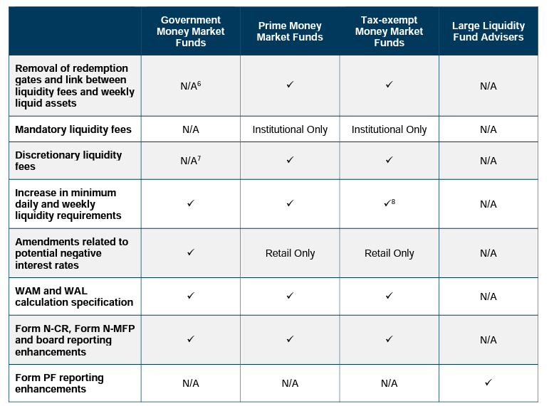

## Table of Contents

## What is the 2016 Money Market Reform?

The 2016 Money Market Reform was a set of changes made by the U.S. Securities and Exchange Commission (SEC) to make money market funds safer and more stable. Before the reform, money market funds were seen as very safe places to keep money, but they could still lose value during big financial troubles, like what happened in 2008. The reform aimed to fix this by making rules that would help prevent sudden withdrawals of money by investors, which can cause problems for the funds and the wider financial system.

One big change was that certain types of money market funds, called institutional prime and institutional municipal funds, had to start using a floating net asset value (NAV) instead of a fixed $1 per share. This meant the value of shares could go up or down slightly, showing investors that these funds were not completely risk-free. Another change was the introduction of liquidity fees and redemption gates. These allowed fund managers to charge fees or temporarily stop investors from taking their money out if too many people were trying to withdraw at once. These changes were meant to help keep the funds stable and protect investors during times of stress in the financial markets.

## Why was the 2016 Money Market Reform introduced?

The 2016 Money Market Reform was introduced because money market funds were seen as very safe places to keep money, but they could still lose value during big financial troubles, like what happened in 2008. This caused a lot of worry for investors and the financial system. The reform was needed to make these funds safer and more stable so that people could trust them more. The main goal was to stop sudden withdrawals of money by investors, which can cause problems for the funds and the wider financial system.

One big reason for the reform was the 2008 financial crisis, where a major money market fund "broke the buck," meaning its value fell below $1 per share. This scared a lot of people and led to a rush to pull money out of these funds. To prevent this from happening again, the SEC decided to make rules that would help keep the funds stable. They changed how certain funds worked and added new ways to manage big withdrawals, making money market funds a safer place for people to keep their money.

## What are the main changes introduced by the 2016 Money Market Reform?

The 2016 Money Market Reform made big changes to make money market funds safer. One main change was that certain types of money market funds, like institutional prime and institutional municipal funds, had to start using a floating net asset value (NAV). This meant the value of shares could go up or down a little bit, instead of always staying at $1 per share. This was to show investors that these funds were not completely risk-free and to help keep the funds stable during tough times.

Another important change was the introduction of [liquidity](/wiki/liquidity-risk-premium) fees and redemption gates. These rules let fund managers charge a fee or temporarily stop investors from taking their money out if too many people were trying to withdraw at the same time. This was to prevent a rush of withdrawals that could hurt the fund and the financial system. By making these changes, the reform aimed to make money market funds more stable and protect investors during times of financial stress.

## How does the reform affect institutional prime money market funds?

The 2016 Money Market Reform made big changes to how institutional prime money market funds work. One main change is that these funds now have to use a floating net asset value (NAV). This means the value of the shares in these funds can go up or down a little bit, instead of always staying at $1 per share. This change was made to show investors that these funds are not completely safe and to help keep the funds stable during tough times.

Another change that affects institutional prime money market funds is the introduction of liquidity fees and redemption gates. If too many people try to take their money out of the fund at the same time, the fund managers can charge a fee or temporarily stop people from taking their money out. This helps prevent a rush of withdrawals that could hurt the fund and the financial system. These changes make the funds safer and more stable, helping to protect investors during times of financial stress.

## What is the impact of the reform on retail money market funds?

The 2016 Money Market Reform did not change retail money market funds as much as it did institutional ones. Retail funds, which are meant for individual investors, can still keep their value at a fixed $1 per share. This means that people who invest in these funds do not have to worry about the value of their shares going up or down a little bit every day. The reason for this is that retail funds are seen as safer because they are less likely to have a lot of people trying to take their money out all at once.

However, there is one change that affects retail money market funds. If there is a big rush of people trying to take their money out, the fund managers can still charge a fee or temporarily stop people from taking their money out. This is called a liquidity fee or a redemption gate. It helps to keep the fund stable and protect other investors. So, even though retail funds did not change as much, this rule helps make sure they stay safe during times of financial stress.

## What are floating net asset values (NAV) and how do they relate to the reform?

Floating net asset values (NAV) are when the value of shares in a money market fund can go up or down a little bit instead of always staying at $1 per share. Before the 2016 Money Market Reform, most money market funds had a fixed NAV of $1 per share, which made people think these funds were very safe. But during big financial troubles, like the 2008 crisis, some funds lost value and "broke the buck," which scared a lot of investors.

The reform changed this for certain types of money market funds, like institutional prime and institutional municipal funds. These funds now have to use a floating NAV to show investors that they are not completely risk-free. This change helps keep the funds more stable during tough times because it makes it clearer to investors that the value of their money can change a little bit. By doing this, the reform aims to prevent sudden rushes of people trying to take their money out, which can cause big problems for the funds and the financial system.

## How does the reform address liquidity fees and redemption gates?

The 2016 Money Market Reform introduced liquidity fees and redemption gates to help keep money market funds stable during times when a lot of people want to take their money out at once. Liquidity fees are charges that fund managers can put on when too many people are trying to withdraw their money. This fee makes it a bit more expensive to take money out, which can slow down the rush and help the fund stay stable. Redemption gates are when the fund managers can temporarily stop people from taking their money out. This gives the fund time to get more cash and handle the situation better.

These rules apply to both institutional and retail money market funds. The idea is to prevent a situation where everyone tries to get their money out at the same time, which can cause big problems for the fund and the financial system. By using liquidity fees and redemption gates, the reform helps make sure that money market funds can handle big withdrawals without falling apart. This makes the funds safer for investors and helps keep the financial system stable during tough times.

## What are the implications of the reform for investors?

The 2016 Money Market Reform has changed things for investors, especially those who put their money in institutional prime and institutional municipal funds. Now, these funds use a floating net asset value (NAV), which means the value of the shares can go up or down a little bit instead of always staying at $1. This might make some investors a bit nervous because they can see that the value of their money isn't fixed. But it also helps make the funds more honest about the risks involved, so investors know what they are getting into. If there's a big rush of people trying to take their money out, the fund managers might charge a fee or stop withdrawals for a bit. This can be annoying for investors who need their money right away, but it helps keep the fund stable and protects everyone's money in the long run.

For people who invest in retail money market funds, the changes are not as big. These funds can still keep their value at a fixed $1 per share, which makes them feel safer. But if there's a big rush to take money out, the fund managers can still charge a fee or stop withdrawals temporarily. This means retail investors might face some delays or costs if they need their money during a financial crisis. Overall, the reform aims to make money market funds safer for everyone by preventing sudden rushes of withdrawals that can hurt the funds and the financial system. It's all about keeping things stable and protecting investors' money during tough times.

## How have money market funds adapted to the 2016 reforms?

Money market funds have made changes to follow the 2016 reforms. For institutional prime and institutional municipal funds, they now use a floating net asset value (NAV). This means the value of the shares can go up or down a little bit instead of always staying at $1. This change helps investors see that these funds are not completely safe and can help keep the funds stable during tough times. Fund managers can also charge a fee or stop people from taking their money out if too many people want to withdraw at the same time. This is to stop a rush of withdrawals that can hurt the fund and the financial system.

Retail money market funds, which are for individual investors, did not change as much. They can still keep their value at a fixed $1 per share, so people feel safer investing in them. But if there is a big rush to take money out, the fund managers can still charge a fee or stop withdrawals temporarily. This helps keep the fund stable and protects other investors. Overall, money market funds have adapted to the reforms by making rules that help prevent sudden rushes of withdrawals, making the funds safer and more stable for everyone.

## What challenges have fund managers faced in implementing the reform?

Fund managers have faced some challenges in implementing the 2016 Money Market Reform. One big challenge is dealing with the floating net asset value (NAV) for institutional prime and institutional municipal funds. Before the reform, the value of these funds was always $1 per share, but now it can go up or down a little bit. This means fund managers have to work harder to keep investors happy and explain why the value changes. They also have to be more careful about what they invest in because any small change can affect the NAV.

Another challenge is managing liquidity fees and redemption gates. If too many people want to take their money out at the same time, fund managers can charge a fee or stop withdrawals temporarily. This is hard because they have to decide when to use these tools and how it will affect their investors. It can be tricky to balance keeping the fund stable with making sure investors can get their money when they need it. Overall, these changes have made the job of fund managers more complicated, but they are important for keeping money market funds safe and stable.

## How has the 2016 Money Market Reform influenced the broader financial market?

The 2016 Money Market Reform has made a big difference in the broader financial market. By making money market funds safer and more stable, the reform helps stop big problems from happening during financial troubles. Before the reform, when people got scared and wanted to take their money out all at once, it could cause a lot of trouble for the funds and the whole financial system. Now, with rules like floating net asset values and the ability to charge fees or stop withdrawals, money market funds are less likely to fall apart during a crisis. This makes the financial market more stable because people trust these funds more and are less likely to panic.

The changes also affect how investors and banks work with money market funds. Investors now know that some funds are not completely safe, so they might be more careful about where they put their money. Banks and other big investors have to think more about the risks and might change how they use these funds. This can lead to changes in how money moves around in the financial market. Overall, the reform has made the financial system stronger and more able to handle tough times, but it has also made things a bit more complicated for everyone involved.

## What are the future prospects and potential further reforms in the money market sector following the 2016 changes?

The future of money market funds looks like it will keep changing to make things even safer and better for investors. After the 2016 reforms, people are still talking about what else can be done to make these funds more stable. Some ideas include making even stricter rules about what kinds of things money market funds can invest in. This could help prevent big losses if something goes wrong in the market. There's also talk about making it easier for funds to get cash quickly during tough times, so they can handle big withdrawals better. These changes could help keep the financial system strong and make sure people's money is safe.

Another thing that might happen is more rules about how much money can be taken out of funds at once. Right now, fund managers can charge fees or stop withdrawals if too many people want their money back. But some people think these rules could be made even clearer and easier to use. This would help prevent a rush of withdrawals that can cause big problems. As the financial world keeps changing, money market funds will probably keep getting new rules to make sure they stay a safe place for people to keep their money.

## References & Further Reading

[1]: ["SEC Adopts Money Market Fund Reform Rules"](https://www.sec.gov/newsroom/press-releases/2014-143) - U.S. Securities and Exchange Commission, 2014.

[2]: ["Money Market Fund Reform; Amendments to Form PF"](https://www.sec.gov/files/rules/final/2014/33-9616.pdf) - Federal Register, 2014.

[3]: Kacperczyk, M., & Schnabl, P. (2013). ["How Safe Are Money Market Funds?"](https://academic.oup.com/qje/article-abstract/128/3/1073/1850594) The Quarterly Journal of Economics, 128(3), 1073-1122.

[4]: Brady, S., Anadu, K., & Cooper, N. (2012). ["The Stability of Prime Money Market Mutual Funds: Sponsor Support from 2007 to 2011"](https://www.bostonfed.org/-/media/Documents/Workingpapers/PDF/qau1203.pdf) - Federal Reserve Bank of Boston.

[5]: ["Algorithmic and High-Frequency Trading"](https://www.amazon.com/Algorithmic-High-Frequency-Trading-Mathematics-Finance/dp/1107091144) by Álvaro Cartea, Sebastian Jaimungal, and José Penalva

[6]: Poole, W. (2010). ["Causes and Consequences of the Financial Crisis of 2007-2009"](https://www.researchgate.net/publication/288570725_Causes_and_consequences_of_the_financial_crisis_of_2007-2009) Harvard Journal of Law & Public Policy, 33(2), 421-441.

[7]: ["Trading and Exchanges: Market Microstructure for Practitioners"](https://www.amazon.com/Trading-Exchanges-Market-Microstructure-Practitioners/dp/0195144708) by Larry Harris

[8]: ["Financial Innovation and Trading"](https://jfin-swufe.springeropen.com/) by Caspar Peter Benzler and Jürgen Kühling 