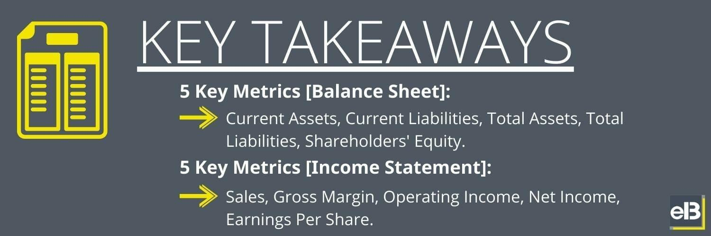

In the ever-evolving world of finance and technology, the intersection of balance sheet analysis and algorithmic trading is becoming increasingly significant. As financial markets grow more complex and interconnected, traders and investors are seeking comprehensive strategies that combine traditional financial analysis with modern technological advancements. This article outlines how understanding balance sheet financial metrics can enhance algorithmic trading strategies, which rely heavily on data-driven decision-making processes.

Balance sheet analysis provides crucial insights into a company's financial health by examining key components such as assets, liabilities, and shareholders' equity. These components can reveal the operational efficiency and financial stability of a company, impacting its market valuation and stock price movements. By integrating these insights into algorithmic trading systems, traders can develop strategies that are both informed and adaptive.



The fusion of fundamental analysis with algorithmic trading allows for a more holistic trading approach. Traders can apply mathematical models and coding, such as Python scripts, to automate the analysis of financial statements, facilitating rapid and precise trades. This approach not only aids in identifying trading opportunities based on financial metrics but also enhances risk management by providing a quantifiable basis for investment decisions.

Join us as we explore the crucial aspects of accounting, financial metrics, and algorithmic trading. This exploration will help traders and financial professionals leverage detailed financial analysis and automation to optimize trading efficiency and outcomes, ultimately contributing to a more dynamic and informed financial market landscape.

## Table of Contents

## Understanding Balance Sheet Financial Metrics

Balance sheets are essential financial statements that offer a detailed snapshot of a company’s financial condition at a particular moment. They are fundamentally structured into three main components: assets, liabilities, and shareholders' equity. Each of these components plays a crucial role in providing a comprehensive overview of a company’s financial standing and is instrumental in assessing the company's ability to meet its financial obligations and generate profits.

**Assets** on the balance sheet are resources owned by the company that are expected to generate future economic benefits. They are typically categorized into current assets, such as cash, accounts receivable, and inventory, and non-current assets, such as property, plant, equipment, and intangible assets like patents. 

**Liabilities** represent the company's obligations to external parties, which are also divided into current liabilities, like accounts payable and short-term debt, and long-term liabilities, including bonds payable and long-term leases.

**Shareholders' equity** indicates the residual interest in the assets of the entity after deducting liabilities. It includes items like common stock, preferred stock, and retained earnings.

Financial metrics derived from these components are critical for investors and traders as they provide insights into the company’s financial health and operational efficiency. Three key types of ratios are particularly significant:

1. **Liquidity Ratios**: These ratios measure the company’s ability to meet its short-term obligations. The most common liquidity ratios include the Current Ratio and the Quick Ratio. 

   - The Current Ratio is calculated as:
$$
     \text{Current Ratio} = \frac{\text{Current Assets}}{\text{Current Liabilities}}

$$
   This ratio provides a sense of the company's capability to cover its short-term liabilities with its short-term assets.

   - The Quick Ratio, or Acid-Test Ratio, refines the Current Ratio by excluding inventory from current assets:
$$
     \text{Quick Ratio} = \frac{\text{Current Assets} - \text{Inventory}}{\text{Current Liabilities}}

$$
   This ratio gives a more stringent assessment of the company's financial strength.

2. **Solvency Ratios**: These ratios assess the company’s capacity to meet its long-term obligations, with the Debt-to-Equity Ratio being a primary example.

   - The Debt-to-Equity Ratio is calculated as:
$$
     \text{Debt-to-Equity Ratio} = \frac{\text{Total Liabilities}}{\text{Shareholders' Equity}}

$$
   A higher ratio suggests higher financial risk, as the company is more reliant on borrowed money.

3. **Profitability Ratios**: These ratios evaluate the company’s ability to generate profit relative to its revenue, assets, or shareholders' equity. Common examples include Return on Assets (ROA) and Return on Equity (ROE).

   - Return on Assets (ROA) is calculated as:
$$
     \text{ROA} = \frac{\text{Net Income}}{\text{Total Assets}}

$$
   It indicates how efficiently the company is utilizing its assets to generate earnings.

   - Return on Equity (ROE) is calculated as:
$$
     \text{ROE} = \frac{\text{Net Income}}{\text{Shareholders' Equity}}

$$
   This ratio measures the company’s profitability by revealing how much profit is generated with the money invested by the shareholders.

Analyzing these metrics offers a deeper understanding of a company's financial stability and its operational success. This is essential for traders who rely on data-driven decisions to evaluate prospective investments and modify trading strategies accordingly. Mastery of these balance sheet metrics is fundamental for making informed trading decisions, particularly in [algorithmic trading](/wiki/algorithmic-trading) where large data sets are analyzed swiftly to capitalize on market trends.

## Role of Accounting in Algorithmic Trading

Accounting plays a crucial role in algorithmic trading by providing a solid foundation of financial data essential for the development and execution of trading algorithms. The integrity and precision of accounting records are paramount to the reliability of these systems, as they serve as the primary source of input data for algorithmic models.

Accurate accounting records are fundamental to ensure that algorithms are fed with reliable inputs. These records encompass a company's historical financial data, ensuring that traders have access to credible information for making decisions. This accuracy is critical, as any discrepancies or errors can lead to incorrect trading signals, potentially resulting in significant financial losses.

Understanding the nuances of financial accounting is vital for traders who develop algorithms that need to respond effectively to real-time data. The complexity of financial data, including variances in reporting standards and practices across different jurisdictions, must be accounted for in algorithmic models. This understanding ensures that the algorithms process data consistently and generate accurate trading signals.

Financial statements and balance sheets, as essential outputs of accounting processes, form the foundation for predictive models in algorithmic trading. Analysts and traders rely on these documents to extract key metrics that influence trading strategies, such as earnings per share (EPS), return on equity (ROE), and debt-to-equity ratios. Algorithms can utilize these metrics to predict market trends, assess the financial health of companies, and identify potential trading opportunities.

Robust accounting practices are directly linked to the development of strong trading strategies. These practices ensure that financial data is clean, consistent, and comprehensive, enabling algorithmic models to perform complex analyses with confidence. For example, consider a scenario where a [machine learning](/wiki/machine-learning) algorithm is designed to identify undervalued stocks. Using historical financial data extracted from accurate accounting records, the algorithm can learn patterns that are indicative of undervaluation, thus allowing traders to make informed decisions.

In conclusion, the integration of sound accounting practices into algorithmic trading systems is integral to their success. By ensuring that trading models are built on a foundation of reliable financial data, traders can enhance the effectiveness of their strategies and improve their ability to navigate the fast-moving markets. As algorithmic trading continues to evolve, the role of accounting in providing quality data will remain indispensable.

## Integration of Financial Metrics in Algo Trading

Integration of balance sheet metrics into algorithmic trading involves converting qualitative data into actionable insights that guide trading decisions. This process begins with the identification of key financial metrics that inform the economic health of a company. Financial ratios derived from balance sheets, such as [liquidity](/wiki/liquidity-risk-premium) and solvency ratios, are instrumental in evaluating a company's operational efficiency and fiscal stability.

To harness these metrics within algorithmic trading systems, algorithms can be crafted to monitor and respond to variations in financial data. For instance, an algorithm might react to shifts in liquidity ratios, such as the current ratio (Current Assets / Current Liabilities), to preempt potential cash flow disruptions. Similarly, solvency ratios like the debt-to-equity ratio (Total Debt / Shareholders' Equity) offer insight into a company's financial structure, which algorithms can use to assess risk and make informed trading decisions.

Moreover, the integration of financial metrics allows for the creation of automated trading strategies that can swiftly interpret and act upon real-time data. These systems are designed to quickly analyze financial statements and balance sheets, extracting pertinent metrics to favorably execute trades. With the advancement of computing technologies and the proliferation of high-frequency trading, the speed at which these analyses occur provides a significant competitive advantage in the market.

Consider the case of hedge funds employing algorithmic models to trade equities based on [fundamental analysis](/wiki/fundamental-analysis). These models might integrate balance sheet metrics into their high-frequency trading algorithms, employing statistical techniques like multivariate regression to predict stock price movements. By leveraging financial ratios, the algorithms can predict the likelihood of a company's stock outperforming or underperforming its peers.

For example, a Python script designed to trigger trades based on liquidity metric thresholds could be structured as follows:

```python
def evaluate_liquidity(current_assets, current_liabilities, threshold=1.5):
    current_ratio = current_assets / current_liabilities
    if current_ratio < threshold:
        execute_trade("sell")  # example action when liquidity is low
    else:
        execute_trade("buy")  # example action when liquidity is stable

def execute_trade(action):
    # Placeholder for trade execution logic
    print(f"Executing {action} order")

# Example usage
evaluate_liquidity(100000, 70000)
```

In this script, the function `evaluate_liquidity` calculates the current ratio and executes a buy or sell order based on a predefined threshold. This exemplifies how threshold-based decision-making can be incorporated into trading systems to exploit financial insights.

In conclusion, the integration of balance sheet financial metrics into algorithmic trading offers profound benefits, enhancing the accuracy and effectiveness of trading strategies. By automating the analysis of crucial financial data, traders can achieve greater precision and responsiveness in their investment approaches, fostering improved performance in ever-competitive trading environments.

## Advantages and Challenges

The synergy of balance sheet analysis and algorithmic trading delivers considerable advantages in modern financial markets. Primarily, the integration allows for enhanced speed and precision in executing trades. Automated systems can process balance sheet data at remarkable speeds, far exceeding human capabilities. This rapid processing enables traders to react almost instantaneously to fluctuations in financial metrics, granting them a competitive edge. For instance, if an algorithm detects a decline in a company's liquidity ratio suggesting potential cash flow issues, it can execute trades within milliseconds to mitigate risk or capitalize on market movements.

The scalability of algorithmic trading systems is another considerable advantage. These systems can handle vast volumes of data, allowing them to simultaneously analyze multiple companies' financial health through their balance sheets. This broad analysis capability aids traders in making more informed decisions by considering a wider context of financial information.

Despite these advantages, several challenges need careful management. Data accuracy is of paramount importance since algorithmic decisions rely on precise inputs from financial statements. Erroneous data can lead to flawed trading decisions, resulting in significant financial losses. Ensuring the integrity of data is essential throughout the extraction, transformation, and loading (ETL) process that populates the trading algorithms with relevant financial metrics.

Furthermore, model reliability is a critical concern. Algorithms must be robust and adaptive to ensure their predictive capabilities remain accurate over time. Machine learning techniques such as [reinforcement learning](/wiki/reinforcement-learning) can help improve model reliability by allowing algorithms to learn from past trades and adjust their strategies accordingly. However, this requires constant monitoring and optimization to prevent model drift.

Market [volatility](/wiki/volatility-trading-strategies) presents another challenge. Sudden market movements can affect the effectiveness of trading models that are predominantly based on historic balance sheet data. To counteract this, algorithms need to incorporate real-time news and other qualitative factors that could impact financial performance. This involves complex natural language processing and sentiment analysis to gauge market sentiment effectively.

In conclusion, while the integration of balance sheet analysis with algorithmic trading presents significant opportunities, it also necessitates careful consideration of several challenges. Financial professionals must focus on ensuring data accuracy, enhancing model reliability, and adapting to market volatility. Embracing new technologies and methodologies will be essential for developing resilient and efficient trading strategies that maximize the potential of this innovative approach.

## Conclusion

The convergence of balance sheet financial metrics and algorithmic trading is significantly transforming the financial industry. This integration allows for a more nuanced understanding of financial health to be embedded directly into trading algorithms, creating opportunities to maximize trading efficiency and outcomes. By combining detailed financial analysis with automation, traders can make more informed decisions swiftly, responding to market changes with precision that was previously unattainable.

In the future, the role of financial data seamlessly integrated with technological tools will become foundational in trading practices. Algorithms that incorporate balance sheet metrics such as liquidity ratios and solvency measures will be central in building and executing sophisticated trading strategies. The automation of these processes enables the handling of large data volumes while minimizing the risk of human error, thus providing a competitive advantage in fast-paced trading environments.

Investors and financial professionals must stay ahead of these trends by continuously embracing and learning about innovative approaches. The rapid pace of technological advancement in financial markets necessitates a commitment to ongoing education and adaptation. Understanding and integrating new methodologies will be crucial to maintaining an edge in evolving markets.

This article emphasizes the importance of both leveraging these technological integrations and remaining agile in adjusting to new developments. The financial landscape is continuously evolving, and those who engage in continuous learning and adaptation are likely to thrive amidst these changes. The strategic use of balance sheet financial metrics in conjunction with algorithmic trading promises a future where the efficiency and effectiveness of trading strategies are greatly enhanced.

## References & Further Reading

[1]: ["Financial Statement Analysis and Security Valuation"](https://www.amazon.com/Financial-Statement-Analysis-Security-Valuation/dp/0073379662) by Stephen H. Penman

[2]: ["Algorithmic Trading and DMA: An Introduction to Direct Access Trading Strategies"](https://archive.org/details/algorithmictradi0000john) by Barry Johnson

[3]: ["Financial Intelligence, Revised Edition: A Manager's Guide to Knowing What the Numbers Really Mean"](https://www.amazon.com/Financial-Intelligence-Revised-Managers-Knowing/dp/1422144119) by Karen Berman and Joe Knight

[4]: ["Data Science for Algorithmic Trading"](https://towardsdatascience.com/data-science-in-algorithmic-trading-d21a46d1565d) by Yves Hilpisch

[5]: ["Python for Finance: Mastering Data-Driven Finance"](https://www.amazon.com/Python-Finance-Mastering-Data-Driven/dp/1492024333) by Yves Hilpisch