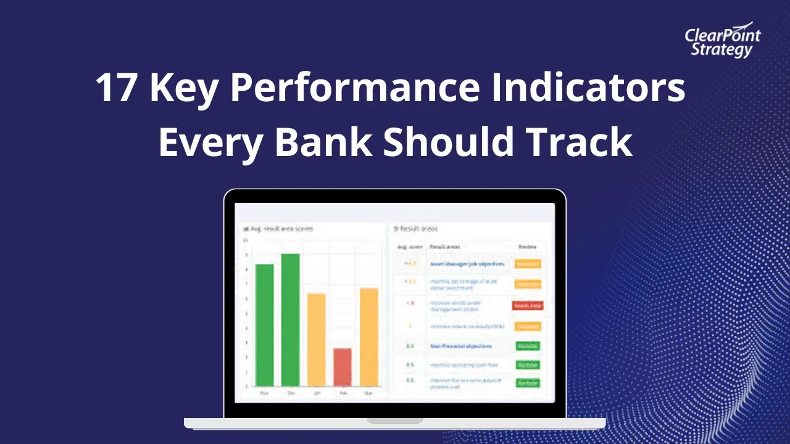

## Table of Contents

## What are benchmarks in the context of the banking sector?

Benchmarks in the banking sector are standards or reference points used to measure the performance of banks. They help banks understand how well they are doing compared to other banks or to their own past performance. For example, a benchmark might be the average interest rate that banks charge on loans. If a bank's interest rate is higher than the benchmark, it might mean the bank is doing better than others in terms of earning interest.

These benchmarks can be set by different organizations, like government agencies or industry groups. They can cover many areas, such as profitability, customer satisfaction, or how quickly the bank processes transactions. By using benchmarks, banks can see where they need to improve and make better decisions to stay competitive. For instance, if a bank sees that its customer satisfaction scores are lower than the benchmark, it might start new programs to improve service.

## Why are benchmarks important for tracking the performance of banks?

Benchmarks are important for tracking the performance of banks because they give banks a way to see how they are doing compared to others. Imagine you are running a race. You want to know if you are faster or slower than other runners. Benchmarks are like the other runners in the race. They help banks see if they are doing better or worse than other banks. This can be about how much money they make, how happy their customers are, or how fast they do their work.

Using benchmarks also helps banks find out where they need to get better. If a bank sees that it is not doing as well as the benchmark in some areas, it can work on those parts. For example, if a bank's customers are less happy than the benchmark shows, the bank can start new ways to make customers happier. This way, benchmarks help banks make smart choices to keep up with or do better than other banks.

## Can you name some common benchmarks used in the banking industry?

In the banking industry, one common benchmark is the net interest margin. This is the difference between the interest a bank earns on loans and the interest it pays on deposits. Banks use this benchmark to see how well they are making money from their main business of lending and borrowing. Another benchmark is the return on assets (ROA), which shows how much profit a bank makes for every dollar of assets it owns. This helps banks see if they are using their assets well to make money.

Customer satisfaction scores are also important benchmarks. These scores tell banks how happy their customers are with their services. Banks can compare their scores to industry averages to see if they need to improve their customer service. Another key benchmark is the efficiency ratio, which measures how well a bank manages its costs compared to its revenue. A lower efficiency ratio means the bank is doing a good job of keeping costs down while making money.

Lastly, the loan-to-deposit ratio is a benchmark that shows the balance between the money a bank lends out and the money it takes in from deposits. This helps banks see if they are lending too much or too little compared to what they have in deposits. By keeping an eye on these benchmarks, banks can make better decisions to stay competitive and serve their customers well.

## How do benchmarks like the S&P U.S. BMI Banks index help investors?

Benchmarks like the S&P U.S. BMI Banks index help investors by giving them a way to see how well banks are doing compared to each other. This index includes many different banks, so it shows an overall picture of how the banking industry is doing. When investors look at this benchmark, they can see if the banks they are interested in are doing better or worse than the average. This helps them decide which banks might be good to invest in.

Using the S&P U.S. BMI Banks index also helps investors understand the risks and rewards of investing in banks. If the index goes up, it might mean that banks are doing well and it could be a good time to invest. If the index goes down, it might mean that banks are struggling, and investors might want to be more careful. By watching this benchmark, investors can make smarter choices about where to put their money in the banking sector.

## What is the difference between a global and a regional banking benchmark?

A global banking benchmark covers banks from all over the world. It helps people see how banks are doing everywhere, not just in one place. For example, a global benchmark might show how well banks in the United States are doing compared to banks in Europe or Asia. This can be useful for investors who want to know about the banking industry around the world. It gives them a big picture of how banks are doing globally.

A regional banking benchmark, on the other hand, focuses on banks in a specific area, like a country or a group of countries. It helps people understand how banks are doing in that particular region. For example, a regional benchmark for Europe would only include banks in European countries. This can be helpful for people who are only interested in the banking industry in that region. It gives them a more detailed look at how banks are doing in a smaller area.

## How is the KBW Bank Index constructed and what does it measure?

The KBW Bank Index, also known as the KBW Nasdaq Bank Index, is made up of a group of banks that trade on the stock market. The index includes the 24 biggest and most important banks in the United States. These banks are chosen based on how much they are worth and how many shares people buy and sell. The index is calculated by looking at the prices of the stocks of these banks and putting them together in a special way that shows how the whole group is doing.

The KBW Bank Index measures how well these big U.S. banks are doing as a group. It helps investors see if the banking industry is going up or down. If the index goes up, it means the banks in the index are doing well and their stock prices are going up. If the index goes down, it means the banks are not doing as well and their stock prices are going down. This index is useful for people who want to know about the health of the U.S. banking industry and make smart choices about where to put their money.

## What role do interest rates play in banking benchmarks?

Interest rates are really important in banking benchmarks. They are like the heartbeat of the banking world. Many benchmarks, like the net interest margin, look at the difference between the interest banks earn on loans and the interest they pay on deposits. If interest rates go up, banks can earn more money from loans, which can make their net interest margin higher. But if interest rates go down, it can be harder for banks to make money from loans, and their net interest margin might get smaller.

Interest rates also affect other benchmarks, like the return on assets (ROA). When interest rates are high, banks can earn more from the money they lend out, which can make their ROA go up. But when interest rates are low, it can be tougher for banks to make a good return on their assets. So, interest rates are a big deal in banking because they can change how well banks do compared to benchmarks. By watching interest rates, banks can plan better and see how they stack up against others in the industry.

## How do regulatory changes impact banking sector benchmarks?

Regulatory changes can have a big effect on banking sector benchmarks. When rules change, banks have to do things differently. For example, if a new rule says banks need to keep more money in reserve, it can change how much they can lend out. This can impact benchmarks like the loan-to-deposit ratio, which looks at the balance between loans and deposits. If banks can lend less, this ratio might go down, showing that banks are not lending as much compared to the money they have in deposits.

These changes can also affect how banks make money. For instance, if a new regulation limits the fees banks can charge, it can lower their profits. This would show up in benchmarks like the return on assets (ROA), which measures how much profit banks make from their assets. If profits go down because of the new rules, the ROA might also go down, showing that banks are not making as much money as before. So, regulatory changes can shake up the numbers that benchmarks track, helping to show how well banks are doing under the new rules.

## Can you explain how the Euro Stoxx Banks index reflects European banking performance?

The Euro Stoxx Banks index is like a report card for big banks in Europe. It includes the stocks of the biggest and most important banks in countries that use the euro. When you look at this index, you can see if these banks are doing well or not. If the index goes up, it means the stock prices of these banks are going up, which is a good sign. If it goes down, it means the stock prices are falling, which might mean the banks are not doing so well.

This index helps people understand the health of the banking industry in Europe. For example, if the Euro Stoxx Banks index is going up while other industries are not doing so well, it might mean that banks are doing better than other businesses. Investors and people who work in the banking world use this index to make decisions about where to put their money or how to plan for the future. It gives them a clear picture of how European banks are performing as a group.

## What advanced metrics are used in banking benchmarks to assess risk?

Banks use advanced metrics to understand how much risk they are taking. One important metric is the Value at Risk (VaR), which helps banks figure out the most they could lose on their investments over a certain time. It's like looking into a crystal ball to see the worst-case scenario for their money. Another metric is the Risk-Weighted Assets (RWA), which measures the risk of different types of loans and investments. Banks use RWA to make sure they have enough money set aside to cover potential losses. These metrics help banks keep an eye on their risk and make smart choices.

Another useful metric is the Loan Loss Provision (LLP), which is the money banks set aside to cover loans that might not get paid back. By looking at LLP, banks can see if they are being too risky with their lending. The Common Equity Tier 1 (CET1) ratio is also important. It shows how much high-quality capital a bank has compared to its risk-weighted assets. A higher CET1 ratio means the bank is in a better position to handle tough times. These advanced metrics help banks manage risk and stay strong, even when things get tough.

## How do alternative data sources enhance the accuracy of banking sector benchmarks?

Alternative data sources help make banking sector benchmarks more accurate by giving banks more information to look at. These sources can include things like social media posts, satellite images, or even data from credit card transactions. By using this extra information, banks can see a fuller picture of how they are doing. For example, if a bank sees that people are talking a lot about their services on social media, it can use that to understand customer satisfaction better than just looking at surveys.

This extra data can also help banks spot trends and risks faster. If satellite images show that a lot of new businesses are opening in an area, a bank might see that as a chance to lend more money there. Or, if credit card data shows that people are spending less, the bank might get ready for more loan defaults. By using [alternative data](/wiki/best-alternative-data), banks can make their benchmarks more up-to-date and accurate, helping them make better decisions and stay ahead of the competition.

## What are some challenges faced when using benchmarks to evaluate the banking sector's health?

Using benchmarks to check how healthy the banking sector is can be tricky. One big problem is that benchmarks might not show the whole picture. For example, a benchmark like the net interest margin looks at how much money banks make from loans compared to what they pay for deposits. But it doesn't tell you if the bank is taking too many risks or if its customers are happy. So, relying only on benchmarks can make banks miss important details about their health.

Another challenge is that benchmarks can be affected by things outside the bank's control, like changes in the economy or new laws. If interest rates go up or down, it can change how well banks do compared to benchmarks, even if the banks themselves haven't changed anything. Also, different countries have different rules for banks, so comparing banks from different places using the same benchmark can be unfair. This means that while benchmarks are useful, they need to be used carefully and with other information to really understand how healthy the banking sector is.

## What are Banking Benchmarks and How Can They Be Understood?

Banking benchmarks are fundamental tools used to assess and compare the performance of bank-related stocks and entities. These benchmarks provide critical insights into the financial health and operational efficiency of banks, helping stakeholders make informed decisions. The evaluation of different types of banks, such as commercial and retail banks, typically involves distinct sets of benchmarks tailored to their operational characteristics and financial structures.

Commercial banks, which primarily focus on deposits and loans from businesses, are often evaluated using metrics that reflect their ability to manage credit risk and generate profit from interest. Retail banks, which deal mostly with individual customers, may emphasize customer service efficiency and retail-oriented financial products. Despite these differences, several key metrics are universally significant in banking benchmarks:

1. **Liquidity Ratios**: These ratios measure a bank's ability to meet its short-term obligations. The common liquidity ratio is the Current Ratio, calculated as:
$$
   \text{Current Ratio} = \frac{\text{Current Assets}}{\text{Current Liabilities}}

$$

   A higher ratio suggests better [liquidity](/wiki/liquidity-risk-premium), indicating the bank can easily meet its short-term debts and obligations.

2. **Net Interest Margin (NIM)**: This metric reflects the difference between the interest income generated and the amount of interest paid to lenders, relative to the amount of interest-earning assets.
$$
   \text{NIM} = \frac{\text{Interest Income} - \text{Interest Expense}}{\text{Average Earning Assets}}

$$

   A higher NIM indicates more profitability from the bank's lending activities.

3. **Profitability Ratios**: These ratios assess a bank's ability to generate earnings relative to its revenue, assets, equity, and other financial conditions. Return on Assets (ROA) and Return on Equity (ROE) are commonly used profitability ratios, defined as:
$$
   \text{ROA} = \frac{\text{Net Income}}{\text{Total Assets}}

$$
$$
   \text{ROE} = \frac{\text{Net Income}}{\text{Shareholder's Equity}}

$$

   These ratios provide insights into how effectively a bank is utilizing its resources to generate profits.

In the investment landscape, Exchange-Traded Funds (ETFs) such as the iShares U.S. Financial Services [ETF](/wiki/etf-trading-strategies) and the Vanguard Financials Index ETF serve as critical benchmarking tools for investors. These ETFs track specific indices that represent portfolios of bank-related stocks, offering a simplified reference for comparing the performance of individual banking entities against broader market trends.

By understanding and utilizing these banking benchmarks, investors and analysts can make more informed decisions about the financial health of banks, enabling a more strategic approach to investment and financial planning.

## References & Further Reading

[1]: Bergstra, J., Bardenet, R., Bengio, Y., & Kégl, B. (2011). ["Algorithms for Hyper-Parameter Optimization."](https://dl.acm.org/doi/10.5555/2986459.2986743) Advances in Neural Information Processing Systems 24.

[2]: ["Advances in Financial Machine Learning"](https://www.amazon.com/Advances-Financial-Machine-Learning-Marcos/dp/1119482089) by Marcos Lopez de Prado

[3]: ["Evidence-Based Technical Analysis: Applying the Scientific Method and Statistical Inference to Trading Signals"](https://www.amazon.com/Evidence-Based-Technical-Analysis-Scientific-Statistical/dp/0470008741) by David Aronson

[4]: ["Machine Learning for Algorithmic Trading"](https://github.com/stefan-jansen/machine-learning-for-trading) by Stefan Jansen

[5]: ["Quantitative Trading: How to Build Your Own Algorithmic Trading Business"](https://www.amazon.com/Quantitative-Trading-Build-Algorithmic-Business/dp/1119800064) by Ernest P. Chan