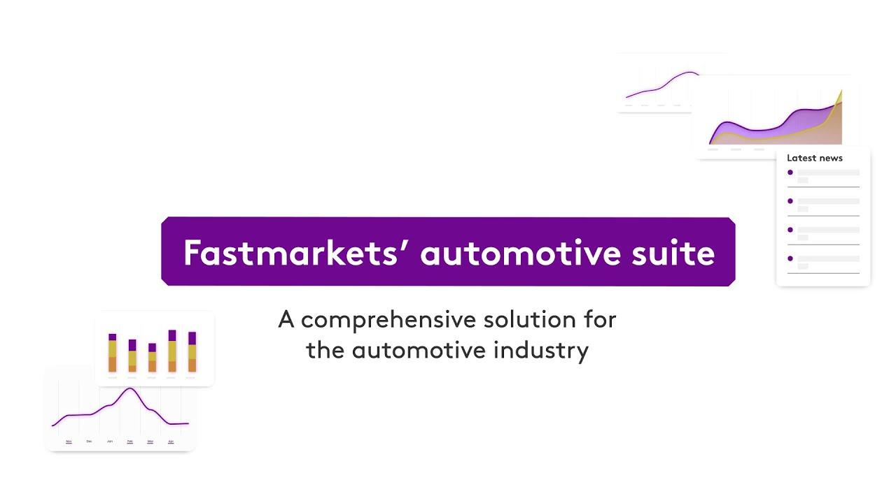

The automotive industry is fundamentally dependent on a spectrum of commodities that serve as essential input materials for vehicle production. These materials form the backbone of car manufacturing, dictating the design, durability, and efficiency of the vehicles. This exploration focuses on understanding how these commodities, including metals like steel and aluminum, as well as advanced plastics and glass, are integral to automotive manufacturing processes.

Steel and aluminum, for instance, are pivotal in constructing vehicle bodies, frames, and various other components. The choice of materials not only influences manufacturing expenses but also plays a crucial role in determining a vehicle’s fuel efficiency and overall performance. Furthermore, evolving environmental and safety standards have heightened the demand for lightweight materials, prompting a shift towards aluminum and other alternatives to traditional steel.



In parallel, the rise of algorithmic trading has introduced new dynamics within commodity markets pertinent to the automotive industry. This technological advancement has transformed how commodity prices are assessed and predicted, bringing rapidity and precision to trading activities. By leveraging computational algorithms and data-driven strategies, market participants can execute trades with greater efficiency, a factor that holds significant implications for automakers in their procurement strategies and cost management.

Thus, the relationship between commodities and the automotive sector is multifaceted, involving intricate interdependencies. As the industry continues to advance towards sustainability and innovation, understanding these materials' market behaviors and incorporating emerging trading technologies become crucial for maintaining competitiveness and optimizing resource allocation.

## Table of Contents

## Key Commodities Used in the Automotive Industry

The automotive industry is fundamentally dependent on a diverse array of materials to manufacture vehicles, with aluminum, steel, advanced plastics, and glass being particularly crucial. These materials are selected for their unique properties, including strength, weight, and cost-effectiveness, all of which influence vehicle performance and manufacturing efficiency.

Steel is one of the most extensively used materials in vehicle construction due to its strength, durability, and affordability. It is typically used in the car's chassis, body, engine components, and various structural elements. The versatility of steel in terms of being able to be crafted and modified into numerous shapes makes it indispensable in traditional automotive manufacturing. Its high tensile strength and ability to absorb impact are particularly valuable for maintaining vehicle safety standards.

Aluminum, on the other hand, is gaining prominence in the industry, primarily due to its lightweight nature, which directly affects vehicle efficiency. The move towards reducing vehicle weight to enhance fuel efficiency and reduce emissions has been a critical [factor](/wiki/factor-investing) driving the increased utilization of aluminum in car production. Aluminum is approximately 33% lighter than steel, which significantly enhances fuel economy and reduces greenhouse gas emissions. It is frequently used in engine blocks, body panels, and wheels. Additionally, aluminum's resistance to corrosion adds to the vehicle's longevity and performance.

The transition towards lightweight materials is catalyzed by stringent regulatory standards aimed at improving fuel efficiency and reducing emissions. These standards have prompted auto manufacturers to explore alternative materials that can meet the dual demands of safety and performance. As a result, aluminum sees increasingly widespread usage as it effectively balances these requirements, providing a lightweight solution while not compromising on safety.

Moreover, advanced plastics have become an integral part of modern vehicles, serving multiple functions. These materials are used extensively in interior fittings such as dashboards, panels, and seats due to their flexibility, durability, and lighter weight compared to traditional materials. By reducing vehicle weight further, these plastics contribute to overall fuel savings and improved performance. Additionally, advances in polymer technologies have introduced plastics that can withstand high temperatures and stresses, making them suitable for use in under-the-hood applications.

Glass remains a staple material in automotive design, contributing to aesthetic appeal and safety. Innovations in glass manufacturing have produced strong, lightweight, and tinted options that enhance vehicle performance and passenger comfort. Technologies such as laminated safety glass and tempered glass have markedly improved vehicle safety by offering better resistance to impact.

In conclusion, the strategic use of materials like steel, aluminum, advanced plastics, and glass is crucial in vehicle manufacturing and design. The automotive industry's focus is increasingly skewed towards materials that not only fulfill structural needs but also align with evolving environmental and efficiency standards.

## Impact of Commodity Prices on Automotive Manufacturing

Fluctuations in commodity prices have a profound impact on the automotive manufacturing industry. Raw materials such as steel, aluminum, and plastics compose a substantial portion of vehicle production costs. Consequently, variances in commodity prices can lead to significant changes in production expenses, directly affecting the industry’s profit margins.

Historically, raw materials can represent up to 70% of the total cost of a vehicle. A significant price hike in commodities like steel or aluminum can increase the cost of vehicle production, pushing manufacturers to adjust pricing models or risk diminishing their margins. For instance, if the cost of steel rises by 10%, and steel accounts for 20% of the production cost of a vehicle priced at $30,000, the increase translates to an additional $600 in production expenses.

$$
\text{Additional Cost} = \frac{\text{Steel Cost Percentage}}{100} \times \text{Vehicle Price} \times \frac{\text{Price Increase Percentage}}{100}
$$

Incorporating strategies to manage materials costs is crucial for automakers to remain competitive. Techniques such as hedging through derivatives and forward contracts are often employed to mitigate these risks. Additionally, diversifying the supply chain and enhancing relationships with multiple suppliers can also provide a buffer against volatile commodity markets.

Furthermore, the global nature of commodity markets means that automotive companies must remain vigilant and adapt quickly to geopolitical events, natural disasters, or shifts in supply and demand, all of which can affect pricing. To maintain competitiveness, manufacturers are increasingly employing technologies such as predictive analytics and [machine learning](/wiki/machine-learning) to better anticipate price changes and manage procurement strategies more effectively.

Overall, understanding the dynamics of commodity pricing and its implications on manufacturing costs is an imperative aspect of strategic planning for automotive companies. This understanding helps ensure that they can maintain profitability and continue to offer competitively priced products to consumers.

## Algorithmic Trading in Commodity Markets

Algorithmic trading has significantly transformed the commodity markets by enhancing execution speed and decision-making efficiency. This trading approach employs computer algorithms to analyze vast datasets and execute trades at optimal timing, thereby offering a strategic edge in the highly volatile commodity markets. The algorithms utilize predefined criteria such as price, timing, and [volume](/wiki/volume-trading-strategy) to identify trading opportunities, executing trades faster than is possible manually.

The core advantage of [algorithmic trading](/wiki/algorithmic-trading) lies in its ability to process and analyze complex market data rapidly, allowing traders to react to market movements almost instantaneously. By employing statistical models and applying machine learning techniques, algorithms can identify patterns and trends that might elude human analysis, thereby providing a more thorough analysis of market conditions. For example, an algorithm might be designed to trigger a buy order whenever a commodity's price drops below a certain threshold, based on historical data indicating a likely price rebound.

Python, a widely used programming language in algorithmic trading, offers numerous libraries such as NumPy, Pandas, and SciPy, which provide the statistical and analytical tools necessary for developing and [backtesting](/wiki/backtesting) trading strategies. Consider the following basic Python code snippet for a moving average crossover strategy, a common algorithmic trading strategy:

```python
import pandas as pd

# Load historical commodity price data
data = pd.read_csv('commodity_prices.csv')
# Calculate the short and long moving averages
data['short_mavg'] = data['price'].rolling(window=40, min_periods=1).mean()
data['long_mavg'] = data['price'].rolling(window=100, min_periods=1).mean()

# Generate buy/sell signals
data['signal'] = 0
data['signal'][40:] = np.where(data['short_mavg'][40:] > data['long_mavg'][40:], 1, 0)

# Plot the moving averages along with signals for visualization
data[['price', 'short_mavg', 'long_mavg']].plot(grid=True)
```

While algorithmic trading provides substantial advantages, human oversight and insight remain crucial. Algorithms are built on historical data and assumptions, which may not always predict future market conditions reliably. As such, human traders are needed to manage unforeseen scenarios and adjust strategies accordingly. Moreover, ethical considerations and market regulations necessitate human involvement to ensure compliance and mitigate the risk of market manipulation.

In conclusion, algorithmic trading stands as a powerful tool in the commodities market, offering increased accuracy and the capacity to evaluate market conditions swiftly. While human participation is essential for effective oversight and adaptability, the integration of algorithms continues to shape the future landscape of commodity trading.

## Impact of Algorithmic Trading on Automotive Commodity Procurement

Algorithmic trading has fundamentally influenced how commodity prices are established and perceived within the automotive industry. This technologically advanced approach leverages complex algorithms to execute trades at speeds and frequencies impossible for a human trader, allowing for more precise and efficient market operations. 

Automakers significantly benefit from algorithmic trading through an improved ability to forecast market trends and manage price risks. The integration of automated trading systems means that automakers receive real-time data analysis, enabling them to make informed procurement decisions rapidly. The algorithms can sift through vast amounts of historical and current market data to identify patterns, thus providing automakers with accurate predictions about future commodity pricing. This information is crucial in managing the cost [volatility](/wiki/volatility-trading-strategies) of essential materials like steel and aluminum, which constitute a substantial portion of vehicle production costs.

However, the adoption of algorithmic trading in the automotive commodity procurement process also brings with it certain challenges, particularly in keeping pace with the accelerated market changes propelled by technological advancements. Automated trades happen at speeds that can be overwhelming for traditional trading systems and can sometimes lead to increased market volatility. These rapid changes necessitate continual updates and monitoring of trading algorithms to ensure they remain effective and relevant.

Moreover, the reliance on algorithmic trading systems introduces complexity in understanding the factors driving price changes. The algorithms, while powerful, can sometimes function as black boxes, providing limited insight into the rationale behind specific trading decisions. Thus, it becomes imperative for automotive industry stakeholders to blend algorithm-based insights with human expertise to interpret and act upon the derived data effectively.

The result is a dual advantage: enhanced predictability and control over commodity procurement, alongside the need for adaptive strategies to match the fast-evolving trading environment. This combination of algorithmic precision and human oversight is essential for navigating the dynamic landscape of commodity prices in automotive manufacturing.

## Future Trends and Opportunities

As the automotive industry progresses toward sustainability and enhanced efficiency, the demand for commodities such as lithium, cobalt, and nickel is anticipated to rise. These materials are vital for the production of electric vehicle (EV) batteries, which are central to the industry's shift from internal combustion engines to electric powertrains. This transformation also underscores the rising significance of rare earth elements used in EV motors. Enhanced fuel efficiency and stricter environmental regulations are driving the automotive sector to innovate in material selection, pushing manufacturers to adopt lightweight materials that meet strength and durability criteria while reducing overall vehicle weight.

Algorithmic trading, increasingly prevalent in commodity markets, is poised to play an essential role in this evolving landscape. Its ability to analyze large datasets in real-time allows for more accurate predictions of price movements, thus equipping traders with insights that were previously unattainable. This efficiency in processing and reacting to market data enables more stable pricing environments and helps automotive companies anticipate market swings, manage price risks, and optimize procurement strategies. By incorporating machine learning and data analytics, algorithmic trading systems are expected to evolve, further refining commodity market predictions.

Opportunities are emerging in leveraging these technologies to enhance pricing strategies. For example, algorithms can be employed to optimize the timing of commodity purchases, locking in favorable prices and reducing exposure to market volatility. Additionally, integrating these trading strategies into the supply chain can lead to improved inventory management and reduced lead times. Automated systems allow for continuous market monitoring, providing actionable insights that can streamline logistics and improve overall operational efficiency.

The integration of algorithmic trading with blockchain technology presents another significant opportunity. By utilizing blockchain for commodity transactions, transparency and traceability are enhanced, reducing fraud and ensuring the integrity of the supply chain. This combination can lead to more reliable forecasting models and a better understanding of supply chain dynamics.

In summary, as the automotive industry embraces vehicles that are both sustainable and efficient, the corresponding demand for specific commodities will transform. By harnessing advances in algorithmic trading and integrating them with innovative technologies like blockchain, automotive companies can refine their material pricing strategies and optimize their supply chains, opening new avenues for growth and competitiveness in a dynamically changing market.

## Conclusion

The intersection of commodities and the automotive sector presents both challenges and opportunities, driven by the dynamic nature of global markets and technological advancements. The automotive industry's dependency on a variety of commodities such as steel, aluminum, and advanced plastics underscores the critical importance of resource management. With the advent of algorithmic trading, there is a significant opportunity for automotive manufacturers to leverage technology for better resource management and enhanced cost efficiencies.

Algorithmic trading, characterized by its speed and capacity to process vast amounts of market data, offers a strategic advantage in managing commodity prices. By enabling quicker and more precise market forecasts, automotive companies can better anticipate price changes and adjust procurement strategies accordingly. The ability to quickly respond to market volatility is crucial, as it directly impacts manufacturing costs and ultimately, profitability.

However, the benefits of embracing algorithmic trading are contingent upon staying informed and adaptive to the ever-changing commodity markets. The constant evolution of market dynamics requires automotive companies to remain vigilant and capable of integrating new technologies and strategies to maintain competitiveness. This adaptability ensures that firms can capitalize on emerging opportunities and mitigate risks associated with commodity price fluctuations.

In conclusion, the convergence of commodities and the automotive industry offers a landscape replete with potential improvements in efficiency and cost management. By effectively incorporating algorithmic trading methodologies, automotive companies can not only secure supply chain resilience but also achieve a sustainable competitive edge. Remaining proactive and responsive to market developments is imperative for enduring success in this sector.

## References & Further Reading

[1]: Callister, W. D., & Rethwisch, D. G. (2009). ["Materials Science and Engineering: An Introduction"](https://archive.org/details/MaterialsScienceAndEngineering). John Wiley & Sons, Inc.

[2]: Aluminum Association. (2021). ["Automotive Applications of Aluminum."](https://drivealuminum.org/wp-content/uploads/2022/06/Automotive-Aluminum-Roadmap_FINAL_2022.pdf)

[3]: Hunt, V.D. (2000). ["Advanced Materials and Processes: The Material Selection Process"](https://www.asminternational.org/magazine/advanced-materials-processes/) John Wiley & Sons.

[4]: Joshi, S. S., & Sheikh, A. A. (2020). ["Advances in Lightweight Materials and Structures"](https://www.researchgate.net/publication/284911958_3D_printing_in_aerospace_and_its_long-term_sustainability). Springer.

[5]: Cuervo, D., Navas, C. A., & Dupont, C. (2018). ["Algorithmic Trading for the Retail Forex: Tuning Programmable Strategies for Profit"](https://www.researchgate.net/publication/327640297_Algorithmic_Trading_for_the_Retail_Forex_Tuning_Programmable_Strategies_for_Profit) IEEE Access.

[6]: Candelon, B., & Tokpavi, S. (2015). ["Commodity Price Volatility and Financialization: A Review and Some New Insights"](https://www.cb.cityu.edu.hk/ef/doc/RCIE%20working%20paper%20series/2015/2015003%20Candelon.pdf). Journal of Banking & Finance.