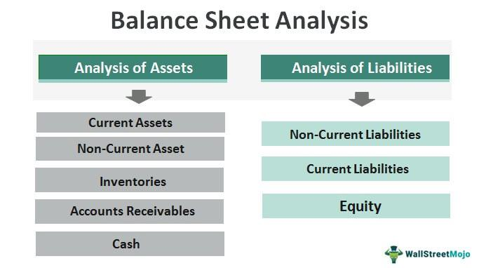

Financial statement analysis is a crucial element in evaluating a company's stability and performance, particularly for algo traders who rely on data-driven insights to inform their strategies. A key component, the balance sheet, provides a comprehensive snapshot of a company's financial status by detailing its assets, liabilities, and shareholders' equity at a specific point in time. This information is indispensable for traders looking to gauge a company's financial health and its capability to fulfill obligations and seize growth opportunities.

Understanding and analyzing financial statements can significantly enhance trading strategies and improve decision-making in algorithmic trading. By dissecting balance sheets, algo traders can derive valuable financial ratios that convey insights into liquidity, solvency, and efficiency, helping to predict market movements and identify investment opportunities. Such ratios are pivotal in crafting algorithms that generate trading signals and manage risk effectively.



This article will explore the key considerations in balance sheet analysis for algo trading, with a focus on critical financial ratios, assets, liabilities, and equity elements. It aims to provide readers with practical guidance on integrating these insights into trading algorithms, optimizing market strategies, and ultimately achieving competitive advantages. The balance sheet, thus, is not merely a static document; it is a dynamic tool that, when analyzed astutely, can drive superior trading decisions.

## Table of Contents

## Understanding the Balance Sheet

A balance sheet is a financial statement providing a snapshot of a company's financial position at a specific point in time, offering insights into its assets, liabilities, and shareholders' equity. These three sections together elucidate the company's financial structure and stability. The balance sheet adheres to the accounting equation: 

$$
\text{Assets} = \text{Liabilities} + \text{Shareholders' Equity}
$$

**Assets** represent resources owned by the company that have economic value and can be measured reliably. They are classified into current and non-current categories. Current assets, such as cash, inventories, and accounts receivable, are expected to be converted to cash or used up within one year. Non-current assets, such as property, plant, equipment, and intangible assets like patents, provide value over a longer period.

**Liabilities** are obligations the company owes to external parties and are also divided into current and non-current categories. Current liabilities, such as accounts payable and short-term debt, are due within one year, whereas non-current liabilities, like long-term debt, are due beyond one year. Liabilities indicate the financial obligations that the company must fulfill, and evaluating them helps in assessing the company's financial stability and liquidity risk.

**Shareholders' Equity** reflects the residual interest in the company's assets after deducting liabilities and represents the ownership interest of shareholders. It includes common stock, preferred stock, additional paid-in capital, retained earnings, and treasury stock. Retained earnings are the cumulative net income kept by the company rather than distributed as dividends, reflecting a source of internal financing for growth.

Understanding this framework is critical for assessing a company's financial health as it reveals how effectively a company utilizes its resources and manages its obligations. Analyzing the balance sheet allows investors and analysts to determine the company's ability to generate future economic benefits and sustain its operations, ultimately informing investment and trading decisions.

## Key Balance Sheet Elements for Algo Trading

In [algorithmic trading](/wiki/algorithmic-trading), analyzing key elements of a balance sheet is crucial for understanding a company's economic footprint, [liquidity](/wiki/liquidity-risk-premium) status, and financial health. These components significantly impact trading strategies, enabling the identification of profitable opportunities and the assessment of potential risks.

### Assets

**Cash and Cash Equivalents**: This figure provides insight into a company's liquidity, reflecting its ability to fulfill short-term obligations without liquidating other assets. For algorithmic traders, high cash levels might indicate excellent financial health or potential for investments and growth. Low cash reserves could signify liquidity risks.

**Accounts Receivable**: This asset represents money owed by customers for goods and services delivered. High levels of accounts receivable might indicate strong sales but could also point to potential collection issues. The Account Receivable Turnover Ratio, calculated as:

$$
\text{Account Receivable Turnover Ratio} = \frac{\text{Net Credit Sales}}{\text{Average Accounts Receivable}}
$$

provides insights into how efficiently a company collects debts.

### Liabilities

**Short-term Liabilities**: These obligations need settlement within a year and include accounts payable, short-term debt, and other accrued liabilities. Monitoring these can help traders evaluate a company's capability to cover debts with current assets. A rising trend in short-term liabilities may signal potential liquidity issues.

**Long-term Liabilities**: This includes bonds payable, long-term leases, and pension obligations, reflecting long-term financial commitments. High long-term liabilities relative to assets may indicate increased financial risk. The Debt-to-Equity Ratio, expressed as:

$$
\text{Debt-to-Equity Ratio} = \frac{\text{Total Liabilities}}{\text{Shareholders' Equity}}
$$

is crucial for assessing a company's leverage and potential financial volatility.

### Shareholders' Equity

**Retained Earnings and Paid-in Capital**: Shareholders' equity signifies ownership worth after liabilities are deducted from assets. Retained earnings reflect accumulated profits, reinvested in the company or reserved for debt reduction. Paid-in capital shows investment funds received from shareholders in exchange for stock. These elements provide insights into how funds are sourced and utilized for growth or shareholder returns.

### Financial Leverage and Efficiency

Understanding the interplay between assets, liabilities, and equity is essential for evaluating financial leverage and operational efficiency. High financial leverage implies more liabilities relative to equity, indicating potential return amplification and financial risk.

### Insights Through Financial Ratios

Financial ratios derived from balance sheet elements offer deeper insights. For example, the Current Ratio:

$$
\text{Current Ratio} = \frac{\text{Current Assets}}{\text{Current Liabilities}}
$$

evaluates liquidity, whereas the Return on Equity (ROE):

$$
\text{ROE} = \frac{\text{Net Income}}{\text{Shareholders' Equity}}
$$

assesses profitability relative to shareholder investments.

Incorporating these balance sheet elements and related financial ratios into algorithmic trading models can refine decision-making processes and enhance trading strategies. Such integration provides a robust foundation for analyzing a company's financial dynamics, supporting informed investment decisions.

## Important Financial Ratios for Algorithmic Trading

Financial ratios derived from the balance sheet, such as the Debt-to-Equity Ratio and Current Ratio, are vital tools for assessing a company's financial health and risk profile in algorithmic trading. These ratios allow traders to quantify a company's financial leverage and liquidity, which are essential in crafting robust trading strategies.

The **Debt-to-Equity Ratio** is defined as:

$$
\text{Debt-to-Equity Ratio} = \frac{\text{Total Liabilities}}{\text{Shareholders' Equity}}
$$

This ratio provides insights into a company's financial leverage by comparing its total liabilities to shareholders' equity. A high ratio typically indicates that a company is heavily financed by debt compared to its equity, which may suggest higher financial risk. Integrating this ratio into trading algorithms can help in risk management by signaling caution when high leverage is detected, potentially flagging companies with unsustainable debt levels.

The **Current Ratio**, calculated as:

$$
\text{Current Ratio} = \frac{\text{Current Assets}}{\text{Current Liabilities}}
$$

measures a company's ability to cover its short-term obligations with its short-term assets. A current ratio greater than 1 indicates that the company has more current assets than current liabilities, reflecting well on its short-term financial health. This ratio can be used in trading algorithms to generate signals favoring financially stable companies with robust liquidity positions.

**Integrating Financial Ratios into Trading Algorithms**

Algorithmic trading systems can leverage these ratios by incorporating them into signal generation and risk management frameworks. For example, a trading algorithm could be configured to initiate or [exit](/wiki/exit-strategy) positions based on threshold levels of the Debt-to-Equity Ratio or Current Ratio. Algorithms can rank companies and prioritize trades based on these ratios, focusing on firms with desirable financial health indicators.

**Example of Financial Metrics in Trading Decisions**

Consider an algorithm designed to trade stocks in the technology sector. By using the Debt-to-Equity Ratio, the algorithm identifies tech companies with lower financial risk (i.e., those with a lower ratio) and prioritizes trades accordingly. Similarly, the Current Ratio can be used to target companies with strong liquidity, which might be more resilient to economic downturns.

**Relevance and Strategy Crafting**

In algorithmic trading, these ratios assist in defining the strategic direction of trades. They can indicate companies' financial strengths or weaknesses, guiding algorithms in portfolio construction by selecting stocks that optimize risk-return profiles. Balancing the interplay of leverage and liquidity, traders can devise strategies that capitalize on discrepancies in market valuation that may arise from perceived risk and health as indicated by these ratios.

**Backtesting Strategies**

Backtesting involves simulating trading strategies using historical data to evaluate their viability before live deployment. By utilizing historical balance sheet data, traders can backtest the integration of financial ratios into trading algorithms. For instance, if using Python, a simple [backtesting](/wiki/backtesting) setup might look like this:

```python
import pandas as pd

# Assume historical data frame df with 'Debt' and 'Equity' columns
df['Debt_to_Equity'] = df['Debt'] / df['Equity']
# Define a strategy based on Debt-to-Equity Ratio thresholds
strategy = df['Debt_to_Equity'] < 1.5

# Signal generation for trading
df['signal'] = strategy

# Example: calculating returns based on generated signals
df['returns'] = df['signal'].shift(1) * df['stock_returns']
cumulative_returns = (1 + df['returns']).cumprod()

print("Cumulative Returns from Strategy:", cumulative_returns.iloc[-1])
```

This code analyzes historical data, evaluates the potential returns of a strategy based on the Debt-to-Equity Ratio threshold, and decides trades accordingly.

In conclusion, integrating financial ratios like the Debt-to-Equity Ratio and Current Ratio into trading algorithms provides a valuable toolkit for traders, ensuring informed decisions grounded in detailed financial analysis. Continuous backtesting and adaptation based on sophisticated metrics are crucial for maintaining and enhancing algorithmic trading success.

## Interpreting Balance Sheets for Strategic Trading

Balance sheet analysis is a powerful tool for predicting market movements and enhancing trading strategies, especially in algorithmic trading. By examining a company's balance sheet, traders can discern financial stability, operational efficiency, and potential growth, which are crucial for identifying investment opportunities and risks.

Firstly, analyzing balance sheets allows traders to gauge the economic equilibrium of a company by observing changes in assets, liabilities, and equity. For instance, a gradual increase in long-term debt could signal potential solvency issues, while a steady rise in retained earnings might reflect strong operational performance and profitability. Such insights help in identifying companies with strong financial positions that are better equipped to withstand market [volatility](/wiki/volatility-trading-strategies).

Traders leverage balance sheets in algorithmic models to enhance decision-making and forecasts by integrating key financial metrics like liquidity ratios and solvency ratios. For instance, the Current Ratio, calculated as:

$$
\text{Current Ratio} = \frac{\text{Current Assets}}{\text{Current Liabilities}}
$$

provides insights into the company's ability to cover short-term obligations, signaling financial health and aiding risk assessment. 

Algorithmic traders incorporate these ratios into automated systems to generate trading signals based on predefined financial health criteria. For example, changes in the Debt-to-Equity Ratio could be used as a trigger in trading algorithms to buy or sell stocks based on shifts in a company’s leverage levels:

$$
\text{Debt-to-Equity Ratio} = \frac{\text{Total Liabilities}}{\text{Shareholders' Equity}}
$$

Constant monitoring of these ratios ensures the models remain predictive and adapt to market changes.

Staying updated with balance sheet modifications requires traders to regularly review company filings and financial news. Automation is a critical component here. By employing technologies like Python for web scraping, traders can automate the retrieval and real-time analysis of financial data, ensuring they react quickly to material changes.

Here is a basic Python script to fetch balance sheet data from financial APIs:

```python
import requests

def get_balance_sheet(symbol):
    api_url = f"https://api.example.com/v1/datatables/WIKI/PRICES.json?ticker={symbol}"
    response = requests.get(api_url)
    return response.json()

company_symbol = "AAPL"
balance_sheet_data = get_balance_sheet(company_symbol)
print(balance_sheet_data)
```

Such data can then be parsed to update trading strategies, allowing for constant refinement of algorithms based on the latest financial insights.

In conclusion, balance sheet analysis is a continuous process vital for maintaining effective trading algorithms. By integrating balance sheet data into algorithmic models, traders can craft strategies that are both responsive and robust, capitalizing on financial trends to maximize returns. Regular review and adaptation to balance sheet changes ensure that trading strategies remain competitive in an ever-changing financial landscape.

## Conclusion

Understanding financial statements, with a particular focus on balance sheets, is essential for algorithmic trading. Balance sheets provide a comprehensive view of a company's financial health, showcasing its assets, liabilities, and equity at a specific point in time. This snapshot is invaluable for algorithmic traders, who rely on data-driven insights to make informed decisions and enhance trading strategies.

Detailed financial analysis plays a pivotal role in developing robust trading algorithms. By scrutinizing a company's balance sheet, traders can evaluate its liquidity, solvency, and financial leverage, thereby assessing the risk and return potential of their investments. This analysis facilitates the construction of algorithms that can maximize returns while effectively managing risk.

Continuous learning and adaptation are necessary to leverage the evolving financial landscapes and dynamic data. The incorporation of new financial metrics and shifting market conditions into trading strategies ensures that algorithms remain competitive and successful. This adaptability enables traders to anticipate market trends and act swiftly, maintaining an edge over static models.

Integrating financial ratios and balance sheet analysis into algorithmic trading frameworks provides a significant competitive advantage. Key ratios, such as the Debt-to-Equity Ratio and Current Ratio, offer insights into a company's financial strategies and risk levels. These metrics can be seamlessly woven into trading algorithms to generate signals and manage risk effectively. By utilizing these ratios, traders can create sophisticated models that exploit market inefficiencies and optimize trading outcomes.

In conclusion, a thorough understanding of financial statements and the strategic incorporation of balance sheet insights are vital to developing efficient algorithmic trading strategies. This approach not only enhances the capability of trading algorithms to maximize returns but also emphasizes the importance of adaptability in a constantly changing financial environment.

## References & Further Reading

[1]: ['The Intelligent Investor'](https://en.wikipedia.org/wiki/The_Intelligent_Investor) by Benjamin Graham - A classic book on value investing with insights into financial statement analysis.

[2]: ['Financial Statement Analysis: A Practitioner's Guide'](https://onlinelibrary.wiley.com/doi/book/10.1002/9781119201489) by Martin S. Fridson and Fernando Alvarez - Provides detailed insights into interpreting financial statements.

[3]: Damodaran, A. (2012). ['Investment Valuation: Tools and Techniques for Determining the Value of Any Asset'](https://books.google.com/books/about/Investment_Valuation.html?id=5SRHAAAAQBAJ) - Offers comprehensive coverage on valuing assets with an emphasis on financial analysis.

[4]: White, G. I., Sondhi, A. C., & Fried, D. (1997). ['The Analysis and Use of Financial Statements'](https://books.google.com/books/about/The_Analysis_and_Use_of_Financial_Statem.html?id=ZoIBv3HbCfAC) - A comprehensive guide to interpreting financial statements.

[5]: ['Security Analysis: Principles and Techniques'](https://www.amazon.com/Security-Analysis-Seventh-Principles-Techniques/dp/1264932405) by Benjamin Graham and David Dodd - An in-depth view of fundamental analysis and financial statements.