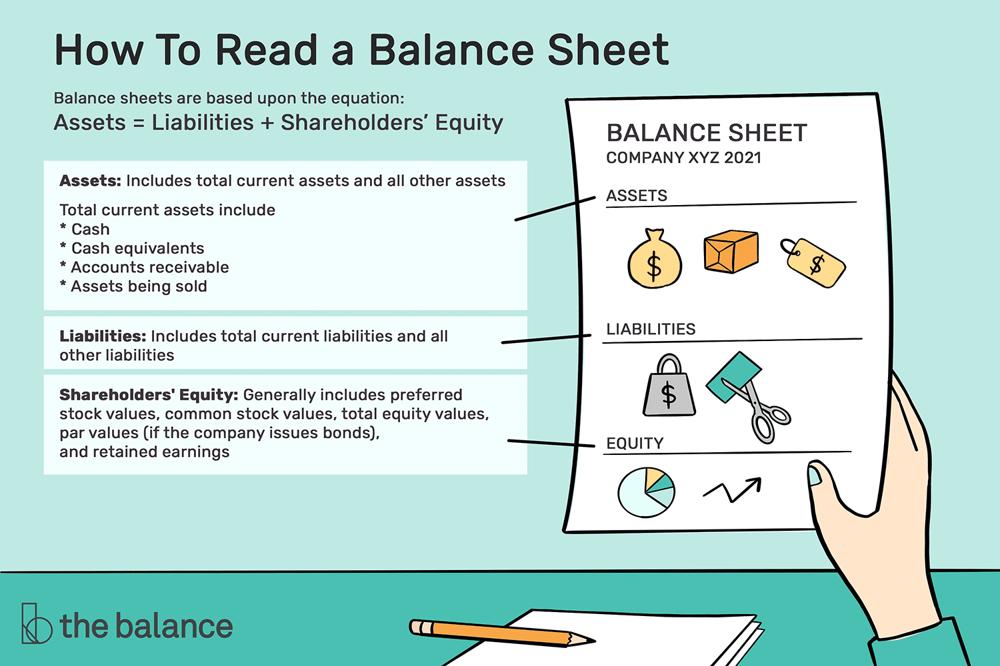

## Table of Contents

## What is a balance sheet and why is it important for financial analysis?

A balance sheet is a financial statement that shows what a company owns and what it owes at a specific point in time. It lists the company's assets, like cash and equipment, on one side, and its liabilities, like loans and debts, on the other side. The difference between these two sides is called the owner's equity, which represents the net worth of the company. Think of it like a snapshot of the company's financial health.

The balance sheet is important for financial analysis because it helps people understand the financial position of a company. By looking at the balance sheet, investors and analysts can see if a company has enough assets to cover its debts, which is crucial for assessing its stability and risk. It also helps in comparing the company's performance over time or against other companies, making it a key tool for making informed investment and business decisions.

## What are the main components of a balance sheet?

A balance sheet has three main parts: assets, liabilities, and owner's equity. Assets are things the company owns that have value, like money in the bank, buildings, or equipment. These are split into two types: current assets, which can be turned into cash quickly, like inventory, and non-current assets, which are long-term items like land or machinery.

Liabilities are what the company owes to others, like loans or bills that need to be paid. Similar to assets, liabilities are divided into current liabilities, which need to be paid soon, like short-term loans, and long-term liabilities, which are debts that will be paid over a longer time, like mortgages.

Owner's equity is the part of the balance sheet that shows what's left after you subtract liabilities from assets. It's basically the net worth of the company. This section can include money put in by the owners, called capital, and the profits that have been kept in the business, known as retained earnings. Together, these three parts give a clear picture of the company's financial health.

## How do assets, liabilities, and equity relate to each other on a balance sheet?

Assets, liabilities, and equity are the three main parts of a balance sheet, and they work together to show how much a company is worth. Assets are all the things a company owns that have value, like cash, buildings, or equipment. Liabilities are what the company owes to others, like loans or bills. Equity is what's left after you take away the liabilities from the assets, and it represents the owner's stake in the company.

The relationship between these three parts is simple but important. The balance sheet must always balance, meaning the total value of the assets must equal the total of liabilities plus equity. If a company buys a new piece of equipment (an asset), it might take out a loan (a liability) to pay for it, or it might use money from the owners (equity). This keeps the balance sheet in balance and helps everyone see the financial health of the company clearly.

## What are current and non-current assets, and how are they distinguished?

Current assets are things a company owns that can be turned into cash within a year. They include things like money in the bank, money people owe the company, and things the company has for sale, like inventory. These are important because they show how much cash a company can get quickly if it needs to.

Non-current assets are things a company owns that it plans to keep for more than a year. These include big things like buildings, land, and machinery. They are important because they help the company do its work over a long time, but they can't be turned into cash as quickly as current assets.

The main way to tell the difference between current and non-current assets is how soon they can be turned into cash. If it can be done within a year, it's a current asset. If it will take longer, it's a non-current asset.

## What are current and long-term liabilities, and why is this distinction important?

Current liabilities are debts that a company needs to pay within a year. This can include things like bills from suppliers, short-term loans, and taxes that are due soon. They are important because they show how much money a company needs to find in the short term to keep running smoothly.

Long-term liabilities are debts that a company will pay over a longer time, more than a year. These can include things like mortgages on buildings or long-term loans. This distinction is important because it helps people understand how a company is managing its money over time. It shows if a company is using long-term debt to grow, and if it can handle its payments in the future. Knowing the difference helps investors and managers make better decisions about the company's financial health.

## How can you assess a company's liquidity using the balance sheet?

You can assess a company's liquidity by looking at its balance sheet, which shows how easily the company can turn its assets into cash to pay off its short-term debts. Liquidity is important because it tells you if the company can pay its bills on time without running into money problems. To check liquidity, you mainly look at current assets, like cash and things that can be sold quickly, and compare them to current liabilities, which are the debts due soon.

One simple way to measure liquidity is by using the current ratio. You find this by dividing the total current assets by the total current liabilities. If the number is more than 1, it means the company has more assets that can be turned into cash quickly than it has short-term debts to pay. This is a good sign that the company is liquid and can handle its bills. If the number is less than 1, it might mean the company could struggle to pay its debts on time, which could be a warning sign.

Another way to look at liquidity is the quick ratio, which is even more strict. It leaves out inventory from current assets because selling inventory might take longer. You calculate it by taking current assets minus inventory, then dividing by current liabilities. A higher quick ratio means the company can pay its short-term debts even faster, which is a strong sign of good liquidity. By using these ratios from the balance sheet, you get a clear picture of how well a company can manage its money in the short term.

## What are common financial ratios used in balance sheet analysis?

Financial ratios are useful tools that help you understand a company's balance sheet better. One common ratio is the current ratio, which you find by dividing current assets by current liabilities. It shows if a company has enough short-term assets to pay its short-term debts. A current ratio over 1 means the company can cover its bills, which is good. Another ratio is the debt-to-equity ratio, which you get by dividing total liabilities by total equity. This tells you how much the company relies on borrowed money compared to money from owners. A lower ratio means the company is less risky because it's not using as much debt.

The quick ratio is another important one. It's like the current ratio but stricter because it leaves out inventory. You calculate it by taking current assets minus inventory and then dividing by current liabilities. A higher quick ratio means the company can pay its short-term debts even faster, which is a sign of good financial health. Lastly, the return on equity (ROE) ratio tells you how well the company is using the money from its owners to make a profit. You find it by dividing net income by total equity. A higher ROE means the company is doing a good job of turning owner's money into profit.

## How does the balance sheet help in understanding a company's solvency?

The balance sheet helps you understand a company's solvency by showing if it can pay all its debts over time. Solvency is about whether a company can keep going without going bankrupt. To check solvency, you look at the balance sheet to see the total assets and compare them to the total liabilities. If the assets are much bigger than the liabilities, it's a good sign that the company is solvent because it has enough value to cover what it owes.

One way to measure solvency using the balance sheet is by looking at the debt-to-equity ratio. You find this by dividing total liabilities by total equity. A lower debt-to-equity ratio means the company is using less borrowed money, which makes it less risky and more likely to stay solvent. Another way is to look at the interest coverage ratio, which shows if the company's profits are enough to pay the interest on its debts. If the company can easily cover its interest payments, it's a good sign of solvency. By using these measures from the balance sheet, you get a clear picture of how well a company can handle its long-term financial health.

## What are off-balance sheet items and why should they be considered in analysis?

Off-balance sheet items are things a company is responsible for but doesn't show on its main balance sheet. These can include things like operating leases, where a company uses equipment or property without owning it, or guarantees the company makes to other businesses. They're important because even though they're not listed as assets or liabilities on the balance sheet, they can still affect the company's money situation.

You should consider off-balance sheet items when looking at a company's financial health because they can hide risks. For example, if a company has a lot of operating leases, it might have to make big payments in the future that aren't shown on the balance sheet. This could make the company look healthier than it really is. By looking at these off-balance sheet items, you get a fuller picture of the company's financial situation and can make better decisions about its stability and risk.

## How can changes in balance sheet items over time indicate a company's financial health?

Changes in balance sheet items over time can tell you a lot about a company's financial health. If you see that the company's assets are growing faster than its liabilities, it's a good sign. This means the company is getting more valuable and can cover its debts better. On the other hand, if liabilities are growing faster than assets, it might mean the company is taking on too much debt, which could be risky. Also, if the company's cash and other current assets are going up, it shows the company is doing well at making money and can pay its bills easily.

Looking at equity is also important. If equity is increasing, it means the company is making profits and keeping them in the business, which is a good sign of financial health. But if equity is going down, it might mean the company is losing money or paying out too much to owners, which could be a warning sign. By watching these changes over time, you can see if the company is getting stronger or weaker financially, and make better decisions about investing in it or working with it.

## What are the limitations of balance sheet analysis and how can they be mitigated?

Balance sheet analysis has some limitations that can make it hard to get a full picture of a company's financial health. One big problem is that the balance sheet only shows what's happening at one moment in time, like a snapshot. This means it doesn't tell you about the company's performance over time or how it's doing compared to other companies. Another issue is that some important things, like the value of a company's brand or the skills of its employees, don't show up on the balance sheet at all. Also, companies can use different ways of valuing their assets and liabilities, which can make it hard to compare one company to another.

To get around these limitations, you can look at more than just the balance sheet. Using other financial statements like the income statement and cash flow statement can give you a better idea of how the company is doing over time. These statements show how much money the company is making and spending, which can help you see if it's growing or shrinking. It's also a good idea to look at financial ratios and trends over several years, not just one moment. And don't forget about off-balance sheet items, like leases or guarantees, which can affect the company's finances even though they're not listed on the balance sheet. By taking all these things into account, you can get a fuller and more accurate picture of the company's financial health.

## How can advanced techniques like vertical and horizontal analysis enhance balance sheet insights?

Vertical analysis helps you understand what makes up a company's balance sheet by showing each item as a percentage of total assets. This way, you can see how important each part is compared to the whole. For example, if cash is 20% of total assets, you know it's a big part of the company's value. By using vertical analysis, you can compare different companies easily, even if they're different sizes. It helps you see if one company relies more on debt or if another has more in cash, giving you a clearer picture of their financial strategies and health.

Horizontal analysis, on the other hand, looks at how the numbers on the balance sheet change over time. It shows you the growth or decline in assets, liabilities, and equity from one period to another. For instance, if a company's cash has grown by 10% each year for the last three years, it's a good sign that the company is doing well financially. By looking at these trends, you can spot patterns and make better predictions about the company's future. Together, vertical and horizontal analysis give you a deeper understanding of a company's financial situation, helping you make smarter decisions about investing or working with them.

## What is the key to understanding the balance sheet?

A balance sheet is a financial statement providing a snapshot of a company's financial position at a specific point in time, offering insights into its assets, liabilities, and shareholders' equity. These three sections together elucidate the company's financial structure and stability. The balance sheet adheres to the accounting equation: 

$$
\text{Assets} = \text{Liabilities} + \text{Shareholders' Equity}
$$

**Assets** represent resources owned by the company that have economic value and can be measured reliably. They are classified into current and non-current categories. Current assets, such as cash, inventories, and accounts receivable, are expected to be converted to cash or used up within one year. Non-current assets, such as property, plant, equipment, and intangible assets like patents, provide value over a longer period.

**Liabilities** are obligations the company owes to external parties and are also divided into current and non-current categories. Current liabilities, such as accounts payable and short-term debt, are due within one year, whereas non-current liabilities, like long-term debt, are due beyond one year. Liabilities indicate the financial obligations that the company must fulfill, and evaluating them helps in assessing the company's financial stability and liquidity risk.

**Shareholders' Equity** reflects the residual interest in the company's assets after deducting liabilities and represents the ownership interest of shareholders. It includes common stock, preferred stock, additional paid-in capital, retained earnings, and treasury stock. Retained earnings are the cumulative net income kept by the company rather than distributed as dividends, reflecting a source of internal financing for growth.

Understanding this framework is critical for assessing a company's financial health as it reveals how effectively a company utilizes its resources and manages its obligations. Analyzing the balance sheet allows investors and analysts to determine the company's ability to generate future economic benefits and sustain its operations, ultimately informing investment and trading decisions.

## What are the key balance sheet elements for algo trading?

In [algorithmic trading](/wiki/algorithmic-trading), analyzing key elements of a balance sheet is crucial for understanding a company's economic footprint, [liquidity](/wiki/liquidity-risk-premium) status, and financial health. These components significantly impact trading strategies, enabling the identification of profitable opportunities and the assessment of potential risks.

### Assets

**Cash and Cash Equivalents**: This figure provides insight into a company's liquidity, reflecting its ability to fulfill short-term obligations without liquidating other assets. For algorithmic traders, high cash levels might indicate excellent financial health or potential for investments and growth. Low cash reserves could signify liquidity risks.

**Accounts Receivable**: This asset represents money owed by customers for goods and services delivered. High levels of accounts receivable might indicate strong sales but could also point to potential collection issues. The Account Receivable Turnover Ratio, calculated as:

$$
\text{Account Receivable Turnover Ratio} = \frac{\text{Net Credit Sales}}{\text{Average Accounts Receivable}}
$$

provides insights into how efficiently a company collects debts.

### Liabilities

**Short-term Liabilities**: These obligations need settlement within a year and include accounts payable, short-term debt, and other accrued liabilities. Monitoring these can help traders evaluate a company's capability to cover debts with current assets. A rising trend in short-term liabilities may signal potential liquidity issues.

**Long-term Liabilities**: This includes bonds payable, long-term leases, and pension obligations, reflecting long-term financial commitments. High long-term liabilities relative to assets may indicate increased financial risk. The Debt-to-Equity Ratio, expressed as:

$$
\text{Debt-to-Equity Ratio} = \frac{\text{Total Liabilities}}{\text{Shareholders' Equity}}
$$

is crucial for assessing a company's leverage and potential financial volatility.

### Shareholders' Equity

**Retained Earnings and Paid-in Capital**: Shareholders' equity signifies ownership worth after liabilities are deducted from assets. Retained earnings reflect accumulated profits, reinvested in the company or reserved for debt reduction. Paid-in capital shows investment funds received from shareholders in exchange for stock. These elements provide insights into how funds are sourced and utilized for growth or shareholder returns.

### Financial Leverage and Efficiency

Understanding the interplay between assets, liabilities, and equity is essential for evaluating financial leverage and operational efficiency. High financial leverage implies more liabilities relative to equity, indicating potential return amplification and financial risk.

### Insights Through Financial Ratios

Financial ratios derived from balance sheet elements offer deeper insights. For example, the Current Ratio:

$$
\text{Current Ratio} = \frac{\text{Current Assets}}{\text{Current Liabilities}}
$$

evaluates liquidity, whereas the Return on Equity (ROE):

$$
\text{ROE} = \frac{\text{Net Income}}{\text{Shareholders' Equity}}
$$

assesses profitability relative to shareholder investments.

Incorporating these balance sheet elements and related financial ratios into algorithmic trading models can refine decision-making processes and enhance trading strategies. Such integration provides a robust foundation for analyzing a company's financial dynamics, supporting informed investment decisions.

## What are the important financial ratios for algorithmic trading?

Financial ratios derived from the balance sheet, such as the Debt-to-Equity Ratio and Current Ratio, are vital tools for assessing a company's financial health and risk profile in algorithmic trading. These ratios allow traders to quantify a company's financial leverage and liquidity, which are essential in crafting robust trading strategies.

The **Debt-to-Equity Ratio** is defined as:

$$
\text{Debt-to-Equity Ratio} = \frac{\text{Total Liabilities}}{\text{Shareholders' Equity}}
$$

This ratio provides insights into a company's financial leverage by comparing its total liabilities to shareholders' equity. A high ratio typically indicates that a company is heavily financed by debt compared to its equity, which may suggest higher financial risk. Integrating this ratio into trading algorithms can help in risk management by signaling caution when high leverage is detected, potentially flagging companies with unsustainable debt levels.

The **Current Ratio**, calculated as:

$$
\text{Current Ratio} = \frac{\text{Current Assets}}{\text{Current Liabilities}}
$$

measures a company's ability to cover its short-term obligations with its short-term assets. A current ratio greater than 1 indicates that the company has more current assets than current liabilities, reflecting well on its short-term financial health. This ratio can be used in trading algorithms to generate signals favoring financially stable companies with robust liquidity positions.

**Integrating Financial Ratios into Trading Algorithms**

Algorithmic trading systems can leverage these ratios by incorporating them into signal generation and risk management frameworks. For example, a trading algorithm could be configured to initiate or [exit](/wiki/exit-strategy) positions based on threshold levels of the Debt-to-Equity Ratio or Current Ratio. Algorithms can rank companies and prioritize trades based on these ratios, focusing on firms with desirable financial health indicators.

**Example of Financial Metrics in Trading Decisions**

Consider an algorithm designed to trade stocks in the technology sector. By using the Debt-to-Equity Ratio, the algorithm identifies tech companies with lower financial risk (i.e., those with a lower ratio) and prioritizes trades accordingly. Similarly, the Current Ratio can be used to target companies with strong liquidity, which might be more resilient to economic downturns.

**Relevance and Strategy Crafting**

In algorithmic trading, these ratios assist in defining the strategic direction of trades. They can indicate companies' financial strengths or weaknesses, guiding algorithms in portfolio construction by selecting stocks that optimize risk-return profiles. Balancing the interplay of leverage and liquidity, traders can devise strategies that capitalize on discrepancies in market valuation that may arise from perceived risk and health as indicated by these ratios.

**Backtesting Strategies**

Backtesting involves simulating trading strategies using historical data to evaluate their viability before live deployment. By utilizing historical balance sheet data, traders can backtest the integration of financial ratios into trading algorithms. For instance, if using Python, a simple [backtesting](/wiki/backtesting) setup might look like this:

```python
import pandas as pd

# Assume historical data frame df with 'Debt' and 'Equity' columns
df['Debt_to_Equity'] = df['Debt'] / df['Equity']
# Define a strategy based on Debt-to-Equity Ratio thresholds
strategy = df['Debt_to_Equity'] < 1.5

# Signal generation for trading
df['signal'] = strategy

# Example: calculating returns based on generated signals
df['returns'] = df['signal'].shift(1) * df['stock_returns']
cumulative_returns = (1 + df['returns']).cumprod()

print("Cumulative Returns from Strategy:", cumulative_returns.iloc[-1])
```

This code analyzes historical data, evaluates the potential returns of a strategy based on the Debt-to-Equity Ratio threshold, and decides trades accordingly.

In conclusion, integrating financial ratios like the Debt-to-Equity Ratio and Current Ratio into trading algorithms provides a valuable toolkit for traders, ensuring informed decisions grounded in detailed financial analysis. Continuous backtesting and adaptation based on sophisticated metrics are crucial for maintaining and enhancing algorithmic trading success.

## How can one interpret balance sheets for strategic trading?

Balance sheet analysis is a powerful tool for predicting market movements and enhancing trading strategies, especially in algorithmic trading. By examining a company's balance sheet, traders can discern financial stability, operational efficiency, and potential growth, which are crucial for identifying investment opportunities and risks.

Firstly, analyzing balance sheets allows traders to gauge the economic equilibrium of a company by observing changes in assets, liabilities, and equity. For instance, a gradual increase in long-term debt could signal potential solvency issues, while a steady rise in retained earnings might reflect strong operational performance and profitability. Such insights help in identifying companies with strong financial positions that are better equipped to withstand market [volatility](/wiki/volatility-trading-strategies).

Traders leverage balance sheets in algorithmic models to enhance decision-making and forecasts by integrating key financial metrics like liquidity ratios and solvency ratios. For instance, the Current Ratio, calculated as:

$$
\text{Current Ratio} = \frac{\text{Current Assets}}{\text{Current Liabilities}}
$$

provides insights into the company's ability to cover short-term obligations, signaling financial health and aiding risk assessment. 

Algorithmic traders incorporate these ratios into automated systems to generate trading signals based on predefined financial health criteria. For example, changes in the Debt-to-Equity Ratio could be used as a trigger in trading algorithms to buy or sell stocks based on shifts in a company’s leverage levels:

$$
\text{Debt-to-Equity Ratio} = \frac{\text{Total Liabilities}}{\text{Shareholders' Equity}}
$$

Constant monitoring of these ratios ensures the models remain predictive and adapt to market changes.

Staying updated with balance sheet modifications requires traders to regularly review company filings and financial news. Automation is a critical component here. By employing technologies like Python for web scraping, traders can automate the retrieval and real-time analysis of financial data, ensuring they react quickly to material changes.

Here is a basic Python script to fetch balance sheet data from financial APIs:

```python
import requests

def get_balance_sheet(symbol):
    api_url = f"https://api.example.com/v1/datatables/WIKI/PRICES.json?ticker={symbol}"
    response = requests.get(api_url)
    return response.json()

company_symbol = "AAPL"
balance_sheet_data = get_balance_sheet(company_symbol)
print(balance_sheet_data)
```

Such data can then be parsed to update trading strategies, allowing for constant refinement of algorithms based on the latest financial insights.

In conclusion, balance sheet analysis is a continuous process vital for maintaining effective trading algorithms. By integrating balance sheet data into algorithmic models, traders can craft strategies that are both responsive and robust, capitalizing on financial trends to maximize returns. Regular review and adaptation to balance sheet changes ensure that trading strategies remain competitive in an ever-changing financial landscape.

## References & Further Reading

[1]: ['The Intelligent Investor'](https://en.wikipedia.org/wiki/The_Intelligent_Investor) by Benjamin Graham - A classic book on value investing with insights into financial statement analysis.

[2]: ['Financial Statement Analysis: A Practitioner's Guide'](https://onlinelibrary.wiley.com/doi/book/10.1002/9781119201489) by Martin S. Fridson and Fernando Alvarez - Provides detailed insights into interpreting financial statements.

[3]: Damodaran, A. (2012). ['Investment Valuation: Tools and Techniques for Determining the Value of Any Asset'](https://books.google.com/books/about/Investment_Valuation.html?id=5SRHAAAAQBAJ) - Offers comprehensive coverage on valuing assets with an emphasis on financial analysis.

[4]: White, G. I., Sondhi, A. C., & Fried, D. (1997). ['The Analysis and Use of Financial Statements'](https://books.google.com/books/about/The_Analysis_and_Use_of_Financial_Statem.html?id=ZoIBv3HbCfAC) - A comprehensive guide to interpreting financial statements.

[5]: ['Security Analysis: Principles and Techniques'](https://www.amazon.com/Security-Analysis-Seventh-Principles-Techniques/dp/1264932405) by Benjamin Graham and David Dodd - An in-depth view of fundamental analysis and financial statements.