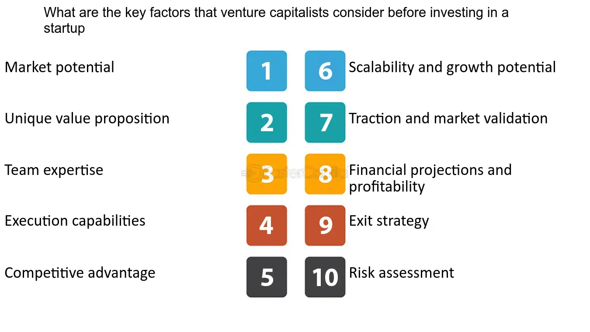

## Table of Contents

## What is a startup and how does it differ from an established business?

A startup is a new business that is just beginning. It is usually created by one or a few people who have a new idea for a product or service. Startups often focus on technology and innovation. They try to grow quickly and solve a problem in a new way. Because they are new, startups often don't have a lot of money or customers yet. They need to find ways to make their business work and become successful.

An established business is different because it has been around for a longer time. It already has customers, money, and a way of doing things that works. Established businesses are usually more stable and have less risk than startups. They might grow slowly and focus on keeping their customers happy. While startups are trying to find their place in the market, established businesses already know their place and work to keep it.

## What are the common stages of startup development?

The first stage of a startup's development is the idea and validation stage. This is when the founders come up with an idea for a new product or service. They spend time talking to potential customers to see if their idea is something people want. If people like the idea, the founders start working on a basic version of their product, called a minimum viable product (MVP). The goal at this stage is to see if the idea can work and if people are willing to pay for it.

The next stage is the growth stage. Once the startup has a working MVP and some customers, it focuses on growing the business. This means getting more customers, making more money, and improving the product. The startup might start to hire more people and look for more money from investors to help it grow faster. This stage can be challenging because the startup needs to find the right way to grow without spending too much money.

The final stage is the scaling and maturity stage. At this point, the startup has a successful product and a lot of customers. It focuses on making the business bigger and more efficient. The startup might expand to new markets or add new products. It becomes more like an established business, with stable income and a clear plan for the future. Some startups might even go public or get bought by a bigger company at this stage.

## What industries are currently attracting startup investments?

Many startups today are getting investments in the technology industry. This includes areas like software, apps, and online services. People are interested in startups that use [artificial intelligence](/wiki/ai-artificial-intelligence), [machine learning](/wiki/machine-learning), and big data to solve problems. Another popular area is fintech, which is about using technology to make financial services better. Startups in this area might work on things like online banking, payment systems, or investment tools.

Another industry attracting a lot of startup investments is healthcare. Startups in this field are working on new ways to help people stay healthy and get better care. This can include telemedicine, which lets people see doctors online, and health apps that help people track their health. Biotechnology is also a big area, with startups trying to create new medicines and treatments. These startups often need a lot of money to do research and testing, so investors are important for them.

Other industries seeing a lot of startup activity include clean energy and sustainability. Startups in these areas are working on things like solar power, electric vehicles, and ways to reduce waste. Investors are interested in these startups because they can help solve big problems like climate change. E-commerce is also a popular area, with startups trying to make online shopping easier and more personalized. Overall, investors are looking for startups that can grow quickly and make a big impact in their industry.

## How much capital should I be prepared to invest in a startup?

When you start a new business, you need to be ready to spend some money. The amount of money you need can be different depending on your business idea and the industry you are in. For a small startup, you might need between $10,000 and $50,000 to get started. This money can help you make a basic version of your product, do some marketing, and keep your business running for a little while. If your startup is in a field like technology or healthcare, you might need more money, sometimes even millions of dollars, because these industries often need a lot of research and development.

As your startup grows, you might need more money to keep going and to get bigger. This is called scaling up. You might need to spend money on hiring more people, making more products, and reaching more customers. Some startups raise money from investors, who give them money in exchange for a part of the business. How much money you need can change as your business grows, so it's important to plan ahead and think about how you will get the money you need at each stage of your startup's life.

## What are the potential risks associated with investing in startups?

Investing in startups can be risky because they are new and might not succeed. Startups often don't have a lot of money or customers yet, so there's a chance they could fail and you could lose your investment. They might have a good idea, but it can be hard to turn that idea into a successful business. There are also many other startups trying to do the same thing, so your startup might not be able to stand out and get enough customers.

Another risk is that startups can change a lot as they grow. They might need more money than they thought, or they might have to change their product or business plan. This can be hard to predict and can affect how much money you make from your investment. Also, the people running the startup might not have a lot of experience, which can make it harder for them to make good decisions and keep the business going.

## How can I evaluate the founding team's experience and track record?

When you want to see if the people starting a new business are good at what they do, you should look at what they have done before. Have they started other businesses? Did those businesses do well? It's good if they have experience in the same kind of business they are starting now. You can also check if they have worked in big companies or have special skills that can help their new business. Talking to them and asking about their past can give you a lot of information.

Another way to check the founding team's experience is to see what other people say about them. You can look for reviews or talk to people who have worked with them before. Sometimes, you can find articles or news stories about them. If other people think they are good at what they do, that's a good sign. It's also important to see if they work well together as a team. A team that gets along and has different skills can be more successful than a team where everyone is the same.

## What should I look for in a startup's business model and value proposition?

When you look at a startup's business model, you want to see how they plan to make money. A good business model should be clear and easy to understand. It should show how the startup will get customers, make money from them, and keep them coming back. The model should also be realistic and fit well with the market the startup is trying to enter. If the business model seems too complicated or hard to believe, it might not work well in the real world.

The value proposition is about what makes the startup special and why people should care about it. It should explain the problem the startup is trying to solve and how their product or service makes things better for customers. A strong value proposition is clear and easy to understand. It should make people feel like they need what the startup is offering. If the value proposition is weak or hard to understand, it might be hard for the startup to get and keep customers.

## How do I assess the market size and growth potential for a startup's product or service?

To assess the market size for a startup's product or service, you need to look at how many people might want to buy it. Start by figuring out who your customers are and how big that group is. You can use data from market research reports or surveys to find out how many people are in your target market. Also, think about how much money people in that market are willing to spend. This will help you understand if the market is big enough to support your startup. If the market is too small, it might be hard to grow your business.

To assess the growth potential, you need to look at trends and changes in the market. Are more people starting to care about the problem your startup solves? Is the market getting bigger over time? You can look at industry reports and news to see if the market is growing. It's also important to think about what might happen in the future. Will new technology or changes in the world make your product more important? If the market is growing and your product fits well with that growth, your startup has a good chance to succeed.

## What legal and financial due diligence should I conduct before investing?

Before you invest in a startup, you need to do some legal checks. This means looking at the startup's legal papers like their business license, contracts with customers or partners, and any patents or trademarks they might have. You should also check if the startup has any legal problems or if they are following all the laws they need to. It's a good idea to hire a lawyer to help you with this because they can find things you might miss. Make sure the startup is set up the right way and that their legal papers are in order.

You also need to do some financial checks. This means looking at the startup's money records like their income, spending, and any debts they have. You want to see if the startup is making money and if they are spending it in a smart way. Look at their financial plans to see if they have a good way to make more money in the future. It's helpful to have an accountant look at these records to make sure everything is right. By checking the startup's legal and financial health, you can make a better decision about whether to invest your money.

## How can I understand a startup's financial projections and valuation?

To understand a startup's financial projections, you need to look at their plan for making and spending money in the future. These projections show how much money the startup thinks it will make, how much it will spend, and how much profit it will have. They usually include things like sales forecasts, cost estimates, and cash flow predictions. It's important to see if these numbers make sense and if they are based on good information. If the projections seem too high or too low, it might mean the startup doesn't have a good understanding of their business. Talking to the startup's team and asking them to explain their numbers can help you see if their plan is realistic.

Understanding a startup's valuation is about figuring out how much the business is worth. This can be tricky because startups often don't have a lot of money coming in yet. Valuation methods can include looking at how much similar startups are worth, how much money the startup has made so far, or how fast they are growing. Sometimes, investors use a method called discounted cash flow, which tries to guess how much money the startup will make in the future and then figures out what that money is worth now. It's helpful to compare the startup's valuation to what other investors think it's worth. If the valuation seems too high or too low compared to others, you might want to ask more questions before deciding to invest.

## What are the different types of investment instruments available for startups?

When you want to invest in a startup, you have different ways to do it. One common way is through equity, where you buy a part of the company. This means you own a piece of the business and can make money if the company does well. Another way is through convertible notes, which are like loans that can turn into equity later. This can be good if you want to invest early but don't want to set a price for the company right away. There are also SAFE (Simple Agreement for Future Equity) agreements, which are simpler than convertible notes and let you invest now with the promise of getting equity in the future.

Another type of investment instrument is debt, where you lend money to the startup and they pay you back with interest. This can be safer than equity because you get your money back even if the company doesn't do well, but it might not make you as much money if the company grows a lot. Some startups also offer revenue-based financing, where you get a part of the company's future sales instead of equity or interest. This can be good if you want to make money as the company makes money, without owning a part of the business. Each type of investment has its own risks and rewards, so it's important to think about what fits best with your goals and how much risk you are willing to take.

## How can I stay informed about the startup's progress and protect my investment?

To stay informed about a startup's progress, you should ask for regular updates from the founders. They can send you reports or have meetings with you to talk about how the business is doing. These updates should include things like how much money the startup is making, how many customers they have, and any big changes or problems. It's also a good idea to keep an eye on news and social media to see what people are saying about the startup. If you're part of the company, you might be able to join meetings or get special reports to stay in the loop.

To protect your investment, you need to keep watching the startup's financial health. Make sure they are spending money wisely and not taking on too much debt. It's also important to know the startup's legal situation and make sure they are following all the rules. You can ask for regular financial statements and have a lawyer or accountant look them over. If you see any red flags, like the startup not meeting its goals or having legal problems, talk to the founders right away. Being involved and asking questions can help you protect your money and make sure the startup stays on track.

## References & Further Reading

[1]: Nanda, Ramana & Rhodes-Kropf, Matthew. (2013). ["Investment Cycles and Startup Innovation."](https://www.sciencedirect.com/science/article/pii/S0304405X13001967) National Bureau of Economic Research.

[2]: Sahlman, William A. (1990). ["The Structure and Governance of Venture-Capital Organizations."](https://www.sciencedirect.com/science/article/pii/0304405X90900658) Journal of Financial Economics.

[3]: Gompers, Paul & Lerner, Josh. (1999). ["The Venture Capital Cycle."](https://archive.org/details/venturecapitalcy0002gomp) MIT Press.

[4]: Markowitz, Harry M. (1952). ["Portfolio Selection."](https://onlinelibrary.wiley.com/doi/abs/10.1111/j.1540-6261.1952.tb01525.x) The Journal of Finance.

[5]: Aronson, David. ["Evidence-Based Technical Analysis: Applying the Scientific Method and Statistical Inference to Trading Signals."](https://www.amazon.com/Evidence-Based-Technical-Analysis-Scientific-Statistical/dp/0470008741) Wiley.

[6]: Chan, Ernest P. ["Quantitative Trading: How to Build Your Own Algorithmic Trading Business."](https://github.com/ftvision/quant_trading_echan_book) Wiley.

[7]: Jansen, Stefan. ["Machine Learning for Algorithmic Trading."](https://github.com/stefan-jansen/machine-learning-for-trading) Packt Publishing.

[8]: Lopez de Prado, Marcos. ["Advances in Financial Machine Learning."](https://www.amazon.com/Advances-Financial-Machine-Learning-Marcos/dp/1119482089) Wiley.