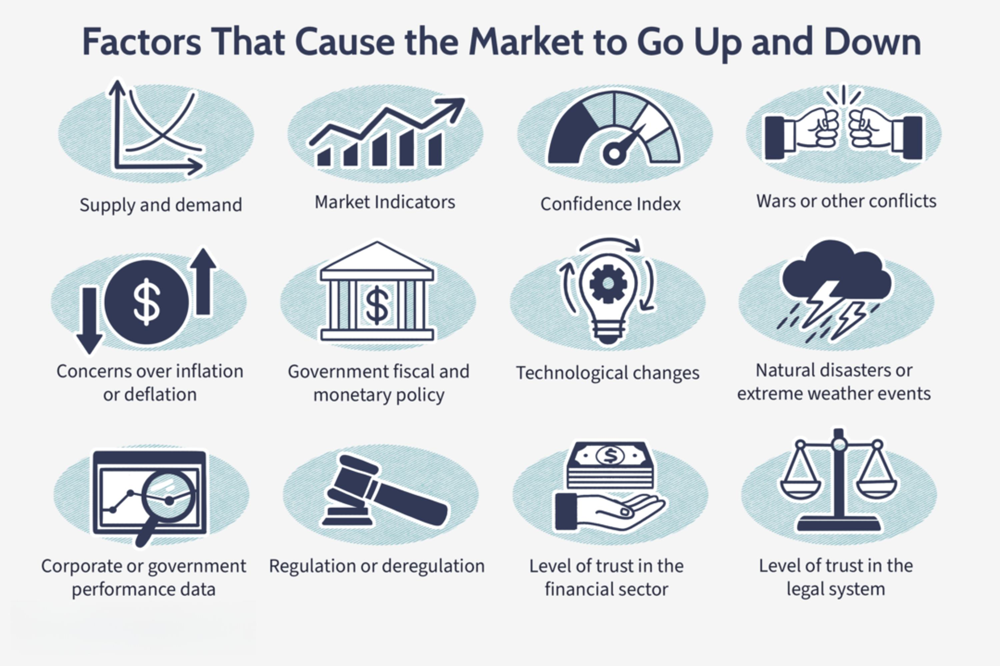

In today's financial landscape, investors encounter a myriad of opportunities and challenges, prominently marked by the emergence of startups and the technological advancements in trading. The rise of startups offers a dynamic frontier for investors seeking to engage with innovative businesses at their inception. On the other hand, algorithmic trading, often referred to as algo trading, leverages sophisticated algorithms and computer systems to execute trades with high precision and speed.

Understanding the essentials of investing in these domains is crucial to making informed decisions. For startup investments, factors such as the required level of involvement, the expected timeframe for returns, potential rates of return, and exit strategies are paramount to assess. Each of these elements plays a pivotal role in determining the risk-reward profile of an investment in a nascent company.



Algorithmic trading represents a significant shift from traditional trading methods. It automates trading processes by analyzing market data and executing orders with minimal human intervention, thus reducing emotional biases and increasing efficiency. Grasping the fundamentals of algorithmic strategies, from understanding the programming languages used, such as Python and C++, to recognizing the necessary risk management practices, is indispensable for beginners and seasoned traders alike.

The landscape of modern investing requires a strategic approach to optimize returns and manage risks effectively. Whether deciding the level of involvement in startups or decoding the intricacies of algorithmic strategies, a wealth of information and tools is at the investor's disposal. Navigating these opportunities with a knowledgeable and adaptable strategy is the key to achieving long-term investment success.

## Table of Contents

## Key Questions for Startup Investments

Startup investments offer the potential for substantial returns, yet they come with significant risks. Assessing these risks and opportunities requires a strategic approach. An investor should consider the following critical questions before proceeding:

1. **What Level of Involvement Is Required?**  
Identifying the degree of engagement expected from an investor is crucial. This can vary widely depending on whether you are an angel investor, where personal interaction and mentorship might be required, or participating through a crowdfunding platform, which usually demands less hands-on involvement. Understanding your own availability and interest in contributing beyond financial input can help align your investment with your personal and professional goals. Research by the National Bureau of Economic Research emphasizes that active involvement can significantly influence the success of a startup (Nanda & Rhodes-Kropf, 2013).

2. **What's the Timeframe?**  
Investments in startups often require a long-term perspective. Evaluating the expected timeframe for returns is essential—startups generally have longer horizons to profitability compared to established companies. The startup's business model, market conditions, and growth trajectory should be assessed to determine how long you are willing to keep your capital tied up. For example, venture capital investments typically have a horizon of around 7-10 years before achieving significant [liquidity](/wiki/liquidity-risk-premium) events (Sahlman, 1990).

3. **Expected Rate of Return?**  
Calculating the potential return on investment (ROI) is imperative. Analysts often use formulas like the Internal Rate of Return (IRR) to assess potential returns, which can be compared to alternative investments. The IRR is a discount rate that makes the net present value (NPV) of all cash flows from a particular project zero. Understanding this metric can help investors align the startup's potential profitability with their financial aims.

4. **How Does the Investment Affect Diversification?**  
Diversification is a key principle in investment strategy. It's important to evaluate how a startup investment fits within your broader portfolio. Consider whether the introduction of a high-risk, high-reward asset will enhance or unbalance the diversity of your investments. A well-diversified portfolio might include a mix of asset classes to mitigate risk, a strategy substantiated by modern portfolio theory (Markowitz, 1952).

5. **Is There a Clear Exit Strategy?**  
Having a predefined [exit](/wiki/exit-strategy) strategy is essential for realizing gains from a startup investment. This could involve various scenarios such as acquisitions, initial public offerings (IPOs), or secondary sales. An exit plan aligns with investment objectives and ensures that there are clear mechanisms for recouping invested capital. According to the Harvard Business Review, understanding potential exit routes is a critical component of successful venture investing (Gompers & Lerner, 1999).

Evaluating each of these questions carefully can help investors make informed choices, balancing the potential for expansive growth with the inherent risks of startup investments.

## Understanding Algorithmic Trading

Algorithmic trading, commonly referred to as algo trading, automates the trading process through the utilization of advanced algorithms. By precisely analyzing vast arrays of market data and automatically executing trades, algo trading aims to enhance trading efficiency and effectiveness.

1. **What is Algorithmic Trading?**  
Algorithmic trading integrates mathematical models and software to execute trading strategies with minimal human intervention. It involves the exploitation of real-time data and execution at speeds incomprehensible to human traders, hence offering significant advantages such as reduced transaction costs and improved market liquidity.

2. **How Does Algo Trading Work?**  
Algo trading operates by employing algorithms to observe and act upon market trends. These algorithms analyze market data including price, [volume](/wiki/volume-trading-strategy), and time, to make trading decisions. When specific conditions encoded in the algorithm are met, it triggers the automatic execution of buy or sell orders.

3. **What Are the Benefits Over Manual Trading?**  
One of the primary advantages of [algorithmic trading](/wiki/algorithmic-trading) over manual trading is the ability to execute orders with speed and precision. This automation reduces the possibility of human errors and can execute trades based on predetermined criteria, free from emotional bias. Consequently, algo trading can manage high-frequency trading strategies, which further optimize market entry and exit points.

4. **Which Programming Languages are Commonly Used?**  
A variety of programming languages are employed in algorithmic trading, with popular choices being Python, Java, C++, and R. Python is often favored due to its versatility and the extensive libraries available for modeling, data analysis, and [machine learning](/wiki/machine-learning). For example, Python libraries such as pandas and NumPy are crucial for handling and analyzing large datasets.

    ```python
    import pandas as pd
    import numpy as np

    # Example: Calculating moving averages as a basic trading signal
    def calculate_moving_average(data, window):
        return data.rolling(window=window).mean()

    # Sample data
    data = pd.Series([100, 101, 102, 103, 104])

    # Calculate 3-day moving average
    moving_average = calculate_moving_average(data, window=3)
    print(moving_average)
    ```

5. **How to Start with Algo Trading?**  
Beginning in algorithmic trading requires a solid understanding of market principles and trading strategies. It's vital to acquire coding skills in languages like Python, which are integral for developing and testing trading algorithms. Beginners should focus on building a foundation in quantitative analysis and [backtesting](/wiki/backtesting) strategies to refine their approach before committing real capital. Popular platforms such as QuantConnect and Zipline offer environments to test strategies with historical data, providing critical insights into potential performance.

Through careful consideration of these aspects, beginners can effectively embark on the journey of algorithmic trading, integrating technology to potentially enhance their trading outcomes.

## Risks and Challenges in Algorithmic Trading

Algorithmic trading uses technology to enhance trading efficiency, but it comes with several challenges and risks that need careful management. One primary concern is regulatory considerations. As markets evolve, regulators continuously update compliance requirements to safeguard market integrity. For instance, traders must adhere to rules regarding trading volumes and order-to-trade ratios to avoid disrupting market stability. Failure to comply may lead to penalties or trading restrictions.

Risk management is another critical aspect. Implementing effective risk mitigation strategies is essential to protect capital. This involves setting appropriate position sizes and defining stop-loss levels to limit potential losses. For example, a stop-loss order helps automatically sell a position to prevent further losses when the price hits a predetermined level. 

It is also crucial to avoid certain pitfalls in algorithmic trading. Over-optimization can lead to strategies that are excessively tailored to past data but fail in live markets. A balance must be maintained to prevent overly complex models that might not generalize well. Insufficient testing before live deployment can result in significant financial losses. Thorough backtesting using historical data and paper trading in simulated environments help in understanding how strategies perform under various market conditions.

Market conditions greatly impact algorithmic strategies. Markets can be volatile, requiring algorithms adaptable to different scenarios. For instance, the increased [volatility](/wiki/volatility-trading-strategies) during economic news releases necessitates dynamic adjustments in trading strategies to maintain profitability, which can often be achieved through real-time data analysis and strategy recalibration.

Ethical considerations should not be overlooked. Using algorithms for market manipulation, such as spoofing (placing fake orders to move prices), undermines market trust and is illegal. Ensuring algorithmic transparency and fairness should be paramount to maintain ethical standards in trading practices. 

Effectively addressing these risks and challenges requires a comprehensive understanding of market dynamics, rigorous testing, and regular strategy evaluation to ensure sustainable and ethical trading operations.

## Algorithmic Trading and Portfolio Management

Integrating algorithmic trading with an investment portfolio requires a strategic approach to ensure optimized risk management and performance enhancement. This involves leveraging automation to achieve greater efficiency, accuracy, and diversification. Here are key aspects to consider when incorporating algorithmic trading into your portfolio management:

1. **Diversification Across Asset Classes**: Algorithmic trading offers the ability to diversify investments across multiple asset classes, such as stocks, commodities, and cryptocurrencies. This diversification provides a hedge against market volatility and reduces the risk associated with a concentrated portfolio. By deploying algorithms across different markets, investors can manage risks more holistically and enhance returns in varying economic cycles.

2. **Customizable Strategies**: One of the significant benefits of algorithmic trading is the ability to develop and tailor strategies to fit specific investment goals and risk tolerances. Algorithms can be programmed to execute trades based on a wide range of parameters, including market trends, price movements, and economic indicators. This customization allows investors to implement distinct strategies, ranging from high-frequency trading to longer-term trend-following approaches, thereby aligning their algorithmic systems with their investment philosophy.

3. **Monitoring and Adjustment**: Continuous monitoring and adjustment of algorithm performance are critical to ensure that trading strategies remain effective and responsive to market changes. This involves regular backtesting of algorithms against historical data and real-time analysis to detect performance deviations. Adjustments might be necessary to refine algorithms or to adapt to evolving market conditions, ensuring sustained optimal outcomes.

4. **Leveraging Advanced Tools**: Utilizing platforms that provide real-time data access and sophisticated testing environments is crucial for the development and implementation of algorithmic trading strategies. Advanced tools enable traders to simulate trading scenarios, test the robustness of algorithms, and conduct comprehensive risk assessments. These platforms often offer integration with market data feeds, analytical tools, and machine learning capabilities, enhancing the precision and effectiveness of algorithmic strategies.

5. **Balancing Automation and Human Insight**: While algorithms offer precision and efficiency, incorporating human insights remains valuable. Market intuition, built from years of experience, can complement automated systems. Decision-making that integrates human judgment ensures that strategic adjustments account for qualitative factors that algorithms might overlook. Thus, a balanced approach that combines algorithmic trading with personal expertise leads to a more comprehensive investment strategy, particularly in unforeseen market conditions or during significant economic changes.

By incorporating these elements, investors can effectively manage their portfolio through algorithmic trading, enhancing their ability to achieve long-term financial objectives while mitigating risks associated with market dynamics.

## Conclusion

Investment in startups and the use of algorithmic trading are transformative trends that are reshaping the global financial landscape. These innovative approaches offer promising avenues for enhancing returns, yet they require a strategic and informed approach to risk management and decision-making.

Investing in startups presents exciting opportunities for high returns, often unmatched by traditional investment vehicles. However, the inherent risks are significant, necessitating thorough due diligence and strategic planning. Potential investors must weigh the level of involvement required, understand the anticipated timeframe for returns, and ensure that investments complement and diversify their existing portfolios. A clear exit strategy is paramount to safeguard investments and ensure liquidity.

Algorithmic trading represents a paradigm shift in how trading is conducted, harnessing the power of technology to enhance efficiency and accuracy. This method automates trading processes, allowing for rapid execution of trades based on predefined criteria. Despite its advantages, successful application demands a nuanced understanding of market dynamics and a robust approach to risk management. Critical elements such as compliance with regulatory standards, adjustment to market conditions, and ethical considerations must guide the development and deployment of algorithmic strategies.

As the investment landscape continues to evolve, the ability to remain informed and adaptable will be crucial for achieving sustained success. The rapid pace of technological advancements and shifts in market conditions demand investors' commitment to continuous learning and strategic refinement. Tools like real-time data platforms and testing environments provide the necessary infrastructure to develop effective strategies, yet they must be balanced with human insight and market intuition. 

In summary, both startup investments and algorithmic trading require a thoughtful approach that integrates innovation with strategic foresight. By maintaining a commitment to learning and adapting to new challenges, investors can navigate the complexities of modern investing more effectively. This strategic agility will be essential to capitalize on the opportunities presented by these transformative trends in the financial market.

## References & Further Reading

[1]: Nanda, Ramana & Rhodes-Kropf, Matthew. (2013). ["Investment Cycles and Startup Innovation."](https://www.sciencedirect.com/science/article/pii/S0304405X13001967) National Bureau of Economic Research.

[2]: Sahlman, William A. (1990). ["The Structure and Governance of Venture-Capital Organizations."](https://www.sciencedirect.com/science/article/pii/0304405X90900658) Journal of Financial Economics.

[3]: Gompers, Paul & Lerner, Josh. (1999). ["The Venture Capital Cycle."](https://archive.org/details/venturecapitalcy0002gomp) MIT Press.

[4]: Markowitz, Harry M. (1952). ["Portfolio Selection."](https://onlinelibrary.wiley.com/doi/abs/10.1111/j.1540-6261.1952.tb01525.x) The Journal of Finance.

[5]: Aronson, David. ["Evidence-Based Technical Analysis: Applying the Scientific Method and Statistical Inference to Trading Signals."](https://www.amazon.com/Evidence-Based-Technical-Analysis-Scientific-Statistical/dp/0470008741) Wiley.

[6]: Chan, Ernest P. ["Quantitative Trading: How to Build Your Own Algorithmic Trading Business."](https://github.com/ftvision/quant_trading_echan_book) Wiley.

[7]: Jansen, Stefan. ["Machine Learning for Algorithmic Trading."](https://github.com/stefan-jansen/machine-learning-for-trading) Packt Publishing.

[8]: Lopez de Prado, Marcos. ["Advances in Financial Machine Learning."](https://www.amazon.com/Advances-Financial-Machine-Learning-Marcos/dp/1119482089) Wiley.