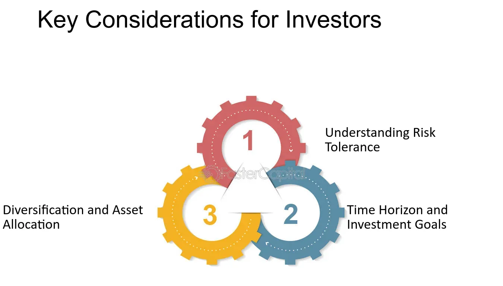

## Table of Contents

## What are the basic principles of stock investment for beginners?

Investing in stocks can be a great way to grow your money over time, but it's important to understand some basic principles before you start. One key idea is diversification, which means spreading your money across different types of stocks and other investments. This can help reduce risk because if one stock goes down, your whole portfolio won't be affected as much. Another important principle is to invest for the long term. The stock market can be unpredictable in the short term, but historically, it has provided good returns over many years. So, it's usually better to think of your investments as something you'll hold onto for a long time, rather than trying to make quick profits.

Another principle to keep in mind is to do your research. Before you buy a stock, it's a good idea to learn about the company, what it does, and how it's doing financially. This can help you make smarter choices and avoid companies that might not be a good investment. Additionally, understanding your own risk tolerance is crucial. Some people are comfortable with the ups and downs of the stock market, while others might prefer safer investments. Knowing how much risk you're willing to take can help you build a portfolio that you feel good about.

## How do you evaluate a company's financial health before investing?

To evaluate a company's financial health before investing, you should start by looking at its financial statements. These include the income statement, balance sheet, and cash flow statement. The income statement shows how much money the company made and spent over a period of time, helping you see if it's making a profit. The balance sheet gives you a snapshot of what the company owns and owes at a specific point in time, which can tell you about its financial stability. The cash flow statement shows how cash is moving in and out of the company, which is important because even profitable companies can run into trouble if they don't have enough cash on hand.

Another important thing to look at is the company's debt. Too much debt can be risky because it means the company has to make regular payments, which can be hard if business slows down. You can find out about a company's debt by looking at its debt-to-equity ratio, which compares what it owes to what it owns. A lower ratio usually means the company is in a better financial position. Also, consider the company's profitability ratios like the return on equity (ROE) and return on assets (ROA). These ratios show how well the company is using its resources to make money. If these numbers are high, it's a good sign that the company is financially healthy.

Lastly, it's helpful to compare the company's financial performance with other companies in the same industry. This can give you a better idea of how well the company is doing compared to its competitors. Look at industry averages for things like profit margins and growth rates. If the company you're thinking about investing in is doing better than average, it might be a good choice. But if it's lagging behind, you might want to think twice before investing.

## What are the different types of stocks and how do they fit into an investment strategy?

There are mainly two types of stocks: common stocks and preferred stocks. Common stocks are what most people think of when they talk about stocks. When you buy common stocks, you own a piece of the company and you can vote on things like who should be on the board of directors. Common stocks can go up or down a lot in price, and they usually pay dividends, which are like little payments the company gives to its shareholders. Preferred stocks are different because they usually don't give you voting rights, but they often pay a fixed dividend. This makes them a bit like bonds because they can be more stable, but they might not grow as much as common stocks.

When you're making an investment strategy, it's good to think about how these different types of stocks fit in. Common stocks can be great for growing your money over time because they have the potential to increase a lot in value. If you're young and can handle some ups and downs, you might want to have more common stocks in your portfolio. On the other hand, if you're looking for something a bit safer and more predictable, preferred stocks could be a good choice. They can give you a steady income from the dividends, which can be helpful if you're closer to retirement or just want to balance out the riskier parts of your portfolio. By mixing both types of stocks, you can create a balanced investment strategy that fits your goals and how much risk you're comfortable with.

## How does market volatility affect stock investment decisions?

Market [volatility](/wiki/volatility-trading-strategies) means that stock prices can go up and down a lot in a short time. This can make investing in stocks feel scary because you might see the value of your investments change a lot from day to day. When the market is volatile, some people might feel nervous and want to sell their stocks to avoid losing money. But selling when the market is down can mean you're locking in losses, which isn't usually a good idea. Instead, it's often better to stick with your long-term plan and not let short-term ups and downs affect your decisions too much.

Understanding how much risk you can handle is really important when the market is volatile. If you know you get nervous when stock prices drop, you might want to have a mix of stocks and safer investments like bonds in your portfolio. This can help you feel more secure because not all your money will be in stocks that can go up and down a lot. Also, if you're investing for the long term, it can be helpful to remember that the market has gone up over time, even with periods of volatility. So, staying calm and not making quick decisions based on short-term changes can help you do better in the long run.

## What role does diversification play in managing investment risk?

Diversification is like not putting all your eggs in one basket. When you invest, you spread your money across different types of investments, like stocks, bonds, and maybe even real estate. This way, if one investment doesn't do well, you won't lose all your money because your other investments might still be doing okay. It's a way to manage risk because it reduces the chance that a big drop in one investment will hurt your whole portfolio.

Think of it like this: if you only invest in one company's stock and that company has a bad year, your investment could lose a lot of value. But if you have stocks from different companies, or even different types of investments like bonds, a bad year for one company won't hurt as much. By diversifying, you're giving yourself a safety net. It doesn't mean you won't ever lose money, but it can make the ups and downs of investing a little smoother and easier to handle.

## How can one use fundamental analysis to make informed stock investment choices?

Fundamental analysis is like doing homework on a company before you decide to invest in it. You look at things like how much money the company makes, how much it owes, and how well it's doing compared to other companies in the same business. This helps you figure out if the company is a good investment. For example, you might look at the company's earnings reports to see if it's making more money each year. You also check the balance sheet to see if the company has more assets than debts, which is a good sign of financial health. By understanding these numbers, you can decide if the stock is priced right or if it's a bargain.

Another part of [fundamental analysis](/wiki/fundamental-analysis) is looking at the bigger picture, like what's happening in the world or the economy that could affect the company. For instance, if a company makes cars and there's a new law that makes it harder to sell cars, that could hurt the company's profits. You also think about things like who runs the company and if they have a good plan for the future. All these pieces of information help you make a smarter choice about whether to buy the stock. By doing this kind of analysis, you're more likely to pick stocks that will do well over time, instead of just guessing or following the crowd.

## What are the benefits and risks of investing in growth vs. value stocks?

Growth stocks are companies that are expected to grow a lot faster than other companies. The benefit of investing in [growth stocks](/wiki/growth-stocks) is that they can make your money grow quickly if the company does well. For example, if you bought stock in a tech company that suddenly becomes very popular, the value of your stock could go up a lot. But there are risks too. Growth stocks can be expensive because everyone wants to buy them, and if the company doesn't grow as fast as expected, the stock price can drop a lot. So, you might lose money if you're not careful.

Value stocks are companies that are thought to be a good deal because their stock price is low compared to what the company is worth. The benefit of investing in value stocks is that they can be safer because they're not as expensive, and if the company does better than people expect, the stock price can go up. This can be a good way to make money without taking as much risk. But there are risks with value stocks too. Sometimes a company's stock is cheap for a reason, like if the company is having problems. If the company doesn't fix its problems, the stock might stay low or even go down more, and you could lose money.

In the end, both growth and value stocks have their own benefits and risks. Growth stocks can give you big rewards but come with bigger risks, while value stocks can be safer but might not grow as fast. It's important to think about your own goals and how much risk you're okay with when deciding which type of stock to invest in.

## How does technical analysis assist in timing stock market entries and exits?

Technical analysis is like using a special set of tools to look at stock price charts and patterns. It helps you figure out the best times to buy or sell stocks. By studying things like moving averages, which show the average price of a stock over time, and looking at patterns like head and shoulders or double tops, you can guess where the stock price might go next. If the price is going up and the moving average is going up too, it might be a good time to buy because the stock could keep going up. On the other hand, if the price starts to go down and breaks through a support level, it might be a good time to sell because the stock could keep falling.

Using technical analysis can help you make better choices about when to get into or out of the stock market. For example, if you see that a stock's price is about to break out of a range it's been stuck in, that could be a signal to buy. Or if the stock's price starts to fall below a key level, that might be a signal to sell before it goes down even more. But remember, technical analysis isn't perfect. It's just one way to look at stocks, and it's always a good idea to use it along with other kinds of analysis, like looking at the company's financials, to make the best decisions.

## What impact do macroeconomic factors have on stock performance?

Macroeconomic factors are big things that happen in the economy that can change how well stocks do. Things like interest rates, inflation, and how fast the economy is growing can all make a difference. For example, if interest rates go up, it can make borrowing money more expensive for companies. This might make them less likely to grow or invest in new projects, which can make their stock prices go down. On the other hand, if the economy is doing really well and growing fast, people might feel more confident about spending money, which can help companies make more profits and make their stock prices go up.

Another important macroeconomic [factor](/wiki/factor-investing) is inflation. When prices for things like food and gas go up a lot, it can make people feel like they have less money to spend on other stuff. This can hurt companies that sell things people don't need as much, like fancy clothes or vacations, because people might not buy as much. Also, if inflation is high, the value of money goes down, which can make stocks less attractive to investors. Governments and central banks often try to control inflation by changing interest rates or other policies, and these changes can also affect how stocks do.

## How should one approach investing in international stocks?

Investing in international stocks can be a good way to spread out your investments and maybe make more money. When you buy stocks from companies in other countries, you're not just relying on how well companies in your own country do. This can help protect your money if something bad happens to the economy at home. But you need to think about things like different currencies and how they might change. If the currency of the country you're investing in gets weaker compared to your own currency, it could make your investment worth less when you change it back. So, it's important to keep an eye on what's happening in the world and how it might affect the countries you're investing in.

Another thing to think about when you invest in international stocks is understanding the rules and the way businesses work in other countries. Each country has its own laws and ways of doing things, which can be different from what you're used to. You might need to do more research to understand these differences. Also, some countries might be riskier to invest in because their governments or economies are not as stable. But if you're willing to take on that risk, you might find some good opportunities that you wouldn't have at home. By learning about these things and being careful, you can make smarter choices about which international stocks to buy.

## What are the tax implications of stock investments and how can they be optimized?

When you invest in stocks, you need to think about taxes. If you make money from your stocks, you have to pay taxes on those gains. There are two kinds of gains: short-term and long-term. Short-term gains are when you sell a stock you've owned for less than a year. These are taxed at your regular income tax rate, which can be pretty high. Long-term gains are when you sell a stock you've owned for more than a year. These are usually taxed at a lower rate, which can save you money. Also, if your company gives you stock as part of your job, you might have to pay taxes on that too, depending on how it's set up.

To make the most of your stock investments and pay less in taxes, you can use some smart strategies. One way is to hold onto your stocks for more than a year so you can get the lower long-term capital gains tax rate. Another way is to use tax-advantaged accounts like an IRA or a 401(k). In these accounts, you don't have to pay taxes on your gains until you take the money out, and sometimes you don't have to pay taxes at all. You can also use a strategy called tax-loss harvesting, where you sell stocks that have gone down in value to offset the taxes on your gains. By planning ahead and using these strategies, you can keep more of your money from your investments.

## How can advanced investors utilize options and futures to enhance their stock investment strategies?

Advanced investors can use options and futures to make their stock investment strategies better. Options are like contracts that give you the right, but not the obligation, to buy or sell a stock at a certain price before a certain time. You can use options to protect your stocks from going down in value, which is called hedging. For example, if you own a stock and you're worried it might go down, you can buy a put option to sell it at a set price, even if the market price drops. Options can also be used to make more money from your stocks without buying more of them. By selling call options on stocks you own, you can get extra income, but you have to be ready to sell your stocks if the price goes up a lot.

Futures are contracts to buy or sell something, like a stock index, at a set price on a future date. They can be used to guess where the market is going and make money from those guesses. If you think the market is going to go up, you can buy futures contracts and make money if you're right. Futures can also be used to protect your portfolio from big market swings. For example, if you're worried about a market crash, you can sell futures contracts to make money if the market goes down, which can help balance out losses in your stock investments. Both options and futures need a lot of knowledge and can be risky, so they're usually used by people who really know what they're doing.

## References & Further Reading

[1]: Bergstra, J., Bardenet, R., Bengio, Y., & Kégl, B. (2011). ["Algorithms for Hyper-Parameter Optimization."](https://dl.acm.org/doi/10.5555/2986459.2986743) Advances in Neural Information Processing Systems 24.

[2]: Lopez de Prado, M. (2018). ["Advances in Financial Machine Learning"](https://www.amazon.com/Advances-Financial-Machine-Learning-Marcos/dp/1119482089). Wiley.

[3]: Aronson, D. (2006). ["Evidence-Based Technical Analysis: Applying the Scientific Method and Statistical Inference to Trading Signals"](https://www.amazon.com/Evidence-Based-Technical-Analysis-Scientific-Statistical/dp/0470008741). Wiley.

[4]: Jansen, S. (2020). ["Machine Learning for Algorithmic Trading: Predictive Models to Extract Signals From Market and Alternative Data"](https://github.com/stefan-jansen/machine-learning-for-trading). Packt Publishing.

[5]: Chan, E. P. (2008). ["Quantitative Trading: How to Build Your Own Algorithmic Trading Business"](https://github.com/ftvision/quant_trading_echan_book). Wiley.