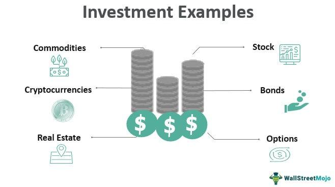

Investing is becoming increasingly sophisticated, with technology playing a pivotal role in shaping the landscape. This evolution introduces a multitude of opportunities and challenges for both individual and institutional investors. The world of finance offers a broad spectrum of investment possibilities, ranging from traditional stock investments, which have been a cornerstone of financial growth and wealth generation, to modern strategies such as algorithmic trading. These strategies leverage advanced computer algorithms to execute trades at high speeds based on predetermined criteria, offering a new dimension to investment strategies.

The purpose of this article is to provide a comprehensive overview that combines essential investment advice, financial tips for stock investment, and an exploration of the rising trend of algo trading. By understanding these components, investors can position themselves more strategically in a complex market environment. This article aims to equip you with the necessary knowledge to make informed financial decisions, recognizing that both market conditions and technology are constantly evolving.



Whether you're a seasoned investor with extensive market experience or a newcomer seeking to navigate investment complexities, understanding these concepts is crucial. A strong grasp of investment fundamentals can significantly enhance your financial strategy, ensuring that you maximize opportunities for growth and security. As financial markets become more intertwined with technology, adapting to these changes ensures investors are not left behind but rather leverage these tools for more robust investment outcomes.

## Table of Contents

## Investment Advice: Building a Strong Foundation

Successful investing starts with a comprehensive understanding of personal financial goals and risk tolerance. This foundation aids in tailoring investment strategies to individual needs and circumstances.

**Diversification** is a fundamental principle in investment strategy to minimize risk. By spreading investments across various asset classes—such as stocks, bonds, real estate, and commodities—investors can reduce exposure to any single asset's volatility. A well-diversified portfolio lowers the potential impact of a negative performance from a specific investment, ensuring more stable returns over time. For example, an investor might hold a mix of domestic and international stocks, alongside government and corporate bonds, to balance growth potential and risk.

A **long-term investment plan** is crucial for maintaining focus and discipline in the face of market volatility. This plan should align with personal financial targets, such as retirement savings or purchasing a home, and guide investment decisions, helping to prevent emotional reactions to market fluctuations. Long-term planning allows investors to leverage the benefits of compounding returns, where reinvested earnings contribute to increasing the overall investment value over time.

Regularly **reviewing and adjusting a portfolio** is vital to ensure it remains aligned with both market conditions and personal goals. Portfolio rebalancing involves buying and selling assets to maintain the desired level of asset allocation. This process may include reducing exposure to overperforming assets and increasing investments in underperforming ones to capitalize on potential growth. For example:

```python
def rebalance_portfolio(current_allocation, target_allocation, current_values):
    rebalance_amounts = {}
    total_value = sum(current_values.values())
    for asset, current_value in current_values.items():
        target_value = target_allocation[asset] * total_value
        rebalance_amounts[asset] = target_value - current_value
    return rebalance_amounts

current_allocation = {'stocks': 0.6, 'bonds': 0.4}
target_allocation = {'stocks': 0.5, 'bonds': 0.5}
current_values = {'stocks': 60000, 'bonds': 40000}

rebalance = rebalance_portfolio(current_allocation, target_allocation, current_values)
```

The Python code will help determine how much to buy or sell to achieve the target allocation.

Recognizing the significance of **[liquidity](/wiki/liquidity-risk-premium)** and maintaining **emergency funds** is essential for safeguarding against unexpected financial challenges. Liquidity refers to how easily an asset can be converted into cash without affecting its market price. Maintaining a portion of investments in liquid assets, like money market funds or short-term bonds, ensures that funds are readily available to cover emergencies or sudden expenses without the necessity of liquidating investments at a loss.

In sum, building a strong investment foundation involves understanding personal financial goals and using diversification, long-term planning, regular portfolio reviews, and liquidity management as guiding principles. These strategies aim to achieve financial growth and stability in a dynamic investment landscape.

## Financial Tips for Stock Investment

When considering stock investment, comprehensive research is paramount. Begin by thoroughly understanding the company's business model and its position in the market. This entails analyzing how the company makes its money, the industry it operates in, and its competitive advantages. Knowledge of a company’s business model allows investors to gauge its long-term growth potential and sustainability.

Fundamental analysis is a crucial aspect of stock evaluation. Investors should keep a close eye on key indicators like the Price-to-Earnings (P/E) ratio, which provides insight into a stock's valuation relative to its earnings. Dividends per share indicate a company's profit distribution to its shareholders and can reflect financial health. Earnings growth is another vital parameter; consistent growth suggests a company positioned for sustained expansion and profitability.

Additionally, the stability and strategic vision of a company's management team significantly affect its performance. Evaluating the leadership involves assessing their experience, track record, and strategic plans for the company’s future. A capable management team can steer a company through tough economic times and capitalize on opportunities for growth.

Investors should also employ technical analysis tools and track market trends to effectively time their stock purchasing and selling decisions. Technical analysis involves evaluating statistical trends derived from trading activity, such as price movement and [volume](/wiki/volume-trading-strategy). This analysis can help identify patterns or signals that indicate future price movements. Commonly used tools in technical analysis include moving averages, relative strength index (RSI), and Bollinger Bands.

Awareness of global economic indicators is essential to understand broader market dynamics. Factors such as interest rates, inflation, and geopolitical events can significantly impact stock market performance. For example, rising interest rates may lead to higher borrowing costs for companies, potentially affecting their profits and, consequently, stock prices. Similarly, geopolitical tensions can cause market [volatility](/wiki/volatility-trading-strategies), influencing investment sentiment and stock valuations globally.

By integrating these financial tips into your stock investment strategy, you can enhance your ability to make informed decisions, optimizing your portfolio for both growth and resilience in an ever-evolving market environment.

## Understanding Algorithmic Trading

Algorithmic trading, commonly referred to as algo trading, employs sophisticated computer programs to make trading decisions based on predefined criteria. This approach allows for trades to be executed with high speed and efficiency, which is crucial in the fast-paced environment of modern financial markets.

One of the primary advantages of algo trading is the significant reduction in human error. Human emotions and biases often lead to mistakes in trading, such as panic selling or overconfidence in investment choices. By automating the trading process, these emotional biases can be minimized, resulting in more objective decision-making.

Algo trading also ensures best execution prices. By rapidly analyzing a vast amount of market data, algorithms can identify optimal entry and [exit](/wiki/exit-strategy) points for trades, thus capturing favorable price movements. This is particularly beneficial in highly liquid markets where price fluctuations can be swift and significant.

Additionally, the use of algorithms maximizes trading speed. In markets where milliseconds can make a difference, the ability to execute trades at lightning-fast speeds provides a competitive edge. This speed is essential for strategies that rely on capturing short-term market movements.

Several common trading algorithms include:

1. **Trend-following:** This strategy tries to capitalize on market momentum by buying securities showing upward trends and selling those in a downward trajectory. The Moving Average Convergence Divergence (MACD) indicator is often used in such strategies to identify trend reversals.

2. **Arbitrage:** This involves buying and selling an asset simultaneously in different markets to take advantage of price discrepancies. For example, a simple arbitrage strategy could be implemented in Python as follows:

   ```python
   # Example of a simple arbitrage strategy
   def arbitrage_opportunity(price_a, price_b, transaction_cost):
       profit = price_b - price_a - transaction_cost
       if profit > 0:
           return True
       return False
   ```

3. **Mean-reversion:** This strategy is based on the idea that prices and returns eventually move back towards the mean or average. Algorithms scan for assets that deviate significantly from their historical averages, expecting a return to mean values.

Developing and [backtesting](/wiki/backtesting) algorithms require robust technical skills. Understanding programming languages, data analysis, and the intricacies of market structures is essential. Backtesting involves evaluating an algorithm's performance on historical data to ensure its effectiveness before actual deployment.

However, [algorithmic trading](/wiki/algorithmic-trading) is not without its risks. Over-optimization, also known as “curve-fitting,” can lead a model to perform splendidly on historical data but fail in live markets. Additionally, the reliance on technology means that system failures, software bugs, or connectivity issues can result in significant financial losses. It is, therefore, vital to incorporate strong risk management practices and maintain a human oversight aspect to monitor and intervene during unexpected conditions.

## The Future of Investing: Merging Traditional and Modern Strategies

The investment landscape is undergoing a significant transformation, driven by the interplay between traditional strategies and cutting-edge technological advancements. One of the most promising developments in this domain is the integration of [artificial intelligence](/wiki/ai-artificial-intelligence) (AI) and [machine learning](/wiki/machine-learning) (ML) with conventional human insights. These technologies enable investors to analyze vast amounts of data more efficiently, revealing patterns and insights that were previously inaccessible. For instance, AI can process complex datasets to predict stock performance, allowing for more informed decision-making. Machine learning algorithms can adapt and evolve with new information, ensuring that strategies remain relevant in ever-changing markets.

While automated trading systems have revolutionized speed and efficiency, they are not infallible. Human oversight is crucial in mitigating risks associated with algorithmic errors which might not account for unexpected market events. An example of this is the infamous "flash crash" of 2010, where automated trading practices led to a rapid, temporary collapse in equity prices. By maintaining a balance between machines and human judgment, the reliability and robustness of trading strategies can be enhanced.

The democratization of financial technology has leveled the playing field for retail investors. Tools and platforms, once exclusive to large financial institutions, are now accessible to individual investors, enabling them to participate in sophisticated trading activities. Platforms like Robinhood exemplify how technology can democratize financial services by offering commission-free trades and access to real-time market data. This shift empowers retail investors with the same capabilities as professional traders, potentially increasing market liquidity and competition.

In this rapidly changing environment, the ability to adapt and continuously educate oneself is essential. As new technologies emerge and markets evolve, sustained success in investing requires an openness to learning and an agile approach to strategy development. This dynamic landscape necessitates a proactive mindset, where investors not only respond to changes but also anticipate and prepare for future trends. Continuous education through online courses, webinars, and financial news outlets can provide investors with the insights needed to remain competitive.

In summary, the future of investing lies in the synergy between traditional methods and technological innovation. By leveraging AI, automating wisely with human oversight, embracing democratized tools, and committing to ongoing learning, investors can develop strategies robust enough to thrive in a complex and dynamic market.

## Conclusion

Incorporating effective investment advice into your strategy can lead to financial growth and security by forming a robust understanding of market dynamics and personal financial goals. Adopting key principles such as diversification and long-term planning establishes a foundation that can weather market volatility and unforeseen circumstances. Understanding stock investment principles, including thorough research and evaluation of fundamental indicators, helps make informed decisions that minimize risk while maximizing potential returns.

Moreover, embracing algo trading can offer a competitive edge. Algorithmic trading optimizes trade execution, enhances precision, and mitigates human error through automated processes. However, it is crucial to blend these technological innovations with traditional finance principles. The future of investing lies in the seamless integration of sophisticated software and established market knowledge.

Given the rapid pace at which markets and technology evolve, adapting to new methods and leveraging technological advancements is vital for staying ahead. The democratization of financial tools empowers retail investors with resources previously exclusive to institutional players, creating a level playing field in accessing market opportunities.

Investors must be proactive in combining traditional and modern strategies, incorporating innovations like AI and machine learning, while maintaining prudent oversight. Ultimately, success in investing results from a harmonious blend of knowledge, strategic planning, and technology utilization. Recognizing and implementing these elements effectively can foster a sustainable path to achieving financial goals in a competitive and dynamic investment landscape.

## References & Further Reading

[1]: Bergstra, J., Bardenet, R., Bengio, Y., & Kégl, B. (2011). ["Algorithms for Hyper-Parameter Optimization."](https://dl.acm.org/doi/10.5555/2986459.2986743) Advances in Neural Information Processing Systems 24.

[2]: Lopez de Prado, M. (2018). ["Advances in Financial Machine Learning"](https://www.amazon.com/Advances-Financial-Machine-Learning-Marcos/dp/1119482089). Wiley.

[3]: Aronson, D. (2006). ["Evidence-Based Technical Analysis: Applying the Scientific Method and Statistical Inference to Trading Signals"](https://www.amazon.com/Evidence-Based-Technical-Analysis-Scientific-Statistical/dp/0470008741). Wiley.

[4]: Jansen, S. (2020). ["Machine Learning for Algorithmic Trading: Predictive Models to Extract Signals From Market and Alternative Data"](https://github.com/stefan-jansen/machine-learning-for-trading). Packt Publishing.

[5]: Chan, E. P. (2008). ["Quantitative Trading: How to Build Your Own Algorithmic Trading Business"](https://github.com/ftvision/quant_trading_echan_book). Wiley.