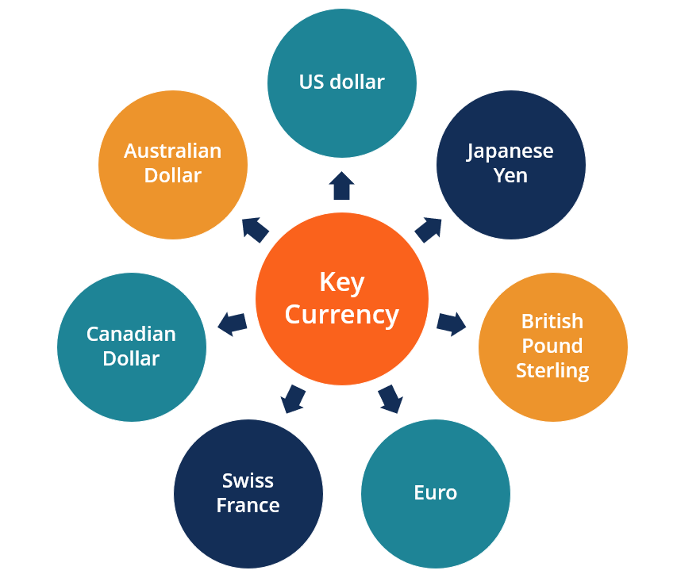

## Table of Contents

## What is a key currency?

A key currency, also known as a reserve currency, is a currency that is widely used and held in large amounts by governments and institutions around the world. It is often used for international trade and as a standard for pricing goods, services, and financial transactions. The most common key currency today is the US dollar, but other currencies like the Euro and the Japanese Yen are also considered key currencies.

Countries hold key currencies in their foreign exchange reserves to help stabilize their own currency and to facilitate international trade. When a country uses a key currency, it can make it easier to buy and sell goods and services with other countries. This is because the key currency is widely accepted and trusted, making it a convenient choice for international transactions.

## How does a currency become a key currency?

A currency becomes a key currency when many countries and businesses start using it a lot for buying and selling things around the world. This usually happens because the country that uses the currency has a strong economy and is trusted by other countries. For example, the US dollar became a key currency because the United States has a big and stable economy, and many countries trust it.

Once a currency is used a lot for international trade, countries start keeping a lot of it in their banks as a reserve. This helps them to buy things from other countries and to keep their own money stable. The more a currency is used and trusted, the more likely it is to stay a key currency.

## What are the historical examples of key currencies?

In the past, different currencies have been key currencies at different times. A long time ago, the Roman denarius was a key currency. It was used a lot for trade in the Roman Empire and other places. After that, the Byzantine solidus became important. It was used for trade in the Mediterranean area for a long time. Then, the Spanish dollar, also called the piece of eight, was a key currency in the 16th to 19th centuries. It was used a lot in trade around the world, especially in the Americas and Asia.

In more recent times, the British pound was a key currency in the 19th and early 20th centuries. This was because the British Empire was very big and powerful, and many countries used the pound for trade. After World War II, the US dollar became the most important key currency. It is still used a lot today for buying and selling things around the world. Other currencies like the Euro and the Japanese Yen have also become important, but the US dollar is still the biggest key currency.

## What are the primary functions of a key currency?

A key currency helps countries buy and sell things with each other easily. It is used a lot in international trade because many countries trust it. When countries use a key currency, they can trade with each other without having to change their money into different currencies all the time. This makes trading simpler and faster. For example, if a country wants to buy oil from another country, they might use the US dollar because it is a key currency that both countries trust.

Another important job of a key currency is to help countries keep their own money stable. Countries keep a lot of key currency in their banks as a reserve. This helps them to have enough money to buy things from other countries and to make sure their own money does not go up and down too much in value. When a country has a lot of a key currency, it can use it to help control its economy and make sure it stays strong.

## How does a key currency affect global trade?

A key currency makes global trade easier and smoother. When countries use a key currency like the US dollar for buying and selling things, they don't have to change their money into different currencies all the time. This saves time and money because changing currencies can be expensive and complicated. For example, if a country wants to buy oil from another country, they can use the US dollar, which is trusted by both countries. This makes the trade happen faster and with less hassle.

A key currency also helps keep global trade stable. Countries keep a lot of key currency in their banks as a reserve. This helps them to have enough money to buy things from other countries and to make sure their own money does not go up and down too much in value. When countries have a lot of a key currency, they can use it to help control their economy and make sure it stays strong. This stability is good for global trade because it makes businesses feel more confident about trading with other countries.

## What role does a key currency play in international finance?

A key currency is very important in international finance. It is used a lot by countries and businesses when they borrow and lend money from each other. For example, if a country wants to borrow money from another country or from a big bank, they might use a key currency like the US dollar. This makes it easier for everyone involved because the key currency is trusted and widely used. It also helps make the borrowing and lending process smoother and less risky.

Another big role of a key currency in international finance is in setting prices for things like oil, gold, and other important goods. When countries buy and sell these goods, they often use a key currency to set the price. This helps make global trade more stable because everyone knows what the price is in a currency they trust. It also makes it easier for countries to plan their budgets and for businesses to make decisions about buying and selling things around the world.

## How do key currencies influence exchange rates?

Key currencies can affect exchange rates a lot. When a country uses a key currency like the US dollar for trading, it can change how much its own money is worth compared to other currencies. If many countries want to use the US dollar, they might need to sell their own money to get dollars. This can make their own money less valuable and the US dollar more valuable. This is because more people want dollars, so the price of the dollar goes up.

Exchange rates can also be influenced by how much a country keeps in key currencies as reserves. If a country has a lot of a key currency like the Euro, it might feel more confident about its own money. This can make other countries and businesses trust the country's money more, which can make its exchange rate stronger. But if a country doesn't have enough key currency, it might worry about its money losing value, which can make the exchange rate weaker.

## What are the advantages of having a key currency for a country?

Having a key currency gives a country a lot of benefits. When a country's currency is a key currency, it becomes very important in global trade. This means other countries want to use it a lot for buying and selling things. This can make the country's economy stronger because more people want to use its money. It also helps the country have more power in the world because its currency is so important.

Another advantage is that a key currency can help a country keep its own money stable. When a country has a key currency, other countries keep a lot of it in their banks as reserves. This can help the country control its economy better. If its money starts to lose value, the country can use the key currency to help make it stable again. This makes businesses and other countries trust the country's money more, which can make the economy even stronger.

## What are the potential disadvantages or risks for a country with a key currency?

Having a key currency can be risky for a country. One big risk is that if the country's economy has problems, it can affect the whole world. This is because many other countries use the key currency for buying and selling things. If the key currency loses value, it can make other countries' economies unstable too. This can cause big problems and make it hard for the country with the key currency to fix its own economy without hurting others.

Another disadvantage is that the country with the key currency might feel pressure to keep its money strong. This can make it hard for the country to make decisions that are best for its own economy. For example, if the country wants to print more money to help its own people, it might worry about making the key currency weaker. This can limit what the country can do to help its economy and its people.

## How do changes in key currency status impact global economic stability?

When a currency stops being a key currency, it can make the whole world's economy shaky. This is because many countries use the key currency for buying and selling things. If a new currency becomes the key currency instead, countries might have to change their money into the new key currency. This can be hard and expensive, and it can make countries worry about their own money losing value. If a lot of countries start using a new key currency, it can change how much things cost around the world and make some countries' economies weaker.

Also, if a key currency loses its status, the country that used to have the key currency might have a hard time. That country might not be able to control its economy as well as before. Other countries might not trust its money as much, which can make it harder for the country to trade with others. This can cause big problems for the country and for the whole world's economy. It's like a big change that everyone has to get used to, and it can take a long time for things to become stable again.

## What are the current key currencies in the world, and how did they achieve this status?

The current key currencies in the world are the US dollar, the Euro, and the Japanese Yen. The US dollar is the most important key currency because the United States has a big and strong economy. Many countries trust the US dollar and use it a lot for buying and selling things. After World War II, the US dollar became even more important because many countries started using it for trade. The US also has a lot of power in the world, which helps keep the dollar strong.

The Euro became a key currency when many European countries started using it in 1999. These countries joined together to make the European Union, and they decided to use one currency to make trading easier. The Euro is trusted because the European Union has a big economy and many countries work together to keep it strong. The Japanese Yen is also a key currency because Japan has a strong economy and is good at making things like cars and electronics. Many countries use the Yen for trading with Japan and other countries in Asia.

## What future trends might affect the status of current key currencies?

In the future, the status of current key currencies like the US dollar, the Euro, and the Japanese Yen might change because of new economic powers. Countries like China are getting stronger and their economies are growing fast. If China's economy keeps getting bigger, more countries might start using the Chinese yuan for trading. This could make the yuan a new key currency. Also, if other countries start working together more, like in big trade groups, they might decide to use a new currency for their group, which could change the status of current key currencies.

Technology could also change the status of key currencies. With more people using digital money and cryptocurrencies, countries might start using these new types of money for trading. If a lot of countries start trusting a new digital currency, it could become a key currency. This could make the current key currencies less important. Also, if countries start using technology to make their own money more stable and easier to use, it might make their currencies more popular and challenge the current key currencies.

## References & Further Reading

[1]: Bergstra, J., Bardenet, R., Bengio, Y., & Kégl, B. (2011). ["Algorithms for Hyper-Parameter Optimization."](https://dl.acm.org/doi/10.5555/2986459.2986743) Advances in Neural Information Processing Systems 24.

[2]: ["Advances in Financial Machine Learning"](https://www.amazon.com/Advances-Financial-Machine-Learning-Marcos/dp/1119482089) by Marcos Lopez de Prado

[3]: ["Evidence-Based Technical Analysis: Applying the Scientific Method and Statistical Inference to Trading Signals"](https://www.amazon.com/Evidence-Based-Technical-Analysis-Scientific-Statistical/dp/0470008741) by David Aronson

[4]: ["Machine Learning for Algorithmic Trading"](https://github.com/stefan-jansen/machine-learning-for-trading) by Stefan Jansen

[5]: ["Quantitative Trading: How to Build Your Own Algorithmic Trading Business"](https://www.amazon.com/Quantitative-Trading-Build-Algorithmic-Business/dp/1119800064) by Ernest P. Chan