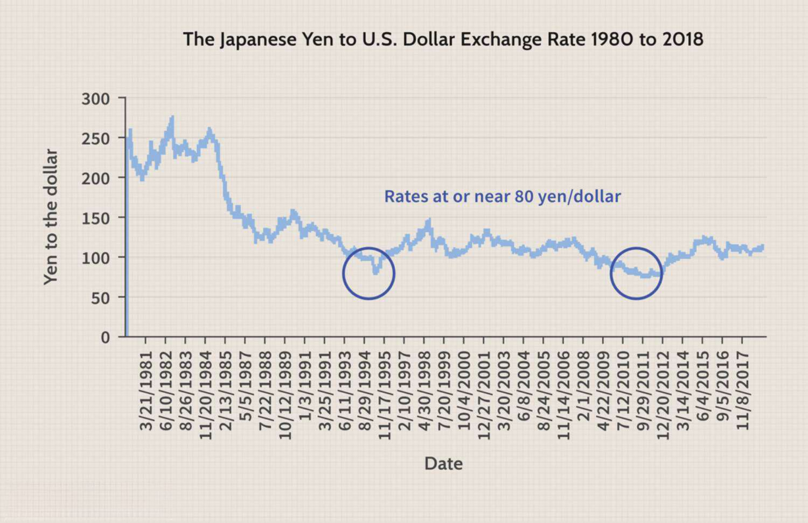

The economic concepts of inflation, stagflation, and algorithmic trading form the bedrock of contemporary financial systems. In an era where global economies are intricately linked, understanding these elements is crucial for navigating economic landscapes. Inflation, often defined as the sustained increase in the general price level of goods and services, directly impacts purchasing power and economic stability. Stagflation, a more complex phenomenon, challenges traditional economic theories by combining stagnant economic growth with high inflation and unemployment rates. These concepts underscore the necessity of robust economic strategies to address unpredictable market conditions.

Algorithmic trading, meanwhile, represents a technological advancement that has revolutionized financial markets. By automating trading processes, it enhances market efficiency and liquidity. However, its role during economic uncertainties like stagflation remains contentious. The interplay between these factors—how inflation and stagflation influence market conditions and how algorithmic trading can either stabilize or exacerbate these effects—carries significant implications for global economies.



Recent trends, including fluctuating inflation rates and economic disruptions, underscore the complexities inherent in these issues. As economies encounter such challenges, a nuanced understanding of how these elements interact is vital. This article explores these intricacies, examining their implications for worldwide economic systems and highlighting how advancements in algorithmic trading might offer solutions to mitigate adverse effects in a stagflationary context. By emphasizing the importance of these interconnected themes, we aim to provide insights into the strategic integration of technology and economic policy to address future financial challenges.

## Table of Contents

## Understanding Inflation and Its Economic Components

Inflation is a critical economic concept, defined as the rate at which the prices of goods and services rise, subsequently eroding purchasing power. Understanding the underlying components that drive inflation is essential for comprehending its broader implications on the economy. 

One of the main factors influencing inflation is the money supply within an economy. According to the Quantity Theory of Money, represented by the equation $MV = PQ$, where $M$ is the money supply, $V$ is the velocity of money, $P$ is the price level, and $Q$ is the quantity of goods and services produced, an increase in the money supply ($M$) often leads to a proportional increase in price levels ($P$) if the velocity of money ($V$) and the quantity of goods and services ($Q$) remain constant. This theory suggests that excessive growth in the money supply is a primary driver of inflation.

Demand for goods and services also plays a significant role in inflationary pressures. When aggregate demand in an economy surpasses aggregate supply, prices tend to rise. This situation can lead to "demand-pull" inflation, where increased consumer demand drives prices upward. For instance, if a country's economy is growing rapidly and consumers are spending more, businesses may raise prices to balance rising input costs and increased demand.

The cost of production is another vital component affecting inflation. Known as "cost-push" inflation, this occurs when production costs increase, leading businesses to pass on the higher costs to consumers in the form of increased prices. Important factors here include wages, which are a major portion of production costs, and the prices of raw materials. For example, if oil prices rise, the increased transportation and production costs can propagate through various sectors, resulting in higher overall prices.

By examining the interactions between money supply, demand for goods, and the cost of production, it is possible to gain a deeper understanding of how inflation impacts the economy. Persistent inflation can lead to uncertain financial environments, affecting monetary policy, interest rates, and overall economic growth. As such, managing inflation is crucial for maintaining economic stability and ensuring sustainable economic development.

## The Anatomy of Stagflation

Stagflation, a term that blends "stagnation" and "inflation," describes a unique economic situation where a country experiences stagnant economic growth, high unemployment, and rising inflation concurrently. This condition poses a significant challenge as it contradicts the conventional economic theory of the Phillips Curve, which suggests an inverse relationship between inflation and unemployment. According to this theory, as unemployment decreases, inflation rises, and vice versa. However, stagflation defies this notion by presenting simultaneous occurrences of high unemployment and inflation.

The most illustrative historical instance of stagflation occurred during the 1970s, particularly following the oil shocks. In the wake of the Yom Kippur War in 1973, members of the Organization of Arab Petroleum Exporting Countries (OAPEC) proclaimed an oil embargo, drastically reducing oil production and sending prices skyward. This abrupt increase in oil prices led to heightened production costs across a variety of sectors, significantly contributing to inflation without a corresponding growth in employment or economic output.

During this period, traditional policy tools appeared inadequate. Central banks faced a dilemma: tightening monetary policy to curb inflation threatened to worsen unemployment, while stimulating the economy could drive inflation further. As a result, policymakers struggled to find solutions, caught between two undesirable outcomes.

The complex interplay of these elements highlights the intrinsic difficulty of addressing stagflation. As evidenced by the experiences of the 1970s, stagflation defies easy resolution through conventional policy measures, often requiring innovative approaches and coordinated economic strategies. The study of this period provides crucial insights into the unique dynamics that facilitate stagflation, serving as a valuable reference for understanding similar conditions in the future.

## Economic Challenges Arising from Stagflation

Stagflation poses significant challenges for economic policymakers because it concurrently presents high inflation and unemployment with stagnant economic growth. This combination undermines the effectiveness of traditional monetary and fiscal policies, which are typically designed to address inflation and stagnation separately. 

Monetary policy tools, such as altering interest rates, face limitations during stagflation. Lowering interest rates would typically stimulate economic growth by encouraging borrowing and investment. However, this can exacerbate inflation, as increased spending may lead to higher demand and further price rises. Conversely, raising interest rates to control inflation could suppress economic growth further, leading to higher unemployment.

Similarly, fiscal policy, which involves government spending and taxation, becomes a balancing act. Expansionary fiscal measures, like increased government spending, can stimulate growth but risk intensifying inflationary pressures. On the other hand, contractionary fiscal actions, such as raising taxes or reducing government expenditure, might ease inflation but could also deepen economic stagnation and increase unemployment.

The inherent conflict between these policy objectives reflects the complexity of managing stagflation. Traditional economic models, such as the Phillips Curve, suggest a trade-off between inflation and unemployment. However, stagflation disrupts this relationship, necessitating novel approaches to economic management. 

Policymakers must explore strategies that address both components of stagflation. These strategies may include improving supply-side conditions, such as investing in infrastructure or promoting technological innovation to enhance productivity. Additionally, targeted support for affected industries and sectors can help mitigate unemployment without fueling further inflation. In summary, effectively addressing stagflation requires a nuanced approach that carefully balances policy measures to manage inflation while supporting economic growth.

## Leveraging Algorithmic Trading Amid Economic Uncertainty

Algorithmic trading, commonly known as algo-trading, utilizes sophisticated algorithms to execute trades at speeds and frequencies that would be impossible for a human trader. These algorithms are designed to measure market conditions, analyze trends, and execute orders based on pre-set criteria. The primary goal is to capitalize on market inefficiencies and automate trading strategies to optimize profitability.

In market conditions characterized by [volatility](/wiki/volatility-trading-strategies) and uncertainty, such as during periods of stagflation, [algorithmic trading](/wiki/algorithmic-trading) can offer several potential benefits. One significant advantage is increased [liquidity](/wiki/liquidity-risk-premium). By facilitating rapid and continuous transactions, algo-trading ensures there are always buyers and sellers in the market, effectively reducing the bid-ask spread and making markets more liquid. This enhanced liquidity can stabilize markets, as it allows for the rapid adjustment of positions in response to changing market dynamics.

Moreover, algorithmic trading can improve market efficiency. With its ability to quickly process vast amounts of data and execute trades at high speed, algo-trading can help markets reflect information more accurately and swiftly. This efficiency is particularly beneficial during volatile periods, as it helps to correct pricing anomalies and ensures that asset prices represent available information.

Despite these benefits, the role of algorithmic trading during economic turbulence such as stagflation remains contentious. Critics argue that while algo-trading can provide liquidity and efficiency, it might also exacerbate market volatility. High-frequency trading algorithms, in particular, can lead to flash crashes—sudden, severe market drops—triggered by cascading sell orders that overwhelm the market's capacity to absorb them. This scenario can cause liquidity to temporarily evaporate, leading to severe price disruptions.

Furthermore, the reliance on algorithms could lead to systemic risks. As many trading firms deploy similar strategies based on comparable algorithms, the market could become susceptible to synchronized movements, which pose a threat to market stability. During economic uncertainty, when traditional economic indicators may not be predictive, these risks might be magnified.

In conclusion, while algorithmic trading holds substantial promise for enhancing market liquidity and efficiency, its impact during periods of stagflation and economic turbulence is complex. The debate continues as to whether the benefits outweigh the potential risks, and this balance remains an important area of focus for market regulators and participants alike. Enhanced oversight, coupled with ongoing advancements in algorithm design, is crucial to ensuring algorithmic trading contributes positively to market stability, especially during challenging economic times.

## Case Studies: Algorithmic Trading During Economic Downturns

Analyzing the role of algorithmic trading during economic downturns provides valuable insights into market dynamics. During periods reminiscent of stagflation, algorithmic trading systems have demonstrated both adaptability and challenges. Examining historical events where such systems were deployed can illuminate their effectiveness and limitations.

Algorithmic trading became prominent in the late 20th century, driven by the rise of computing power and the need for rapid transaction execution. A key historical event illustrating its impact during economic downturns is the 2008 financial crisis. Despite not being a stagflationary period, the crisis shares characteristics of high uncertainty and market instability. Algorithmic trading contributed to liquidity by facilitating continuous buying and selling of securities, which is crucial during periods of financial distress. However, it also accentuated short-term volatility as algorithms reacted almost instantaneously to market signals, often triggering a cascade of automated orders that amplified price movements.

Consider the "Flash Crash" of May 6, 2010, a notable incident that highlights both the strengths and vulnerabilities of algorithmic trading. On that day, major US stock indices plunged and recovered within minutes. The rapidity of orders overwhelming the market's infrastructure pointed to the need for better risk management and circuit breakers. Investigations later showed that a single sell algorithm executed by a large trader was responsible for initiating this volatile situation, interacting with high-frequency trading algorithms and causing a temporary market collapse.

One strength identified from the analysis of such events is the ability of algorithmic trading to maintain market efficiency. By executing trades based on pre-defined criteria, algorithms reduce the impact of emotional decision-making and subjective biases, offering consistency. They also play a crucial role in price discovery by integrating vast amounts of market data quickly.

On the vulnerability side, algorithmic strategies often rely on historical data and market patterns, which may not hold during unprecedented economic conditions. This reliance can lead to systemic risks, as uniformly programmed responses from multiple algorithms can cause synchronized market reactions, exacerbating volatility. The 2011 European Sovereign Debt Crisis observed similar patterns where correlated algorithmic strategies led to intensified volatility in the European bond markets.

To mitigate these risks, regulatory bodies and financial institutions have been enhancing safeguards. These include implementing stricter oversight on algorithmic trading strategies and stress-testing them against atypical market conditions. Moreover, advances in [machine learning](/wiki/machine-learning) and [artificial intelligence](/wiki/ai-artificial-intelligence) offer promise for developing adaptive algorithms that can better differentiate between temporary volatility and fundamental market shifts.

Studying these case studies underscores the necessity of ongoing development in algorithmic systems to address both performance and risk management during economic disruptions. This involves collaborative efforts between algorithm developers, financial institutions, and regulators to ensure stability and efficacy in algorithmic trading practices amidst future economic downturns.

## Future Outlook: Mitigating Stagflation Through Technological Innovation

Technological advancements, particularly in artificial intelligence (AI) and machine learning, offer promising avenues to mitigate the adverse effects of stagflation. These technologies enhance the ability to develop adaptive algorithms capable of responding proactively to economic fluctuations. By analyzing vast datasets, machine learning models can identify patterns and forecast economic shifts, potentially allowing stakeholders to address downturns before they escalate.

AI systems can process economic indicators at scale, assessing variables like inflation rates, unemployment [statistics](/wiki/bayesian-statistics), and global supply chain data. Machine learning algorithms, for instance, can be trained to recognize signals indicative of stagflationary trends, potentially enabling anticipatory actions. The application of predictive analytics allows for the simulation of various economic scenarios, which can help in formulating robust contingencies.

Furthermore, the development of dynamic models that adjust trading strategies in real-time is feasible through [reinforcement learning](/wiki/reinforcement-learning)—a subset of machine learning. Reinforcement learning algorithms can optimize decision-making processes by continuously learning from market data and feedback, thus minimizing potential losses during volatile periods.

Collaboration between policymakers and financial institutions is crucial to fully leverage these technological innovations. Policymakers can integrate AI-driven insights into economic strategies, aligning fiscal policies with technological predictions to buffer against stagflation's impact. Simultaneously, financial institutions can refine algorithmic trading systems, improving market liquidity and resilience during economic stress.

Additionally, ensuring transparency and promoting ethical AI use should be a priority. The establishment of regulatory frameworks that govern algorithmic financial operations will foster trust and stability across markets. Policymakers should work closely with technologists to set standards for fair AI practices while encouraging innovation.

In conclusion, the symbiotic relationship between technology and economic policy can be a key determinant in addressing the challenges posed by stagflation. Harnessing AI and machine learning holds the potential to revolutionize economic forecasting and intervention strategies, paving the way for a more resilient global financial system.

## Conclusion

The intertwining effects of inflation, stagflation, and algorithmic trading play a pivotal role in shaping modern economic landscapes. Inflation, characterized by rising prices and a decreasing purchasing power, directly influences both consumer behavior and market stability. When compounded with stagnation in growth and elevated unemployment, the phenomenon of stagflation arises, challenging traditional economic theories and presenting unique policy dilemmas. In this context, the advancement of algorithmic trading emerges as a potential tool to navigate these complex economic conditions.

Algorithmic trading, employing sophisticated computer algorithms to execute trades, offers benefits such as increased market liquidity and efficiency. These advantages become particularly relevant during periods of economic uncertainty like stagflation. By enabling faster transactions and reducing human biases, algorithmic trading can stabilize markets by narrowing bid-ask spreads and providing continuous market presence.

Furthermore, the strategic integration of algorithmic trading with economic policies could aid in mitigating the impacts of stagflation. For instance, algorithms can be designed to analyze vast datasets in real-time, providing insights that enable preemptive measures against economic downturns. Policymakers and financial institutions could leverage these capabilities to develop adaptive strategies that respond to dynamic economic conditions.

To illustrate, consider the Python code snippet below that outlines a simple moving average crossover strategy, a commonly used approach in algorithmic trading:

```python
import numpy as np
import pandas as pd

# Sample market data
data = pd.DataFrame({
    'price': [100, 102, 103, 101, 104, 105, 107, 106, 108, 110]
})

# Calculate moving averages
data['short_ma'] = data['price'].rolling(window=3).mean()
data['long_ma'] = data['price'].rolling(window=5).mean()

# Generate buy/sell signals
data['signal'] = np.where(data['short_ma'] > data['long_ma'], 1, 0)
data['positions'] = data['signal'].diff()

print(data)
```

This script calculates two moving averages (short-term and long-term) to generate buy and sell signals, demonstrating how algorithms can systematize trading strategies that would be challenging to execute manually.

Ultimately, the convergence of algorithmic advancements and thoughtful economic policymaking holds promise for mitigating the adverse impacts of stagflation. As technological innovations continue to evolve, harnessing these developments through coordinated efforts presents a viable pathway to addressing future financial challenges effectively. Integrating technology prudently with macroeconomic strategies may indeed unlock resilience and stability in the face of economic turbulence.

## References & Further Reading

[1]: Blanchard, O. J., & Gali, J. (2007). "The Macroeconomic Effects of Oil Price Shocks: Why are the 2000s so Different from the 1970s?" *NBER Working Paper Series*. [Link to paper](https://www.nber.org/papers/w13368)

[2]: Bernanke, B. S. (2013). "The Great Stagnation: Causes, Consequences, and Solutions." *Princeton University Press*.

[3]: ["Advances in Financial Machine Learning"](https://www.amazon.com/Advances-Financial-Machine-Learning-Marcos/dp/1119482089) by Marcos Lopez de Prado

[4]: Stiglitz, J. E. (2008). "The Triumphant Return of John Maynard Keynes." *Project Syndicate*. [Link to article](https://www.project-syndicate.org/commentary/the-triumphant-return-of-john-maynard-keynes)

[5]: ["Quantitative Trading: How to Build Your Own Algorithmic Trading Business"](https://www.amazon.com/Quantitative-Trading-Build-Algorithmic-Business/dp/1119800064) by Ernest P. Chan

[6]: Hamilton, J. D. (1983). "Oil and the Macroeconomy since World War II." *The Journal of Political Economy, 91*(2), 228-248.

[7]: ["Machine Learning for Algorithmic Trading"](https://github.com/stefan-jansen/machine-learning-for-trading) by Stefan Jansen

[8]: Krugman, P. (2008). "The Return of Depression Economics and the Crisis of 2008." *W. W. Norton & Company*.