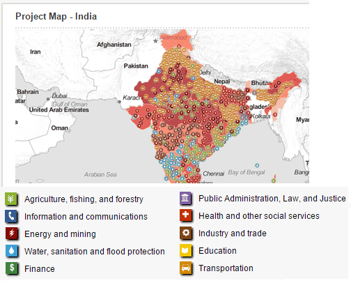

## Table of Contents

## What are the main economic indicators used to assess India's economy?

The main economic indicators used to assess India's economy include Gross Domestic Product (GDP), inflation rate, unemployment rate, and foreign exchange reserves. GDP measures the total value of all goods and services produced within the country over a specific period, usually a year. It helps to understand the overall health and growth of the economy. Inflation rate tracks the increase in prices of goods and services over time, showing how purchasing power changes. The unemployment rate indicates the percentage of the labor force that is jobless and actively seeking employment, which reflects the employment situation in the country. Foreign exchange reserves are the amount of foreign currencies held by the central bank, which can influence the stability of the national currency and the country's ability to engage in international trade.

In addition to these, other important indicators include the fiscal deficit, which is the difference between the government's total expenditure and its total receipts, excluding borrowings. A high fiscal deficit can lead to increased borrowing and higher interest rates. The balance of trade, which is the difference between the value of exports and imports, also plays a crucial role. A positive balance of trade, or trade surplus, means the country is exporting more than it is importing, which can be a sign of economic strength. On the other hand, a trade deficit might indicate that the country is consuming more than it is producing. These indicators together provide a comprehensive picture of India's economic performance and help policymakers make informed decisions.

## How is India's Gross Domestic Product (GDP) calculated and what does it indicate?

India's Gross Domestic Product (GDP) is calculated by adding up the total value of all goods and services produced within the country in a year. There are three main ways to calculate GDP: the production approach, the income approach, and the expenditure approach. The production approach adds up the value of all final goods and services produced by different sectors like agriculture, industry, and services. The income approach sums up all the incomes earned by households and businesses, including wages, profits, and rents. The expenditure approach calculates GDP by adding up all the spending on goods and services by households, businesses, the government, and foreigners (exports minus imports). In India, the Central Statistics Office (CSO) uses these methods to estimate the GDP, usually releasing quarterly and annual figures.

GDP indicates the size and health of India's economy. When GDP grows, it means the economy is expanding, and more goods and services are being produced. This can lead to more jobs and higher incomes for people. On the other hand, if GDP shrinks, it might mean the economy is slowing down, which can lead to fewer jobs and lower incomes. GDP per capita, which is GDP divided by the population, helps to understand how wealthy the average person in India is. By looking at GDP, policymakers can make decisions about economic policies, and businesses can plan their investments. Overall, GDP is a key measure to see how well India's economy is doing.

## What is the current inflation rate in India and how is it measured?

The current inflation rate in India, as of the latest data available, is around 5% to 6%. This rate can change from month to month, so it's good to check the latest figures from the government or economic reports. Inflation is measured using the Consumer Price Index (CPI), which tracks the prices of a basket of goods and services that a typical household buys. The CPI looks at things like food, clothing, housing, and transportation. If the prices of these items go up, the CPI goes up, and that means the inflation rate is higher.

The CPI is calculated by taking the average price of the basket of goods and services in the current period and comparing it to the average price in a base period. The percentage change between these two periods is the inflation rate. For example, if the average price of the basket was 100 in the base period and it's 105 in the current period, the inflation rate would be 5%. The government uses this information to make decisions about economic policies, like setting interest rates, to keep inflation under control and help the economy grow steadily.

## What are the unemployment rates in India and how do they impact the economy?

The unemployment rate in India changes from time to time, but it's usually around 7% to 8%. This number shows the percentage of people who want to work but can't find a job. The government and other groups like the Centre for Monitoring Indian Economy (CMIE) keep track of this rate. When more people are out of work, it's a sign that the economy might not be doing so well.

High unemployment can hurt the economy in many ways. When people don't have jobs, they don't have money to spend on things they need or want. This can slow down businesses because they sell less. If businesses sell less, they might not grow or might even have to close, which can lead to even more people losing their jobs. On the other hand, when unemployment goes down, more people have money to spend, which can help the economy grow. So, keeping unemployment low is important for a strong economy.

## How does the balance of trade affect India's economy?

The balance of trade is the difference between what a country exports and what it imports. For India, if the country exports more than it imports, it has a trade surplus, which is good for the economy. This means India is selling more to other countries than it is buying from them, bringing in more money. A trade surplus can make the Indian rupee stronger and help the economy grow because there's more money flowing into the country.

On the other hand, if India imports more than it exports, it has a trade deficit, which can be a problem. A trade deficit means India is spending more money on foreign goods than it is [earning](/wiki/earning-announcement) from its own exports. This can weaken the rupee and might lead to less money in the economy. If the trade deficit is too big, it can make it harder for India to pay for the things it needs from other countries, which can slow down economic growth. So, keeping a good balance of trade is important for India's economic health.

## What role does the Foreign Direct Investment (FDI) play in India's economic growth?

Foreign Direct Investment (FDI) is when companies from other countries invest money in India by setting up businesses or buying shares in Indian companies. This is really important for India's economy because it brings in money that can be used to build new factories, improve technology, and create jobs. When foreign companies invest in India, they often bring new skills and technology with them, which can help Indian businesses become more efficient and competitive. This can lead to more goods and services being produced, which helps the economy grow.

FDI also helps India connect more with the global economy. When foreign companies set up in India, they often export their products to other countries, which can increase India's exports and improve its balance of trade. More exports mean more money coming into the country, which can help the Indian rupee stay strong. Plus, FDI can lead to more competition in the market, which can be good for consumers because it might lead to lower prices and better products. Overall, FDI plays a big role in helping India's economy grow and become stronger.

## How is the fiscal deficit defined and what are its implications for India?

The fiscal deficit is the difference between what the Indian government spends and what it earns, not counting money it borrows. If the government spends more than it makes, it has to borrow money to cover the difference. This is like when someone uses a credit card to pay for things they can't afford right now. The government usually shows this number as a percentage of the Gross Domestic Product (GDP), which helps people understand how big the deficit is compared to the whole economy.

A big fiscal deficit can cause problems for India. When the government borrows a lot, it can lead to higher interest rates because there's more competition for money. Higher interest rates can make it harder for people and businesses to borrow money for things like buying a house or starting a new business. Also, if the government keeps borrowing, it might have to pay more in the future just to cover the interest on its debt. This can make it harder for the government to spend money on important things like schools, hospitals, and roads. So, keeping the fiscal deficit under control is important for a healthy economy.

## What are the key interest rates set by the Reserve Bank of India and how do they influence the economy?

The Reserve Bank of India (RBI) sets several key interest rates that play a big role in India's economy. One of the most important is the repo rate, which is the rate at which banks borrow money from the RBI. When the repo rate goes up, it becomes more expensive for banks to borrow money, and they often pass this cost on to customers by raising interest rates on loans. Another key rate is the reverse repo rate, which is what banks earn when they lend money to the RBI. This rate helps control how much money is in the economy. The RBI also sets the bank rate, which is the rate at which it lends money to banks without any securities, and the marginal standing facility (MSF) rate, which is a bit higher than the repo rate and used for emergency borrowing by banks.

These interest rates have a big impact on the economy. When the RBI raises the repo rate, borrowing becomes more expensive, and people might decide to save more and spend less. This can slow down the economy because businesses might not get as many customers, and they might have to cut back on their plans to grow. On the other hand, if the RBI lowers the repo rate, borrowing becomes cheaper, and people might decide to spend more and take out loans for things like buying a house or starting a business. This can help the economy grow because more money is moving around. By adjusting these rates, the RBI tries to keep the economy stable, control inflation, and help the country grow.

## How do industrial production indices reflect the health of India's manufacturing sector?

Industrial production indices show how well India's factories and industries are doing. These indices measure how much stuff like cars, machines, and other goods are made each month. If the index goes up, it means factories are making more things, which is good for the economy. It shows that the manufacturing part of India's economy is growing. When factories make more, they often need to hire more workers, which can help lower unemployment. Also, more production can lead to more exports, which can bring more money into the country.

On the other hand, if the industrial production index goes down, it means factories are making less stuff. This can be a sign that the economy is slowing down. When factories produce less, they might not need as many workers, which can lead to higher unemployment. Also, if less is being made, there might be fewer goods to sell to other countries, which can hurt India's balance of trade. So, watching the industrial production indices helps people understand if the manufacturing sector is doing well or if it needs help to grow.

## What is the significance of the Sensex and Nifty indices in understanding India's stock market performance?

The Sensex and Nifty are two important stock market indices in India. The Sensex, or the S&P BSE Sensex, is made up of 30 of the biggest and most important companies listed on the Bombay Stock Exchange (BSE). The Nifty, or the NSE Nifty 50, includes 50 major companies listed on the National Stock Exchange (NSE). These indices help people see how the stock market is doing overall. When the Sensex and Nifty go up, it usually means that the stock market is doing well, and people are feeling good about the economy. If they go down, it might mean that people are worried and the market is not doing so well.

These indices are important because they give a quick snapshot of the health of the stock market. Investors and people who follow the economy use them to make decisions about buying or selling stocks. If the Sensex and Nifty are going up, it might be a good time to invest because the market is growing. But if they are going down, people might want to be more careful with their money. Overall, the Sensex and Nifty help everyone understand how the stock market is performing and what might happen next in the economy.

## How does the Purchasing Managers' Index (PMI) provide insights into India's business activity?

The Purchasing Managers' Index (PMI) is a number that tells us how businesses in India are doing. It looks at things like how many new orders they are getting, how much they are producing, how fast they are delivering, and how many jobs they are creating. If the PMI is over 50, it means that businesses are doing better than last month. If it's under 50, it means they are doing worse. The PMI helps us see if the economy is growing or shrinking by looking at what businesses are doing.

The PMI is really important because it gives us early information about how the economy is doing. For example, if the manufacturing PMI is high, it might mean that factories are busy and making a lot of things. This can be good news because it might lead to more jobs and more money being spent in the economy. On the other hand, if the services PMI is low, it might mean that businesses like restaurants and hotels are not doing so well, which can be a sign that people are not spending as much money. By watching the PMI, we can get a quick idea of how different parts of the economy are doing and what might happen next.

## What advanced metrics like the Gini coefficient tell us about income inequality in India?

The Gini coefficient is a number that shows how equal or unequal income is in a country like India. It goes from 0 to 1, where 0 means everyone has the same income, and 1 means one person has all the income and everyone else has nothing. In India, the Gini coefficient helps us understand if the gap between rich and poor is getting bigger or smaller. A higher Gini coefficient means more inequality, which can be a problem because it might make it harder for poor people to get the things they need, like good education and healthcare.

Looking at the Gini coefficient over time can show us if things are getting better or worse. For example, if the Gini coefficient in India is going down, it might mean that the government's policies to help poor people are working. But if it's going up, it could mean that the rich are getting richer and the poor are getting poorer, which can lead to more social problems. By keeping an eye on the Gini coefficient, we can see how fair the economy is and whether we need to do more to help everyone have a chance to do well.

## References & Further Reading

[1]: Bergstra, J., Bardenet, R., Bengio, Y., & Kégl, B. (2011). ["Algorithms for Hyper-Parameter Optimization."](https://papers.nips.cc/paper/4443-algorithms-for-hyper-parameter-optimization) Advances in Neural Information Processing Systems 24.

[2]: ["Advances in Financial Machine Learning"](https://www.amazon.com/Advances-Financial-Machine-Learning-Marcos/dp/1119482089) by Marcos Lopez de Prado

[3]: ["Evidence-Based Technical Analysis: Applying the Scientific Method and Statistical Inference to Trading Signals"](https://www.amazon.com/Evidence-Based-Technical-Analysis-Scientific-Statistical/dp/0470008741) by David Aronson

[4]: ["Machine Learning for Algorithmic Trading"](https://github.com/stefan-jansen/machine-learning-for-trading) by Stefan Jansen

[5]: ["Quantitative Trading: How to Build Your Own Algorithmic Trading Business"](https://www.amazon.com/Quantitative-Trading-Build-Algorithmic-Business/dp/1119800064) by Ernest P. Chan

[6]: Reserve Bank of India. ["Handbook of Statistics on Indian Economy"](https://www.rbi.org.in/Scripts/AnnualPublications.aspx?head=Handbook%20of%20Statistics%20on%20Indian%20Economy)

[7]: World Bank. ["India Overview"](https://www.worldbank.org/en/country/india/overview)

[8]: Securities and Exchange Board of India. ["Algorithmic Trading: Issues and Concerns"](https://economictimes.indiatimes.com/markets/stocks/news/decoding-sebis-move-to-ring-fence-retail-traders-from-dangers-of-algo-trading/articleshow/88303482.cms)

[9]: Patterson, S. (2012). ["Dark Pools: High-Speed Traders, A.I. Bandits, and the Threat to the Global Financial System"](https://dl.acm.org/doi/10.5555/2385786). Crown Business.

[10]: Ministry of Statistics and Programme Implementation, Government of India. ["Key Economic Indicators"](https://mospi.gov.in/)

[11]: Asian Development Bank. ["Asian Development Outlook"](https://www.adb.org/outlook/editions/december-2024)

[12]: Investopedia. ["An Introduction to Algorithmic Trading"](https://www.investopedia.com/articles/active-trading/101014/basics-algorithmic-trading-concepts-and-examples.asp)

[13]: Pring, M. J. (2002). ["Technical Analysis Explained"](https://www.amazon.com/Technical-Analysis-Explained-Fifth-Successful/dp/0071825177). McGraw-Hill.