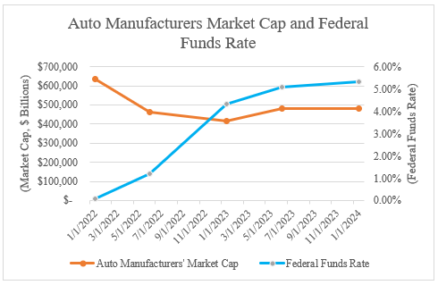

## Table of Contents

## What are economic indicators and why are they important for investing?

Economic indicators are pieces of information that show how well a country's economy is doing. They can tell us things like how many people have jobs, how much stuff people are buying, and how fast prices are going up. Some common economic indicators include the unemployment rate, the consumer price index, and the gross domestic product (GDP). Investors use these indicators to understand the overall health of the economy and to make guesses about what might happen next.

These indicators are important for investing because they help investors make smarter choices about where to put their money. For example, if the unemployment rate is going down, it might mean that more people will have money to spend, which could be good for companies that sell things to consumers. On the other hand, if the consumer price index is going up quickly, it might mean that inflation is becoming a problem, which could affect the value of money and investments. By keeping an eye on these indicators, investors can try to predict which investments will do well and which ones might not.

## How do economic indicators specifically impact the automotive sector?

Economic indicators can have a big impact on the automotive sector. For example, when the unemployment rate goes down, more people have jobs and money to spend. This can lead to more people buying cars because they feel more confident about their finances. On the other hand, if the unemployment rate goes up, people might be more worried about money and less likely to buy a new car. This can hurt car sales and the companies that make cars.

Another important indicator is the consumer price index, which measures inflation. If inflation is high, the prices of cars and the parts needed to make them can go up. This can make cars more expensive for buyers and can squeeze the profits of car companies. Also, when interest rates go up, it can make car loans more expensive, which can make people less likely to buy a car. So, car companies need to keep a close eye on these indicators to plan their business and make smart decisions.

## What is the significance of Gross Domestic Product (GDP) growth rates for the automotive industry?

Gross Domestic Product (GDP) growth rates are very important for the automotive industry. When GDP is growing, it means the overall economy is doing well. More people are working and have money to spend. This can lead to more people buying cars because they feel good about their finances. Car companies can sell more cars and make more money when the economy is strong.

On the other hand, if GDP growth slows down or even shrinks, it can be bad for the automotive industry. When the economy is not doing well, people might worry about money and decide to hold off on buying a new car. This can lead to fewer car sales and lower profits for car companies. So, car companies watch GDP growth rates closely to plan their business and make decisions about production and sales.

## How does unemployment rate influence consumer demand for vehicles?

The unemployment rate has a big effect on how many cars people want to buy. When the unemployment rate goes down, more people have jobs. This means they have money coming in and feel more sure about their future. When people feel good about their money, they are more likely to buy things like cars. So, when unemployment is low, car companies usually see more people coming to buy their vehicles.

On the other hand, when the unemployment rate goes up, it can make people worried about money. If more people are out of work, they might not have the money to buy a new car. They might also be scared about losing their job and decide to save their money instead of spending it on a car. This can lead to fewer people buying cars, which can hurt car companies and make them sell fewer vehicles.

## What role does consumer confidence play in automotive sales?

Consumer confidence is really important for how many cars get sold. When people feel good about their money and the future, they are more likely to buy things like cars. If they think the economy is doing well and they will keep their job, they feel okay about spending money on a new car. This means more people go to car dealerships and buy vehicles, which is good for car companies.

On the other hand, if people are not feeling confident about their money, they might decide to wait before buying a car. If they are worried about losing their job or think the economy might get worse, they might want to save their money instead of spending it on a big purchase like a car. When consumer confidence is low, fewer people buy cars, and this can hurt car sales and the companies that make cars.

## How can interest rates affect car financing and sales?

Interest rates can have a big effect on how many cars people buy. When interest rates are low, it's cheaper for people to borrow money to buy a car. This means car loans cost less, so more people can afford to buy a car. When car loans are cheaper, more people go to car dealerships and buy vehicles, which is good for car companies.

On the other hand, when interest rates go up, car loans get more expensive. If it costs more to borrow money, fewer people might decide to buy a car. They might think it's too expensive to pay back the loan, so they wait or choose not to buy a car at all. When interest rates are high, car sales can go down, which can hurt the car companies.

## What are the effects of inflation on the automotive industry?

Inflation can make things harder for the automotive industry. When inflation goes up, the prices of cars and the parts needed to make them can also go up. This means cars can become more expensive for people to buy. If cars cost more, fewer people might want to buy them because they can't afford it. This can lead to fewer car sales and lower profits for car companies.

Also, when inflation is high, it can affect how much money people have to spend. If the prices of everything are going up, people might feel like they have less money to spend on big things like cars. They might decide to save their money instead of buying a new car. This can make car sales go down even more. So, car companies need to watch inflation closely and plan how to deal with it.

## How does the strength of the currency impact automotive exports and imports?

When a country's currency is strong, it can make it harder for that country to sell cars to other countries. This is because a strong currency makes the cars more expensive for people in other countries to buy. For example, if the US dollar is strong, a car made in the USA will cost more for someone in Europe or Japan to buy. This can make it harder for American car companies to sell their cars in those places. On the other hand, a strong currency can make it cheaper for a country to buy cars from other countries. So, if the US dollar is strong, it might be cheaper for Americans to buy cars made in Europe or Japan.

When a country's currency is weak, it can help that country sell more cars to other countries. A weak currency makes the cars cheaper for people in other countries to buy. For example, if the US dollar is weak, a car made in the USA will cost less for someone in Europe or Japan to buy. This can help American car companies sell more cars in those places. But, a weak currency can make it more expensive for a country to buy cars from other countries. So, if the US dollar is weak, it might be more expensive for Americans to buy cars made in Europe or Japan.

## What are leading indicators for the automotive sector and how can they predict market trends?

Leading indicators for the automotive sector are signs that help predict what will happen next in the car market. One important leading indicator is consumer confidence. When people feel good about their money and the economy, they are more likely to buy cars. This means that if consumer confidence is going up, car companies might expect more sales soon. Another leading indicator is new car orders. If more people are ordering new cars, it can mean that car sales will go up in the future. Car companies watch these orders to plan how many cars they need to make.

Another leading indicator is interest rates. When interest rates are low, car loans are cheaper, so more people might buy cars. If interest rates are going down, car companies might expect more sales because it's easier for people to borrow money. Also, economic indicators like GDP growth can be a leading indicator. If the economy is growing, people have more money to spend, which can lead to more car sales. By watching these leading indicators, car companies can try to guess what will happen in the market and make smart decisions about their business.

## How do government policies and regulations, such as emissions standards, influence the automotive market?

Government policies and regulations, like emissions standards, can really change how the automotive market works. When governments set strict rules about how much pollution cars can make, car companies need to spend money to make their cars cleaner. This can mean using new technology or changing how they make cars. These changes can make cars more expensive for people to buy. But, these rules can also push car companies to make more electric or hybrid cars, which can be good for the environment.

These rules can also affect what kinds of cars people want to buy. If the government gives money to people who buy electric cars, more people might choose to buy them. This can help car companies that make electric cars sell more of them. On the other hand, if the rules make gas cars more expensive, fewer people might buy them. So, car companies need to watch these rules closely and plan how to make cars that meet the new standards while still selling well.

## What advanced economic indicators should an expert investor monitor to gain an edge in the automotive sector?

Expert investors looking to gain an edge in the automotive sector should keep an eye on advanced economic indicators like the Manufacturing PMI (Purchasing Managers' Index). The PMI gives a good idea of how busy factories are and how much they are making. If the PMI for the automotive industry is going up, it can mean that more cars are being made, which might lead to more sales soon. Investors can use this information to guess if car companies will do well in the future and make smart choices about where to put their money.

Another important indicator is the inventory levels of new cars at dealerships. If there are a lot of cars sitting on lots and not being sold, it can mean that people are not buying as many cars as expected. This can be a warning sign for investors that car sales might go down. On the other hand, if inventory levels are low, it can mean that cars are selling quickly, which is a good sign for car companies. By watching these advanced indicators, expert investors can get a better understanding of what might happen in the automotive market and make better investment decisions.

## How can global economic indicators, like international trade agreements, affect investment decisions in the automotive industry?

Global economic indicators, like international trade agreements, can have a big impact on investment decisions in the automotive industry. When countries make trade deals, it can change how easy or hard it is for car companies to sell their cars in other countries. For example, if a new trade agreement lowers taxes on cars being sold between two countries, it can make it cheaper for people in one country to buy cars from the other country. This can be good for car companies that want to sell more cars abroad, and investors might see this as a good time to put money into those companies.

On the other hand, if a trade agreement makes it harder to sell cars in other countries, it can hurt car companies. For example, if a new trade deal adds more taxes or rules, it can make cars more expensive for people in other countries to buy. This can mean fewer car sales and lower profits for car companies. Investors need to watch these global economic indicators closely to understand how they might affect the car market and make smart choices about where to invest their money.

## What role do financial ratios play in automotive investing?

Financial ratios are crucial metrics that provide insights into the financial health and operational efficiency of companies within the automotive sector. These ratios help investors assess risk, evaluate management effectiveness, and determine potential returns on investment. Three essential financial ratios highly pertinent to the automotive industry include the Debt-to-Equity Ratio, the Inventory Turnover Ratio, and the Return on Equity (ROE).

### Debt-to-Equity Ratio

The Debt-to-Equity Ratio (D/E) is a measure of a company's financial leverage, calculated by dividing its total liabilities by shareholders' equity. It provides insights into the extent of a company's reliance on debt to finance its assets.

$$
\text{Debt-to-Equity Ratio} = \frac{\text{Total Liabilities}}{\text{Shareholders' Equity}}
$$

In the automotive industry, which is capital-intensive, maintaining an optimal D/E ratio is crucial. A high ratio may indicate significant borrowing, potentially leading to financial instability, especially in economic downturns where revenue might decline. Conversely, a low ratio suggests less reliance on debt, possibly implying conservative management practices or a strong equity base.

### Inventory Turnover Ratio

Inventory Turnover Ratio assesses how efficiently a company manages its inventory. This ratio is calculated by dividing the cost of goods sold (COGS) by the average inventory for a particular period.

$$
\text{Inventory Turnover Ratio} = \frac{\text{Cost of Goods Sold}}{\text{Average Inventory}}
$$

A high Inventory Turnover Ratio indicates effective inventory management, signifying that the company is adept at selling and replacing its stock, thereby reducing holding costs. In the automotive sector, efficient inventory management is vital due to the rapid changes in consumer preferences and technology advancements.

### Return on Equity (ROE)

Return on Equity (ROE) measures a company's profitability in relation to shareholders' equity. It is calculated as net income divided by shareholders' equity.

$$
\text{Return on Equity} = \frac{\text{Net Income}}{\text{Shareholders' Equity}}
$$

ROE is critical for investors as it evaluates how effectively management is using equity financing to generate profits. A high ROE indicates that the company is generating substantial profits relative to shareholder investments, which boosts investor confidence. In the automotive industry, where capital projects and innovation require substantial equity investment, a strong ROE signals financial efficiency and robust management performance.

Together, these financial ratios offer a comprehensive view of a company’s operational and financial status, aiding investors in making informed decisions regarding their investments in the automotive industry. Understanding and analyzing these ratios can be significantly beneficial, especially when combined with economic indicators and [algorithmic trading](/wiki/algorithmic-trading) strategies.

## References & Further Reading

Investopedia provides numerous articles that clearly explain the fundamental economic indicators significant to the automotive sector. These resources cover topics such as auto sales trends, the influence of macroeconomic factors like unemployment rates, and the impact of consumer confidence and interest rates on automotive purchasing behaviors. These articles are essential for building a foundational understanding of how these indicators affect the automotive industry.

For those interested in financial ratios and algorithmic trading, several [books](/wiki/algo-trading-books) and academic papers are noteworthy. Titles such as "Financial Ratios for Executives: How to Assess Company Strength, Fix Problems, and Make Better Decisions" by Michael Rist offer practical insights into calculating and interpreting financial ratios like the debt-to-equity ratio, inventory turnover, and return on equity (ROE). In the domain of algorithmic trading, "Algorithmic Trading and DMA: An Introduction to Direct Access Trading Strategies" by Barry Johnson, provides a comprehensive guide on developing algorithmic trading systems using tools like Python, enhancing the efficiency and accuracy of investment decisions in the automotive sector.

Industry reports, such as those published by the International Organization of Motor Vehicle Manufacturers (OICA) or McKinsey & Company, provide detailed analyses of global automotive market trends. These reports explore the economic impact of automobile manufacturing on economies and how external factors such as regulatory changes and technological advancements shape the sector's future. These materials are invaluable for investors seeking to understand the broader economic landscape impacting the automotive market. 

Integrating these resources will equip investors and analysts with the necessary tools to navigate the dynamic automotive investment landscape, bridging traditional analysis with innovative trading strategies.

