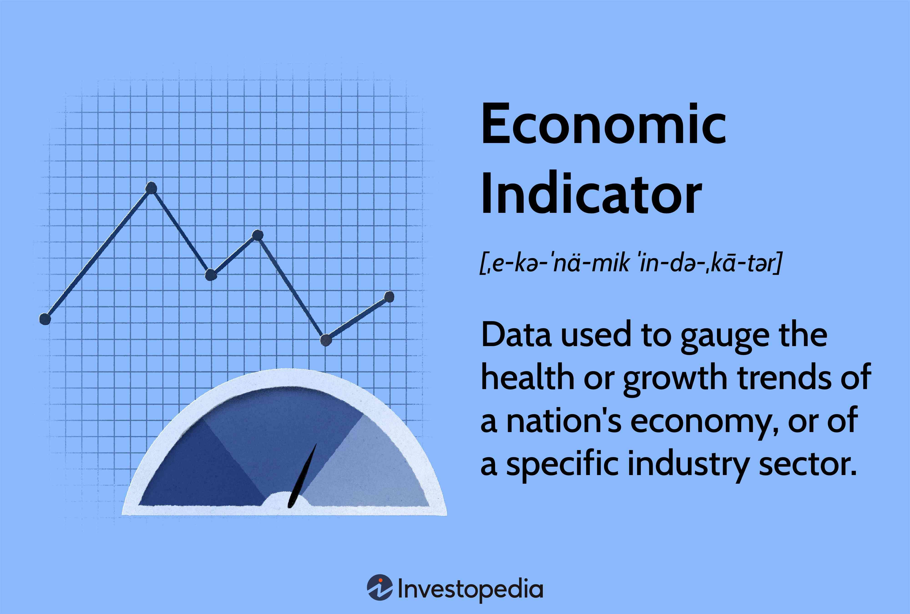

The banking sector is a cornerstone of the modern economy, serving as an intermediary for capital allocation, facilitating payments, and supporting economic growth through lending and investment activities. As financial institutions engage in these operations, they significantly influence and are influenced by economic indicators such as interest rates, inflation, and Gross Domestic Product (GDP). Evaluating these economic indicators is crucial for making informed investment decisions within the banking sector.

Interest rates, for instance, play a crucial role in determining the profitability of banks. They affect the spread between what banks earn on loans and pay on deposits, directly impacting net interest margins. An increase in interest rates often leads to increased borrowing costs, thereby affecting consumer spending and investment. Conversely, lower interest rates can encourage borrowing and stimulate economic activity. Inflation, another key indicator, affects bank operations through its impact on interest rates and the value of collateral held against loans. High inflation generally prompts central banks to hike interest rates, directly influencing banking profitability and strategy. Additionally, GDP growth is indicative of the overall economic health and directly correlates with banks' investment opportunities, as a buoyant economy typically results in increased business activities and thus heightened demand for bank services.

Algorithmic trading is increasingly reshaping investments in banking. Leveraging technology and data analytics, algorithmic trading employs complex algorithms to expedite trading decisions and execute orders at speeds unattainable by human traders. This technological shift enables banks to enhance their trading efficiency, reduce transaction costs, and improve the accuracy of their investment strategies. By utilizing algorithmic trading, banks can also more effectively capitalize on market trends and fluctuations, responding swiftly to shifts in economic indicators.

In essence, the banking sector is deeply intertwined with various economic indicators. Assessing these indicators allows for a comprehensive understanding of potential investment risks and opportunities while algorithmic trading provides the technological means to optimize these investment strategies. Together, they underscore the importance of integrating economic analysis with technological advancements in banking to drive informed investment decisions.

## Table of Contents

## Key Economic Indicators for the Banking Sector

The banking sector, a cornerstone of the global economy, is considerably influenced by several economic indicators, notably interest rates, inflation, housing market trends, and GDP growth. Understanding these indicators is crucial for assessing banking profitability, asset valuation, loan portfolio management, and investment opportunities.

Interest rates, determined by central banks, primarily influence banking profitability through borrowing and lending activities. Higher interest rates generally result in increased net interest margins, as banks can charge more for loans while the interest paid on deposits does not rise proportionally. Conversely, lower interest rates can squeeze these margins, pushing banks to explore alternative income-generating avenues or refinance existing loan portfolios. Furthermore, interest rates influence investment decisions by determining the cost of capital, affecting the attractiveness of investment opportunities. 

Inflation impacts banking operations significantly by altering asset valuations and the real return on investments. Rising inflation erodes the value of fixed-income assets, such as bonds, and affects the purchasing power of currency. Banks might adjust interest rates on deposits and loans to hedge against inflationary pressures, impacting the demand for credit and deposit dynamics. Moreover, inflation can influence the cost of operation and compliance, necessitating strategic changes in policy and pricing.

The housing market is intrinsically linked to the banking sector through mortgage issuance and real estate financing. Trends in the housing market dictate the demand for housing loans, influencing banks' loan portfolios and the risk profile of their lending activities. For instance, a booming housing market may encourage increased mortgage lending. However, banks must be cautious of housing bubbles that could lead to defaults and affect the financial stability of the housing loan portfolio.

GDP growth is a robust indicator of economic health and significantly influences the banking sector. Strong GDP growth signals increased economic activity, generating more business for banks through heightened demand for loans and financial services. It also fosters confidence in investment opportunities, encouraging both individual and institutional investors to engage more vigorously with banking products. Conversely, slow or negative GDP growth can lead to decreased lending activity, greater loan defaults, and limited investment prospects, adversely affecting banks' financial health.

In sum, these key economic indicators not only reflect the state of the economy but also guide strategic decision-making within the banking sector. Their dynamic interplay necessitates vigilant analysis by banking professionals to optimize profitability, manage risks, and capture investment opportunities effectively.

## Algorithmic Trading in the Banking Sector

Algorithmic trading, also known as algo-trading, refers to the use of computer systems programmed with specific algorithms to execute trades automatically and at high speed. These algorithms are designed to make investment decisions by analyzing market data, allowing banks to optimize their trading strategies and operations. The adoption of [algorithmic trading](/wiki/algorithmic-trading) in the banking sector has increased significantly, transforming the way banks conduct their trading activities, enabling more precise and faster decision-making processes.

The primary advantage of algorithmic trading in the banking sector is the speed at which trades can be executed. Algorithms process data and execute trades in milliseconds, far surpassing human capabilities. This speed is crucial in volatile markets where the ability to respond quickly to market changes can significantly affect profitability. Additionally, algorithmic trading provides heightened accuracy by minimizing human errors in trade execution. Computers following preset algorithms can execute orders with greater precision and consistency, eliminating the biases and emotional influences that can impact human traders.

Moreover, algorithms can be programmed to incorporate complex modeling techniques and large datasets, enabling banks to analyze vast amounts of market data and identify patterns that might not be discernible manually. This ability to handle large datasets enhances strategic decision-making, allowing banks to implement sophisticated strategies such as statistical [arbitrage](/wiki/arbitrage) or mean reversion strategies, which rely on identifying market inefficiencies.

However, the integration of algorithmic trading in the banking sector is not without challenges and risks. One significant challenge is the creation and maintenance of robust algorithms capable of adapting to rapidly changing market conditions. The market can be unpredictable, and inflexible algorithms may lead to significant financial losses if they are not continuously updated and improved.

Another notable risk is the potential for technological failures. As trading becomes increasingly reliant on algorithms, the risk of technical malfunctions, such as software bugs or erroneous data inputs, can potentially lead to substantial financial and reputational damage for banks. Managing these risks requires a comprehensive approach to software development and testing, ensuring that algorithms are thoroughly vetted before deployment.

Additionally, the prevalence of algorithmic trading raises concerns regarding market stability. The high-speed nature of algorithmic trades can sometimes lead to flash crashes—rapid and severe market downturns caused by sudden massive sell-offs initiated by algorithms. Regulatory scrutiny has increased in response, with more significant emphasis on ensuring that banks have adequate risk management protocols and fail-safes to prevent or mitigate such occurrences.

In summary, algorithmic trading in the banking sector offers remarkable advantages in speed, accuracy, and data processing that can enhance investment decisions. However, banks must navigate the inherent challenges and risks, including technological dependencies and market stability concerns, to maximize the benefits of algorithmic trading.

## Monetary Policy and Its Impact on Banking Investments

Central bank policies, such as [interest rate](/wiki/interest-rate-trading-strategies) adjustments, are pivotal in shaping banking investments. When central banks modify interest rates, they directly affect the cost of borrowing and the return on savings—key factors influencing the banking sector. A decrease in interest rates, for example, generally leads to cheaper borrowing costs for consumers and businesses, thereby encouraging increased lending activities by banks. This can lead to a rise in investments as businesses expand operations, and consumers increase spending on goods such as housing and durable products.

Conversely, an increase in interest rates tends to raise the cost of borrowing, which can dampen economic activity. Banks may experience a decrease in loan demand, impacting their profitability and potentially leading to more conservative investment strategies. In this scenario, banks might focus on safer, lower-yield investments to mitigate risks associated with reduced loan performance.

Reserve requirement changes also have profound effects on banks' ability to lend and invest. Reserve requirements dictate the proportion of deposits that banks must hold as reserves, either in their vaults or at the central bank. A reduction in reserve requirements effectively increases the amount of funds available for banks to lend, potentially boosting their investment activities. In contrast, higher reserve requirements restrict the available funds for lending, which can lead to a more cautious approach in investments as banks seek to maintain [liquidity](/wiki/liquidity-risk-premium) and solvency.

Case studies of monetary policy provide insights into its impacts on banks. For instance, during the 2008 financial crisis, central banks globally adopted accommodative monetary policies, slashing interest rates to historic lows and implementing quantitative easing to inject liquidity into the financial system. This allowed banks to stabilize their balance sheets, renew lending activities, and ultimately support economic recovery. The European Central Bank (ECB) and the Federal Reserve employed these strategies to prevent further deterioration of the banking sector and stimulate economic growth.

In contrast, restrictive monetary policies, where central banks increase interest rates to combat inflation, can lead to tighter credit conditions. As illustrated in the late 1970s and early 1980s, the U.S. Federal Reserve raised interest rates sharply under Chairman Paul Volcker to curb inflation. While successful in its goal, the high-interest rates also contributed to a recession, with banks tightening lending standards and experiencing challenges in maintaining profitability.

Understanding these dynamics is crucial for investors and banking professionals. By closely monitoring central bank policies, stakeholders can anticipate shifts in lending capabilities and investment strategies, adjusting their approaches to optimize outcomes in the evolving banking landscape.

## Technological Advancements in Banking

Artificial intelligence (AI) and [machine learning](/wiki/machine-learning) (ML) are transforming the banking sector, offering enhanced capabilities in banking operations and decision-making. By leveraging vast data and advanced algorithms, these technologies facilitate more efficient processes, provide deeper insights, and improve overall customer experiences.

AI and machine learning have revolutionized banking operations by automating tasks that previously required considerable human intervention. For instance, banks are now using AI to process loan applications more efficiently. Algorithms can assess the creditworthiness of applicants by analyzing large datasets that include credit scores, income levels, and spending habits. This not only speeds up the processing time but also enhances accuracy in risk assessment.

In decision-making, AI aids banks by predicting market trends, assessing risks, and optimizing portfolios. Machine learning models can analyze historical data and recognize patterns to forecast future financial scenarios. Such predictive capabilities empower banks to make informed strategic decisions, aligning their investment portfolios with anticipated market movements.

Innovation in customer service is another area where technology is making substantial impacts. AI-powered chatbots and virtual assistants provide customers with 24/7 support, handling inquiries, and performing tasks ranging from balance checks to fund transfers. These innovations improve customer engagement by offering personalized interactions and reducing waiting times.

Risk management has also seen advancements through AI and machine learning. Banks now deploy sophisticated algorithms to detect fraudulent activities by identifying anomalies in transaction patterns and flagging suspicious activities in real-time. This proactive approach to fraud prevention not only safeguards financial assets but also enhances trust in banking services.

Compliance is crucial in the banking sector, with stringent regulatory frameworks governing operations. AI technologies assist banks in maintaining compliance by automating the monitoring of regulatory changes and ensuring adherence to relevant laws and standards. Machine learning models can analyze compliance data to identify gaps and suggest corrective actions, thereby reducing the risk of regulatory penalties and preserving the institution's reputation.

The long-term implications of technological adoption in the banking sector are profound. AI and machine learning are expected to lead to cost reductions by decreasing reliance on manual processes and optimizing operational efficiencies. Furthermore, the enhanced decision-making capabilities can yield better financial performance, driving increased profitability.

In the context of banking sector investments, these technological advancements open new avenues for profitability. Investors may find opportunities in banks that lead in technology adoption, as these institutions are likely to exhibit higher growth rates and competitive advantages. Such banks can leverage AI and machine learning to tap into new markets, innovate financial products, and improve customer retention.

While the integration of AI and machine learning in banking offers numerous benefits, it also presents challenges. Ensuring data privacy and security is paramount, as sensitive financial information is processed by these technologies. Banks must invest in robust cybersecurity measures to protect data integrity and maintain customer trust.

In summary, the role of AI and machine learning in modernizing banking operations is pivotal. These technologies offer substantial improvements in customer service, risk management, and compliance, with significant potential for optimizing banking sector investments. It is essential for banks to continually adopt and refine these technologies to remain competitive and meet the evolving needs of the financial landscape.

## Investment Strategies in the Banking Sector

Investment strategies in the banking sector are diverse and cater to varying investor objectives, including income and growth. Income investing in banking typically involves targeting financial institutions with robust dividend payouts. Investors focusing on this strategy value stable and predictable income streams, often gravitating towards well-established banks with a history of distributing profits to shareholders. This approach not only provides a steady cash flow but also aligns with the long-term financial stability of the bank.

On the other hand, growth investing emphasizes capital appreciation, with investors seeking banks that exhibit strong potential for market share expansion, innovative product offerings, and robust earnings growth. These investors are willing to tolerate higher [volatility](/wiki/volatility-trading-strategies) for the prospect of significant upside potential in the stock value. Growth-oriented banks might reinvest earnings into technology advancement or strategic acquisitions to fuel their expansion agenda.

Diversifying investment portfolios with banking stocks can mitigate risk and enhance returns. This involves combining different types of banking institutions, such as retail, investment, and regional banks, and is beneficial because these entities often have varying risk profiles and exposure to economic cycles. For example, large multinational banks may provide investors with global exposure and stability, while regional banks might offer quicker growth opportunities tied to local economic conditions.

Fundamental analysis plays a pivotal role in assessing the financial health of banks and guiding investment decisions. This analytical approach involves evaluating a bank's balance sheet, income statement, and cash flow statement to ascertain its intrinsic value. Key financial metrics such as the price-to-earnings (P/E) ratio, return on equity (ROE), and the net interest margin (NIM) are utilized to appraise bank performance.

For instance, the P/E ratio helps investors determine whether a bank's stock is over or undervalued relative to its earnings. ROE measures a bank's profitability by revealing how effectively it uses shareholders' equity to generate profits. Net interest margin, which represents the difference between interest income generated and interest paid out, is crucial for evaluating a bank's core profitability from its lending and deposit operations.

Furthermore, qualitative factors like management effectiveness, regulatory landscape, and competitive positioning are incorporated into the [fundamental analysis](/wiki/fundamental-analysis) to provide a comprehensive evaluation. These assessments help in distinguishing banks that are likely to perform well, particularly under challenging economic conditions.

In summary, investment strategies in the banking sector range from income to growth investing, with diversification serving as a critical risk management tool. Employing fundamental analysis supports informed decisions by illuminating both quantitative and qualitative aspects of a bank's operations, ultimately guiding investors towards institutions with sound financial health and promising growth trajectories.

## Conclusion

The banking sector operates at the intersection of economic indicators and financial strategy, necessitating informed investment decisions to navigate the complexities of the market. Economic indicators such as interest rates, inflation, GDP growth, and housing market trends are paramount for evaluating the health and potential of banking investments. These indicators provide insights into the economic climate, enabling investors to assess risks and opportunities within the banking sector effectively.

Algorithmic trading has further revolutionized the investment landscape in banking by leveraging advanced technology and data analytics. This transformation has facilitated greater speed, accuracy, and efficiency in investment decision-making processes. Algorithms can process vast amounts of data in real-time, assessing market trends and executing trades with precision. However, alongside these advantages, the adoption of algorithmic trading also introduces challenges such as market volatility and the risk of systematic errors, necessitating robust risk management strategies.

Technological integration continues to play an instrumental role in the banking sector, enhancing operations, customer service, and compliance. Innovations in [artificial intelligence](/wiki/ai-artificial-intelligence) and machine learning provide banks with powerful tools to refine investment strategies, improve risk management, and optimize customer interactions. As technology evolves, its long-term implications on banking investments are profound, offering potential for enhanced profitability and competitive advantage.

Continuous monitoring of economic trends and technological advancements is essential for optimizing investment strategies in the banking sector. Investors must remain vigilant to shifts in economic indicators and emerging technologies to adapt their approaches and maintain resilience in a dynamic market. By comprehensively understanding the interplay between economic factors and technological innovation, stakeholders can better position themselves to capitalize on opportunities and mitigate risks within the banking sector.

## References & Further Reading

[1]: Bergstra, J., Bardenet, R., Bengio, Y., & Kégl, B. (2011). ["Algorithms for Hyper-Parameter Optimization."](https://dl.acm.org/doi/10.5555/2986459.2986743) Advances in Neural Information Processing Systems 24.

[2]: ["Advances in Financial Machine Learning"](https://www.amazon.com/Advances-Financial-Machine-Learning-Marcos/dp/1119482089) by Marcos Lopez de Prado

[3]: ["Evidence-Based Technical Analysis: Applying the Scientific Method and Statistical Inference to Trading Signals"](https://www.amazon.com/Evidence-Based-Technical-Analysis-Scientific-Statistical/dp/0470008741) by David Aronson

[4]: ["Machine Learning for Algorithmic Trading"](https://github.com/stefan-jansen/machine-learning-for-trading) by Stefan Jansen

[5]: ["Quantitative Trading: How to Build Your Own Algorithmic Trading Business"](https://www.amazon.com/Quantitative-Trading-Build-Algorithmic-Business/dp/1119800064) by Ernest P. Chan