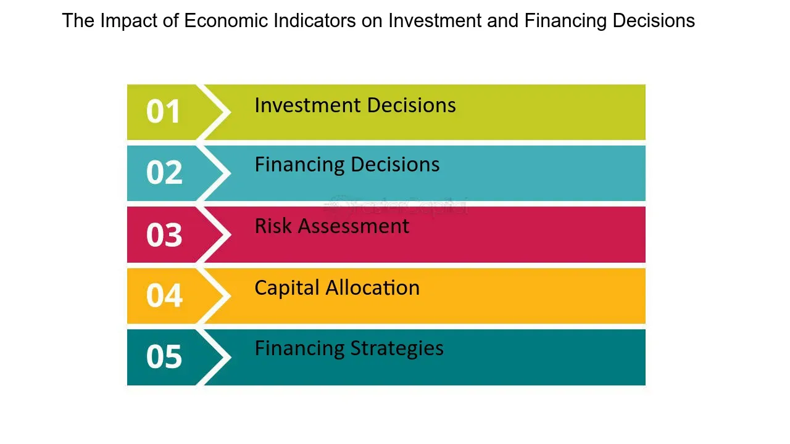

## Table of Contents

## What are economic indicators and why are they important for investing?

Economic indicators are pieces of information that tell us how well an economy is doing. They can be things like the unemployment rate, how much people are spending, or how fast prices are going up. These indicators help us understand if the economy is growing, staying the same, or shrinking. They are like the vital signs of the economy, similar to how a doctor checks your temperature and blood pressure to see if you're healthy.

These indicators are important for investing because they help investors make smart choices. If the indicators show that the economy is doing well, investors might feel more confident and decide to buy more stocks or other investments. On the other hand, if the indicators suggest that the economy might be heading for trouble, investors might want to be more careful and maybe sell some of their investments to avoid losing money. By keeping an eye on economic indicators, investors can try to predict what might happen next and plan their moves accordingly.

## How do interest rates affect the banking sector?

Interest rates have a big impact on the banking sector. When interest rates go up, banks can charge more for loans. This can be good for banks because they make more money from the interest people pay on their loans. But it can also make people less likely to borrow money, because loans become more expensive. So, while banks might earn more on each loan, they might end up making fewer loans overall.

On the other hand, when interest rates go down, borrowing money becomes cheaper. This can encourage more people to take out loans, which can be good for banks because they can make more loans. However, the downside is that banks earn less interest on each loan. Also, when interest rates are low, people might move their money from savings accounts to other investments that offer better returns, which can reduce the amount of money banks have to lend out.

In summary, interest rates are a double-edged sword for banks. Higher rates can mean more profit per loan but fewer loans, while lower rates can lead to more loans but less profit per loan. Banks need to carefully manage these changes to stay profitable and stable.

## What is the significance of GDP growth for banks?

GDP growth is important for banks because it shows how well the economy is doing. When GDP grows, it usually means more people are working and have money to spend. This can be good for banks because more people might want to borrow money to buy things like houses or cars. Banks make money from the interest they charge on these loans, so when more loans are made, banks can earn more profit.

On the other hand, if GDP growth slows down or turns negative, it can be bad for banks. A slowing economy might mean fewer people are working and less money is being spent. This can make people less likely to take out loans, and some might even struggle to pay back the loans they already have. When this happens, banks can face more risk and might have to set aside more money to cover potential losses, which can hurt their profits.

## How does inflation impact banking investments?

Inflation can have a big effect on banking investments. When inflation goes up, the value of money goes down. This means that the money banks get from interest on loans or investments might not be worth as much in the future. Banks need to think about this when they decide where to put their money. If inflation is high, they might want to invest in things that can grow faster than inflation, like stocks or real estate, to make sure they don't lose value.

On the other hand, if inflation is very high, it can make people worried about the economy. They might start taking their money out of banks and putting it into things they think will protect them from inflation, like gold or other safe investments. This can make it harder for banks to have enough money to lend out. Banks might then have to offer higher interest rates to keep people's money, which can cut into their profits. So, banks need to carefully watch inflation and adjust their investment strategies to handle these changes.

## What role does unemployment rate play in the banking industry?

The unemployment rate is a big deal for banks. When fewer people are out of work, it's good for banks. More people have jobs, so they have money coming in. This means they're more likely to take out loans to buy houses, cars, or start businesses. Banks make money from the interest on these loans, so when more loans are being made, banks do well. Plus, people with jobs are more likely to pay back their loans on time, which means less risk for the banks.

On the flip side, when the unemployment rate goes up, it can be tough for banks. More people without jobs means fewer people can afford to take out loans. This can hurt the banks because they make less money from interest. Also, people who lose their jobs might struggle to pay back their loans, which can lead to more defaults. Banks then have to set aside more money to cover these possible losses, which can cut into their profits. So, the unemployment rate is something banks watch closely because it affects how much money they can make and how much risk they have to take.

## How can the yield curve be used to predict banking sector performance?

The yield curve is a chart that shows the interest rates on bonds over different time periods. It's like a map that can help predict how the economy and the banking sector might do in the future. When the yield curve is normal, with short-term rates lower than long-term rates, it usually means that people think the economy will keep growing. This is good for banks because it means more people might want to borrow money, and banks can make more loans and earn more interest.

But when the yield curve gets flat or even turns upside down, with short-term rates higher than long-term rates, it can be a warning sign. This can mean that people think the economy might slow down or even go into a recession. When this happens, banks might be more careful about lending money because they worry more people might not be able to pay back their loans. This can lead to fewer loans and less profit for banks. So, by looking at the yield curve, banks and investors can get a hint about what might happen next in the banking sector.

## What are the implications of housing market trends for banking investments?

The housing market can have a big impact on banking investments. When the housing market is doing well, and home prices are going up, it's usually good for banks. More people want to buy houses, so they take out mortgages. Banks make money from the interest on these mortgages. Also, when home prices go up, people feel richer because their houses are worth more. This can make them more likely to take out other loans, like for home improvements or to buy cars, which also helps banks make more money.

But if the housing market starts to go down, it can be bad for banks. When home prices fall, fewer people want to buy houses, so fewer mortgages are made. This means less money from interest for banks. Also, if home prices drop a lot, people who bought homes with loans might owe more than their homes are worth. This can make it hard for them to pay back their loans, and banks might lose money if people can't pay. So, banks need to keep a close eye on the housing market to make smart investment choices.

## How do regulatory changes influence the banking sector's economic health?

Regulatory changes can really shake things up for banks. When the government makes new rules, it can change how banks do business. If the rules are stricter, banks might have to hold more money in reserve, which means they have less to lend out. They might also have to spend more money to make sure they're following all the new rules. This can make it harder for banks to make a profit, because they have to be more careful with their money and spend more on things like compliance and reporting.

On the other hand, if the rules get looser, banks might be able to take more risks and make more loans. This can help them make more money, but it can also be risky. If banks take too many risks and something goes wrong, it can hurt the whole economy. So, finding the right balance with regulations is important. It helps keep banks safe and stable, but also lets them help the economy grow by lending money to people and businesses.

## What is the impact of consumer confidence on banking stocks?

Consumer confidence is a big deal for banking stocks. When people feel good about the economy, they're more likely to spend money and take out loans. This is great for banks because they make money from the interest on those loans. When more loans are being made, banks can earn more profit, and this can make their stock prices go up. Investors see that banks are doing well and want to buy their stocks, which pushes the prices even higher.

But if consumer confidence goes down, it can be bad news for banking stocks. When people are worried about the economy, they might hold onto their money instead of spending it or taking out loans. This means fewer loans for banks, which can hurt their profits. When banks make less money, their stock prices can go down. Investors might start selling their bank stocks because they're worried about the future, which can make the prices drop even more. So, keeping an eye on consumer confidence is important for understanding how banking stocks might do.

## How do banks' loan-to-deposit ratios affect their investment attractiveness?

The loan-to-deposit ratio is a number that shows how much money a bank lends out compared to how much money it has from deposits. If this ratio is high, it means the bank is lending out a lot of the money it gets from deposits. This can be good for the bank because they make money from the interest on loans. Investors might like this because it can mean the bank is making more profit. But it can also be risky. If too many people can't pay back their loans, the bank could be in trouble. So, investors need to think about the risks and rewards when looking at a bank's loan-to-deposit ratio.

On the other hand, if the loan-to-deposit ratio is low, it means the bank is lending out less of the money it gets from deposits. This can be safer for the bank because they're not taking as many risks with loans. But it can also mean they're not making as much money from interest. Investors might see a low ratio as a sign that the bank is being careful, which can be good. But they might also worry that the bank isn't growing or making as much profit as it could. So, the loan-to-deposit ratio is an important thing for investors to look at when deciding if a bank is a good investment.

## What advanced metrics should be considered when analyzing bank stocks?

When looking at bank stocks, one important metric to consider is the net interest margin. This shows how much money a bank makes from the difference between the interest it earns on loans and the interest it pays on deposits. A higher net interest margin means the bank is doing a good job of making money from its loans. Another key metric is the efficiency ratio, which tells you how well a bank is managing its costs. A lower efficiency ratio means the bank is spending less money to make each dollar of revenue, which is good for profits.

Another useful metric is the return on assets (ROA), which shows how well a bank is using its assets to make money. A higher ROA means the bank is doing a good job of turning its assets into profit. The return on equity (ROE) is also important because it shows how much profit a bank is making for its shareholders. A higher ROE means the bank is doing well at making money for the people who own its stock. By looking at these metrics, investors can get a better idea of how healthy and profitable a bank is, which can help them decide if it's a good investment.

## How can global economic indicators influence domestic banking sector investments?

Global economic indicators can have a big impact on how people invest in banks at home. When the world economy is doing well, it can make people feel more confident about their own country's economy. This can lead to more people wanting to borrow money from banks, which is good for banks because they make money from the interest on loans. Investors might also feel more comfortable putting their money into bank stocks if they think the global economy is strong, because they believe the banks will do well.

On the other hand, if global economic indicators show that the world economy is struggling, it can make people worried about their own country's economy too. This can lead to fewer people wanting to take out loans, which means less money for banks from interest. Investors might start selling their bank stocks because they're worried about the future, which can make the prices of those stocks go down. So, keeping an eye on global economic indicators is important for understanding how domestic banking sector investments might do.

## References & Further Reading

[1]: Bergstra, J., Bardenet, R., Bengio, Y., & Kégl, B. (2011). ["Algorithms for Hyper-Parameter Optimization."](https://dl.acm.org/doi/10.5555/2986459.2986743) Advances in Neural Information Processing Systems 24.

[2]: ["Advances in Financial Machine Learning"](https://www.amazon.com/Advances-Financial-Machine-Learning-Marcos/dp/1119482089) by Marcos Lopez de Prado

[3]: ["Evidence-Based Technical Analysis: Applying the Scientific Method and Statistical Inference to Trading Signals"](https://www.amazon.com/Evidence-Based-Technical-Analysis-Scientific-Statistical/dp/0470008741) by David Aronson

[4]: ["Machine Learning for Algorithmic Trading"](https://github.com/stefan-jansen/machine-learning-for-trading) by Stefan Jansen

[5]: ["Quantitative Trading: How to Build Your Own Algorithmic Trading Business"](https://www.amazon.com/Quantitative-Trading-Build-Algorithmic-Business/dp/1119800064) by Ernest P. Chan