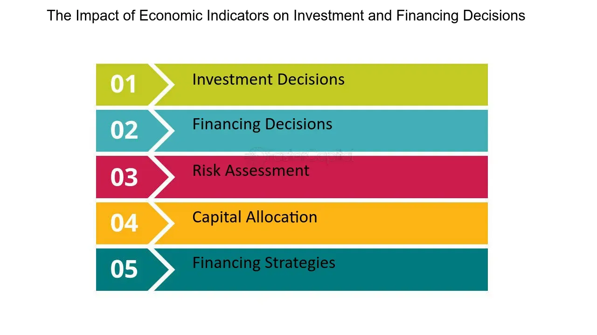

## Table of Contents

## What are economic indicators and why are they important for investment decisions?

Economic indicators are pieces of data that tell us about the health of an economy. They can show things like how many people have jobs, how much stuff people are buying, and how fast prices are going up. These indicators help us understand if the economy is doing well or if it might be heading into tough times.

These indicators are important for investment decisions because they give investors clues about what might happen in the future. If the indicators show the economy is growing, investors might feel more confident and decide to buy more stocks or other investments. On the other hand, if the indicators suggest the economy might be slowing down, investors might choose to be more careful and maybe sell some of their investments to avoid losing money. By keeping an eye on these indicators, investors can make smarter choices about where to put their money.

## How can Gross Domestic Product (GDP) influence investment strategies?

Gross Domestic Product (GDP) is like a big report card for a country's economy. It tells us the total value of all the goods and services produced in a country over a certain time, usually a year. When GDP is growing, it means the economy is doing well, and people are spending more money. This can make investors feel good about the future, so they might decide to buy more stocks or invest in new businesses. They think that with a strong economy, their investments will grow and make them more money.

On the flip side, if GDP is shrinking, it can be a warning sign that the economy is not doing so well. When this happens, investors might get worried and start selling their stocks or holding onto their money instead of investing it. They might think that a weak economy could hurt their investments, so they want to be careful. By watching GDP, investors can adjust their strategies, either by taking more risks when the economy is strong or playing it safe when things look shaky.

## What role does inflation play in investment planning?

Inflation is when the prices of things we buy go up over time. This means that the money we have today will buy less stuff in the future. When planning investments, it's important to think about inflation because it affects how much our money will be worth down the road. If inflation is high, the value of our money goes down faster, so we need to find investments that can grow faster than inflation to keep our money's value.

For example, if you keep your money in a savings account with low interest, and inflation is high, your money might actually lose value over time. That's why investors often look for things like stocks or real estate that might grow more than inflation. By understanding and planning for inflation, investors can choose the right investments to make sure their money keeps its value and even grows over time.

## How do employment rates affect the economy and investment opportunities?

Employment rates tell us how many people have jobs in a country. When more people have jobs, it's good for the economy because people with jobs earn money and spend it on things like food, clothes, and entertainment. This spending helps businesses grow and can lead to even more jobs. When employment rates are high, the economy usually does well, and this can make investors feel confident. They might invest in stocks or start new businesses because they think the economy will keep growing.

On the other hand, if employment rates are low, it means fewer people have jobs. This can be bad for the economy because people without jobs don't have as much money to spend. When people spend less, businesses might struggle, and the economy can slow down. When investors see low employment rates, they might worry and decide to be more careful with their money. They might sell some of their investments or hold onto their money until the employment situation improves. So, employment rates are a big deal for both the economy and for deciding where to invest.

## What is the significance of interest rates for investors?

Interest rates are like the price of borrowing money. When interest rates go up, it costs more for people and businesses to borrow money from banks. This can slow down the economy because people might buy fewer things like houses or cars, and businesses might not want to expand as much. For investors, higher interest rates can mean that saving money in a bank becomes more attractive because they can earn more interest. But it can also make borrowing money to invest in things like stocks or real estate more expensive, so they might be more cautious.

On the other hand, when interest rates are low, borrowing money becomes cheaper. This can help the economy grow because people and businesses are more likely to take out loans to buy things or start new projects. For investors, low interest rates can make it a good time to borrow money to invest in stocks or other things that might grow in value. But it also means that keeping money in a savings account won't earn much interest, so they might look for other ways to make their money grow. Interest rates are a big deal for investors because they can change how much risk they want to take and where they decide to put their money.

## How can consumer confidence indices guide investment decisions?

Consumer confidence indices tell us how people feel about the economy and their own money. When people feel good about the economy, they are more likely to spend money on things like new cars or going out to eat. This can help businesses grow and make the economy stronger. For investors, high consumer confidence can be a good sign. It might mean that people will keep spending, which can be good for companies and their stock prices. So, investors might feel more confident and decide to buy more stocks or invest in new businesses.

On the other hand, if consumer confidence is low, it means people are worried about the economy and might spend less money. They might hold onto their money instead of buying things, which can slow down the economy. When investors see low consumer confidence, they might worry that businesses will struggle and stock prices might go down. This can make them more cautious about investing. They might sell some of their stocks or wait for a better time to invest. By watching consumer confidence, investors can get a sense of where the economy might be headed and make smarter choices about their investments.

## What are leading, lagging, and coincident indicators and how do they differ?

Leading, lagging, and coincident indicators are different types of economic data that help us understand what's happening with the economy. Leading indicators are like early warning signs. They show us what might happen in the future. For example, if people are applying for more building permits, it could mean that construction will pick up soon. Investors watch leading indicators to try to get ahead of changes in the economy.

Lagging indicators, on the other hand, tell us what has already happened. They confirm trends after they've started. For instance, unemployment rates often go up after the economy has already started to slow down. Lagging indicators are useful for understanding the past and confirming that a change in the economy has taken place. 

Coincident indicators give us a snapshot of what's happening right now. They move along with the economy and help us see its current state. Things like personal income and industrial production are coincident indicators. They help us understand the economy's present condition, which can be useful for making decisions based on current economic health.

## How do stock market indices reflect the health of the economy?

Stock market indices, like the Dow Jones or the S&P 500, are like big scoreboards for the economy. They show how well a bunch of big companies are doing by tracking the prices of their stocks. When the stock market is going up, it usually means that people feel good about the economy. They think that companies will make more money in the future, so they buy more stocks. This can be a sign that the economy is healthy and growing.

But if the stock market starts to go down, it can be a warning sign that people are worried about the economy. They might think that companies will have a harder time making money, so they sell their stocks. This can mean that the economy might be slowing down or facing some problems. By watching stock market indices, people can get a quick idea of how the economy is doing and make decisions based on that.

## What impact do exchange rates have on international investment?

Exchange rates are like the price of one country's money compared to another country's money. They can have a big impact on international investments. When a country's currency gets stronger, it means that the money from that country can buy more things in other countries. This can be good for investors who want to invest in foreign stocks or businesses because their money goes further. But it can also make things more expensive for people in other countries who want to buy things from that country, which might affect the profits of companies that sell a lot internationally.

On the flip side, if a country's currency gets weaker, it means that the money from that country can buy less in other countries. This can make foreign investments more expensive for investors from that country. But it can also make things cheaper for people in other countries to buy from that country, which might help companies that sell a lot overseas. So, exchange rates can change how much risk investors want to take and where they decide to put their money when they're thinking about international investments.

## How can housing starts and building permits be used as economic indicators?

Housing starts and building permits are important signs that tell us about the economy. Housing starts count the number of new homes that builders start to build each month. Building permits are the official okay that builders need before they can start building. When more people are getting permits and starting to build new homes, it usually means the economy is doing well. People feel confident about their money and want to buy new homes. This can also mean more jobs in construction and more spending on things like furniture and appliances, which helps the economy grow.

On the other hand, if fewer people are getting permits and starting to build homes, it can be a warning sign that the economy might be slowing down. When people are worried about their money, they might not want to buy new homes. This can lead to fewer jobs in construction and less spending on home-related stuff. By watching housing starts and building permits, people can get a good idea of how the economy is doing and make smart choices about their investments.

## What advanced economic indicators should expert investors monitor?

Expert investors should keep an eye on the Purchasing Managers' Index (PMI). This is a number that tells us how much new orders, production, and jobs are happening in manufacturing and services. When the PMI goes up, it means these areas of the economy are growing. This can be a good sign for investors because it might mean that businesses will do better and stock prices could go up. But if the PMI goes down, it might mean that the economy is slowing down, and investors might want to be more careful with their money.

Another important indicator is the yield curve. This shows the difference between short-term and long-term interest rates. When the yield curve is steep, it means long-term rates are much higher than short-term rates, and this can be a sign that the economy will grow. But if the yield curve gets flat or even turns upside down, it can be a warning that a recession might be coming. Expert investors watch the yield curve closely because it can help them decide when to take risks or when to play it safe with their investments.

## How can investors use real-time economic data to make informed decisions?

Investors can use real-time economic data to make better choices about where to put their money. This data gives them the latest information on things like how many people have jobs, how much stuff people are buying, and how fast prices are going up. By looking at this information right away, investors can see if the economy is doing well or if it might be heading into tough times. For example, if new data shows that more people are getting jobs, investors might feel good about the future and decide to buy more stocks or invest in new businesses.

On the other hand, if real-time data shows that fewer people are spending money or that prices are going up too fast, investors might get worried. They might think that the economy could slow down, so they might sell some of their investments or hold onto their money instead of putting it into new things. By keeping an eye on real-time economic data, investors can react quickly to changes in the economy and make smarter decisions about their investments.

## How can economic indicators be integrated into algorithmic trading?

Algorithms in financial trading leverage economic indicators to formulate strategies aimed at maximizing returns while minimizing risks. By incorporating macroeconomic data, these algorithms can extract insights and predictions that guide investment decisions. Economic indicators, such as GDP growth rates, Consumer Price Index (CPI), and unemployment rates, serve as essential inputs to the models driving these strategies.

The integration of economic indicators into trading algorithms typically involves advanced data analytics and predictive modeling. Algorithms can process large volumes of data to identify patterns that human traders might overlook. Machine learning techniques, such as regression analysis, neural networks, and time-series forecasting, are commonly employed to model relationships between economic indicators and asset price movements.

For example, suppose a trader is interested in developing a strategy based on GDP growth rates. By applying a linear regression model, one can quantify the relationship between GDP figures and the price movements of specific stocks or asset classes. The algorithm might use a model such as:

$$
\text{Price Change} = \beta_0 + \beta_1 \times \text{GDP Growth} + \epsilon
$$

where $\beta_0$ is the intercept, $\beta_1$ is the coefficient representing the sensitivity of price changes to GDP growth, and $\epsilon$ is the error term. Based on this model, the algorithm can make buy or sell decisions depending on the predicted price changes derived from anticipated GDP values.

Successful integration of economic indicators in [algorithmic trading](/wiki/algorithmic-trading) systems can be seen in various trading strategies. For instance, a [momentum](/wiki/momentum) trading algorithm may take cues from leading economic indicators, adjusting positions ahead of anticipated market movements. Similarly, algorithms engaged in mean reversion trading might use lagging indicators to refine entry and [exit](/wiki/exit-strategy) points.

Quantitative hedge funds often illustrate successful use cases of integrating economic indicators with algorithmic trading. Funds employing a macro-strategy might utilize a blend of data sources, including central bank announcements and economic reports, to dynamically adjust their portfolios. In these systems, sophisticated statistical models capture the influence of macroeconomic shifts on asset prices, allowing for rapid response to economic changes.

In conclusion, the strategic incorporation of economic indicators into algorithmic trading models offers a powerful approach to investment. These algorithms, supported by robust data analytics and predictive capabilities, are well-equipped to respond to the complexities of modern financial markets. As technology progresses, the precision and adaptability of these systems are expected to further enhance their efficacy in optimizing trading strategies.

## References & Further Reading

[1]: Bergstra, J., Bardenet, R., Bengio, Y., & Kégl, B. (2011). ["Algorithms for Hyper-Parameter Optimization."](https://papers.nips.cc/paper/4443-algorithms-for-hyper-parameter-optimization) Advances in Neural Information Processing Systems 24.

[2]: ["Advances in Financial Machine Learning"](https://www.amazon.com/Advances-Financial-Machine-Learning-Marcos/dp/1119482089) by Marcos Lopez de Prado

[3]: ["Evidence-Based Technical Analysis: Applying the Scientific Method and Statistical Inference to Trading Signals"](https://www.amazon.com/Evidence-Based-Technical-Analysis-Scientific-Statistical/dp/0470008741) by David Aronson

[4]: ["Machine Learning for Algorithmic Trading"](https://github.com/stefan-jansen/machine-learning-for-trading) by Stefan Jansen

[5]: ["Quantitative Trading: How to Build Your Own Algorithmic Trading Business"](https://www.amazon.com/Quantitative-Trading-Build-Algorithmic-Business/dp/1119800064) by Ernest P. Chan