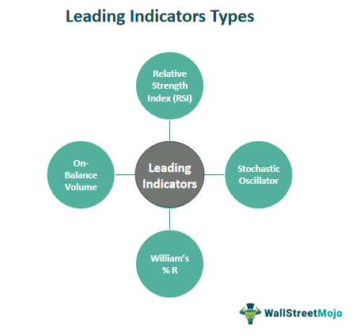

This article explores the intricate world of oil trading, focusing on crucial economic indicators and the role of algorithmic trading in oil market analysis. The oil market's complexity stems from various influencing factors, encompassing geopolitical events, supply and demand dynamics, and macroeconomic trends. These elements require investors and traders to adopt a comprehensive approach to market analysis to stay competitive.

Economic indicators play a pivotal role in providing insights into market conditions. Indicators such as crude oil inventories, production levels, and global GDP growth offer essential information for understanding and forecasting price movements. These indicators enable traders to make informed decisions and anticipate changes in market trends.



In recent years, algorithmic trading has gained prominence as a tool to enhance trading efficiency and accuracy. By employing sophisticated computer algorithms, traders can process vast datasets in real-time to identify patterns and capitalize on market opportunities. This method reduces human error and emotional biases, providing traders with a competitive edge in a highly volatile market.

Algorithmic trading strategies can optimize decision-making processes by integrating advanced techniques like machine learning and artificial intelligence. These strategies analyze historical data and adapt to evolving market conditions, ensuring that traders are well-equipped to manage risks and maximize returns.

Moreover, the advent of advanced trading platforms and tools has facilitated the development and deployment of algorithmic trading strategies. Platforms like NinjaTrader, MetaTrader, and QuantConnect offer features for backtesting, optimization, and live trading, enabling traders to fine-tune their strategies and improve performance.

In conclusion, understanding economic indicators and employing algorithmic trading strategies are vital for navigating the oil market's complexities. By leveraging technological advancements and integrating rigorous analysis into trading frameworks, investors can achieve greater consistency and success in their trading endeavors.

## Table of Contents

## Understanding the Importance of Economic Indicators in Oil Trading

Economic indicators are crucial in shaping the dynamics of the oil market. They serve as a barometer for assessing the current and prospective states of the market, allowing traders to make informed decisions. Among the vital indicators, [crude oil](/wiki/crude-oil) inventories, production levels, and global GDP growth are significant.

Crude oil inventories, as disseminated by the Energy Information Administration (EIA) on a weekly basis, have a direct influence on oil prices. An increase in inventory levels typically signals a surplus, exerting downward pressure on prices. Conversely, a decline in inventories may indicate higher demand or reduced supply, potentially driving prices up. Thus, monitoring these weekly reports is integral for traders aiming to anticipate price movements.

Production levels, encompassing both OPEC and non-OPEC countries, also play an essential role. Fluctuations in output, whether due to geopolitical tensions or strategic decisions by oil-producing nations, can considerably affect supply levels and, subsequently, market prices.

Additionally, global GDP growth impacts oil demand. Economic expansion generally leads to increased industrial activity and energy consumption, thereby elevating demand for oil. Similarly, a slowdown in economic activity can dampen demand, influencing price trends.

Several other indicators further assist traders in refining their market strategies. Refinery utilization rates, which indicate the percentage of capacity in use at refineries, impact immediate supply levels. High utilization rates suggest robust demand for refined products and can lead to increased crude oil demand.

Import/export data offer insights into regional demand and supply dynamics, reflecting shifts in trading patterns that might affect global prices. Meanwhile, industrial demand figures help gauge consumption trends across various sectors, from transportation to manufacturing.

These economic indicators collectively provide an analytical framework for traders to forecast market trends, allowing them to adapt their strategies proactively. By understanding these metrics, traders can better navigate the volatile and complex environment of the oil market.

## Overview of Algorithmic Trading in the Oil Market

Algorithmic trading, often referred to as algo trading, involves the use of computer algorithms to execute trades based on predetermined rules and strategies. This approach aims to enhance both the efficiency and precision of trade execution. By analyzing large datasets rapidly, algo trading identifies patterns and trends within the volatile crude oil market, a task that would be daunting if done manually.

The implementation of algo trading in the crude oil market offers several advantages. Primarily, it reduces the influence of human error and emotional decision-making, thus leading to more rational trading outcomes. Furthermore, it increases the speed at which trades are executed, which is crucial in a volatile market where prices can fluctuate rapidly.

Advanced algorithms integrate [artificial intelligence](/wiki/ai-artificial-intelligence) (AI) and [machine learning](/wiki/machine-learning) techniques, enabling them to adapt to dynamic market conditions and optimize trading strategies continuously. Machine learning models, for example, can be trained to recognize price patterns or predict future price movements based on historical data. This adaptability ensures that trading strategies remain effective even as market conditions change.

Moreover, algo trading platforms often employ complex mathematical models to forecast price trends and optimize trade execution. These models can include regression analysis, time-series forecasting, and even [deep learning](/wiki/deep-learning) techniques for pattern recognition. The integration of such sophisticated methods allows traders to leverage statistical and computational tools to maximize their trading potential.

Here is a simplistic Python example illustrating how one might implement a basic moving average crossover strategy, a common technique in [algorithmic trading](/wiki/algorithmic-trading):

```python
import pandas as pd
import numpy as np

# Load historical price data
data = pd.read_csv('crude_oil_prices.csv')
data['SMA_50'] = data['Close'].rolling(window=50).mean()
data['SMA_200'] = data['Close'].rolling(window=200).mean()

# Buy signal: Short-term average crosses above long-term average
data['Signal'] = np.where(data['SMA_50'] > data['SMA_200'], 1, 0)

# Compute daily returns
data['Daily_Return'] = data['Close'].pct_change()

# Strategy returns
data['Strategy_Return'] = data['Daily_Return'] * data['Signal'].shift(1)

# Cumulative returns
data['Cumulative_Strategy_Return'] = (1 + data['Strategy_Return']).cumprod()

# Output final cumulative return for the period
final_return = data['Cumulative_Strategy_Return'].iloc[-1]
print(f"Cumulative Strategy Return: {final_return}")
```

This code employs a simple moving average crossover strategy, which is one of the more straightforward forms of algorithmic trading. The strategy generates buy signals when a short-term moving average crosses above a long-term moving average, reflecting a potential upward trend. 

In summary, algorithmic trading fundamentally transforms how crude oil trading is conducted by leveraging speed, precision, and adaptability through sophisticated computational techniques. This transformation allows traders to operate more efficiently and take advantage of fleeting market opportunities that are often imperceptible to human traders.

## Developing a Successful Crude Oil Trading Strategy

A successful crude oil trading strategy hinges on a comprehensive analysis of historical data coupled with the application of technical indicators. This combined approach enables traders to identify trends, reversals, and potential price movements, offering a structured methodology for decision-making.

One of the most commonly employed technical indicators in crude oil trading is the moving average. It helps in smoothing price data over a specific time period, thereby filtering out the noise of daily price fluctuations. For example, the simple moving average (SMA) calculates the average of a security’s price over a defined number of periods. Calculating a 50-day SMA involves summing the closing prices for the past 50 days and dividing by 50. Traders often look for crossovers between short-term and long-term moving averages as signals to buy or sell.

Another pivotal tool is the stochastic oscillator, which compares a particular closing price of a security to a range of its prices over a certain period. This indicator is particularly useful in determining overbought or oversold conditions in the market, which can precede reversals. The oscillator ranges from 0 to 100, where readings over 80 indicate overbought conditions, while readings below 20 suggest oversold conditions.

Fibonacci retracement levels are also essential for traders to predict potential support and resistance levels in the oil market. By analyzing the percentage retracements, traders can identify critical levels at which the price could reverse its direction. This method is based on the idea that markets will retrace a predictable portion of a move, after which they will continue in the original direction.

Risk management strategies are equally crucial in developing a successful trading approach. Techniques such as setting stop-loss orders can safeguard against significant losses by automatically selling a position once it reaches a pre-determined price. Position sizing is another vital aspect, where the amount of capital allocated to a trade is carefully calculated to limit exposure to any single trade. 

Constant refinement and adaptation of trading strategies are necessary, underpinned by rigorous [backtesting](/wiki/backtesting) and analysis of market feedback. Backtesting allows traders to simulate trading strategies against historical data, providing insights into a strategy's effectiveness and areas for improvement.

Programming languages, particularly Python, are invaluable in strategy development and analysis. Python’s libraries, such as Pandas for data manipulation and Matplotlib for plotting, offer powerful tools for technical analysis. The flexibility enables traders to automate data analysis, optimize trading strategies, and effectively backtest them.

Here is a simple Python example illustrating how to calculate a 50-day simple moving average:

```python
import pandas as pd

# Assume df is a DataFrame with date as index and 'Close' as the column
df['SMA_50'] = df['Close'].rolling(window=50).mean()

# Print the first few entries of the DataFrame
print(df.head())
```

This code snippet helps traders compute moving averages over historical data, a foundational step in developing and assessing trading strategies. In summary, a successful crude oil trading strategy is characterized by the integration of sound technical analysis, disciplined risk management, and continuous refinement using robust analytical tools.

## Backtesting and Optimization of Oil Trading Strategies

Backtesting is a crucial process in evaluating the effectiveness of trading strategies by simulating their performance against historical market data. It allows traders to understand potential outcomes and refine strategies before deploying them in live trading environments. When conducting a backtest, it's important to ensure that the simulation accurately reflects real market conditions, including transaction costs, market [liquidity](/wiki/liquidity-risk-premium), and slippage.

Optimization is another key aspect, involving the adjustment of strategy parameters such as entry and [exit](/wiki/exit-strategy) points to improve performance. This process helps fine-tune strategies for maximum efficiency. However, care must be taken to avoid overfitting, where a strategy is too closely tailored to historical data and may not perform well in various market conditions. To prevent overfitting, it's essential to validate strategies across multiple datasets, including out-of-sample and walk-forward testing, which can provide a more robust evaluation of strategy performance.

Python is a popular tool for backtesting and optimization, offering powerful libraries like `pandas` and `[backtrader](/wiki/backtrader)`. `Pandas` facilitates data manipulation and analysis, while `backtrader` is specifically designed for backtesting trading strategies. The combination of these tools enables traders to build and test strategies effectively.

Here is an example of a simple backtest using Python:

```python
import backtrader as bt
import pandas as pd

class MyStrategy(bt.Strategy):
    def __init__(self):
        self.sma = bt.indicators.SimpleMovingAverage(self.data.close, period=15)

    def next(self):
        if not self.position:
            if self.data.close[0] > self.sma[0]:
                self.buy()
        else:
            if self.data.close[0] < self.sma[0]:
                self.sell()

data = bt.feeds.YahooFinanceData(dataname='WTI', fromdate=pd.Timestamp('2020-01-01'), todate=pd.Timestamp('2021-01-01'))
cerebro = bt.Cerebro()
cerebro.addstrategy(MyStrategy)
cerebro.adddata(data)
cerebro.run()
cerebro.plot()
```

This script defines a simple moving average crossover strategy, adds crude oil data, and executes the backtest. The results are plotted for visualization.

Optimization can be implemented by adjusting parameters iteratively to find the best-performing set. For example, using `optstrategy` method in `backtrader` allows systematic parameter testing:

```python
cerebro.optstrategy(MyStrategy, period=range(10, 31))
```

This line will test the strategy over moving average periods from 10 to 30. Traders should thoroughly analyze the outputs to ensure they select robust, generalized parameters that will perform well across different market conditions.

Overall, effective backtesting and optimization are foundational to developing a successful trading strategy, helping traders refine their approaches and make informed decisions in the dynamic oil market.

## Tools and Platforms for Algo Trading in Crude Oil

Advanced platforms such as NinjaTrader, MetaTrader, and QuantConnect serve as foundational tools for algorithmic trading in the crude oil market. These platforms provide a comprehensive array of features essential for both novice and experienced traders aiming to streamline their trading activities through automation.

NinjaTrader is renowned for its robust backtesting capabilities. It allows traders to simulate trading strategies using historical data, thereby assessing their potential effectiveness. Its ability to backtest strategies rigorously, with consideration of transaction costs and slippage, positions it as a preferred choice for traders focusing on optimizing trading algorithms. The platform supports the C# programming language, empowering users to create custom indicators and automated trading systems tailored to their specific strategies.

MetaTrader, particularly its MT4 and MT5 versions, is widely used in the trading community for its user-friendly interface and extensive support for algorithmic trading. It facilitates the development of Expert Advisors (EAs), which are automated trading scripts that can execute trades based on predefined criteria. MetaTrader's MQL4 and MQL5 scripting languages enable users to program sophisticated trading strategies and indicators. MetaTrader also supports real-time data feeds and provides a robust testing environment through its Strategy Tester feature.

QuantConnect is another powerful platform that focuses on [quantitative trading](/wiki/quantitative-trading) and provides a research environment based on the Lean Algorithm Framework. It offers extensive support for multiple asset classes, including crude oil, allowing traders to backtest and optimize their strategies in the cloud. Python, being one of the supported languages, enables traders to leverage a wide array of machine learning libraries to refine and enhance their trading algorithms. QuantConnect’s API provides seamless integration with brokerage accounts, enabling real-time data acquisition and trade execution.

Programming skills, particularly in languages like Python or C#, are extremely beneficial for traders utilizing these platforms. Python's extensive libraries, such as pandas for data manipulation and analysis, and backtrader for backtesting, make it a favored choice for developing and testing algorithmic strategies. C# is equally powerful, especially within the environments of NinjaTrader and other similar platforms requiring high performance and computational efficiency.

Access to APIs is instrumental in integrating these platforms with brokerage accounts. APIs facilitate the automated acquisition of real-time market data and the subsequent execution of trades. High-frequency trading strategies, in particular, benefit from the low-latency data feeds and order execution capabilities provided by these integrations.

Understanding each platform's specific features and toolsets is vital for maximizing their potential. This includes familiarity with scripting languages, optimization techniques, and the nuances of the specific trading environment they provide. Thus, a thorough grasp of these elements allows traders to leverage platform capabilities effectively, ensuring enhanced strategy formulation and execution in the dynamic oil trading market.

## Challenges and Risk Management in Oil Algo Trading

In the dynamic field of algorithmic trading, particularly within the crude oil market, a variety of challenges confront traders, necessitating meticulous risk management strategies. System failures and market misinterpretations stand out as principal challenges. System issues, including hardware malfunctions or software bugs, can lead to substantial trading errors, making it essential to implement robust system monitoring and maintenance protocols. Regular updates, continuous monitoring of trading systems, and establishing redundancy mechanisms can help reduce the occurrence of such failures.

Market misinterpretations arise when algorithms inaccurately analyze data or fail to adapt to sudden market shifts. Diversifying trading algorithms and integrating adaptive machine learning models are effective strategies for addressing these challenges. Machine learning techniques, such as [reinforcement learning](/wiki/reinforcement-learning) and neural networks, enable algorithms to dynamically respond to evolving market patterns. This adaptability enhances the algorithm's ability to anticipate and react to different market conditions, thus reducing the risk of misinterpretations.

Over-leverage is another significant risk within oil algorithmic trading. Excessive leverage amplifies potential losses and can lead to rapid capital depletion. To mitigate these risks, traders should employ stringent position sizing and stop-loss mechanisms. Position sizing involves determining the amount to invest in a single position, based on the total capital and acceptable risk level. For instance, by following the Kelly Criterion, traders can calculate optimal position sizes to maximize expected returns while minimizing losses. Additionally, stop-loss orders automatically liquidate positions that have reached predetermined loss thresholds, safeguarding against severe market downturns.

Regular review and adjustment of trading strategies are paramount to ensuring their continued effectiveness and sustainability. Market conditions are not static, and trading strategies that once performed well may become obsolete as market dynamics shift. Traders should engage in continuous strategy evaluation through backtesting and optimization to align with the current market environment. Incorporating feedback loops in the trading system allows for automatic updates and refinements to the algorithm, thereby maintaining its competitiveness.

In summary, although algorithmic trading in the oil sector presents certain inherent challenges, they can be managed effectively. A combination of system resilience, market adaptability, leverage control, and continuous strategy review forms the backbone of a robust risk management framework, enabling traders to navigate the complexities of the oil market efficiently.

## Conclusion

Algorithmic trading offers substantial benefits for those dealing with the complexities of the oil market. By effectively utilizing economic indicators and continuously refining trading strategies through robust backtesting and optimization, traders can achieve a level of consistency essential for success. This requires aligning trading decisions with prevalent economic trends, which are often revealed through indicators such as crude oil inventories and global GDP growth. Consistency in trading can lead to more predictable outcomes, fostering investor confidence.

A solid risk management framework is indispensable in ensuring the protection of capital and the realization of long-term profitability. This involves setting appropriate position sizes and stop-loss orders to mitigate potential losses. Risk management strategies act as a safeguard against market [volatility](/wiki/volatility-trading-strategies) and unforeseen market movements that could otherwise jeopardize a trader's portfolio.

The rapid evolution of technology underscores the importance of continuous learning and adaptation. Staying abreast of technological advancements and integrating them into trading strategies can provide a competitive edge. For instance, the adoption of AI and machine learning in trade execution systems can enhance the ability to predict and respond to market changes more swiftly and accurately.

Ultimately, the foundation of a successful oil trading endeavor lies in the development of a well-constructed trading strategy that is meticulously paired with stringent risk management principles. By doing so, traders can not only navigate the innate challenges of the oil markets but also capitalize on opportunities with greater efficiency and effectiveness. Whether one is a seasoned trader or a new entrant in the market, the adherence to these principles is key to achieving enduring success.

## References & Further Reading

- Bergstra, J., Bardenet, R., Bengio, Y., & Kégl, B. (2011). "Algorithms for Hyper-Parameter Optimization." Advances in Neural Information Processing Systems 24. This paper provides a comprehensive analysis of different algorithms for optimizing hyper-parameters, offering valuable insights for traders employing algorithmic models and machine learning.

- Lopez de Prado, M. "Advances in Financial Machine Learning." This book investigates into the application of machine learning techniques in finance, enabling traders to harness sophisticated models for predicting market changes and improving trading accuracy.

- Aronson, D. "Evidence-Based Technical Analysis: Applying the Scientific Method and Statistical Inference to Trading Signals." This work stresses the importance of a scientific approach to trading, utilizing statistical methods to validate trading strategies and ensure their robustness.

- Jansen, S. "Machine Learning for Algorithmic Trading." This resource illustrates the use of machine learning models in developing algorithmic trading strategies, offering practical examples and Python code implementations.

- Chan, E. P. "Quantitative Trading: How to Build Your Own Algorithmic Trading Business." This book serves as a guide for individuals looking to establish their own algorithmic trading operations, detailing the necessary steps from strategy development to execution.

