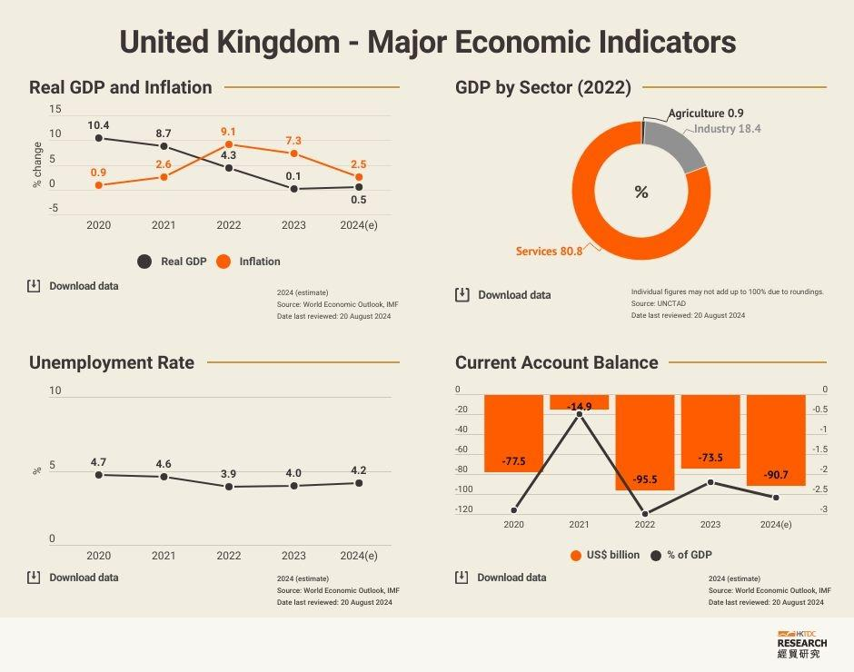

The UK economy relies on a complex network of indicators and metrics, vital for guiding decisions in both government policy and business strategy. Among these indicators, Gross Domestic Product (GDP), inflation rates, and employment statistics stand out as key measures of economic health. GDP reflects the total economic output and provides insight into the overall economic performance. Inflation, primarily measured by the Consumer Prices Index (CPI), offers a snapshot of purchasing power and cost of living, essential for evaluating price stability. Meanwhile, employment levels serve as a barometer for labor market conditions, influencing consumer confidence and spending.

In recent years, the financial landscape has significantly evolved with the advent of algorithmic trading. This method, which uses pre-programmed instructions to execute trades, often at high speeds and volumes, has become a major force in global financial markets. Algorithmic trading strategies are increasingly informed by economic indicators such as GDP and inflation, highlighting the interplay between economic data and trading practices.



This article aims to explore how these critical economic indicators influence algorithmic trading in the UK. Understanding this relationship is crucial for both policymakers, who strive to maintain economic stability, and investors, who seek to capitalize on market dynamics. The integration of algorithmic trading with economic indicators presents both challenges and opportunities, making it imperative for stakeholders to comprehend these connections to navigate the financial landscape effectively.

## Table of Contents

## Key Economic Indicators in the UK

The UK economy relies on a series of key indicators to assess its performance and guide policy decisions. Among these, Gross Domestic Product (GDP) is foremost, serving as the principal measure of economic health by quantifying total economic output. It encapsulates the aggregate value of all goods and services produced within a country during a specified period, typically a year or a quarter. Understanding GDP trends is vital for determining growth rates and for comparing economic performance across different periods and economies.

Inflation is another crucial economic indicator, gauged primarily through the Consumer Prices Index (CPI). The CPI tracks changes in the price level of a basket of consumer goods and services, reflecting the cost of living and the purchasing power of the currency. Central banks, including the Bank of England, closely monitor CPI as it influences monetary policy decisions aimed at achieving price stability.

Labor market statistics provide insight into economic vitality and consumer sentiment. Key data points include unemployment rates, which measure the percentage of the labor force that is jobless and seeking employment, and average earnings, which indicate wage growth and consumer spending potential. High employment levels typically signal robust economic health, while rising wages can drive inflationary pressures.

Interest rates, determined by the Bank of England's monetary policy, wield significant influence over economic activity. They affect borrowing costs, investment decisions, and consumer spending. Adjustments in interest rates are tools used to control inflation, stimulate economic growth, or curb economic overheating.

Public finances encompass government expenditure and borrowing patterns, reflecting the fiscal health of the nation. Government spending supports various sectors and services, contributing to economic stability and growth. Conversely, high levels of government borrowing may indicate fiscal challenges, necessitating policy interventions to ensure sustainable economic management.

Together, these economic indicators offer a comprehensive overview of the UK's economic performance, guiding policymakers and investors in their decision-making processes. Understanding the interplay between these metrics is essential for anticipating economic trends and for formulating strategies that align with economic realities.

## Algorithmic Trading and Its Impact

Algorithmic trading, often synonymous with high-frequency trading, utilizes computer programs to execute a large number of trades in financial markets. These algorithms follow predefined criteria, which can include timing, price, and the quantity of orders, leveraging the speed and processing power of modern computers to identify opportunities with minimal human intervention.

The proliferation of [algorithmic trading](/wiki/algorithmic-trading) has fundamentally altered the landscape of financial markets. Traditional barriers such as distance and time have been reduced, enhancing market efficiency. This proliferation leads to increased trade volumes and improved market [liquidity](/wiki/liquidity-risk-premium), allowing for quicker transaction times and tighter bid-ask spreads. However, this increase in trades also introduces the potential for heightened [volatility](/wiki/volatility-trading-strategies), as algorithms rapidly respond to market stimuli.

Economic indicators such as Gross Domestic Product (GDP) and inflation are central to the decision-making processes embedded within these trading algorithms. GDP growth rates serve as indicators of economic health, influencing market sentiment and guiding investment strategies. For instance, robust GDP growth might prompt algorithms to favor equities, anticipating increased corporate profits. Inflation data, typically derived from the Consumer Prices Index (CPI), impacts [interest rate](/wiki/interest-rate-trading-strategies) expectations and bond pricing, steering algorithmic adjustments in fixed-income portfolios.

Algorithmic platforms exhibit the capability to swiftly process and react to economic data releases, a critical [factor](/wiki/factor-investing) in current financial environments. When economic indicators are released, the rapid interpretation and subsequent action by algorithms can lead to significant shifts in market liquidity. For example, an unexpected GDP announcement might cause substantial price movements as algorithms automatically execute trades based on pre-established strategies. This swift reactivity can both stabilize markets by reducing price discrepancies and amplify volatility through reinforcing directional price movements.

The relationship between economic indicators and algorithmic trading offers distinct advantages and potential drawbacks for investors. On one hand, the integration of economic data into algorithmic models provides the opportunity for improved decision-making and risk management, as algorithms can adapt quickly to new information. On the other hand, this reliance on algorithms can pose risks, particularly if the models misinterpret data or if multiple algorithms simultaneously react to news, leading to unintended market consequences such as flash crashes.

In summary, the dynamic interaction between algorithmic trading and economic indicators is reshaping the financial markets. This shift presents both opportunities for strategic advancement and challenges in managing potential market instability, underscoring the importance for investors to comprehend the implications of algorithmically-driven trading strategies.

## The Influence of UK Economic Indicators on Algorithmic Trading Strategies

Economic data releases are fundamental components shaping algorithmic trading strategies in the UK. These data points give insight into the macroeconomic environment, allowing algorithms to adjust and respond to market conditions. Among these, GDP growth rates and inflation reports are pivotal. GDP figures indicate the overall economic performance and health, directly impacting investor confidence and market forecasts. Algorithms analyze these figures to fine-tune their trading positions, often relying on historical data correlation and predictive analytics to estimate future trends.

Interest rates, primarily dictated by the Bank of England, serve as a powerful economic indicator influencing algorithmic trading strategies. When interest rates change, it signals shifts in borrowing costs and consumer spending power. Algorithms are programmed to adjust their portfolios instantly to these changes, optimizing asset allocation in line with anticipated economic impacts. For instance, a rise in interest rates typically leads to a stronger currency due to increased foreign investment attracted by higher returns, prompting algorithmic models to adjust foreign exchange trades accordingly.

Public finance data, including government tax policies and spending programs, also play a crucial role in forming trading strategies. These factors affect overall market sentiment and the economic outlook, leading algorithms to adjust the weight of sector-based investments. Changes in tax rates can alter disposable income and corporate profitability, thereby influencing stock valuations and trading volumes.

Retail sales numbers provide valuable insight into consumer behavior and economic [momentum](/wiki/momentum). Strong retail sales suggest robust consumer demand, encouraging algorithms to explore consumer-focused trading strategies, particularly in sectors like retail and consumer goods. Predictive models within algorithms frequently utilize [machine learning](/wiki/machine-learning) to forecast retail performance based on seasonal trends and historical data.

Lastly, the balance of trade significantly impacts currency markets. A surplus indicates stronger national currency potential, as it reflects higher foreign demand for domestic goods and services. Algorithms engaged in currency trading monitor trade balance reports to anticipate currency movements. The data informs models to execute trades that capitalize on identified trends, optimizing returns through currency appreciations or depreciations.

By integrating these economic indicators into their decision models, algorithmic trading systems can effectively navigate the complexities of financial markets, maximizing opportunities while managing risks associated with fluctuating economic conditions. This systematic approach ensures that trading strategies are aligned with the latest economic realities, offering investors a sophisticated means to enhance decision-making and capitalize on emerging market dynamics.

## Challenges and Opportunities

Algorithmic trading brings the advantage of rapid decision-making, critical in the fast-paced financial markets. However, it also poses significant challenges, particularly concerning market stability during periods of economic uncertainty. The speed and [volume](/wiki/volume-trading-strategy) associated with algorithmic trading can amplify market fluctuations, potentially leading to excessive volatility. 

Regulation plays a vital role in mitigating these risks. Ensuring that algorithmic trading does not destabilize markets is a priority for financial regulators. The Financial Conduct Authority (FCA) in the UK, alongside other global regulatory bodies, establishes guidelines to ensure fairness and transparency. The implementation of measures such as circuit breakers and enhanced monitoring systems are examples of regulatory interventions designed to maintain market integrity in the face of rapid algorithmic trades.

Understanding the influence of economic indicators on algorithmic trading models is critical for investors aiming to leverage these strategies effectively. Economic indicators such as GDP, inflation, and employment [statistics](/wiki/bayesian-statistics) provide a foundation for predictive trading algorithms, influencing decisions about asset allocation and risk management. By aligning trading strategies with anticipated economic trends, investors can improve their decision-making processes.

Opportunities abound in utilizing big data and [artificial intelligence](/wiki/ai-artificial-intelligence) to refine algorithmic trading approaches. The integration of machine learning algorithms can enhance the accuracy of predictive models, allowing for more informed trading decisions. For instance, machine learning techniques such as [reinforcement learning](/wiki/reinforcement-learning) can optimize trading strategies by continually learning from market data and adjusting methods in real time. A Python implementation of a simple reinforcement learning algorithm might look like this:

```python
import numpy as np

class SimpleTradingAgent:
    def __init__(self, n_actions):
        self.n_actions = n_actions
        self.q_table = np.zeros((1, n_actions))

    def choose_action(self, epsilon):
        if np.random.rand() < epsilon:
            return np.random.choice(self.n_actions)
        else:
            return np.argmax(self.q_table)

    def update_q_value(self, action, reward, alpha, gamma):
        best_future_q = np.max(self.q_table)
        self.q_table[action] += alpha * (reward + gamma * best_future_q - self.q_table[action])

# Example usage
agent = SimpleTradingAgent(n_actions=3)
epsilon, alpha, gamma = 0.1, 0.01, 0.9
action = agent.choose_action(epsilon)
agent.update_q_value(action, reward=1, alpha=alpha, gamma=gamma)
```

Additionally, constant monitoring of both economic indicators and trading performance is necessary to optimize outcomes. Continual assessment allows traders to adapt strategies to current market conditions, resulting in improved performance and risk management. With the dynamic nature of global economies, the ability to pivot quickly in response to new data is a significant advantage.

In summary, while algorithmic trading presents challenges, particularly concerning market volatility and regulation, it also offers substantial opportunities for those who understand how to harness its capabilities effectively. By integrating advanced technologies and maintaining a vigilant approach to economic conditions, investors can optimize their strategies and achieve favorable outcomes in the financial markets.

## Conclusion

The interplay between UK economic indicators and algorithmic trading is a defining feature of modern financial markets. As the economic landscape evolves, algorithmic trading offers both opportunities and challenges for market participants. These systems are designed to leverage real-time data, including key economic indicators like GDP, inflation, and interest rates, to make rapid trading decisions that can significantly impact market dynamics.

Understanding the connection between these economic indicators and trading strategies allows investors to make more informed decisions. For instance, algorithms that effectively incorporate economic data can adjust automatically to market changes, optimizing returns and managing risks. By aligning decision-making processes with indicators such as employment levels or public finances, traders and investors can better predict market movements and adjust their strategies accordingly.

Future advancements in technology, such as the integration of artificial intelligence and machine learning, are expected to further influence the dynamics of the UK economy and investment strategies. These technologies can enhance the abilities of algorithmic systems to analyze complex data sets and identify patterns more efficiently. As these technological capabilities improve, the potential for more sophisticated and adaptive trading strategies will increase.

Therefore, staying informed and adaptable is crucial for leveraging the benefits of algorithmic trading within the context of economic indicators. As the financial landscape becomes more complex, continuous monitoring and adaptation are vital for optimizing trading performance. Ensuring that investors and policymakers are equipped with a thorough understanding of how economic indicators influence algorithmic trading will enable them to navigate the ever-changing financial markets effectively.

## References & Further Reading

[1]: Organisation for Economic Co-operation and Development (OECD). ["United Kingdom Economic Snapshot"](https://www.oecd.org/en/topics/sub-issues/economic-surveys/united-kingdom-economic-snapshot.html) Retrieved 2023.

[2]: "Algorithmic Trading: Winning Strategies and Their Rationale" by Ernie Chan, published by Wiley.

[3]: Bank of England. ["Monetary Policy Report"](https://www.bankofengland.co.uk/monetary-policy-report/monetary-policy-report), various issues.

[4]: "Advances in Financial Machine Learning" by Marcos Lopez de Prado, published by Wiley.

[5]: "Macroeconomics" by N. Gregory Mankiw, which covers economic indicators like GDP and inflation in detail.

[6]: London School of Economics and Political Science. ["Research on Automation and Algorithmic Trading"](https://www.lse.ac.uk/) covering various aspects of financial markets. 

[7]: Financial Conduct Authority. ["High-Frequency Trading: Overview and Implications"](https://www.fca.org.uk/news/speeches/regulating-high-frequency-trading) 

[8]: "Quantitative Trading: How to Build Your Own Algorithmic Trading Business" by Ernest P. Chan, which discusses economic indicators in trading strategies.