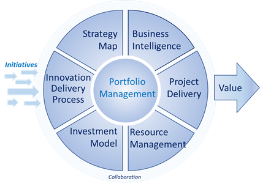

## Table of Contents

## What is portfolio management and why is it important?

Portfolio management is the process of managing a collection of investments, like stocks, bonds, and other assets, to meet specific financial goals. It involves deciding which investments to buy, when to buy them, and when to sell them. The goal is to balance risk and return to help grow wealth over time. A well-managed portfolio can help someone save for things like retirement, buying a house, or funding education.

It's important because it helps people make the most of their money. By spreading investments across different types of assets, portfolio management reduces the risk of losing money if one investment does poorly. This is called diversification. It also allows people to adjust their investments as their financial goals or life situations change. For example, someone might start with riskier investments when they are young and switch to safer ones as they get closer to retirement. Overall, good portfolio management can lead to better financial security and peace of mind.

## What are the basic components of a portfolio?

A portfolio is made up of different types of investments, like stocks, bonds, and cash. Stocks are pieces of ownership in a company. When you buy a stock, you hope the company does well and the stock price goes up. Bonds are loans you give to a company or government. They pay you back with interest over time. Cash in a portfolio can be money in a savings account or money market fund, which is safe but doesn't grow much.

These components work together to help reach financial goals. Stocks can grow a lot but are riskier. Bonds are safer but grow slower. Cash is the safest but grows the least. By mixing these, a portfolio can balance risk and reward. For example, a young person might have more stocks for growth, while someone close to retirement might have more bonds and cash for safety. This mix is called asset allocation, and it's key to good portfolio management.

## How do you set investment goals for a portfolio?

Setting investment goals for a portfolio starts with thinking about what you want to achieve with your money. Do you want to save for retirement, buy a house, or pay for your kids' education? Each goal might need a different plan. For example, if you're saving for a house you might want to grow your money quickly, but if you're close to retirement, you might want to keep your money safe. You also need to think about how long you have to reach your goals. The more time you have, the more risk you might be willing to take because you have more time to recover from any losses.

Once you know your goals and timeline, you can decide how much risk you're okay with. If you're scared of losing money, you might choose safer investments like bonds. If you're okay with more risk, you might choose stocks. Your age, how much money you can lose, and how much you know about investing also matter. It's a good idea to write down your goals and check them every now and then to make sure your portfolio is still on track. As your life changes, your goals might change too, so it's important to keep your portfolio updated.

## What is asset allocation and how does it work in portfolio management?

Asset allocation is about deciding how to spread your money across different types of investments, like stocks, bonds, and cash. It's a big part of managing a portfolio because it helps balance risk and reward. If you put all your money in one type of investment, you could lose a lot if that investment does badly. But if you spread your money out, you're less likely to lose everything all at once. This is called diversification, and it's a key idea in asset allocation.

How you choose to allocate your assets depends on your goals, how long you have to reach them, and how much risk you're willing to take. For example, if you're young and saving for retirement, you might put more money in stocks because they can grow a lot over time, even though they're riskier. But if you're close to retiring, you might put more money in bonds and cash because they're safer. Your asset allocation should change as your life changes, so it's important to check and adjust your portfolio now and then to make sure it still fits your goals.

## How do you assess and manage risk in a portfolio?

Assessing and managing risk in a portfolio starts with understanding what risk means to you. Risk is the chance that you might lose money on your investments. To figure out how much risk you're okay with, think about your financial goals, how long you have to reach them, and how much money you can afford to lose. For example, if you're saving for something important like buying a house soon, you might not want to take big risks. But if you're saving for retirement that's many years away, you might be okay with more risk because you have time to recover from any losses.

Once you know your risk level, you can manage it by spreading your investments across different types of assets. This is called diversification. If you put all your money in one stock and it goes down, you could lose a lot. But if you spread your money across many stocks, bonds, and cash, a drop in one won't hurt as much. You should also keep an eye on your portfolio and adjust it as needed. If your investments are doing better or worse than expected, or if your life changes, you might need to change your mix of investments to keep your risk at a level you're comfortable with. Regular check-ups help make sure your portfolio is still on track to meet your goals.

## What are the different types of investment vehicles used in portfolios?

Investment vehicles are the different ways you can invest your money in a portfolio. Some common types include stocks, which are pieces of ownership in a company. When you buy a stock, you hope the company does well and the stock price goes up. Bonds are another type, which are like loans you give to a company or government. They pay you back with interest over time. Mutual funds are a way to invest in a mix of stocks, bonds, or other assets all at once. They are managed by professionals who choose the investments for you. Exchange-traded funds (ETFs) are similar to mutual funds but can be traded like stocks during the day.

Real estate can also be part of a portfolio, where you invest in property that you hope will grow in value or earn rental income. Commodities like gold or oil are another type of investment that can be added to a portfolio. They can help protect against inflation or other economic changes. Finally, cash and cash equivalents, like money in a savings account or money market fund, are the safest but don't grow much. Each type of investment vehicle has its own level of risk and reward, and choosing the right mix helps balance your portfolio to meet your financial goals.

## How can diversification benefit a portfolio?

Diversification means spreading your money across different types of investments. It's like not putting all your eggs in one basket. If you only invest in one thing and it does badly, you could lose a lot of money. But if you spread your money out, a drop in one investment won't hurt as much because other investments might still be doing well. This can help keep your portfolio safer and more stable.

By having a mix of stocks, bonds, and other investments, you can balance risk and reward. Stocks can grow a lot but are riskier. Bonds are safer but grow slower. If you have both, you can still grow your money while keeping some safety. Over time, this can lead to better returns because you're not as likely to lose everything if one part of the market goes down. Diversification helps you reach your financial goals more smoothly and with less worry.

## What role does rebalancing play in portfolio management?

Rebalancing is like giving your portfolio a check-up and making sure it's still on track with your goals. Over time, some of your investments might grow faster than others, so your mix of stocks, bonds, and other assets can change. If you started with 60% stocks and 40% bonds, it might turn into 70% stocks and 30% bonds if stocks do well. Rebalancing means selling some of the stocks that grew a lot and buying more bonds to get back to your original mix. This helps keep your risk level where you want it.

It's important to rebalance because it keeps your portfolio in line with how much risk you're okay with. If you don't rebalance, your portfolio might get too risky or too safe without you realizing it. By checking and adjusting your investments regularly, you can make sure they still fit your goals and how long you have to reach them. Rebalancing helps you stay on track and feel more confident about your financial future.

## How do you evaluate the performance of a portfolio?

Evaluating the performance of a portfolio means checking how well your investments are doing. You look at how much your portfolio has grown or shrunk over time. One way to do this is by comparing your portfolio's returns to a benchmark, like a stock market index. If your portfolio did better than the benchmark, that's a good sign. You also want to see if your portfolio is helping you reach your financial goals. If you're saving for a house and your portfolio is growing, you're on the right track.

Another important part of evaluating your portfolio is looking at the risk you're taking. You want to see if the risk you're taking is worth the reward you're getting. If your portfolio is growing a lot but you're losing sleep over it because it's too risky, you might need to change things. It's also good to check if your investments are doing what you expected them to do. If some investments are not performing well, you might need to sell them and buy others that fit your goals better. Regular check-ups help you keep your portfolio working for you.

## What advanced strategies can be used to optimize a portfolio?

One advanced strategy to optimize a portfolio is called tax-loss harvesting. This means selling investments that have lost value to offset gains from other investments. By doing this, you can lower your taxes, which helps your portfolio grow faster. Another strategy is using options and futures. These are like bets on how investments will do in the future. They can help protect your portfolio from big drops or make more money if things go well. But they're tricky and can be risky, so it's important to know what you're doing or get help from a pro.

Another way to optimize a portfolio is by using [factor](/wiki/factor-investing) investing. This means [picking](/wiki/asset-class-picking) investments based on things like size, value, or how much they move with the market. By focusing on these factors, you can try to beat the market. You can also use tactical asset allocation, which means changing your mix of investments based on what's happening in the economy or markets. This can help you take advantage of opportunities or avoid risks. All these strategies need a lot of research and understanding, so it's good to learn a lot or work with someone who knows a lot about investing.

## How do regulatory and tax considerations affect portfolio management?

Regulatory and tax considerations play a big role in how you manage your portfolio. Different countries have different rules about what you can and can't do with your investments. These rules can affect what kinds of investments you choose and how you manage them. For example, some investments might be off-limits or need special permission. Knowing the rules helps you stay out of trouble and make smart choices. If you break the rules, you could get in big trouble or lose money, so it's important to pay attention to them.

Taxes also have a big impact on your portfolio. Different investments are taxed differently. Some, like stocks, might be taxed when you sell them if you make a profit. Others, like certain bonds, might be taxed differently or not at all. You can use strategies like tax-loss harvesting to lower your taxes. This means selling investments that have lost value to offset gains from other investments. By thinking about taxes, you can keep more of your money and help your portfolio grow faster. It's a good idea to talk to a tax expert to make sure you're doing everything right and taking advantage of all the tax breaks you can.

## What are the latest trends and technologies impacting portfolio management?

One of the latest trends in portfolio management is the use of [artificial intelligence](/wiki/ai-artificial-intelligence) (AI) and [machine learning](/wiki/machine-learning). These technologies help investors make better decisions by analyzing huge amounts of data quickly. They can look at things like stock prices, news, and even social media to find patterns and predict what might happen next. This can help pick the best investments and manage risk better. Robo-advisors are a good example of this. They use AI to create and manage portfolios for people automatically, making investing easier and cheaper.

Another big trend is the focus on environmental, social, and governance ([ESG](/wiki/esg-investing)) factors. More and more investors want to put their money in companies that are good for the planet and society. This means looking at things like a company's impact on the environment, how they treat their workers, and how well they're run. ESG investing can help make the world a better place while still making money. Technology also helps with this by making it easier to find and track ESG data, so investors can make smarter choices.

Lastly, blockchain technology is starting to change how investments are made and managed. Blockchain is a secure way to keep track of transactions and ownership. It can make buying and selling investments faster and safer. Some people are even using blockchain to create new kinds of investments, like cryptocurrencies and tokenized assets. These new options can add more variety to a portfolio and help it grow in different ways. As technology keeps getting better, it will keep changing how we manage our money.

## What are some effective investment strategies?

Investment strategies are systematic plans designed to align financial goals with an individual's risk tolerance. These strategies range from aggressive approaches, which seek high returns, to conservative ones focused on capital preservation. The core objective is to optimize investment outcomes by carefully considering the interplay between risk and reward.

To construct a successful investment strategy, it is crucial to understand the investor's unique goals and the prevailing market conditions. This understanding ensures that investments are planned effectively, balancing potential returns against acceptable levels of risk. For example, an aggressive strategy might allocate a larger portion of assets to high-risk stocks with the prospect of significant returns, while a conservative strategy may prioritize stable, income-generating assets like government bonds or blue-chip stocks.

Key to developing an effective strategy is the use of quantitative assessments to optimize asset allocation and maximize returns. This involves techniques such as Modern Portfolio Theory (MPT), which suggests that an optimal portfolio can be constructed by balancing the expected return against the level of risk, mathematically expressed as:

$$

E(R_p) = \sum_{i=1}^{n} w_i E(R_i)
$$

where $E(R_p)$ is the expected return of the portfolio, $w_i$ is the proportion of the portfolio invested in asset $i$, and $E(R_i)$ is the expected return of asset $i$.

Additionally, the [volatility](/wiki/volatility-trading-strategies) of the portfolio is minimized by finding a combination of assets that have low correlations with each other. This diversification reduces unsystematic risk, potentially optimizing the portfolio performance without a corresponding increase in risk.

Deciding on the appropriate investment strategy also involves considering factors such as time horizon, market conditions, and personal risk tolerance. Time horizon plays a pivotal role: longer investment horizons typically allow for more aggressive strategies due to the extended period available to recover from market volatility. Market conditions can shift the balance between risk and return, requiring adaptive strategies to maintain effectiveness.

Overall, aligning individual financial goals with market realities through strategic planning allows investors to pursue their desired financial outcomes confidently. By leveraging quantitative assessments and adjusting for personal preferences and market shifts, investors can enhance their potential for achieving financial success.

## References & Further Reading

[1]: Burton G. Malkiel. (2019). ["A Random Walk Down Wall Street: The Time-Tested Strategy for Successful Investing"](https://www.amazon.com/Random-Walk-Down-Wall-Street/dp/1324002182). W. W. Norton & Company.

[2]: Bodie, Zvi, Kane, Alex, & Marcus, Alan J. (2014). ["Investments"](https://books.google.com/books/about/EBOOK_Investments_Global_edition.html?id=BMsvEAAAQBAJ). McGraw-Hill Education.

[3]: Marcos López de Prado. (2018). ["Advances in Financial Machine Learning"](https://www.amazon.com/Advances-Financial-Machine-Learning-Marcos/dp/1119482089). Wiley.

[4]: Ernest P. Chan. (2008). ["Quantitative Trading: How to Build Your Own Algorithmic Trading Business"](https://www.amazon.com/Quantitative-Trading-Build-Algorithmic-Business/dp/0470284889). Wiley.

[5]: Stefan Jansen. (2018). ["Machine Learning for Algorithmic Trading: Predictive models to extract signals from market and alternative data for systematic trading strategies with Python"](https://github.com/stefan-jansen/machine-learning-for-trading). Packt Publishing.

[6]: David G. Luenberger. (2014). ["Investment Science"](https://www.amazon.com/Investment-Science-David-G-Luenberger/dp/0199740089). Oxford University Press.