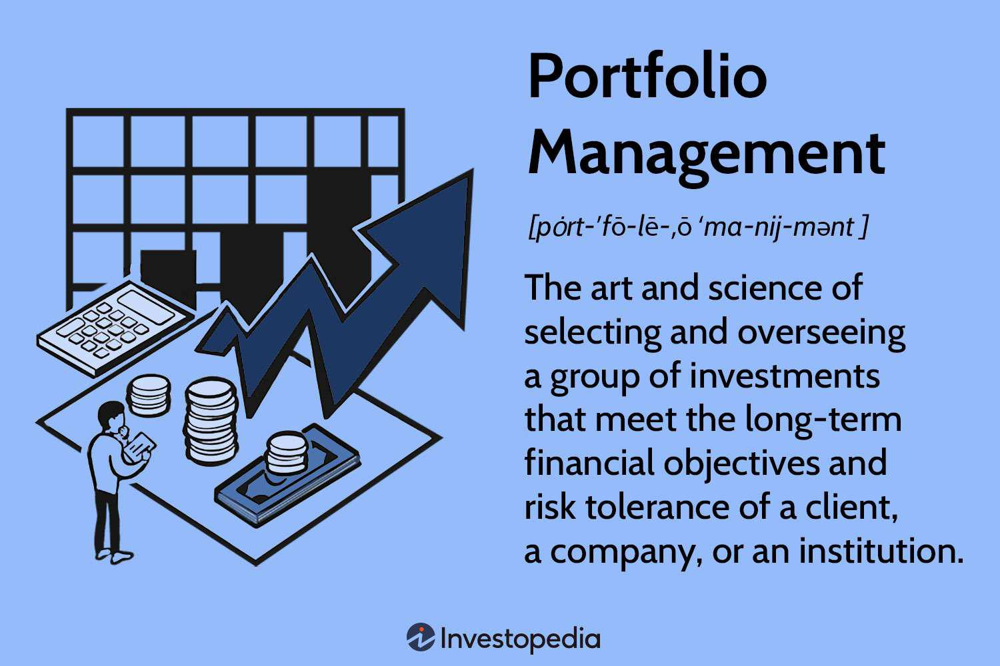

Financial markets have undergone a remarkable transformation, propelled by technological advancements that have enhanced investment strategies and portfolio management processes. These developments have revolutionized the way investors approach financial planning, creating new opportunities and complexities in wealth management. This article examines the essential elements of constructing a robust financial planning framework, focusing on investment strategy formulation, portfolio management, and the integration of algorithmic trading.

Investment strategies are crucial in achieving financial objectives, as they provide tailored plans that align with an individual's risk tolerance and financial goals. With the growing complexity of financial markets, understanding the nuances of both aggressive and conservative strategies is imperative for effective investment planning.



Portfolio management, another critical aspect, involves the meticulous process of selecting and continuously overseeing a mix of investments to meet specific objectives. The operational aspects of balancing risk and reward through asset allocation are pivotal in ensuring long-term financial stability and growth. This requires a dynamic approach to monitoring market conditions and adjusting portfolios accordingly, whether through active or passive management techniques.

Algorithmic trading has introduced significant technological advantages, offering a level of speed and precision in executing trades previously unattainable through manual processes. By harnessing computer algorithms to automate trading decisions, investors can minimize emotional biases and maximize efficiency. This technological edge provides an important tool in managing investment portfolios and optimizing financial outcomes.

Together, these components create a framework that enhances an investor's ability to manage wealth with greater efficacy. Understanding how to integrate these multifaceted elements can lead to more informed decision-making and optimized financial results. The goal is to provide insights into crafting a holistic strategy that leverages technology and strategic planning to achieve superior financial outcomes.

## Table of Contents

## Investment Strategies

Investment strategies are systematic plans designed to align financial goals with an individual's risk tolerance. These strategies range from aggressive approaches, which seek high returns, to conservative ones focused on capital preservation. The core objective is to optimize investment outcomes by carefully considering the interplay between risk and reward.

To construct a successful investment strategy, it is crucial to understand the investor's unique goals and the prevailing market conditions. This understanding ensures that investments are planned effectively, balancing potential returns against acceptable levels of risk. For example, an aggressive strategy might allocate a larger portion of assets to high-risk stocks with the prospect of significant returns, while a conservative strategy may prioritize stable, income-generating assets like government bonds or blue-chip stocks.

Key to developing an effective strategy is the use of quantitative assessments to optimize asset allocation and maximize returns. This involves techniques such as Modern Portfolio Theory (MPT), which suggests that an optimal portfolio can be constructed by balancing the expected return against the level of risk, mathematically expressed as:

$$

E(R_p) = \sum_{i=1}^{n} w_i E(R_i)
$$

where $E(R_p)$ is the expected return of the portfolio, $w_i$ is the proportion of the portfolio invested in asset $i$, and $E(R_i)$ is the expected return of asset $i$.

Additionally, the [volatility](/wiki/volatility-trading-strategies) of the portfolio is minimized by finding a combination of assets that have low correlations with each other. This diversification reduces unsystematic risk, potentially optimizing the portfolio performance without a corresponding increase in risk.

Deciding on the appropriate investment strategy also involves considering factors such as time horizon, market conditions, and personal risk tolerance. Time horizon plays a pivotal role: longer investment horizons typically allow for more aggressive strategies due to the extended period available to recover from market volatility. Market conditions can shift the balance between risk and return, requiring adaptive strategies to maintain effectiveness.

Overall, aligning individual financial goals with market realities through strategic planning allows investors to pursue their desired financial outcomes confidently. By leveraging quantitative assessments and adjusting for personal preferences and market shifts, investors can enhance their potential for achieving financial success.

## Financial Planning

Financial planning serves as a foundational roadmap to attaining long-term financial security by incorporating key elements such as budgeting, saving, investing, and risk management. This comprehensive process begins with the critical step of setting clear financial objectives. These objectives might encompass short-term goals like setting aside an emergency fund or long-term aspirations such as retirement savings. The selection of these goals establishes the groundwork for formulating an effective financial plan.

Strategizing for future investments involves evaluating a range of investment opportunities to grow wealth over time. This requires an understanding of the risk-return trade-off and diversification strategies to balance potential risks and rewards. The implementation of disciplined saving habits constitutes another vital component, promoting consistent asset accumulation. Additionally, budgeting nuances play a pivotal role in ensuring a controlled cash flow, striving to maximize savings without compromising on essential expenditures.

An effective financial plan also incorporates risk management tactics to safeguard against potential financial setbacks. This includes the utilization of insurance products and the creation of contingency funds, aiming to mitigate risks such as job loss or unforeseen large expenses. Aligning financial resources with personal goals involves a continuous assessment of financial health, requiring periodic reviews and adjustments to the plan as life circumstances and market conditions evolve.

Incorporating disciplined strategies within financial planning leads to optimized financial outcomes, as it creates a structured path for resource allocation. This ensures that financial goals remain attainable, even amidst changing economic environments. Through the orchestration of these elements, financial planning minimizes risks and guides individuals along their financial journey, ultimately enhancing the probability of achieving financial independence and security.

Overall, the careful integration of budgeting, saving, investing, and risk management within a financial plan aids in aligning resources with personal aspirations, allowing for a strategic approach toward wealth accumulation and financial resilience.

## Portfolio Management

Portfolio management is integral to achieving long-term financial objectives while managing risk. This multifaceted process involves selecting and overseeing a diverse mix of investments to accommodate the unique goals and risk profiles of individual investors or institutions. Central to this process are core activities like asset allocation, diversification, and periodic rebalancing, each instrumental in maintaining a portfolio's alignment with specific financial goals.

Asset allocation is the foundation of portfolio management, involving distributing investments across various asset classes such as equities, bonds, and cash. The goal is to balance risk and return by allocating resources efficiently based on the investor's risk tolerance and market conditions. The allocation decision is critical; historically, as suggested by the modern portfolio theory formulated by Harry Markowitz, diversification can significantly reduce the risk of financial portfolios by spreading investments across uncorrelated assets.

Diversification further bolsters risk management by spreading investments within asset classes to mitigate the impact of any single asset's poor performance. This strategy is driven by the principle that a well-diversified portfolio can achieve a more stable return than one concentrated in a limited number of assets. For example, an equity portfolio might include stocks from various sectors such as technology, healthcare, and finance, reducing sector-specific risks.

Periodic rebalancing is another essential activity in portfolio management. Over time, market fluctuations can cause the asset distribution to drift from its target allocation. Rebalancing involves realigning the portfolio's asset mix back to its original state or to a newly defined strategic allocation. This practice ensures the portfolio’s risk level remains consistent with the investor's expectations. It often involves selling high-performing assets and buying underperforming ones, which can be counterintuitive but is necessary for maintaining the desired risk-return profile.

The portfolio management process can adopt either active or passive strategies, each with distinct objectives and methodologies. Active portfolio management aims to outperform market indices through tactical decision-making, rigorous research, and continuous monitoring. Active managers seek to capitalize on market inefficiencies by making timely buy or sell decisions based on in-depth analysis and predictions of future market movements. This approach can potentially yield higher returns but often comes with higher costs and increased risk.

Conversely, passive portfolio management seeks to replicate the performance of specific market indices, such as the S&P 500, through minimal intervention. This strategy often involves investing in index funds or exchange-traded funds (ETFs) designed to closely follow the index components. The primary advantage of passive management is its cost-effectiveness and reduced complexity, thanks to lower transaction fees and a buy-and-hold investment philosophy.

Adjusting for market dynamics forms an essential practice in maintaining alignment with an investor’s goals. This adaptability ensures that the portfolio responds effectively to economic changes, [interest rate](/wiki/interest-rate-trading-strategies) shifts, and geopolitical events that could impact asset prices. Such flexibility is especially critical in volatile markets, where timely adjustments can help protect wealth and capitalize on emerging opportunities.

In conclusion, effective portfolio management, through diligent asset allocation, diversification, rebalancing, and strategic choice between active and passive approaches, provides a structured pathway for investors to achieve their long-term financial objectives while prudently managing risk.

## Algorithmic Trading

Algorithmic trading leverages advanced computer algorithms to automate and execute trading decisions with unparalleled speed and precision, often exceeding human capability. At its core, [algorithmic trading](/wiki/algorithmic-trading) employs complex mathematical models and statistical analysis to analyze massive datasets, identify trading opportunities, and execute transactions in fractions of a second. This automated process minimizes human intervention, thereby enhancing operational efficiency and reducing the impact of emotional biases that often cloud judgment in traditional trading practices.

Algorithms operate based on predefined strategies, which are meticulously crafted to meet specific trading objectives such as [market making](/wiki/market-making), [arbitrage](/wiki/arbitrage), or [trend following](/wiki/trend-following). These strategies enable traders to participate in the market rapidly and systematically by following rules encoded within the trading algorithms. For instance, a simple moving average crossover strategy might be implemented in Python as follows:

```python
def moving_average(prices, window_size):
    """Calculate the moving average over a specified window size."""
    return np.convolve(prices, np.ones(window_size)/window_size, mode='valid')

def trading_strategy(prices, short_window, long_window):
    """Generate buy/sell signals based on moving average crossovers."""
    short_mavg = moving_average(prices, short_window)
    long_mavg = moving_average(prices, long_window)

    signals = np.where(short_mavg > long_mavg, 1, 0)  # 1 for buy, 0 for sell
    return np.diff(signals)

prices = np.random.random(1000)  # hypothetical price series
signals = trading_strategy(prices, 50, 200)
```

The advantages of algorithmic trading are manifold. It ensures consistency in trading strategies by eliminating the inconsistency of human decision-making and executing trades at optimal prices. The high-frequency trading subset of algorithmic trading exploits minute price discrepancies across markets, providing [liquidity](/wiki/liquidity-risk-premium) and refining price efficiency.

Despite its advantages, algorithmic trading faces several challenges. Market volatility can lead to liquidity shortages, impacting trade execution. Algorithmic trading systems are also susceptible to technical failures, such as latency issues, network outages, or incorrect algorithm logic, which can lead to substantial losses. Moreover, the market impact of automated strategies can sometimes amplify price volatility, necessitating robust risk management protocols.

In summary, algorithmic trading exemplifies the convergence of technology and finance, offering enhanced trading speed, precision, and efficiency. However, its complexities require sophisticated infrastructure and rigorous oversight to mitigate inherent challenges and optimize its potential benefits.

## Integration and Synergy

Integrating investment strategies, financial planning, portfolio management, and algorithmic trading establishes a robust framework in wealth management. The synchronization of these elements enhances the efficacy of financial decision-making, rendering it both comprehensive and adaptable to varying market conditions. This synergy facilitates a more proactive approach in managing financial assets, optimizing performance, and mitigating potential risks.

Investment strategies provide the foundational basis for aligning financial goals with risk tolerance. They help in defining clear objectives, which are essential for effective financial planning. Financial planning, in turn, acts as the roadmap that guides the execution of these strategies, ensuring that all financial activities remain cohesive and directed towards achieving long-term financial security. By integrating these two components, investors can tailor their approaches to fit personal financial goals and market realities, enhancing their ability to weather financial uncertainties.

Portfolio management is the mechanism through which investment strategies are implemented and monitored. It involves selecting a mix of investments, ongoing assessment, and adjustments based on market changes. Active portfolio management seeks to outperform market benchmarks through regular analysis and rebalancing, while passive management focuses on stabilizing long-term gains. When incorporated with sound financial planning and strategy development, portfolio management strengthens the overall financial framework, providing clarity and focus to investment endeavors.

Algorithmic trading further complements this framework by introducing automation and precision to trading activities. By utilizing computer-based algorithms, algo trading enables quick execution of trades with minimal human intervention, relying on statistical data and pre-defined strategies. This automation reduces the influence of human emotions in trading decisions, facilitating a more data-driven and systematic approach to market participation.

The integration of algorithmic trading into investment strategies and portfolio management not only streamlines the trading process but also enhances the ability to react swiftly to market fluctuations. By leveraging technology, investors can increase their chances of maximizing returns while minimizing risks, thereby achieving more efficient financial outcomes.

The interconnectedness of these components creates an integrated approach that empowers investors to align their financial resources strategically. This strategic alignment ensures that different financial elements work in cohesion, fostering an environment of continuous improvement and adaptation to market dynamics. By combining individual investor goals with a thorough understanding of market conditions and technological advancements, this integration promotes sustained financial success and resilience against market volatility.

## Future Trends

The future of financial planning and investment management is poised for significant transformation through advancements in [artificial intelligence](/wiki/ai-artificial-intelligence) (AI) and [machine learning](/wiki/machine-learning) (ML). These technologies are enhancing precision, efficiency, and personalization within portfolio management and algorithmic trading. By utilizing AI, investment processes benefit from improved data analysis capabilities, enabling the identification of complex patterns within large datasets to optimize strategies and deliver enhanced outcomes.

AI and ML facilitate the automation of decision-making processes, allowing for real-time adjustments influenced by evolving market dynamics. For instance, algorithms can predict shifts in market trends by analyzing historical data and identifying correlations, which can be applied to optimize asset allocation. Python libraries such as TensorFlow or Scikit-learn are commonly used for such data-driven predictive modeling.

```python
import numpy as np
import pandas as pd
from sklearn.model_selection import train_test_split
from sklearn.ensemble import RandomForestRegressor

# Example of using Random Forest for predicting market trends
data = pd.read_csv('market_data.csv')  # Hypothetical dataset

# Features and target variable
X = data.drop('target', axis=1)
y = data['target']

# Splitting the dataset
X_train, X_test, y_train, y_test = train_test_split(X, y, test_size=0.2, random_state=42)

# Model training
model = RandomForestRegressor(n_estimators=100)
model.fit(X_train, y_train)

# Predicting market trends
predictions = model.predict(X_test)
```

The push for technological innovation in finance is expected to drive the development of more sophisticated and accessible financial management tools. Application of AI involves not just predictive analytics, but also the ability to dynamically optimize investment strategies, manage risk, and reduce costs through automation. This trend enhances personalization, whereby investors receive tailored advice and investment solutions that align with their specific financial goals and risk profiles.

In summary, the integration of AI and ML into financial planning is setting the stage for a future where investment decisions are more data-driven and individualized. As these technologies evolve, the financial industry will likely see a substantial increase in the sophistication of tools available to investors, enabling them to better capture opportunities and manage market uncertainties effectively.

## Conclusion

The intricate landscape of finance demands a comprehensive grasp of key components such as investment strategies, financial planning, portfolio management, and algorithmic trading. Aligning these elements is crucial to constructing a robust financial framework that aims to achieve optimal financial outcomes. Each of these components plays a vital role and, when integrated effectively, they enhance the ability to make informed financial decisions.

Investment strategies serve as the foundation, determining how to allocate resources effectively based on individual goals and market conditions. A well-outlined strategy considers risk tolerance, time horizons, and the ever-changing financial environment, setting the stage for further financial planning.

Financial planning acts as a structured roadmap guiding the allocation of resources across budgeting, saving, investing, and risk management to reach long-term objectives. This planning ensures that all financial actions are aligned with personal goals, thereby optimizing outcomes and minimizing risks.

Portfolio management is the ongoing process of overseeing an investment mix to meet specific objectives and maintain an appropriate level of risk. By constantly evaluating and adjusting investment choices, investors ensure their portfolios remain aligned with their broader financial strategies.

Algorithmic trading enhances this framework by utilizing advanced computer algorithms to automate trading decisions, offering speed and precision beyond human capability. This technology reduces emotional biases and allows for rapid market engagement, further refining the financial strategy.

Incorporating these elements into a cohesive financial plan equips investors to navigate the complexities of financial markets with greater strategic acumen. This comprehensive approach increases financial resilience, enabling investors to adjust dynamically to market changes and improve the likelihood of sustained financial success. Embracing this holistic strategy is essential for optimizing financial performance and securing long-term financial stability.

## References & Further Reading

[1]: Burton G. Malkiel. (2019). ["A Random Walk Down Wall Street: The Time-Tested Strategy for Successful Investing"](https://www.amazon.com/Random-Walk-Down-Wall-Street/dp/1324002182). W. W. Norton & Company.

[2]: Bodie, Zvi, Kane, Alex, & Marcus, Alan J. (2014). ["Investments"](https://books.google.com/books/about/EBOOK_Investments_Global_edition.html?id=BMsvEAAAQBAJ). McGraw-Hill Education.

[3]: Marcos López de Prado. (2018). ["Advances in Financial Machine Learning"](https://www.amazon.com/Advances-Financial-Machine-Learning-Marcos/dp/1119482089). Wiley.

[4]: Ernest P. Chan. (2008). ["Quantitative Trading: How to Build Your Own Algorithmic Trading Business"](https://www.amazon.com/Quantitative-Trading-Build-Algorithmic-Business/dp/0470284889). Wiley.

[5]: Stefan Jansen. (2018). ["Machine Learning for Algorithmic Trading: Predictive models to extract signals from market and alternative data for systematic trading strategies with Python"](https://github.com/stefan-jansen/machine-learning-for-trading). Packt Publishing.

[6]: David G. Luenberger. (2014). ["Investment Science"](https://www.amazon.com/Investment-Science-David-G-Luenberger/dp/0199740089). Oxford University Press.