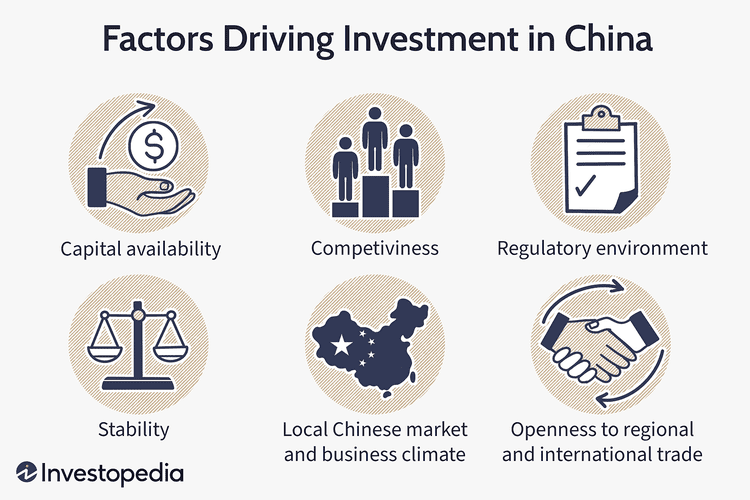

China stands as a pivotal player in the global economy, underscored by its rapid ascent to becoming the world's second-largest economy. Over the past few decades, China's economic evolution has been characterized by a sustained period of high growth rates, transforming it from a primarily agrarian society into a global industrial powerhouse. This transformation is rooted in a series of economic reforms initiated in the late 20th century, which prioritized market-oriented policies, opening up to international trade and investment, and substantial infrastructure development.

Historically, China's economic growth can be attributed to its strategic focus on key economic drivers, including manufacturing, exports, and technology. The country's manufacturing sector, often referred to as "the world's factory," has played a significant role in global supply chains, offering a competitive edge through low production costs and a vast labor force. Additionally, China's export-driven model has facilitated an impressive trade surplus and foreign exchange reserves, further propelling its economic stature on the global stage.

In recent years, China has also embraced technological innovation and advanced sectors, shaping the scope of its economic ambitions. This is where algorithmic trading enters the scene, representing a sophisticated intersection of technology and finance. As China continues to modernize its financial markets, the adoption of algorithmic trading systems has gained momentum. These systems leverage complex mathematical models and algorithms to execute trades at speeds and efficiencies beyond human capability, subsequently enhancing market liquidity and price discovery efficiency.

This article aims to elucidate the intricate interplay between China's economic growth and the rise of algorithmic trading, considering both as complementary forces shaping the nation's financial landscape. Readers can expect to gain insights into the backbone of China's economic expansion, current challenges, and the innovative sectors driving progress. Additionally, the article will explore how algorithmic trading influences China's financial markets and its broader economic implications, providing a comprehensive understanding of these dynamic elements.

## Table of Contents

## The Backbone of China's Economic Growth

China's economic landscape has undergone significant transformation over the past few decades, with several sectors emerging as vital contributors to its Gross Domestic Product (GDP). A closer examination reveals the crucial roles played by exports, manufacturing, and technology, alongside the impact of government policies and reforms, infrastructure development, and urbanization.

### Contribution of Major Sectors to China's GDP

1. **Exports and Manufacturing:**
   Exports have been a central pillar of China's economic growth, often described as the "world's factory." The manufacturing sector, particularly in electronics, textiles, and machinery, has been pivotal. In 2020, China's manufacturing sector accounted for approximately 27% of its GDP, according to the World Bank. The country's ability to produce goods at competitive prices has bolstered its position as the world's leading exporter.

2. **Technology:**
   Technological advancement is another cornerstone of China's economic structure. The technology sector's rise has been fueled by substantial investments in research and development, leading to innovations in various fields such as telecommunications, semiconductors, and information technology. Companies like Huawei, Tencent, and Alibaba have become global leaders, driving not only domestic growth but also expanding China's influence in global technology markets.

### Impact of Government Policies and Reforms

The Chinese government has implemented a series of economic reforms that have significantly impacted economic expansion. Starting with the economic reforms of the late 1970s, which shifted the economy from a centrally planned system to a more market-oriented one, China's policies have continually evolved to support growth. Notable reforms include the modernization of the financial sector, reduction of state monopolies, and facilitation of foreign direct investment. Special Economic Zones (SEZs) have been instrumental in attracting foreign investments, contributing to regional development and export-led growth.

### Infrastructure Developments and Urbanization

Infrastructure development has been a catalyst for economic growth in China. Massive investments in transport networks, such as high-speed railways, expressways, and airports, have enhanced connectivity within the country and with the rest of the world. For instance, China's high-speed rail network, the largest in the world, spans over 37,000 kilometers, facilitating efficient movement of goods and people, thus stimulating economic activities.

Urbanization also plays a pivotal role in China's economic expansion. The rapid shift from rural to urban living has created a large consumer base and boosted domestic consumption. As of 2020, over 60% of China's population resided in urban areas, a significant increase from 26% in 1990. This urban expansion has led to increased demand for housing, services, and infrastructure, further propelling economic growth.

In conclusion, the interplay of robust exports, dynamic manufacturing, and rapid technological advancement, supported by strategic government policies, infrastructure development, and urbanization, forms the backbone of China's impressive economic growth. These elements together have not only contributed to GDP but have also positioned China as a formidable force in the global economy.

## Current Challenges Facing the Chinese Economy

China's economy, a powerhouse that has experienced rapid growth over the past few decades, now faces several formidable challenges. Notably, trade tensions, particularly with the United States, have introduced significant [volatility](/wiki/volatility-trading-strategies). Issues like tariffs and trade barriers have strained relations, affecting China's export sector—a cornerstone of its economic strategy. For instance, U.S.-China trade tensions have at times led to increased tariffs on Chinese goods, impacting both importers and exporters and creating uncertainty in international trade[1].

Debt levels present another critical challenge. China's total debt has risen considerably, with local government and corporate debt being particularly high. This debt accumulation could pose risks to financial stability, as high debt levels might lead to defaults or require government intervention, potentially stifling economic growth. The International Monetary Fund (IMF) has often highlighted the need for careful debt management to avert financial crises[2].

Demographic changes also exert significant pressure on the economy. The one-child policy, implemented for decades, has resulted in an aging population and a shrinking workforce, which can constrain economic growth. As the population ages, the burden on healthcare and pension systems increases, while a smaller workforce may lead to lower economic productivity. These demographic shifts necessitate policy reforms to bolster workforce participation and productivity[3].

Global economic slowdown and geopolitical uncertainties further exacerbate these challenges. The COVID-19 pandemic, for instance, disrupted supply chains and dampened demand for Chinese goods globally. Additionally, geopolitical issues, such as tensions in the South China Sea and with neighboring countries, contribute to economic risk and instability. These factors, combined with a worldwide economic downturn, have collectively hindered growth prospects for China[4].

A significant structural shift is underway as China transitions from an export-driven economy to one driven by domestic consumption. This strategic pivot, termed "dual circulation," aims to reduce reliance on external markets and bolster internal economic resilience. However, this transition is not without difficulties. Increasing domestic consumption requires higher household incomes and consumer confidence, which are influenced by factors like employment rates and wage growth. Balancing this shift while ensuring sustainable growth remains a formidable task for policymakers[5].

In conclusion, China's economy is navigating through complex challenges that require strategic adjustments. The interplay of trade tensions, high debt levels, demographic shifts, global economic conditions, and structural economic changes necessitates a comprehensive response to maintain China's economic [momentum](/wiki/momentum).

[1] Bradsher, Keith. "China's Trade Surplus with U.S. and E.U. Expands." The New York Times, 2020.
[2] International Monetary Fund. "People's Republic of China: 2020 Article IV Consultation-Press Release; Staff Report; and Statement by the Executive Director for China". IMF Country Report No. 20/354, 2020.
[3] World Bank. "China's Population: Demographic Challenges Ahead", 2021.
[4] "World Economic Outlook Update," International Monetary Fund, 2021.
[5] Tse, Edward. "China's Dual Circulation Strategy." Forbes, 2020.

## Economic Drivers and Innovation

Innovation and technology play a pivotal role in China's sustained economic growth, with several sectors leading this transformation. E-commerce, fintech, and [artificial intelligence](/wiki/ai-artificial-intelligence) (AI) represent key drivers of change, reshaping the economic landscape and setting new benchmarks for efficiency and productivity.

E-commerce has revolutionized retail in China, fostering a consumer culture that thrives on digital platforms. Companies like Alibaba and JD.com have leveraged vast consumer data and cutting-edge technologies like AI to enhance user experience, optimize supply chains, and offer personalized marketing. As a result, China's e-commerce sector has become one of the largest globally, contributing significantly to GDP and creating millions of jobs.

In fintech, China has emerged as a global leader, largely due to the rapid adoption of mobile payment systems and innovations in digital finance. Platforms such as Alipay and WeChat Pay dominate the market, facilitating seamless transactions for billions of consumers and businesses alike. This fintech revolution has improved financial inclusion, granting access to financial services to traditionally underserved populations.

AI has permeated various aspects of the Chinese economy, from manufacturing and healthcare to smart cities and agriculture. The government's strategic plan to become a leader in AI by 2030 further emphasizes its importance. AI's ability to process large datasets, automate tasks, and improve decision-making processes has been transformative, enabling companies to enhance efficiency and reduce costs.

Investment in research and development (R&D) underpins these technological advancements. China is one of the world's largest spenders on R&D, with substantial investments directed towards emerging technologies and high-tech industries. The government's support through initiatives like the "Made in China 2025" plan aims to transition the nation from a manufacturing hub to an innovation-driven economy. This investment not only enhances domestic technological capabilities but also attracts international collaborations, fostering a global exchange of knowledge and expertise.

In summary, China's continuous investment in innovation and technology catalyzes economic growth, with sectors such as e-commerce, fintech, and AI driving transformative changes. The emphasis on R&D further fuels this growth, ensuring that China remains at the forefront of global technological advancements.

## The Rise of Algorithmic Trading in China

Algorithmic trading, a method of executing orders using automated and pre-programmed trading instructions, has seen a rapid rise in China. This technique leverages the speed and efficiency of computers to conduct high-frequency trades, effectively altering the landscape of financial markets. As China's financial sector modernizes, [algorithmic trading](/wiki/algorithmic-trading) has become increasingly prevalent, offering numerous advantages while also presenting new challenges to market dynamics.

The introduction of algorithmic trading in China has been driven by the need to enhance market efficiency. By utilizing advanced computational algorithms, traders can process vast amounts of market data quickly and respond to fluctuations more effectively than manual trading allows. This contributes to tighter bid-ask spreads and increased [liquidity](/wiki/liquidity-risk-premium), which are indicative of a more efficient market. For example, when a trading algorithm detects a price discrepancy between two assets, it can execute trades in milliseconds to capitalize on the opportunity, simultaneously correcting the price deviation and stabilizing the market.

The regulation of algorithmic trading in China is governed by several key policies implemented to ensure fair and stable financial markets. The China Securities Regulatory Commission (CSRC) has established guidelines that require firms engaging in algorithmic trading to meet rigorous standards concerning data security, risk management, and system reliability. These regulations are designed to mitigate the potential risks associated with high-speed trading, such as market manipulation and systemic risks, which can lead to significant financial instability.

Algorithmic trading is impacting China's financial sector in diverse ways, reshaping both trading operations and economic implications. Its integration into the Chinese markets has led to improved efficiency and competitiveness, allowing domestic firms to compete on an international level. Moreover, the adoption of algorithmic trading has spurred innovation and technological advancement within the financial sector, promoting the development of sophisticated trading platforms and infrastructure.

However, the rise of algorithmic trading also brings challenges, particularly concerning market integrity and volatility. The speed and anonymity of automated trading make it difficult to monitor and regulate potentially manipulative trading practices, such as spoofing or flash crashes. Additionally, the reliance on technology can increase systemic risks if algorithms malfunction or if there are technical failures within trading systems.

Overall, the emergence of algorithmic trading in China represents a significant shift in its financial landscape, offering both opportunities and challenges. While it enhances market efficiency and promotes technological innovation, it also necessitates robust regulatory frameworks to manage the associated risks. As China continues to evolve its financial markets, the role of algorithmic trading will likely expand, necessitating ongoing adaptation and oversight to balance innovation with stability.

## The Interplay Between Economic Growth and Algorithmic Trading

The interplay between economic growth and algorithmic trading in China is a multifaceted relationship, where both elements serve to enhance and drive one another. Economic growth provides the financial market with the liquidity and dynamism that facilitate the development and expansion of algorithmic trading. Conversely, algorithmic trading contributes to market efficiency and liquidity, thereby supporting further economic growth.

Algorithmic trading, defined as the use of algorithms to automate trading decisions and executions, has gained substantial traction in China over recent years. This rise has paralleled significant economic expansion, creating a mutually reinforcing cycle. The rapid growth of China’s economy has led to increased market capitalization and the emergence of new financial instruments, which are well-suited for algorithmic trading strategies.

**Case Studies**

One pertinent example of this interplay is the impact of algorithmic trading on the Chinese stock market. Studies have shown that the introduction of algorithmic trading systems has decreased trading costs and improved price discovery in major indices such as the Shanghai Stock Exchange Composite Index. By improving market depth and reducing volatility, algorithmic trading has made markets more attractive to both domestic and international investors, further increasing capital inflows into China.

The commodities market in China is another sector where algorithmic trading has had a significant impact. In markets for metals and agricultural products, algorithmic trading has enabled more precise and quicker [arbitrage](/wiki/arbitrage) opportunities, thereby stabilizing prices and mitigating sharp fluctuations that can arise from speculative activities. This stabilization supports industries reliant on these commodities, fostering industrial growth and contributing to the broader economy.

**Potential Risks and Benefits**

There are several benefits associated with algorithmic trading in a growing economy like China’s. Firstly, it increases market efficiency by ensuring that asset prices more accurately reflect available information. This further attracts investors, thus deepening capital markets. Moreover, the increased speed and reduced transaction costs offered by algorithmic trading facilitate higher trading volumes, providing more liquidity to the market.

However, there are also inherent risks in the integration of algorithmic trading within a rapidly expanding economy. The complexity and opacity of some algorithmic strategies can lead to systemic risks, particularly if these algorithms act in a concerted manner during periods of market stress. Events like the “Flash Crash” in the United States highlight how technical issues or poorly designed algorithms can lead to dramatic short-term market disruptions. To mitigate such risks, Chinese regulatory bodies have implemented policies requiring greater transparency and stringent testing of algorithmic systems.

In summary, the interplay between economic growth and algorithmic trading in China is characterized by mutual reinforcement, where each catalyzes advancements in the other. As China continues its economic ascent, algorithmic trading will likely play a more pronounced role in shaping its financial landscape, necessitating careful consideration of both its benefits and risks.

## Future Perspectives on China’s Economic Evolution

Predictions and expert opinions on China's economic future suggest a multifaceted evolution shaped by technology, domestic policy, and globalization. The nation's economic trajectory is expected to remain robust, buoyed by its resilience and adaptability in the face of global shifts.

Emerging trends indicate that digital transformation will continue to be a significant driver of China's economic growth. The rapid expansion of technologies like 5G, artificial intelligence (AI), and blockchain is likely to facilitate new business models and efficiencies across various sectors. Furthermore, China's commitment to becoming a global leader in scientific innovation is evident through substantial investments in research and development (R&D). In 2023, China's R&D expenditure surpassed 2.5% of its GDP, highlighting its dedication to fostering technological breakthroughs that could spearhead future growth.

Another potential driver of growth is the shift towards a greener economy. China's ambitious carbon neutrality goals by 2060 necessitate substantial advancements in renewable energy and sustainable practices. This transition is expected to create new industries and jobs, contributing significantly to future economic development.

International collaboration and competition will also play a crucial role in shaping China's economic future. As the world's second-largest economy, China's trade policies and foreign investment strategies significantly influence global markets. The Belt and Road Initiative (BRI) exemplifies China's approach to enhancing international cooperation, potentially opening new trade routes and economic partnerships. However, geopolitical tensions, particularly with Western countries, present challenges that could impact economic strategies and collaborations.

In terms of competition, China's ambition to lead in technology sectors such as telecommunications, biotechnology, and clean energy pits it against other major economic powers. This rivalry could spur further innovation and efficiency but also necessitates navigating complex international relations and trade agreements.

In summary, China's economic evolution is poised to be dynamic and multifaceted, driven by technological innovation, green initiatives, and global interactions. These factors will be instrumental in determining the country's economic landscape in the coming decades.

## Conclusion

In conclusion, China's economy has established itself as a pivotal force on the global stage, with its rapid growth over recent decades showcasing a robust blend of strategic government policies, innovation, and industrial strength. The nation's economic framework has been significantly bolstered by major sectors such as manufacturing and technology, while government reforms and urban infrastructure have further propelled its expansion. 

Amidst this vast economic landscape, the rise of algorithmic trading marks a revolutionary development in China's financial markets. This form of trading, characterized by its use of advanced algorithms and computing power to execute trades at optimal efficiencies, plays an influential role in enhancing market fluidity and reducing transactional frictions. Despite introducing potential risks such as market volatility and systemic risk, algorithmic trading offers significant advantages in terms of efficiency and market expansion that align with China's broader economic goals.

The interplay between China's economic growth and algorithmic trading underscores a mutually reinforcing dynamic. As China's economy continues to evolve, the integration of cutting-edge technology and innovation, including algorithmic trading, will be crucial to sustaining growth. The examples observed in specific sectors and market indices demonstrate the beneficial impacts of algorithmic trading, though with caution towards associated risks.

For stakeholders, these insights are vital for strategic planning and decision-making. Policymakers, financial institutions, and businesses must recognize the transformative power of economic drivers and algorithmic trading in shaping the future trajectory of China's economy. Embracing these developments will require adaptability and proactive engagement in a rapidly changing economic environment characterized by both domestic and international challenges. Stakeholders should pave the way for sustainable growth by prioritizing innovation, regulatory frameworks, and strategic investments that leverage these economic drivers.

## References & Further Reading

[1]: Bradsher, Keith. "China's Trade Surplus with U.S. and E.U. Expands." The New York Times, 2020. [Link](https://www.nytco.com/press/familiar-faces-fresh-roles-our-china-team-is-changing-and-its-not/)

[2]: International Monetary Fund. "People's Republic of China: 2020 Article IV Consultation-Press Release; Staff Report; and Statement by the Executive Director for China". IMF Country Report No. 20/354, 2020. [Link](https://en.wikipedia.org/wiki/COVID-19_recession)

[3]: World Bank. "China's Population: Demographic Challenges Ahead," 2021. [Link](https://population.un.org/wpp/)

[4]: "World Economic Outlook Update," International Monetary Fund, 2021. [Link](https://www.imf.org/en/Publications/WEO/Issues/2021/10/12/world-economic-outlook-october-2021)

[5]: Tse, Edward. "China's Dual Circulation Strategy." Forbes, 2020. [Link](https://www.economist.com/china/2020/11/05/chinas-dual-circulation-strategy-means-relying-less-on-foreigners)

[6]: "Advances in Financial Machine Learning" by Marcos Lopez de Prado. [Link](https://www.amazon.com/Advances-Financial-Machine-Learning-Marcos/dp/1119482089)

[7]: "Quantitative Trading: How to Build Your Own Algorithmic Trading Business" by Ernest P. Chan. [Link](https://www.amazon.com/Quantitative-Trading-Build-Algorithmic-Business/dp/1119800064)

[8]: "Machine Learning for Algorithmic Trading" by Stefan Jansen. [Link](https://github.com/stefan-jansen/machine-learning-for-trading)