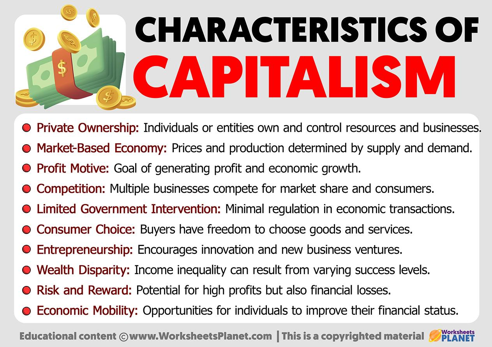

The global economic landscape is shaped by a variety of economic systems, among which capitalism and market economies are notably prominent. Capitalism fundamentally hinges on the principles of private ownership, where individuals and corporations own and control property and resources. It thrives on the profit motive, urging entities to maximize revenue through production and commerce. Market competition further fuels this drive, as businesses seek to innovate and enhance efficiency to outpace competitors. These mechanisms collectively contribute to economic prosperity, fostering environments where economic growth and wealth accumulation are paramount.

The advent and rise of technology have significantly transformed market operations, with algorithmic trading emerging as a pivotal force in financial markets. Algorithmic trading leverages advanced computational methods to execute financial transactions at speeds incomprehensible to human traders. This technological evolution not only optimizes trading processes but also influences the very structure and dynamics of economic systems within capitalist frameworks. 

The relationship between market economies, capitalism, and algorithmic trading is intricate and multifaceted. Market economies are guided by the forces of supply and demand, determining the allocation of resources and the pricing of goods and services. Within such economies, algorithmic trading exemplifies the seamless integration of technology into financial practices, enhancing market efficiency and liquidity. This article, therefore, seeks to explore these intersections, offering insights into how these economic models interact and the implications they hold for financial markets.

Understanding the synergy between capitalism, market economies, and the technological advancements epitomized by algorithmic trading is crucial. It allows stakeholders to navigate the complexities inherent in modern financial markets and informs economic strategies that respond to evolving technological landscapes. As these interactions unfold, they shape economic policies and outlooks, illustrating the importance of adapting to change in maintaining a robust economic infrastructure.

## Table of Contents

## Understanding Capitalism and Market Economy

Capitalism is a dynamic economic system characterized by private ownership of capital goods and resources, which are allocated through market dynamics. In this context, the market economy operates based on the fundamental principles of supply and demand, where the interplay between buyers and sellers determines the pricing and distribution of goods and services. This self-regulating mechanism is pivotal in directing economic activities and allocating resources efficiently within the market.

A capitalist market economy thrives on competition, which serves as a catalyst for innovation and efficiency. The pursuit of profits drives firms and entrepreneurs to innovate, improve production processes, and deliver goods and services that meet consumer demands more effectively. This environment of rivalry among market participants fosters economic growth, as it encourages productive use of resources and the development of new technologies.

Central to the philosophy of capitalism are key features such as private property rights, the accumulation of capital, and competitive free markets. Private property rights ensure that individuals and businesses have the legal authority to own and control their assets, providing the incentive to invest and produce. Capital accumulation, the process of acquiring additional assets or capital, is vital for expanding production capabilities and fostering economic development. Competitive free markets facilitate the unfettered exchange of goods and services, enabling price signals to guide economic decisions and resource allocation.

Despite its many strengths, capitalism also presents inherent drawbacks. While it has been instrumental in creating wealth and driving economic prosperity, it can also exacerbate inequality. The disparities in wealth and income distribution often emerge due to unequal access to resources, education, and opportunities. Critics of capitalism argue that these disparities can lead to social tension and limit equality of opportunity.

Additionally, capitalism may encounter challenges related to market failures, where the free market fails to allocate resources optimally. Examples include environmental degradation due to externalities, and situations where public goods are underprovided. Addressing these issues often requires government intervention to correct market inefficiencies and ensure a more equitable economic framework.

Overall, the interplay between the benefits and drawbacks of capitalism offers a comprehensive understanding of this economic system. The drive for profit and competition promotes efficiency and innovation, while the associated challenges demand careful consideration of policies that balance economic growth with social equity.

## Algorithmic Trading and Its Role in Capitalist Economies

Algorithmic trading involves the use of sophisticated computer algorithms to execute trading orders with precision and speed far exceeding human capabilities. This technology-driven approach has fundamentally transformed financial markets within capitalist economies. By leveraging vast amounts of market data, algorithms optimize trading strategies to maximize efficiency and profitability, becoming integral to modern market operations.

In capitalist economies, where the principles of supply and demand drive market behavior, [algorithmic trading](/wiki/algorithmic-trading) exploits these dynamics through several strategic methods. High-frequency trading ([HFT](/wiki/high-frequency-trading-strategies)) is one of the most prominent strategies, characterized by executing a large number of orders across various markets within fractions of a second. HFT profits from bid-ask spreads and minuscule price changes, operating on razor-thin margins in high volumes.

Arbitrage strategies also benefit from algorithmic capabilities by identifying price discrepancies across different markets or financial instruments and executing trades to exploit these inefficiencies. For example, if a stock is listed at different prices on two exchanges, an algorithmic trader can buy the stock on the cheaper exchange and simultaneously sell it on the more expensive one, capitalizing on the price differential.

Market-making, another key strategy facilitated by algorithms, enhances [liquidity](/wiki/liquidity-risk-premium) by continuously quoting buy and sell prices for financial instruments. This activity ensures smoother market functioning by reducing the bid-ask spread and providing liquidity to market participants, a role traditionally performed by human traders.

The implementation of algorithmic trading within capitalist frameworks illustrates the intersection of technological progression and capitalist ideology. On one hand, this approach maximizes market efficiency by optimizing trade execution, lowering transaction costs, and contributing to tighter spreads. Consequently, investors benefit from increased market liquidity and reduced latency in executing trades, which aligns with the capitalist pursuit of profit and efficiency.

However, algorithmic trading introduces challenges, including market instability and regulatory complexities. The significant market share captured by algorithmic trading can exacerbate [volatility](/wiki/volatility-trading-strategies), as evidenced by "flash crashes", where rapid automated selling leads to abrupt market declines. Such events underscore the need for robust risk management systems and regulatory oversight to mitigate potential disruptions.

Regulatory bodies face the challenge of ensuring that markets remain fair and transparent amidst the prevalence of algorithmic trading. Regulations must address concerns around market manipulation and the concentration of trading power among a few dominant firms, which can skew market dynamics unfavorably. The balance between fostering innovation and ensuring market integrity remains a critical regulatory focus.

In summary, algorithmic trading plays a crucial role in capitalist economies by enhancing trading efficiency and liquidity. While it offers substantial benefits, its challenges necessitate careful regulation and consideration of ethical issues to ensure the equitable and sustainable development of financial markets.

## Impact of Algorithmic Trading on Market Dynamics

Algorithmic trading has become a transformative force within financial markets, profoundly impacting market dynamics through its influence on liquidity, price discovery, and volatility. This evolution stems from the capability of algorithmic systems to execute trades based on advanced mathematical models and vast datasets, often at speeds and volumes unattainable by human traders.

**Market Liquidity and Price Discovery**

Algorithmic trading contributes significantly to market liquidity, as algorithms can continuously post bids and offers, facilitating a smoother trading process even when human activity might dwindle. Consequently, this enhances the efficiency of markets and aids in more accurate price discovery. By leveraging high-frequency trading (HFT), these algorithms can rapidly incorporate new information into asset prices, ensuring markets reflect the collective knowledge and sentiment available at any given moment. An efficient price discovery process involves matching sellers with the right buyers at prices that reflect the underlying value of the traded assets, thus minimizing discrepancies between supply and demand.

**Volatility and Flash Crashes**

While the presence of algorithmic trading can enhance liquidity and stability under normal conditions, it can occasionally contribute to increased market volatility. The execution speed and [volume](/wiki/volume-trading-strategy) of orders through algorithms can lead to phenomena such as 'flash crashes,' where market values plummet in seconds before rebounding just as quickly. These crashes often result from unforeseen interactions between algorithms or unintended responses to market anomalies, illustrating how automated systems, despite their efficiency, can sometimes induce instability.

Consider the infamous example of the 2010 Flash Crash, where the U.S. stock market indexes experienced rapid declines before recovering in a short span. Investigations later revealed that a confluence of aggressive trading strategies and algorithmic executions exacerbated the sell-off, thereby magnifying the market’s volatility during that period.

**Effects on Traditional Trading and Market Participants**

The advent of algorithmic trading has reshaped traditional trading approaches. Human traders now compete in an environment where speed and data-driven decision-making dominate, leading to a transformation in how they operate. As algorithms facilitate rapid positional adjustments in response to market shifts, traditional strategies reliant on slower, manual processes have had to adapt. This shift has precipitated a reevaluation of foundational trading principles, pushing human participants to integrate technology into their methodologies to remain competitive.

Moreover, the behavior of market participants is also influenced by the prevalence of algorithmic trading, as investors seek to anticipate and counteract algorithmic movements. This often requires embracing a deeper understanding of the strategies employed by automated systems, leading to an environment where data analytics and technological proficiency are as critical as financial acumen.

**Positive and Negative Aspects**

While algorithmic trading promotes greater market liquidity and efficient price discovery, it concurrently introduces potential challenges. On the positive side, increased liquidity can lead to narrower bid-ask spreads, reducing trading costs for all market participants. Additionally, the faster incorporation of information into prices is beneficial for overall market efficiency.

Conversely, the potential for 'flash crashes' highlights a critical downside, where market participants are vulnerable to sudden and extreme price fluctuations. These events underscore the necessity for robust regulatory frameworks and technological oversight to mitigate unintended consequences and ensure market stability.

In summary, algorithmic trading's impact on market dynamics is multifaceted, offering significant advancements in trading efficiency and liquidity while presenting challenges related to volatility and stability. The continued evolution of algorithmic strategies will necessitate careful balancing of these factors to harness their benefits while minimizing potential risks.

## Challenges and Ethical Considerations

The rise of algorithmic trading within capitalist market economies introduces a host of ethical considerations and challenges that demand careful scrutiny. A significant concern is the potential impact on market fairness and accessibility. Algorithmic trading systems, by their nature, can advantage firms with substantial resources, potentially leading to a concentration of trading power among a few dominant entities. This concentration can exacerbate existing wealth disparities and contribute to market dominance, ultimately altering the competitive landscape.

Regulatory bodies face considerable challenges in addressing these issues, aiming to ensure transparency and prevent market manipulation. The complexity and velocity of algorithmic trades necessitate robust oversight mechanisms to maintain a level playing field for all market participants. This includes implementing regulations that ensure fair access to trading infrastructure and market data, as well as targeting practices that may lead to market disruptions, such as 'flash crashes.'

To address these concerns effectively, striking a balance between fostering innovation and ensuring rigorous regulation is crucial. Innovation in trading technologies can lead to enhanced market efficiency and liquidity; however, without appropriate checks and balances, it may also pose significant systemic risks. Regulators and policymakers must collaborate with industry stakeholders to develop frameworks that not only promote technological advancement but also safeguard the integrity and stability of financial markets.

Furthermore, ethical considerations arise regarding the societal implications of algorithmic trading, particularly its impact on employment within the financial sector. The efficiency and speed of automated systems reduce the need for traditional trading roles, prompting a shift in labor dynamics. Policymakers must consider strategies to mitigate such impacts, potentially through retraining programs to equip workers with skills relevant to emerging financial technologies.

Overall, the interplay between regulation, innovation, and ethical considerations is pivotal in navigating the challenges presented by algorithmic trading. Ensuring that advancements in technology benefit a broad spectrum of society while maintaining fair and secure financial markets is a complex but necessary endeavor.

## Conclusion

The integration of algorithmic trading within capitalist systems signifies a substantial transformation of financial markets, underscored by the influence of technology. Algorithmic trading’s ability to execute high-volume transactions at unprecedented speeds embodies the principles of efficiency and competition central to capitalism. This evolution propels discussions about market efficiency, regulation, and equity to the forefront of contemporary economic discourse.

The rapid advancements in algorithmic trading continually challenge traditional notions of market dynamics, necessitating a nuanced understanding of the intricate relationship between capitalism and trading technologies. As these systems evolve, they highlight the dual needs for both innovation in financial technologies and robust regulatory frameworks to ensure fairness and mitigate systemic risks.

Further research and policy development are critical to enhancing the benefits of algorithmic trading while addressing associated risks. Policymakers and economic strategists must collaboratively develop regulations that promote transparency and fairness, preventing market manipulation and ensuring equitable access to technological advancements. This approach requires a balance between fostering technological innovations and safeguarding the stability and integrity of financial markets.

In conclusion, while algorithmic trading is a key catalyst for efficiency in modern markets, its complexities demand careful consideration. Future economic strategies should aim to harness its potential benefits, such as improved liquidity and reduced transaction costs, while vigilantly monitoring and managing the risks it poses to market stability and equity.

## References & Further Reading

[1]: Bergstra, J., Bardenet, R., Bengio, Y., & Kégl, B. (2011). ["Algorithms for Hyper-Parameter Optimization."](https://papers.nips.cc/paper/4443-algorithms-for-hyper-parameter-optimization) Advances in Neural Information Processing Systems 24.

[2]: ["Advances in Financial Machine Learning"](https://www.amazon.com/Advances-Financial-Machine-Learning-Marcos/dp/1119482089) by Marcos Lopez de Prado

[3]: ["Evidence-Based Technical Analysis: Applying the Scientific Method and Statistical Inference to Trading Signals"](https://www.amazon.com/Evidence-Based-Technical-Analysis-Scientific-Statistical/dp/0470008741) by David Aronson

[4]: ["Machine Learning for Algorithmic Trading"](https://github.com/stefan-jansen/machine-learning-for-trading) by Stefan Jansen

[5]: ["Quantitative Trading: How to Build Your Own Algorithmic Trading Business"](https://www.amazon.com/Quantitative-Trading-Build-Algorithmic-Business/dp/1119800064) by Ernest P. Chan