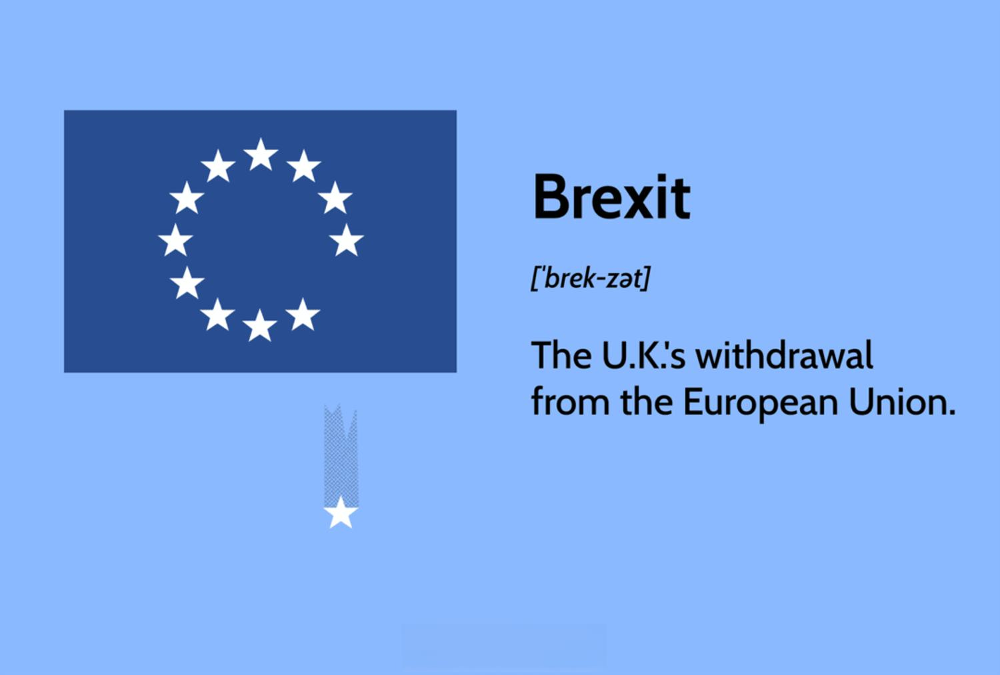

## Table of Contents

## Who were the main negotiators for the UK during Brexit?

The main negotiator for the UK during Brexit was David Davis. He was appointed as the Secretary of State for Exiting the European Union in July 2016. David Davis was responsible for leading the UK's negotiations with the EU. He worked hard to make sure the UK could leave the EU in a good way. However, he resigned in July 2018 because he did not agree with the government's plan for Brexit.

After David Davis left, Dominic Raab took over as the main negotiator. He became the Secretary of State for Exiting the European Union. Dominic Raab continued the negotiations with the EU. He tried to finalize the details of the UK's exit from the EU. But he also resigned in November 2018, just before the Brexit deal was supposed to be voted on in Parliament. After that, Stephen Barclay became the new negotiator until Brexit was completed.

## What role did the European Union's chief negotiator play in Brexit talks?

The European Union's chief negotiator during Brexit was Michel Barnier. His job was to talk with the UK and make sure the EU's rules and interests were protected. Michel Barnier worked hard to make a fair deal that both the EU and the UK could agree on. He had to make sure that things like trade, people's rights, and money were handled properly. He also had to keep the 27 other EU countries happy with the deal.

Michel Barnier was very important because he led the EU side of the talks. He met with the UK's negotiators many times to discuss and solve problems. Sometimes, the talks were hard, and they had to find ways to agree on things. Michel Barnier always tried to be clear and open about what the EU wanted. In the end, his work helped to make the Brexit deal happen, even though it was not easy.

## How did Theresa May's approach to Brexit negotiations differ from Boris Johnson's?

Theresa May wanted to keep close ties with the European Union after Brexit. She tried to make a deal that would let the UK stay in the EU's single market for goods. She also wanted to have a special arrangement for Northern Ireland to keep the border open with Ireland. But her plan was hard to pass because many people in her party and in Parliament did not like it. They thought it was too close to the EU and did not give the UK enough freedom. In the end, her deal was voted down many times, and she had to leave her job as Prime Minister.

Boris Johnson, who became Prime Minister after Theresa May, took a different approach. He wanted to leave the EU quickly and completely. He promised to "get Brexit done" and was ready to leave without a deal if needed. Johnson's plan was to have a simpler deal that focused on trade, and he was willing to accept a border in the Irish Sea to make it happen. His approach was more about getting out of the EU fast, even if it meant some problems. In the end, Johnson's deal passed, and the UK left the EU.

## What were the key objectives of the UK in the Brexit negotiations?

The UK wanted to leave the European Union but still have good relations with it. One big goal was to make a trade deal that would let the UK sell things to the EU without too many problems. The UK also wanted to control its own laws and borders again. This meant they could decide who could come into the country and make their own rules without the EU telling them what to do.

Another important goal was to keep the peace in Northern Ireland. The UK wanted to make sure there was no hard border between Northern Ireland and Ireland. This was tricky because the EU wanted to check goods moving between the two places. The UK tried to find a way to keep the border open while still leaving the EU. In the end, they agreed to have some checks in the Irish Sea instead, which was not what everyone wanted but helped to solve the problem.

## How did the EU's negotiation strategy impact the Brexit outcome?

The EU's negotiation strategy had a big impact on how Brexit turned out. The EU wanted to make sure that leaving the EU would not be easy for the UK. They wanted to show other countries that leaving the EU would be hard and not worth it. The EU's main negotiator, Michel Barnier, was very strict and clear about what the EU wanted. He made sure that the UK had to follow the EU's rules during the talks. This made it hard for the UK to get the kind of deal they wanted.

Because of the EU's tough strategy, the UK had to make a lot of compromises. The EU did not want to let the UK have all the benefits of being in the EU without following the rules. This meant the UK could not have a very close relationship with the EU after leaving. The EU's firm stance also made it hard for the UK to leave without a deal, which some in the UK wanted. In the end, the EU's strategy helped them get a deal that protected their interests and showed other countries that leaving the EU would be difficult.

## What were the major sticking points during the Brexit negotiations?

The biggest problem during the Brexit talks was what to do about the border between Northern Ireland and Ireland. The UK wanted to leave the EU but keep the border open. The EU said they needed to check goods moving between the two places to make sure their rules were followed. This was hard because an open border was important for peace in Northern Ireland. In the end, they agreed to have some checks in the Irish Sea instead, which was not what everyone wanted but helped to solve the problem.

Another big issue was how close the UK would stay to the EU after leaving. Some people in the UK wanted to keep close ties and stay in the EU's single market for goods. Others wanted to leave completely and have more freedom to make their own rules. The EU did not want to let the UK have all the benefits of being in the EU without following the rules. This made it hard to agree on a deal that everyone liked. In the end, the UK had to make a lot of compromises to get a deal that worked for both sides.

## How did the Irish border issue influence the Brexit negotiations?

The Irish border was a big problem during the Brexit talks. The UK wanted to leave the EU but keep the border between Northern Ireland and Ireland open. This was important for peace in Northern Ireland. But the EU said they needed to check goods moving between the two places to make sure their rules were followed. This was hard because an open border was important for peace. The UK and EU had to find a way to solve this problem without making things worse in Northern Ireland.

In the end, they agreed to have some checks in the Irish Sea instead of at the border. This meant that goods moving from Great Britain to Northern Ireland would be checked. This was not what everyone wanted, but it helped to solve the problem. The Irish border issue made the Brexit talks very hard and took a long time to solve. It was one of the main reasons why the talks were so difficult and why the UK had to make a lot of compromises to get a deal.

## What were the financial settlement terms discussed during Brexit talks?

During the Brexit talks, one big thing they had to talk about was money. The UK had to pay the EU for things they had agreed to before Brexit. This was called the financial settlement. The EU wanted the UK to pay around 100 billion euros, but the UK said that was too much. In the end, they agreed that the UK would pay about 39 billion euros. This money would help pay for things like pensions for EU workers and projects the UK had promised to help with.

The financial settlement was important because it showed that the UK was willing to pay for its past promises. It helped make the EU feel better about the UK leaving. The money would be paid over many years, and it was a big part of the deal that let the UK leave the EU. Even though it was a lot of money, it was less than what the EU first asked for, and it helped both sides agree on a deal.

## How did public opinion in the UK affect the Brexit negotiation process?

Public opinion in the UK played a big role in how Brexit negotiations went. People in the UK had different ideas about what Brexit should look like. Some wanted a close relationship with the EU, while others wanted to leave completely and have more freedom. This made it hard for the UK government to decide what to ask for in the talks. The government had to listen to what people wanted, and sometimes this meant changing their plans. For example, when Theresa May's deal was voted down many times, it showed that a lot of people did not like it. This made it harder for her to get a deal done.

Boris Johnson used public opinion to help him get his deal passed. He promised to "get Brexit done" quickly, which is what many people wanted. He also said he was ready to leave without a deal if needed, which made some people feel like he was serious about leaving the EU. This helped him win support from people who wanted a fast and complete [exit](/wiki/exit-strategy). In the end, public opinion pushed the government to make a deal that would satisfy enough people to get it passed. This showed how important it was for the government to listen to what the public wanted during the Brexit talks.

## What were the roles of Michel Barnier and David Davis in the Brexit negotiations?

Michel Barnier was the European Union's main person talking during Brexit. His job was to make sure the EU's rules and interests were safe. He talked with the UK and tried to make a fair deal that both the EU and the UK could agree on. He had to make sure things like trade, people's rights, and money were handled right. He also had to keep the other 27 EU countries happy with the deal. Michel Barnier was very important because he led the EU side of the talks. He met with the UK's negotiators many times to discuss and solve problems. Sometimes, the talks were hard, and they had to find ways to agree on things. Michel Barnier always tried to be clear and open about what the EU wanted. In the end, his work helped to make the Brexit deal happen, even though it was not easy.

David Davis was the UK's main person talking at the start of Brexit. He was in charge of the UK's talks with the EU. He worked hard to make sure the UK could leave the EU in a good way. He wanted to make a deal that would let the UK have good relations with the EU after leaving. But he resigned in July 2018 because he did not agree with the government's plan for Brexit. After he left, other people like Dominic Raab and Stephen Barclay took over. David Davis's role was important because he set the stage for the UK's side of the talks. Even though he did not finish the job, his work helped the UK move forward in the negotiations.

## How did the withdrawal agreement evolve throughout the negotiation process?

At the start of the Brexit talks, the UK and the EU wanted to make a deal that would let the UK leave the EU smoothly. The first big thing they talked about was the financial settlement. The EU wanted the UK to pay a lot of money for things they had promised before Brexit. The UK did not want to pay that much, but they agreed on about 39 billion euros in the end. Another big issue was what to do about the border between Northern Ireland and Ireland. The UK wanted to keep the border open for peace, but the EU said they needed to check goods moving between the two places. This was hard to solve, and it took a long time to agree on having some checks in the Irish Sea instead.

As the talks went on, the UK's plan for Brexit changed a lot. Theresa May, who was the UK's leader at first, wanted a deal that would keep the UK close to the EU. She tried to make a deal that would let the UK stay in the EU's single market for goods and have a special arrangement for Northern Ireland. But her plan was hard to pass because many people in her party and in Parliament did not like it. They thought it was too close to the EU and did not give the UK enough freedom. In the end, her deal was voted down many times, and she had to leave her job. Boris Johnson, who became the UK's leader after Theresa May, took a different approach. He wanted to leave the EU quickly and completely. He promised to "get Brexit done" and was ready to leave without a deal if needed. Johnson's plan was to have a simpler deal that focused on trade, and he was willing to accept a border in the Irish Sea to make it happen. His approach was more about getting out of the EU fast, even if it meant some problems. In the end, Johnson's deal passed, and the UK left the EU.

## What were the long-term implications of the negotiation strategies used by both sides?

The way the UK and the EU talked during Brexit had big effects that will last a long time. The EU wanted to show other countries that leaving the EU would be hard. They were very strict and clear about what they wanted. This made it hard for the UK to get the kind of deal they wanted. The UK had to make a lot of compromises. They could not have a very close relationship with the EU after leaving. This made some people in the UK unhappy because they felt like they did not get what they wanted from Brexit. The EU's tough strategy also made it hard for the UK to leave without a deal, which some in the UK wanted. In the end, the EU's strategy helped them get a deal that protected their interests and showed other countries that leaving the EU would be difficult.

The UK's strategy changed a lot during the talks. At first, Theresa May wanted a deal that would keep the UK close to the EU. But many people in the UK did not like this plan. They thought it was too close to the EU and did not give the UK enough freedom. This made it hard for May to get her deal passed. When Boris Johnson became the UK's leader, he took a different approach. He wanted to leave the EU quickly and completely. He promised to "get Brexit done" and was ready to leave without a deal if needed. This helped him win support from people who wanted a fast and complete exit. In the end, Johnson's deal passed, and the UK left the EU. But the way the UK changed its strategy during the talks made some people feel like the process was messy and confusing.

## References & Further Reading

[1]: BBC News. ["Boris Johnson's Brexit Deal: What It Means and Why It Matters."](https://www.bbc.co.uk/news/uk-politics-48496082)

[2]: The Guardian. ["Theresa May and the Failures of Her Brexit Deal."](https://www.theguardian.com/commentisfree/2019/jul/19/theresa-may-failures-conservative-leader?bcmt=1)

[3]: Financial Times. ["David Frost: The Architect of the UK’s Trade Deal."](https://www.ft.com/content/c4942166-c61b-46ec-832f-1671aecf1b02)

[4]: New Statesman. ["Keir Starmer's Brexit Strategy."](https://www.newstatesman.com/politics/labour/2024/11/inside-keir-starmers-reset)

[5]: European Commission. ["Michel Barnier: Leading the EU Negotiation Team."](https://en.wikipedia.org/wiki/Michel_Barnier)

[6]: Reuters. ["The Role of Von der Leyen and Michel in Brexit Talks."](https://www.reuters.com/world/europe/world-leaders-react-von-der-leyens-re-election-eu-commission-chief-2024-07-18/)

[7]: Lopez de Prado, M. ["Advances in Financial Machine Learning."](https://www.amazon.com/Advances-Financial-Machine-Learning-Marcos/dp/1119482089)

[8]: Chan, E. P. ["Quantitative Trading: How to Build Your Own Algorithmic Trading Business."](https://github.com/ftvision/quant_trading_echan_book)