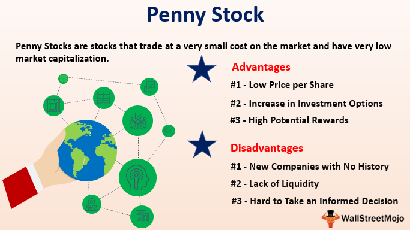

Understanding investment analysis and financial ratios is a critical aspect of engaging with penny stocks, which are known for their low price and high volatility characteristics. These stocks, often representing small-cap companies, provide unique opportunities alongside significant risks, making them a distinct segment in the equities market. Effective evaluation of penny stocks relies heavily on comprehensive financial analysis, which involves scrutinizing the company's financial health and market position. 

One of the pivotal elements of this analysis is the selection and interpretation of financial ratios. These ratios serve as quantitative tools for investors to assess various aspects of a company's performance, such as liquidity, profitability, and valuation. Each financial ratio unveils specific insights, aiding in the identification of the stock's strengths and potential vulnerabilities. For instance, liquidity ratios like the current ratio inform investors about a company's capacity to meet its short-term liabilities, while valuation ratios such as the price-to-earnings (P/E) ratio offer perspectives on the stock's market value in relation to its earnings.



Algorithmic trading introduces another layer of sophistication in penny stock investments. By leveraging computer algorithms to execute trades, investors can automate the decision-making process, thus enhancing the speed and efficiency of trades. This method allows for the rapid processing of vast datasets, incorporating technical indicators and financial ratios to identify potential trading opportunities. However, employing such technology demands a robust strategy that is capable of managing the inherent volatility of penny stocks.

In navigating the investment landscape of penny stocks, it is quintessential to balance both risk and opportunity through well-structured strategies. Risk mitigation can be achieved through the careful selection of financial ratios, rigorous analysis, and the application of algorithmic trading techniques. By integrating these elements, investors can refine their trading approaches, ultimately positioning themselves for improved financial outcomes. As we explore these interconnected aspects, a thorough understanding will enable investors to make more informed decisions and optimize their participation in the penny stock market.

## Table of Contents

## Understanding Penny Stocks and Their Risks

Penny stocks are shares of small-cap companies that typically trade at low prices, usually less than $5 per share, and are often found on over-the-counter (OTC) markets. These markets, unlike the major exchanges such as the New York Stock Exchange (NYSE) and NASDAQ, are less regulated and can result in a lack of transparency for potential investors. Companies issuing penny stocks usually have market capitalizations of under $250 million, placing them in a high-risk category due to several factors including limited financial reporting and liquidity issues.

High volatility is a key characteristic of penny stocks, meaning their prices can fluctuate dramatically in a short period. This volatility can stem from the low share prices and the relatively small number of investors engaging with these stocks. As a result, penny stocks can occasionally yield substantial returns on investment, albeit with increased risk. This risk arises from the potential lack of liquidity, whereby investors might find it challenging to buy or sell shares without impacting the stock price significantly.

Liquidity risk is pivotal when considering penny stocks. Low trading volumes often mean that there might be insufficient buyers or sellers at a given time, making it hard to execute trades at favorable prices. Consequently, this can lead to wide bid-ask spreads, where the asking price and bidding price have a significant gap. For instance, if a penny stock has a bid price of $2.00 and an ask price of $2.50, the execution cost becomes relatively high, which can erode potential profits.

To navigate the risks associated with penny stocks, investors should undertake comprehensive analysis and due diligence. This typically involves examining the company's financial health, business model, and potential for growth. Despite the limited information available for many penny stock companies, scrutinizing whatever is accessible, such as financial statements and any public announcements, is essential.

Moreover, constructing a well-thought-out investment strategy is crucial. This strategy could include setting clear entry and [exit](/wiki/exit-strategy) points based on risk tolerance and market conditions. Investors might also consider diversification to spread the risk across multiple penny stocks rather than channeling resources into a single investment.

Understanding and accepting the inherent risks of penny stock investments is necessary before committing capital. Investors should be prepared for the possibility of total loss, but with adequate research and strategic planning, there exists a potential for significant financial gains.

## Essential Financial Ratios for Penny Stock Analysis

Financial ratios serve as essential metrics for evaluating the health and potential of penny stocks. These tools help investors assess various aspects of a company's financial performance, offering insights that aid in making informed investment decisions. Understanding the following key financial ratios is crucial when analyzing penny stocks:

### Liquidity Ratios

Liquidity ratios measure a company's capacity to meet its short-term obligations. These include:

- **Current Ratio**: Calculated as $\text{Current Ratio} = \frac{\text{Current Assets}}{\text{Current Liabilities}}$, this ratio assesses whether a company has enough resources to cover its short-term liabilities with its short-term assets.

- **Quick Ratio**: The quick ratio, $\text{Quick Ratio} = \frac{\text{Current Assets} - \text{Inventories}}{\text{Current Liabilities}}$, provides a more stringent assessment by excluding inventory from assets, which may not be easily convertible to cash.

### Leverage Ratios

Leverage ratios reflect the degree to which a company is utilizing borrowed money, highlighting its ability to manage long-term debt:

- **Debt Ratio**: Defined as $\text{Debt Ratio} = \frac{\text{Total Debt}}{\text{Total Assets}}$, this ratio indicates the proportion of a company's assets that are financed by debt, with a higher ratio suggesting greater reliance on debt.

- **Interest Coverage Ratio**: This ratio, $\text{Interest Coverage Ratio} = \frac{\text{Earnings Before Interest and Taxes (EBIT)}}{\text{Interest Expenses}}$, measures how easily a company can cover interest payments on its outstanding debt.

### Performance Ratios

Performance ratios provide insights into a company's ability to generate profits from its operations:

- **Gross Profit Margin**: Calculated as $\text{Gross Profit Margin} = \frac{\text{Gross Profit}}{\text{Revenue}}$, this ratio shows the percentage of revenue that exceeds the cost of goods sold, indicating production efficiency.

- **Operating Profit Margin**: Defined as $\text{Operating Profit Margin} = \frac{\text{Operating Income}}{\text{Revenue}}$, this metric reveals the proportion of revenue left after covering operating expenses.

### Valuation Ratios

Valuation ratios help assess a stock's market value relative to its earnings, guiding investors in evaluating whether a stock is overvalued or undervalued:

- **Price-to-Earnings (P/E) Ratio**: This ratio is calculated as $\text{P/E Ratio} = \frac{\text{Market Price per Share}}{\text{Earnings per Share (EPS)}}$. A high P/E ratio may indicate that the market expects future growth, while a low ratio may suggest that the stock is undervalued.

Each of these ratios provides critical insights into different dimensions of a company's financial health and operational efficiency. When used collectively, they help investors paint a comprehensive picture of a penny stock's potential, thereby facilitating informed decision-making in the highly volatile and speculative penny stock market.

## Algorithmic Trading in Penny Stocks

Algorithmic trading, a method that utilizes computer programs to automate trading processes, is increasingly being adopted within the penny stock market. This approach leverages the computational power of algorithms to execute trades based on predefined parameters, thereby enhancing both the efficiency and speed of decision-making. This rapid processing capability allows traders to swiftly react to the dynamic changes characteristic of the penny stock market, optimizing entry and exit points to maximize potential returns.

In the context of penny stocks, [algorithmic trading](/wiki/algorithmic-trading) can process vast amounts of stock data rapidly to identify profitable opportunities. Algorithmic systems are often programmed to use a combination of technical indicators such as moving averages, relative strength index (RSI), and Bollinger Bands, alongside financial ratios, to assess stocks. For example, a simple Python script might be used to determine when a stock's price crosses a moving average, triggering a buy or sell decision. Below is a basic illustration:

```python
import pandas as pd
import numpy as np

def moving_average(stock_prices, window_size):
    return stock_prices.rolling(window=window_size).mean()

def trading_strategy(stock_data):
    stock_data['Moving_Avg'] = moving_average(stock_data['Close'], window_size=50)
    buy_signals = stock_data[stock_data['Close'] > stock_data['Moving_Avg']]
    sell_signals = stock_data[stock_data['Close'] < stock_data['Moving_Avg']]
    return buy_signals, sell_signals

# Sample Data
stock_data = pd.DataFrame({'Close': np.random.random(100) * 100})
buy, sell = trading_strategy(stock_data)
```

Algorithmic trading is particularly beneficial in mitigating the subjective biases and emotional influences that often affect human traders. By relying on predefined parameters and data-driven strategies, it ensures consistent decision-making.

Despite its advantages, implementing algorithmic trading in the volatile penny stock sector requires careful strategy design. The algorithms need to be robust and adaptable to handle the inherent unpredictability of the market. This requires extensive back-testing on historical data to identify potential pitfalls and optimize algorithm performance.

Additionally, there is typically a need for continuous monitoring and improvement of the algorithms, as market conditions can change rapidly. Traders must ensure that their systems remain aligned with current market trends and data patterns, which may involve recalibrating parameters or integrating new indicators.

Moreover, the risk of erroneous trades due to software glitches or unforeseen market events, known as "flash crashes," underscores the necessity for fail-safes within algorithmic systems. These could include stop-loss mechanisms or circuit breakers to limit potential losses.

In conclusion, while algorithmic trading has the potential to revolutionize trading in penny stocks through efficiency and data-driven insights, its effective implementation requires a combination of technological acumen and financial expertise. Key to success is the ability to design algorithms that not only target profitability but also incorporate risk management strategies for sustained performance in the fluctuating penny stock market.

## Mitigating Risks Through Fundamental Analysis

Fundamental analysis is a methodical approach to evaluating a company's intrinsic value through a comprehensive examination of its financial statements. This analysis is crucial for those investing in penny stocks, as these investments come with inherent risks associated with [volatility](/wiki/volatility-trading-strategies) and market perception. By conducting a thorough analysis, investors can assess a company's financial health, operational efficiency, and growth prospects, which are pivotal in determining the investment's potential viability.

The first step in [fundamental analysis](/wiki/fundamental-analysis) is scrutinizing the company's financial health via its balance sheet, which provides insight into the company's assets, liabilities, and shareholders' equity. An understanding of key financial ratios, such as the current ratio and debt-to-equity ratio, helps evaluate the company's short-term [liquidity](/wiki/liquidity-risk-premium) and long-term financial stability. For example, a current ratio (current assets divided by current liabilities) greater than 1 suggests that the company can cover its short-term obligations.

Assessing operational efficiency is another critical aspect, where investors should examine income statements for metrics like gross profit margin and operating margin. These ratios indicate how efficiently a company generates profit from its sales and operations. A consistent increase in these margins may signal a well-managed company with effective cost control practices, which is vital for long-term profitability.

A deeper analysis should also include evaluating the company's growth potential through its operational strategies and competitive positioning within the industry. Investors should look at revenue trends, research and development investments, and market expansion plans to gauge future performance possibilities. Peter Lynch famously suggested looking into the company's earnings growth rate, which can be calculated as follows:

$$
\text{Earnings Growth Rate} = \left( \frac{\text{Current Year Earnings} - \text{Previous Year Earnings}}{\text{Previous Year Earnings}} \right) \times 100
$$

The quality of management and its strategic direction are often indicators of the company's long-term success. It is critical for investors to assess the management's vision and industry expertise, as well as ethical practices and governance structures. Reading reports or listening to earnings call transcripts can provide valuable insights into management's competence.

Incorporating market trends and sector performance into analysis helps in contextualizing a company's relative position and competitiveness. Understanding economic conditions and regulatory changes affecting the industry can forecast potential headwinds or tailwinds for the business. Investors should stay updated on these external factors to adjust their strategies accordingly.

To effectively incorporate fundamental analysis into your investment approach, it is beneficial to use a systematic framework to evaluate these factors and support your decision-making process. Tools like discounted cash flow (DCF) models can estimate the present value of expected future cash flows to determine if stock prices reflect the company's true value. Python libraries such as NumPy and pandas can facilitate the computation and visualization of fundamental metrics and trends.

In summary, a rigorous fundamental analysis offers a grounded strategy to mitigate risks and identify promising opportunities within the speculative landscape of penny stocks. By focusing on financial, operational, and strategic aspects, investors can build a robust, informed approach to penny stock investments.

## Conclusion: Navigating Penny Stocks with Strategy and Caution

Investing in penny stocks can yield significant returns but also entails substantial risks. A disciplined approach, grounded in careful analysis and strategic planning, is crucial for navigating this volatile market effectively. By concentrating on financial ratios, traders gain insights into a company's financial health, helping to make informed investment decisions. Essential ratios like liquidity ratios, leverage ratios, performance ratios, and valuation ratios serve as vital indicators of a company's stability and potential profitability. These metrics enable investors to identify potential red flags and assess the viable investment opportunities within the extensive universe of penny stocks.

Algorithmic trading, which employs pre-defined criteria to execute trades, offers a way to manage the high volatility typical of penny stocks. The ability to process vast amounts of data rapidly and execute trades with precision allows investors to optimize entry and exit points in real-time. Nevertheless, designing robust algorithms is imperative, as the speculative nature of penny stocks can lead to swift market changes.

The integration of both technical and fundamental analysis presents a holistic approach to mitigate inherent risks. While technical analysis helps in understanding price patterns and market trends, fundamental analysis offers deep insights into a company's operations, management strategy, and growth potential. Combined, these analyses provide a comprehensive view that can uncover promising opportunities that may be overlooked through a singular analysis approach.

A key success [factor](/wiki/factor-investing) is remaining informed and vigilant. Engaging regularly with market news, updates, and sector performance enhances the ability to adapt strategies in response to market fluctuations. Additionally, continuous learning and staying abreast of trading technology updates and analytical techniques are essential for maintaining a competitive edge in the dynamic penny stock market. Overall, a strategy that balances careful analysis with adaptive tactics positions investors strongly to capitalize on the potential of penny stocks while managing associated risks effectively.

## References & Further Reading

[1]: ["Advances in Financial Machine Learning"](https://www.amazon.com/Advances-Financial-Machine-Learning-Marcos/dp/1119482089) by Marcos Lopez de Prado

[2]: ["Quantitative Trading: How to Build Your Own Algorithmic Trading Business"](https://www.amazon.com/Quantitative-Trading-Build-Algorithmic-Business/dp/1119800064) by Ernest P. Chan

[3]: ["Machine Learning for Algorithmic Trading"](https://github.com/stefan-jansen/machine-learning-for-trading) by Stefan Jansen

[4]: ["Evidence-Based Technical Analysis: Applying the Scientific Method and Statistical Inference to Trading Signals"](https://www.amazon.com/Evidence-Based-Technical-Analysis-Scientific-Statistical/dp/0470008741) by David Aronson

[5]: Bergstra, J., Bardenet, R., Bengio, Y., & Kégl, B. (2011). ["Algorithms for Hyper-Parameter Optimization."](https://dl.acm.org/doi/10.5555/2986459.2986743) Advances in Neural Information Processing Systems 24.