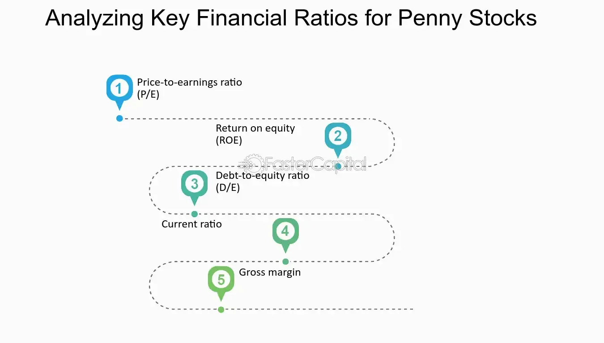

## Table of Contents

## What are penny stocks and why are they considered high risk?

Penny stocks are stocks that trade at a very low price, usually less than a dollar. They are often from small companies that are just starting out or are not doing well. Because they are cheap, some people think they can buy a lot of them and make a big profit if the stock price goes up. But penny stocks are not traded on big stock exchanges like the New York Stock Exchange. Instead, they are traded on smaller markets, which makes them harder to buy and sell.

Penny stocks are considered high risk for a few reasons. First, they are very volatile, which means their prices can go up and down a lot in a short time. This makes it hard to predict what will happen to your investment. Second, there is often less information available about these companies, so it's harder to know if they are a good investment. Finally, because they are not on big exchanges, it can be hard to sell them quickly if you need to. All these things make penny stocks a risky choice for investors.

## What are financial ratios and why are they important for analyzing penny stocks?

Financial ratios are numbers that help you understand a company's financial health by comparing different parts of its financial statements. They can show you things like how much debt a company has, how well it's making money, and how quickly it can pay its bills. For penny stocks, which are stocks that cost less than a dollar, these ratios are really important because these companies are often small and new, so there's less information about them.

Using financial ratios to analyze penny stocks is important because it helps you see if the company is doing well or if it's in trouble. Since penny stocks can be very risky, looking at these ratios can give you a better idea of whether the company might grow and make money in the future, or if it might fail. This can help you decide if it's worth investing in the stock or if it's too risky.

## How can the Price-to-Earnings (P/E) ratio help in evaluating penny stocks?

The Price-to-Earnings (P/E) ratio is a financial ratio that shows how much investors are willing to pay for each dollar of a company's earnings. For penny stocks, the P/E ratio can help you see if the stock is a good deal or if it's too expensive. If a penny stock has a low P/E ratio, it might mean the stock is cheap and could be a good investment. But if the P/E ratio is high, it might mean the stock is too expensive and not a good buy.

However, using the P/E ratio to evaluate penny stocks can be tricky. Sometimes, penny stocks don't have any earnings at all, so their P/E ratio can't be calculated. Also, even if a penny stock does have a P/E ratio, it might not be very useful because these companies can be very unpredictable. So, while the P/E ratio can give you some information, you should use it along with other financial ratios and do a lot of research before deciding to invest in a penny stock.

## What does the Price-to-Book (P/B) ratio tell us about a penny stock's value?

The Price-to-Book (P/B) ratio tells you how much the market thinks a company is worth compared to its book value. The book value is what the company would be worth if it sold all its assets and paid off all its debts. For penny stocks, a low P/B ratio might mean the stock is undervalued and could be a good buy. But a high P/B ratio might mean the stock is overvalued and not a good investment.

However, using the P/B ratio to judge penny stocks can be tricky. Penny stock companies are often small and new, so their book values might not be very accurate. Also, the P/B ratio doesn't tell you about the company's future growth or earnings. So, while the P/B ratio can give you some clues about a penny stock's value, you should use it along with other financial ratios and do a lot of research before deciding to invest.

## How can the Debt-to-Equity (D/E) ratio indicate the financial health of a penny stock company?

The Debt-to-Equity (D/E) ratio tells you how much a company is using debt to run its business compared to the money it gets from its owners or shareholders. For a penny stock company, a high D/E ratio might mean the company is taking on a lot of debt, which can be risky. If the company can't pay back its debts, it might run into big trouble. On the other hand, a low D/E ratio might mean the company is not using much debt, which can be a good sign because it shows the company is not taking big risks with borrowed money.

However, looking at the D/E ratio for penny stocks can be tricky. These companies are often small and new, so their financial situation can change quickly. A high D/E ratio might not always be bad if the company is using the debt to grow and make more money in the future. But it's still important to be careful because penny stocks are already risky, and a lot of debt can make them even riskier. So, while the D/E ratio can give you some clues about a penny stock's financial health, you should use it along with other financial ratios and do a lot of research before deciding to invest.

## What is the significance of the Current Ratio for penny stocks?

The Current Ratio tells you if a company can pay its short-term bills with the money and things it has right now. For penny stocks, this ratio is important because these companies are often small and new, so they might not have a lot of money. If a penny stock has a high Current Ratio, it means the company can easily pay its bills, which is a good sign. But if the Current Ratio is low, it might mean the company could have trouble paying its bills, which is risky.

However, using the Current Ratio to judge penny stocks can be tricky. These companies can be very unpredictable, and their financial situation can change quickly. A high Current Ratio might look good, but if the company's money is tied up in things that are hard to sell quickly, it might not be as good as it seems. So, while the Current Ratio can give you some clues about a penny stock's ability to pay its bills, you should use it along with other financial ratios and do a lot of research before deciding to invest.

## How does the Quick Ratio differ from the Current Ratio, and why is it important for penny stocks?

The Quick Ratio is similar to the Current Ratio, but it's a bit stricter. While the Current Ratio looks at all the money and things a company has to pay its short-term bills, the Quick Ratio only looks at the money and things that can be turned into cash quickly. This means it doesn't count things like inventory, which might take a while to sell. For penny stocks, the Quick Ratio can tell you if a company can pay its bills right away, without having to sell off its inventory.

The Quick Ratio is important for penny stocks because these companies can be very risky. If a penny stock company has a low Quick Ratio, it might mean they don't have enough quick cash to pay their bills, which is a big problem. On the other hand, a high Quick Ratio can be a good sign, showing that the company can handle its short-term debts easily. But remember, penny stocks can change a lot, so you should always use the Quick Ratio with other financial ratios and do a lot of research before deciding to invest.

## Can the Return on Equity (ROE) provide insights into the profitability of penny stocks?

The Return on Equity (ROE) tells you how well a company is using the money that its shareholders have put in to make more money. For penny stocks, ROE can give you an idea about how profitable the company is. If a penny stock has a high ROE, it means the company is doing a good job of turning the shareholders' money into profits. But if the ROE is low, it might mean the company isn't making much money from the money it has.

However, using ROE to look at penny stocks can be tricky. These companies are often small and new, so their profits can go up and down a lot. A high ROE might look good, but if the company is taking big risks to get that high return, it might not be a good investment. So, while ROE can give you some clues about a penny stock's profitability, you should use it along with other financial ratios and do a lot of research before deciding to invest.

## What does the Earnings Per Share (EPS) indicate about a penny stock's performance?

Earnings Per Share (EPS) tells you how much money a company made for each share of its stock. For penny stocks, EPS can show if the company is making money or losing it. If a penny stock has a high EPS, it means the company is doing well and making a lot of money for each share. But if the EPS is low or negative, it means the company might be struggling and not making much money, or even losing money.

However, using EPS to judge penny stocks can be tricky. These companies are often small and new, so their earnings can change a lot from one time to another. A high EPS might look good, but if the company can't keep making that much money, it might not be a good investment. So, while EPS can give you some clues about a penny stock's performance, you should use it along with other financial ratios and do a lot of research before deciding to invest.

## How can the Dividend Yield be used to assess penny stocks, and what are the risks involved?

The Dividend Yield tells you how much money you get back from a stock in the form of dividends compared to what you paid for the stock. For penny stocks, a high Dividend Yield might seem good because it means you're getting a lot of money back for your investment. But with penny stocks, a high Dividend Yield can sometimes be a warning sign. It might mean the stock price has dropped a lot, making the yield look high, or the company might be paying out more in dividends than it can afford, which is not good for its future.

There are big risks when looking at the Dividend Yield of penny stocks. First, many penny stock companies don't pay dividends at all because they are small and new and need all their money to grow. If a penny stock does pay dividends, there's a chance the company might cut or stop the dividends if it runs into money problems. Also, a high Dividend Yield might not last long if the stock price keeps going down. So, while the Dividend Yield can give you some information about a penny stock, you need to be very careful and look at other things too before deciding to invest.

## What advanced financial ratios should expert investors look at when analyzing penny stocks?

Expert investors looking at penny stocks might want to look at the Price-to-Sales (P/S) ratio. This ratio tells you how much the market thinks the company is worth compared to how much money it makes from selling things. For penny stocks, a low P/S ratio might mean the stock is a good deal because the company's sales are high compared to its price. But a high P/S ratio might mean the stock is too expensive for how much the company is selling. This ratio can be useful because some penny stock companies might not have earnings yet, but they still have sales.

Another important ratio is the Operating Margin. This tells you how much money a company makes from its main business after paying for things like making the product or providing the service. For penny stocks, a high Operating Margin can be a good sign because it means the company is good at turning its sales into profits. But a low Operating Margin might mean the company is struggling to make money from what it sells. Expert investors should use this ratio along with others to get a full picture of the penny stock's financial health.

Lastly, the Altman Z-Score can be a helpful tool. This score uses several financial ratios to predict if a company might go bankrupt. For penny stocks, a high Altman Z-Score means the company is probably safe from going bankrupt, which is good news. But a low score means there's a bigger chance the company could fail. Since penny stocks are already risky, knowing the Altman Z-Score can help expert investors decide if the risk is worth it.

## How can combining multiple financial ratios give a more comprehensive view of a penny stock's potential?

Combining multiple financial ratios helps you get a better picture of a penny stock's potential because each ratio tells you something different about the company. For example, the Price-to-Earnings (P/E) ratio tells you how much investors are willing to pay for the company's earnings, while the Debt-to-Equity (D/E) ratio shows how much the company is using debt. By looking at both, you can see if the company is making money and also if it's taking on too much risk with debt. This way, you can understand if the stock is a good deal and if the company is financially healthy.

Using different ratios together also helps you see if one ratio is giving you a false picture. For instance, a high Dividend Yield might look good, but if the company's Earnings Per Share (EPS) is low or negative, it could mean the company is paying out more than it can afford. By looking at the Current Ratio and Quick Ratio too, you can see if the company can actually pay its bills. So, combining ratios like P/E, D/E, EPS, and liquidity ratios gives you a fuller view of the penny stock's potential and helps you make a smarter investment decision.

## How Can Risks Be Mitigated Through Fundamental Analysis?

Fundamental analysis is a methodical approach to evaluating a company's intrinsic value through a comprehensive examination of its financial statements. This analysis is crucial for those investing in penny stocks, as these investments come with inherent risks associated with [volatility](/wiki/volatility-trading-strategies) and market perception. By conducting a thorough analysis, investors can assess a company's financial health, operational efficiency, and growth prospects, which are pivotal in determining the investment's potential viability.

The first step in [fundamental analysis](/wiki/fundamental-analysis) is scrutinizing the company's financial health via its balance sheet, which provides insight into the company's assets, liabilities, and shareholders' equity. An understanding of key financial ratios, such as the current ratio and debt-to-equity ratio, helps evaluate the company's short-term [liquidity](/wiki/liquidity-risk-premium) and long-term financial stability. For example, a current ratio (current assets divided by current liabilities) greater than 1 suggests that the company can cover its short-term obligations.

Assessing operational efficiency is another critical aspect, where investors should examine income statements for metrics like gross profit margin and operating margin. These ratios indicate how efficiently a company generates profit from its sales and operations. A consistent increase in these margins may signal a well-managed company with effective cost control practices, which is vital for long-term profitability.

A deeper analysis should also include evaluating the company's growth potential through its operational strategies and competitive positioning within the industry. Investors should look at revenue trends, research and development investments, and market expansion plans to gauge future performance possibilities. Peter Lynch famously suggested looking into the company's earnings growth rate, which can be calculated as follows:

$$
\text{Earnings Growth Rate} = \left( \frac{\text{Current Year Earnings} - \text{Previous Year Earnings}}{\text{Previous Year Earnings}} \right) \times 100
$$

The quality of management and its strategic direction are often indicators of the company's long-term success. It is critical for investors to assess the management's vision and industry expertise, as well as ethical practices and governance structures. Reading reports or listening to earnings call transcripts can provide valuable insights into management's competence.

Incorporating market trends and sector performance into analysis helps in contextualizing a company's relative position and competitiveness. Understanding economic conditions and regulatory changes affecting the industry can forecast potential headwinds or tailwinds for the business. Investors should stay updated on these external factors to adjust their strategies accordingly.

To effectively incorporate fundamental analysis into your investment approach, it is beneficial to use a systematic framework to evaluate these factors and support your decision-making process. Tools like discounted cash flow (DCF) models can estimate the present value of expected future cash flows to determine if stock prices reflect the company's true value. Python libraries such as NumPy and pandas can facilitate the computation and visualization of fundamental metrics and trends.

In summary, a rigorous fundamental analysis offers a grounded strategy to mitigate risks and identify promising opportunities within the speculative landscape of penny stocks. By focusing on financial, operational, and strategic aspects, investors can build a robust, informed approach to penny stock investments.

## References & Further Reading

[1]: ["Advances in Financial Machine Learning"](https://www.amazon.com/Advances-Financial-Machine-Learning-Marcos/dp/1119482089) by Marcos Lopez de Prado

[2]: ["Quantitative Trading: How to Build Your Own Algorithmic Trading Business"](https://www.amazon.com/Quantitative-Trading-Build-Algorithmic-Business/dp/1119800064) by Ernest P. Chan

[3]: ["Machine Learning for Algorithmic Trading"](https://github.com/stefan-jansen/machine-learning-for-trading) by Stefan Jansen

[4]: ["Evidence-Based Technical Analysis: Applying the Scientific Method and Statistical Inference to Trading Signals"](https://www.amazon.com/Evidence-Based-Technical-Analysis-Scientific-Statistical/dp/0470008741) by David Aronson

[5]: Bergstra, J., Bardenet, R., Bengio, Y., & Kégl, B. (2011). ["Algorithms for Hyper-Parameter Optimization."](https://dl.acm.org/doi/10.5555/2986459.2986743) Advances in Neural Information Processing Systems 24.