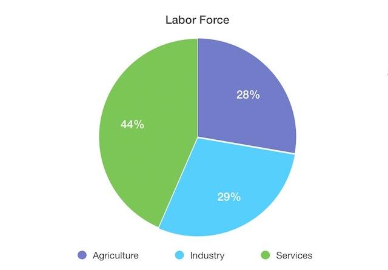

## Table of Contents

## What are the main industries driving the Chinese economy?

The main industries driving the Chinese economy are manufacturing, services, and technology. Manufacturing is very important because China makes a lot of products like electronics, machinery, and cars. Many countries buy these products, which helps the Chinese economy grow. The service industry, including things like tourism, finance, and retail, is also growing quickly. More people are working in these jobs, which helps the economy.

Technology is another big driver of the Chinese economy. Companies like Huawei and Alibaba are leading in areas like smartphones, e-commerce, and artificial intelligence. The government is investing a lot in technology to make China a world leader. This focus on technology is creating new jobs and bringing in more money for the country.

Overall, these three industries - manufacturing, services, and technology - are the main forces behind China's economic growth. They work together to make China's economy strong and keep it growing.

## How has the manufacturing sector contributed to China's economic growth?

The manufacturing sector has been a big help to China's economic growth. China makes a lot of things like clothes, toys, and electronics. Other countries buy these things, which gives China a lot of money. This money helps China build more factories and create more jobs. More jobs mean more people can buy things, which makes the economy grow even more.

Also, China has become really good at making things quickly and cheaply. This is because they have a lot of workers and big factories. When companies from other countries want to make their products, they often choose China because it's less expensive. This has made China a very important place for manufacturing around the world. As a result, China's economy keeps growing and getting stronger.

## What role does the technology industry play in China's economy?

The technology industry is a big part of China's economy. It helps the country grow by making new products like smartphones, computers, and apps. Companies like Huawei, Alibaba, and Tencent are leading the way. They make things that people all over the world want to buy. When people buy these products, it brings money into China's economy. This money helps create more jobs and build more businesses.

The Chinese government is also putting a lot of effort into technology. They want China to be a leader in things like [artificial intelligence](/wiki/ai-artificial-intelligence) and 5G. They spend a lot of money on research and building new technology. This focus on technology is making China's economy stronger. It's also helping China compete with other big countries like the United States. By being good at technology, China can keep growing and becoming more powerful.

## How significant is the agriculture sector in China, and what are its main products?

The agriculture sector is very important in China. It helps feed the big population of the country. Even though manufacturing and technology are big parts of the economy, farming still plays a big role. It gives jobs to many people in the countryside and helps make sure there is enough food for everyone.

The main products from China's agriculture are rice, wheat, corn, and soybeans. They also grow a lot of fruits and vegetables like apples, oranges, and tomatoes. China is one of the biggest producers of these crops in the world. This helps China not only feed its own people but also sell these products to other countries, which brings in more money for the economy.

## What are the key features of China's service industry and its impact on the economy?

The service industry in China includes things like tourism, finance, and retail. It's growing very fast and becoming a bigger part of the economy. More and more people are working in these jobs because they offer good opportunities. For example, China has a lot of tourists visiting places like Beijing and Shanghai. This brings in a lot of money. Also, banks and other financial services are helping businesses grow and people save money.

The service industry helps the economy in many ways. It creates jobs, which means more people can earn money and spend it on things they need. This spending helps other parts of the economy grow too. When the service industry does well, it makes the whole economy stronger. It's like a cycle: more jobs lead to more spending, which leads to more growth. This is why the service industry is so important for China's economic future.

## How does the real estate market influence China's economic landscape?

The real estate market is a big part of China's economy. When people buy houses or apartments, it helps the economy grow. Building new homes creates jobs for construction workers and others. It also means more money for companies that make things like cement and steel. The government makes money from taxes on property too. So, when the real estate market is doing well, it helps the whole economy.

But sometimes, the real estate market can be a problem. If too many people buy houses hoping to sell them for more money later, it can create a bubble. A bubble means prices go up a lot but might fall suddenly. If that happens, it can hurt the economy. The government tries to control this by making rules about buying and selling property. They want to keep the market stable so it helps the economy without causing big problems.

## What is the importance of the automotive industry in China, and how has it evolved?

The automotive industry is very important in China. It helps the economy grow because it makes a lot of cars and trucks. People in China and other countries buy these vehicles, which brings in a lot of money. Making cars also creates jobs for many people, like factory workers and engineers. This means more people can earn money and spend it on things they need, which helps the whole economy.

Over time, the automotive industry in China has changed a lot. At first, China mostly made cars for other companies. But now, Chinese companies like BYD and Geely are making their own cars and even electric vehicles. The government is helping this industry grow by giving money for research and building factories. This focus on electric cars is making China a leader in the world for green technology. As the industry keeps growing, it will keep helping China's economy get stronger.

## How do energy and natural resources sectors contribute to China's industrial base?

The energy and natural resources sectors are very important for China's industries. They provide the power and materials needed to keep factories running and build things. For example, coal and natural gas are used to make electricity, which is needed for all kinds of manufacturing. China has a lot of coal, so it can make a lot of energy to keep its industries going. Also, China needs metals like iron and copper to make cars, machines, and buildings. They get these metals from mining, which helps the economy grow.

Over time, China has been trying to use cleaner energy sources like wind and solar power. This is important because it helps the environment and also makes China less dependent on coal. The government is spending a lot of money to build wind farms and solar panels. This is good for the economy because it creates new jobs and helps China be a leader in green technology. By using different kinds of energy and resources, China can keep its industries strong and growing.

## What are the emerging industries in China that are expected to drive future growth?

Emerging industries in China that are expected to drive future growth include electric vehicles, renewable energy, and biotechnology. Electric vehicles are becoming very popular because the government is pushing for cleaner transportation. Companies like BYD and NIO are making electric cars that people want to buy. This helps the economy grow because it creates jobs and brings in money from other countries that buy these cars. Renewable energy, like wind and solar power, is also growing fast. China wants to use less coal and more clean energy. This is good for the environment and helps the economy by creating new jobs and making China a leader in green technology.

Biotechnology is another important industry that is expected to grow. This includes things like new medicines and ways to grow food better. China is investing a lot in research to find new ways to help people stay healthy and feed the growing population. These new technologies can help the economy by creating high-tech jobs and making China a leader in science. All these emerging industries are helping China's economy become stronger and more modern.

## How does the government's policy affect the development of key industries in China?

The Chinese government plays a big role in helping key industries grow. They make rules and plans to support industries like manufacturing, technology, and electric vehicles. For example, the government gives money to companies to help them do research and build new factories. They also make it easier for these companies to get loans from banks. This helps the industries grow faster and create more jobs. The government also tries to control problems like real estate bubbles by making rules about buying and selling property. This helps keep the economy stable.

The government's focus on technology and green energy is very important. They want China to be a leader in things like artificial intelligence and electric cars. So, they spend a lot of money on these areas. This helps companies like Huawei and BYD grow and compete with other countries. The government also encourages the use of renewable energy like wind and solar power. This is good for the environment and helps create new jobs. By supporting these key industries, the government helps the whole economy grow and become stronger.

## What are the challenges faced by China's major industries in the global market?

China's major industries face several challenges in the global market. One big challenge is competition from other countries. For example, in technology, companies like Huawei have to compete with big American companies like Apple and Google. These companies have been in the market for a long time and have a lot of customers. Also, some countries put rules and taxes on Chinese products to make them more expensive. This makes it harder for Chinese companies to sell their products in other countries.

Another challenge is the need to keep improving and innovating. In industries like electric vehicles and renewable energy, China needs to keep making new and better products to stay ahead. This can be hard because it takes a lot of money and smart people to do research and development. Also, China has to deal with problems like pollution and using too much energy. The world is watching how China handles these issues, and it can affect how other countries see Chinese products. If China can solve these problems, it will help its industries do better in the global market.

## How do international trade and investment impact the key industries of the Chinese economy?

International trade and investment are very important for China's key industries. When China sells things like electronics, cars, and clothes to other countries, it brings a lot of money into the economy. This money helps companies grow and create more jobs. Also, when other countries invest money in China, it helps build new factories and businesses. This makes the industries stronger and helps them make more things to sell around the world. For example, if a foreign company builds a factory in China, it can make products there and sell them to other countries, which helps the Chinese economy grow.

But there are also challenges with international trade and investment. Sometimes, other countries put taxes on Chinese products to make them more expensive. This can make it harder for Chinese companies to sell their things in other countries. Also, if there are big problems between countries, like trade wars, it can hurt China's industries. For example, if another country stops buying Chinese products, it can cause problems for the companies that make those products. So, China needs to keep good relationships with other countries to help its industries do well in the global market.

## References & Further Reading

[1]: Lopez de Prado, M. (2018). ["Advances in Financial Machine Learning."](https://www.amazon.com/Advances-Financial-Machine-Learning-Marcos/dp/1119482089) John Wiley & Sons.

[2]: Chan, E. P. (2009). ["Quantitative Trading: How to Build Your Own Algorithmic Trading Business."](https://github.com/ftvision/quant_trading_echan_book) John Wiley & Sons.

[3]: Aronson, D. R. (2006). ["Evidence-Based Technical Analysis: Applying the Scientific Method and Statistical Inference to Trading Signals."](https://www.amazon.com/Evidence-Based-Technical-Analysis-Scientific-Statistical/dp/0470008741) John Wiley & Sons.

[4]: Jansen, S. (2020). ["Machine Learning for Algorithmic Trading."](https://github.com/stefan-jansen/machine-learning-for-trading) Packt Publishing.

[5]: Li, Y., & Ye, K. (2018). ["Big Data Analytics in the Financial Industry."](https://academic.oup.com/rfs/article/34/7/3213/6210658) Proceedings of the 2018 International Conference on Information Technology and Software Engineering.