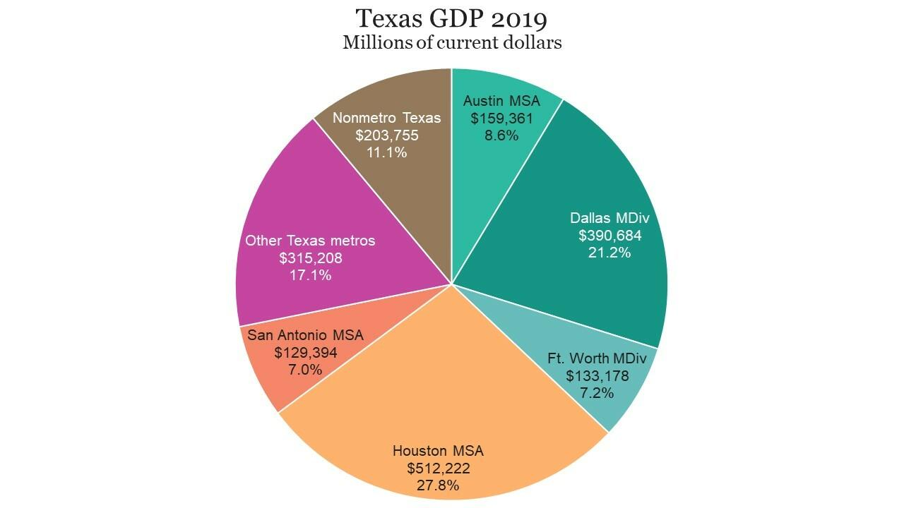

Texas has long been a powerhouse in the U.S. economy, contributing significantly to the national Gross Domestic Product (GDP). Known for its vast size and abundant resources, the state's diverse range of industries continuously drive its economic growth, making it a vital player on the economic stage. Texas's economy is multifaceted, encompassing energy, technology, agriculture, and manufacturing sectors that position it as a leader in various fields. This diversity not only supports stability but also fosters innovation, development, and resilience in the face of economic fluctuations.

In recent years, technological advancements have added new dimensions to traditional economic models. Algorithmic trading, a method of executing orders using automated pre-programmed trading instructions, has emerged as a significant development within the financial sector. This innovation promises enhanced efficiency and sophistication in trading by leveraging complex algorithms and data analysis to make fast trading decisions, which can lead to improved market liquidity and reduced costs.



This article examines the key industries fueling Texas's GDP growth and considers the burgeoning role of algorithmic trading in transforming the economic framework of the state. By exploring these elements, we aim to provide a comprehensive overview of how Texas's economic landscape is evolving in response to technological integration and market demands.

## Table of Contents

## The Supersector: Trade, Transportation, and Utilities

The Trade, Transportation, and Utilities supersector plays a pivotal role in the Texas economy, contributing significantly to the state's overall employment statistics. According to definitions provided by the Bureau of Labor Statistics, this sector encompasses a wide array of subindustries, each integral to economic activity within Texas. This includes wholesale trade, retail trade, transportation, and various utility services. Despite its importance, the sector does not exhibit remarkable growth but continues to provide stable employment opportunities for millions of Texas residents.

The sector's connection to technological and energy advancements is particularly notable. As Texas advances in technology, particularly in logistics and supply chain management, the transportation industry benefits from increased efficiency and cost-effectiveness. Innovations in vehicle automation, intelligent transportation systems, and real-time data analytics are transforming how goods and services are delivered across the state. For instance, the deployment of Internet of Things (IoT) technologies allows for better tracking and management of logistics operations, enhancing overall effectiveness.

Moreover, Texas's strong energy industry underpins the utilities subindustry within this sector. The state's leading role in energy production supports various utility services, facilitating the distribution of electricity and natural gas to both residential and commercial entities. This symbiotic relationship between energy production and utility services underscores the sector's role in maintaining industrial health.

While the supersector's growth may not be as dynamic as others, its essential functions ensure a solid foundation for Texas's economic framework, reaffirming its status as a crucial element of the state's economy.

## Business Services: A Growing Workforce

Business services in Texas play a critical role in the state's economic framework, employing a significant portion of its workforce. According to data from the Bureau of Labor Statistics (BLS), the professional and business services sector encompasses a wide range of subindustries, including architectural, engineering, and computer system design services, all of which have shown notable growth in recent years.

Texas has increasingly become a hub for talent and businesses, particularly in architecture and engineering. This is partly due to the state's investments in infrastructure projects and urban development initiatives, which create ample opportunities for architectural and engineering firms. This growth is reflected in employment [statistics](/wiki/bayesian-statistics) that show the Texan workforce in this sector surpassing the national average.

In the computer systems design industry, Texas has become an attractive destination for tech companies and startups. Major cities such as Austin, often referred to as "Silicon Hills," have developed vibrant tech ecosystems. These areas not only offer substantial employment opportunities but also foster innovation and collaboration among companies, further driving the sector's expansion.

The inclination of companies to relocate or expand their operations in Texas can be attributed to several factors. The state offers a business-friendly environment with competitive tax rates and a relatively low cost of living, which appeals to both individuals and corporations. Moreover, Texas's strategic location and well-established infrastructure support efficient business operations and connectivity.

The state's dedication to workforce development programs further augments the growth of business services. Through initiatives that enhance skill training and education, Texas ensures a steady supply of qualified professionals to meet the demands of burgeoning industries. 

Overall, the business services sector in Texas is distinguished not only by its size but also by its dynamism, driven by an influx of talent and continuous innovation. This growth trajectory augurs well for the state's economic resilience and its ability to adapt to future challenges and opportunities.

## Education and Health Services: Stability and Employment

The education and health services sector in Texas plays a crucial role in employment, serving as a foundation for both stability and growth within the state's labor market. Despite moderate growth compared to other sectors, its integral connection to community wellbeing ensures its enduring relevance.

Hospitals and research facilities are major employers within this sector, ensuring consistent workforce engagement. Texas, home to the renowned Texas Medical Center in Houston, the largest medical complex in the world, boasts a wide array of institutions that both provide cutting-edge medical care and conduct groundbreaking research. These establishments contribute significantly to workforce engagement, employing a large number of healthcare professionals, researchers, and support staff. The University of Texas System, with its multiple campuses and health institutions, also plays a vital role, offering diverse healthcare services and academic programs that help to maintain a steady pool of skilled professionals in the sector.

Moreover, the education subsector, comprising public and private schools, colleges, and universities, represents a stable component. With Texas consistently ranking high in terms of student population, there is an ongoing demand for educators and administrative staff. The Texan education system's expansive scope—from primary to tertiary education—provides a constant source of employment opportunities throughout the state.

Overall, the education and health services sector underscores its importance not just through employment figures but also as a critical component of Texas's community infrastructure. Its capacity to provide stable jobs, even in times of economic flux, is a testament to its foundational role in the state's economy. As the population expands, so too will the demand for health and education services, ensuring the sector's continued contribution to employment stability in Texas.

## Manufacturing: A Mixed Outlook

The manufacturing industry in Texas exerts a considerable influence on the state's economy, contributing significantly to its GDP despite encountering various challenges. This sector encompasses a broad spectrum of industries, including electronics, machinery, and food production. However, chemical manufacturing is notably prominent within Texas, largely due to the state's abundant petroleum resources, which provide the raw materials necessary for chemical production.

Chemical manufacturing stands out as a vibrant segment of the manufacturing industry. Texas's vast petroleum reserves facilitate the production of essential chemicals such as ethylene, propylene, and benzene. These chemicals are foundational components in a range of products, including plastics, synthetic rubber, and pharmaceuticals, underscoring their critical role in both the state and national economy. Additionally, the presence of major petroleum refineries in Texas supports synergistic opportunities between raw material extraction and chemical production, enhancing efficiency and economic value.

Despite these advantages, the Texas manufacturing sector faces hurdles such as fluctuating oil prices, regulatory changes, and international competition. Oil price [volatility](/wiki/volatility-trading-strategies) can affect production costs and profit margins in chemical manufacturing. Furthermore, stringent environmental regulations require companies to invest in cleaner technologies, potentially increasing operational expenses. Internationally, Texas manufacturers compete with countries possessing lower labor costs, pushing them to innovate and optimize processes.

In response to these challenges, Texas manufacturers are increasingly embracing technological advancements and automation. Implementing innovative production techniques, such as advanced robotics and Internet of Things (IoT) systems, assists in maintaining competitiveness by improving efficiency and reducing costs. These advancements also help in complying with environmental regulations by enhancing energy efficiency and minimizing waste.

The outlook for Texas manufacturing, while mixed, remains optimistic, driven by the resilience and adaptability of its industries. The state's commitment to leveraging its natural advantages and investing in technological innovation positions it well to navigate current challenges and capitalize on future opportunities.

## Energy: The Historic Pillar of Texas's Economy

Texas is renowned for its significant contribution to the United States' energy production and employment. The state's energy sector, historically a cornerstone of its economy, has consistently led the nation in various forms of energy generation, including oil, natural gas, and wind energy. According to the U.S. Energy Information Administration, Texas is the largest producer of [crude oil](/wiki/crude-oil) and natural gas in the country, and it also ranks as the top wind energy producer. The large reserves of petroleum resources provide a foundation for Texas's robust chemical manufacturing industry, supporting downstream industries and contributing significantly to the state's GDP.

The energy sector's vitality extends beyond production, as it plays a crucial role in employment within the state. It provides a wide range of job opportunities, from exploration and extraction to refining and distribution. The sector's employment impact is substantial, as it not only includes direct jobs within the energy companies but also indirect employment across supply chains and ancillary services.

However, the energy industry in Texas faces challenges, including cyclical economic downturns and fluctuating global oil prices. Recent downturns have highlighted the volatility of reliance on fossil fuels and the associated risks for the state's economic health. These challenges are not only economic but also environmental, as pressure mounts to transition towards more sustainable and cleaner energy sources.

The effects of the energy sector's health ripple through other sectors of the Texan economy such as trade and hospitality. For instance, a thriving energy sector boosts regional trade, trucking, and transportation industries, as energy products are a key component of state and national exports. Conversely, downturns can depress demand for services and goods associated with hospitality and retail, impacting broad swathes of tertiary sectors tied to consumer spending power generated from energy industry wages.

Overall, while the energy sector remains a historic and pivotal element of Texas's economic framework, its future trajectory may depend on how swiftly it can adapt to current economic and environmental trends. This adaptation includes exploring new technologies and innovations, such as renewables and increased energy efficiency, to sustain its contribution to the state's economy in the long term.

## Financial Services: An Evolving Sector

Texas's financial sector is undergoing significant transformation as traditional services adapt to integrate technological advancements. This evolution is evident in the increasing adoption of [algorithmic trading](/wiki/algorithmic-trading), which is revolutionizing investment strategies and decision-making processes.

Algorithmic trading employs complex algorithms to execute trades at speeds and frequencies far exceeding human capabilities. These algorithms analyze various data inputs and can execute trades based on predetermined criteria, minimizing human intervention. The technology's impact on the financial markets is profound, offering benefits such as increased trading efficiency, reduced transaction costs, and enhanced market [liquidity](/wiki/liquidity-risk-premium).

The rise of algorithmic trading in Texas is facilitated by the state's robust technological infrastructure and its growing pool of tech-savvy professionals. As financial institutions increasingly rely on data-driven strategies, algorithmic trading offers a competitive edge by enabling the processing of vast amounts of information to identify trading opportunities. This shift toward automation allows firms to react swiftly to market changes, optimizing their investment outcomes.

Furthermore, the adoption of [machine learning](/wiki/machine-learning) and [artificial intelligence](/wiki/ai-artificial-intelligence) within algorithmic trading systems has enhanced their predictive capabilities. Machine learning algorithms can detect patterns and trends in historical data, improving forecast accuracy. For instance, a basic Python implementation that illustrates the use of machine learning in algorithmic trading might involve the following steps:

```python
import pandas as pd
from sklearn.model_selection import train_test_split
from sklearn.ensemble import RandomForestClassifier
from sklearn.metrics import accuracy_score

# Load financial data
data = pd.read_csv('financial_data.csv')

# Feature selection and target variable
features = data[['open_price', 'high_price', 'low_price', 'volume']]
target = data['close_price_direction']  # 1 for up, 0 for down

# Split data into training and testing sets
X_train, X_test, y_train, y_test = train_test_split(features, target, test_size=0.2, random_state=42)

# Train the model
model = RandomForestClassifier(n_estimators=100, random_state=42)
model.fit(X_train, y_train)

# Predict and evaluate
predictions = model.predict(X_test)
accuracy = accuracy_score(y_test, predictions)

print(f'Model Accuracy: {accuracy:.2f}')
```

Such implementations leverage historical market data to train algorithms capable of making predictions about future price movements, potentially offering significant returns. However, they also introduce new challenges, including increased market volatility and the need for regulatory oversight to prevent potential misuse.

Texas's strategic adoption of algorithmic trading reflects a broader trend within the financial services sector, where technology-driven solutions offer a pathway to enhanced competitiveness and innovation. As the sector continues to embrace these advancements, Texas is well-positioned to maintain its status as a dynamic hub for financial services.

## Algorithmic Trading: The New Frontier

Algorithmic trading, also known as algo trading, is revolutionizing the financial landscape in Texas by automating and optimizing trading strategies through the use of advanced algorithms. This method leverages sophisticated mathematical models and high-speed computations to make data-driven decisions, reducing human error and enhancing market efficiency.

In Texas, a state renowned for its robust financial and technological sectors, algorithmic trading is becoming increasingly prevalent. By utilizing vast datasets and high-frequency trading platforms, financial institutions can execute trades at speeds and volumes unattainable by traditional methods. This shift towards algorithmic strategies not only streamlines trading processes but also improves the precision and timing of buy and sell orders, thereby maximizing returns and minimizing risks.

The efficiency gains from algorithmic trading are considerable. Algorithms can process complex datasets, identify patterns, and execute trades in microseconds. This rapid processing power allows traders to respond to market changes in real-time, thereby capitalizing on short-lived opportunities that would otherwise be missed. One of the key benefits of algo trading is its ability to backtest trading strategies using historical data. By simulating trades against past market conditions, traders can refine their strategies, ensuring robustness and profitability before implementation.

Moreover, algorithmic trading enhances decision-making by eliminating emotional biases. Traditional trading can be influenced by fear or greed, leading to suboptimal decisions. Algorithms, however, follow a set of predetermined rules and criteria, ensuring consistent and objective trading behavior. This impartial approach not only enhances performance but also offers transparency, as all trading decisions are based on a defined logic.

As the financial sector in Texas continues to evolve, the adoption of algorithmic trading is set to grow, driven by advancements in artificial intelligence and machine learning. These technologies further increase the sophistication of trading algorithms, enabling them to learn from data and adapt to changing market conditions. For instance, machine learning algorithms can identify subtle market signals and trends that are not easily discernible by human traders, thereby offering a competitive edge.

In conclusion, algorithmic trading is reshaping investment strategies in Texas by promoting automation, efficiency, and data-driven decision making. As financial markets become more complex, the reliance on powerful algorithms will likely intensify, solidifying Texas's position as a leader in financial innovation and economic growth.

## Conclusion

The diverse industrial landscape of Texas remains pivotal to its GDP growth and economic resilience. Texas, as a leading economic force in the United States, benefits from an array of robust industries including energy, manufacturing, technology, and financial services. This intricate mosaic of sectors ensures that Texas's economy possesses an inherent adaptability, capable of weathering fluctuations and seizing opportunities. As traditional sectors continue to evolve, the integration and influence of emerging technologies such as algorithmic trading become crucial. This cutting-edge advancement is poised to redefine financial services by enhancing efficiency, precision, and the scalability of operations. Algorithmic trading leverages complex algorithms to automate and optimize trading strategies, significantly impacting decision-making processes. As a result, Texas's economic stature is bolstered, making it a key player in the global market context. Furthermore, the state's ability to adapt and evolve signifies that its economic trajectory will likely maintain its robust growth, promoting resilience and sustained prosperity amid changing market dynamics.

## References & Further Reading

[1]: Lopez de Prado, M. (2018). ["Advances in Financial Machine Learning."](https://www.amazon.com/Advances-Financial-Machine-Learning-Marcos/dp/1119482089) John Wiley & Sons.

[2]: Aronson, D. R. (2006). ["Evidence-Based Technical Analysis: Applying the Scientific Method and Statistical Inference to Trading Signals."](https://www.amazon.com/Evidence-Based-Technical-Analysis-Scientific-Statistical/dp/0470008741) Wiley.

[3]: Jansen, S. (2020). ["Machine Learning for Algorithmic Trading."](https://github.com/stefan-jansen/machine-learning-for-trading) Packt Publishing.

[4]: Chan, E. P. (2008). ["Quantitative Trading: How to Build Your Own Algorithmic Trading Business."](https://github.com/egorpe/EPChan-QuantitativeTrading/blob/master/example7_6.m) John Wiley & Sons.

[5]: U.S. Energy Information Administration. ["Texas State Profile and Energy Estimates."](https://www.eia.gov/state/?sid=TX)