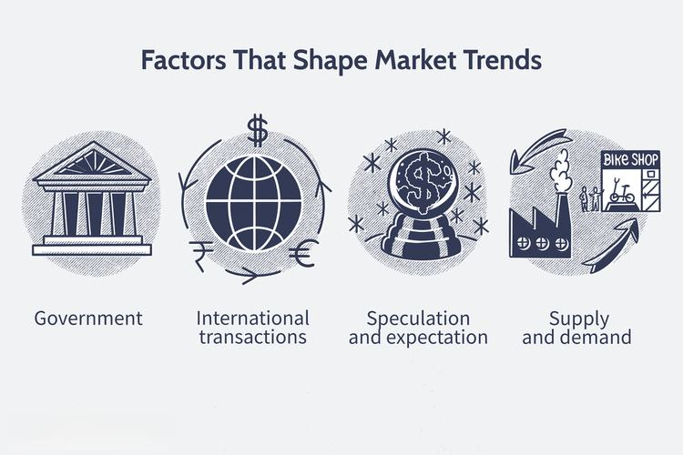

The United States boasts a vibrant and diverse economy enriched by multiple thriving industries. As of recent years, pivotal sectors such as technology, healthcare, and construction have played significant roles in driving the nation's economic growth. Technology continues to transform industries with innovations such as artificial intelligence and cloud computing, fostering both efficiency and new employment opportunities. Healthcare remains indispensable, propelled by an aging population and ongoing medical advancements. Simultaneously, construction sees sustained demand driven by population growth and infrastructure needs.

In tandem with these established sectors, algorithmic trading emerges as a transformative trend reshaping the economic landscape. This innovative approach employs mathematical models and automated systems to optimize trading processes in financial markets. By enhancing speed and precision, algorithmic trading contributes significantly to market efficiency and liquidity.

This article explores the key industries propelling the U.S. economy, detailing their contributions to growth and innovation. It further examines the role of algorithmic trading as an economic driver, highlighting its influence on market behaviors and the broader economic implications. This exploration underscores the complex yet dynamic nature of the U.S. economy, shaped by both traditional industries and modern technological advances.

## Table of Contents

## Key Industries Fueling U.S. Economic Growth

The United States economy is characterized by its diversity and adaptability, with multiple sectors playing significant roles in its sustained growth and dynamism. At the forefront of this economic engine are key industries such as healthcare, technology, and construction.

Healthcare is a critical pillar, largely driven by demographic changes including an aging population. This sector has been instrumental in economic recovery post the 2008 financial crisis, primarily through the creation of millions of jobs. Medical innovations and healthcare reforms have further amplified the demand for medical services, making it a vital component of economic stability and expansion.

Technological advancements have served as a formidable catalyst for economic growth. The technology sector has seen impressive employment expansion, spurred by innovations in artificial intelligence (AI), machine learning, and cloud computing. These technologies are reshaping other industries, including healthcare, manufacturing, and retail, by enhancing innovation and operational efficiency. The intrinsic link between technology and these sectors enables a ripple effect, whereby technological progress significantly boosts overall economic productivity.

Construction remains an essential driver of growth, fueled by ongoing population increases and urbanization. This sector's contributions are evident in its record-level spending, adding substantial figures to the national Gross Domestic Product (GDP). Within construction, various sub-sectors, such as residential and nonresidential development, are experiencing noteworthy growth, underscoring their importance in meeting the evolving infrastructural needs of the nation.

In addition to these primary industries, retail and manufacturing, particularly the production of non-durable goods, are indispensable to the U.S. economy. Retail serves as a backbone by providing vast employment opportunities and a significant share of GDP. The manufacturing of non-durable goods, which includes products consumed over a short period, is crucial for daily operations and consumer satisfaction. As consumer behaviors and technologies evolve, both sectors face continuous transformation, driving changes in supply chains and production methodologies. 

Together, these industries form the bedrock of the U.S. economic structure, with each playing a specialized role in fostering growth, innovation, and resilience.

## The Role of Healthcare

Healthcare has maintained its status as a cornerstone of the United States economy, especially since the financial crisis of 2008. This sector's importance is underscored by a demographic shift towards an aging population, which inherently increases the demand for medical services. According to the U.S. Census Bureau, by 2030, all baby boomers will be age 65 or older, expanding the size of the older population so that one in every five residents will be at retirement age. This demographic trend necessitates the expansion of healthcare services, facilities, and workforce.

Between 2006 and 2016, the healthcare sector experienced noteworthy growth, significantly contributing to the U.S. labor market by adding millions of jobs. The Bureau of Labor Statistics reported that healthcare had one of the fastest employment growth rates during this period, a trend that continues as healthcare occupations are projected to grow faster than the average for all occupations in the coming decade. This job creation is crucial not only for economic stability but also for providing essential services to a growing number of patients.

Medical advances, including innovations in pharmaceuticals, biotechnology, and healthcare delivery systems, have also been pivotal in catalyzing healthcare demand. These advances have led to better diagnosis, treatment, and management of diseases, increasing the longevity and quality of life. Moreover, the Affordable Care Act and subsequent healthcare reforms have expanded access to healthcare services, allowing more individuals to seek and receive medical care. This expansion of access has fueled further growth in the sector, both in terms of service provision and economic contribution.

The integration of technology in healthcare, such as electronic health records (EHRs), telemedicine, and mobile health applications, has made healthcare more efficient and accessible. These technological enhancements contribute to the sector’s ability to meet demand efficiently, thus supporting its economic role. In conclusion, due to the interplay of demographic changes, medical advancements, and health policy reforms, healthcare continues to be a pivotal industry driving U.S. economic growth.

## Technological Advancements and Their Impact

The tech sector serves as a formidable catalyst for economic strength in the United States, creating a surge in employment opportunities and spurring significant advancements across various industries. At the forefront of these technological advancements lie [artificial intelligence](/wiki/ai-artificial-intelligence) (AI), [machine learning](/wiki/machine-learning) (ML), and cloud computing, each contributing uniquely to economic growth and transformation.

Artificial intelligence and machine learning technologies are advancing at an unprecedented pace, providing industries with tools to enhance productivity and innovation. AI and ML enable the automation of complex tasks, improve decision-making processes, and offer predictive analytics. For instance, in the manufacturing industry, machine learning algorithms can optimize supply chain operations by predicting demand more accurately, thereby reducing waste and increasing efficiency. These technologies also play a pivotal role in personalizing customer experiences in retail, which can lead to increased customer satisfaction and loyalty.

Cloud computing is another critical technological advancement that has revolutionized how businesses operate. By allowing companies to store and process data over the internet rather than on local servers, cloud computing offers scalability, flexibility, and cost savings. This technology is fundamental for businesses of all sizes, enabling them to access powerful computational resources and vast amounts of storage without the need for substantial capital investment. The healthcare sector, for instance, benefits from cloud-based solutions by facilitating enhanced data sharing among medical professionals, which can improve patient outcomes and streamline administrative processes.

Furthermore, the intersection of these technologies underscores their impact on other sectors. In healthcare, AI-driven diagnostic tools and cloud-based platforms for telemedicine are transforming patient care and operational efficiency. In retail, machine learning algorithms analyze consumer behavior to tailor marketing strategies, while cloud-based inventory systems allow for real-time management and forecasting.

By accelerating innovation and operational efficiency, these technological advancements drive economic growth, creating new business models and job opportunities. The tech sector's ability to influence and improve traditional industries such as manufacturing, healthcare, and retail illustrates its critical role in shaping a dynamic and resilient U.S. economy.

## Construction as an Economic Driver

Population growth has been a significant [factor](/wiki/factor-investing) propelling the demand for construction across the United States. This demand extends beyond residential housing to include infrastructure and commercial projects necessary to support expanding urban and suburban areas. As of the latest data, construction spending in the U.S. has reached unprecedented levels, contributing significantly to the national GDP. This investment reflects both the immediate needs of a growing population and the long-term strategic planning for sustainable urban development. 

Construction spending encompasses various sub-sectors, each experiencing notable growth. Residential construction, driven by increasing household formation and urban migration, has seen substantial investment. This growth is evident in the development of single-family homes, multifamily units, and condominiums responding to the diverse housing preferences across demographic segments.

Additionally, the nonresidential construction sector is undergoing significant expansion. This includes the construction of commercial facilities such as shopping centers and office buildings, as well as institutional structures like schools and healthcare facilities. Infrastructure projects, including transportation networks and utilities, are also pivotal, driven by both public investments and private partnerships aiming to enhance connectivity and support economic activities.

This increase in construction activity not only contributes directly to GDP but also plays a critical role in employment. The sector is a significant employer in the U.S., offering jobs in various trades and professions, from on-site laborers to engineers and project managers. The multiplier effect of construction is substantial, as it stimulates demand in related industries such as building materials, transportation, and real estate services.

In summary, the U.S. construction industry serves as a vital economic driver, fueled by both demographic trends and strategic investments. The sector's growth not only addresses current housing and infrastructure demands but also lays the groundwork for future economic resilience and development.

## Retail and Non-Durable Manufacturing

Retail is a cornerstone of the U.S. economy, significantly contributing to both employment and GDP. As of recent estimates, the retail sector employs approximately 32 million Americans, accounting for about 10% of the total U.S. labor force. Retail activity spans numerous sub-sectors, including traditional brick-and-mortar stores, e-commerce, and direct-to-consumer models, each dynamically adapting to technological advancements and shifts in consumer preferences.

E-commerce, in particular, has experienced exponential growth, driven by innovations in logistical frameworks, payment systems, and digital marketing strategies. The rise of online marketplaces such as Amazon, eBay, and Walmart has transformed traditional shopping paradigms, emphasizing convenience and choice. This digital evolution is supported by data analytics, which allows retailers to tailor their offerings to specific consumer needs and behaviors, optimizing operational efficiency and customer satisfaction.

Non-durable manufacturing plays an equally vital role by focusing on the production of goods with a short lifespan, typically less than three years. These goods include food and beverages, clothing, and personal care products, integral to daily consumption patterns. The sector's importance is underscored by its resilience to economic fluctuations due to the inelastic nature of demand for these essential goods.

Technological influences are profoundly reshaping both retail and non-durable manufacturing sectors. Automation, artificial intelligence, and machine learning have been integrated into supply chain management and production processes, enhancing speed, precision, and cost-effectiveness. Retailers and manufacturers are increasingly employing predictive analytics to forecast demand, manage inventory, and reduce waste, thus aligning production with consumer trends.

Moreover, sustainability initiatives are gaining traction, as both consumers and regulatory frameworks push for eco-friendly practices. These initiatives include reducing carbon footprints, using recyclable materials, and minimizing waste, which not only meet regulatory compliance but also appeal to the environmentally-conscious consumer base.

In summary, retail and non-durable manufacturing are pivotal to the U.S. economy, continuously adapting to changing consumer behaviors and technological advancements. These sectors' ability to innovate and respond to market dynamics remains crucial for sustaining economic growth and resilience.

## Algorithmic Trading: A Modern Economic Driver

Algorithmic trading employs the use of mathematical models and automated systems to facilitate the buying and selling of securities. It enhances the efficiency of financial markets by executing transactions at speeds and precision levels that are impossible for human traders to match. The core advantage of [algorithmic trading](/wiki/algorithmic-trading) is its ability to process vast amounts of data rapidly, identifying market trends and executing trades within milliseconds based on pre-set criteria.

The automated nature of algorithmic trading allows for the execution of many trades across various markets simultaneously, optimizing returns and minimizing the risks associated with manual trading. By doing so, it significantly influences market behavior. When these algorithms execute numerous small trades, they contribute to price adjustments, potentially impacting market trends over both short and long terms.

Speed and precision translate into cost efficiency, as faster trade execution can lead to more favorable price points and reduced market impact costs. Market [liquidity](/wiki/liquidity-risk-premium) is bolstered by algorithmic trading as these systems contribute to a higher rate of trades and tighter bid-ask spreads. Enhanced liquidity helps ensure that securities can be bought and sold quickly without a significant effect on their prices.

Algorithmic trading has reshaped regulatory policies. Regulatory bodies have been motivated to adapt rules addressing potential risks associated with these automated systems, such as the propensity for erroneous trades, flash crashes, and systemic risks to the financial markets. Policies like the U.S. SEC's Regulation National Market System (Reg NMS) aim to promote fairness in order routing and pricing, ensuring that algorithmic trading aligns with the overall market integrity.

Thus, algorithmic trading represents a transformational force within financial markets, offering unprecedented levels of efficiency, influencing both market dynamics and regulatory frameworks.

## Integration of Algo Trading in Key Sectors

Algorithmic trading, traditionally associated with the financial sector, is increasingly influencing various industries beyond finance. In technology and manufacturing, the adoption of algo trading principles is evident in the widespread use of data-driven decision-making processes and predictive analytics, leveraging extensive datasets to extract insights and optimize operations.

In the technology sector, algorithms are integral to machine learning and artificial intelligence applications, where they enable real-time processing and analysis of large data volumes. Companies employ algorithms to predict user behavior, enhance customer experience, and tailor products to individual preferences, thus gaining a competitive edge. For instance, recommendation systems like those used by Netflix and Amazon rely heavily on algorithms to analyze past user interactions and predict future behaviors.

Manufacturing also benefits from algorithmic applications, particularly through predictive maintenance and supply chain optimization. Algorithmic models predict equipment failures before they occur, reducing downtime and saving costs associated with unexpected disruptions. Algorithms also optimize inventory levels, procurement strategies, and logistics, improving efficiency and reducing waste.

The cross-sector application of algorithms extends to areas such as marketing, where predictive analytics inform campaign strategies by identifying potential customers and predicting their purchasing behavior. These practices enhance resource allocation and maximize return on investment, illustrating the transformative impact of algorithmic thinking across industries.

This integration of algo trading principles fosters innovation and economic growth by enhancing operational efficiencies, reducing costs, and creating new opportunities for value creation. As industries continue to recognize the potential of algorithms, the cross-sector synergy will likely drive further advancements and bolster the U.S. economy's resilience.

## Conclusion

The U.S. economy exemplifies a dynamic interplay between traditional sectors and cutting-edge innovations. Central to this economic resilience are industries such as healthcare, technology, and retail. The healthcare sector continues to thrive, driven by the needs of an aging population and ongoing medical advancements. This growth is not only vital for job creation but also for maintaining public well-being, thereby reinforcing economic stability.

Technological innovation further bolsters the U.S. economy through its transformative impact across various sectors. With technologies like artificial intelligence, machine learning, and cloud computing underpinning modern advancements, the tech industry catalyzes growth by enabling higher efficiency and fostering innovation. These technologies also ripple outwards to enhance productivity and innovation in industries such as healthcare, manufacturing, and retail, underscoring their extensive influence.

Retail remains a fundamental component of the economy, providing significant employment and contributing substantially to the GDP. Non-durable manufacturing plays an equally crucial role by ensuring the continuous availability of essential goods. Together, these sectors adapt to shifting consumer preferences and technological changes, ensuring continued economic vitality.

In parallel, algorithmic trading emerges as a transformational force within the financial sector. By employing complex mathematical models and automated processes, algorithmic trading heightens market efficiency and accuracy in transactions. This modern approach not only streamlines operations within financial markets but also contributes to improved liquidity and market behavior. Furthermore, the principles of algorithmic trading extend beyond finance, influencing sectors such as technology and manufacturing, where data-driven decision-making is increasingly driving innovation and growth.

In conclusion, the U.S. economy thrives on a sophisticated mix of enduring industries and modern technological advancements. While traditional sectors like healthcare, technology, and retail provide a stable foundation for economic resilience, the infusion of algorithmic trading represents a forward-thinking shift, enhancing market dynamics and promoting cross-sector innovation. This synergy between conventional industries and technological evolution is pivotal to sustaining and advancing the economic landscape of the United States.

## References & Further Reading

[1]: Bergstra, J., Bardenet, R., Bengio, Y., & Kégl, B. (2011). ["Algorithms for Hyper-Parameter Optimization."](https://dl.acm.org/doi/10.5555/2986459.2986743) Advances in Neural Information Processing Systems 24.

[2]: ["Advances in Financial Machine Learning"](https://www.amazon.com/Advances-Financial-Machine-Learning-Marcos/dp/1119482089) by Marcos Lopez de Prado

[3]: ["Evidence-Based Technical Analysis: Applying the Scientific Method and Statistical Inference to Trading Signals"](https://www.amazon.com/Evidence-Based-Technical-Analysis-Scientific-Statistical/dp/0470008741) by David Aronson

[4]: ["Machine Learning for Algorithmic Trading"](https://github.com/stefan-jansen/machine-learning-for-trading) by Stefan Jansen

[5]: ["Quantitative Trading: How to Build Your Own Algorithmic Trading Business"](https://www.amazon.com/Quantitative-Trading-Build-Algorithmic-Business/dp/1119800064) by Ernest P. Chan