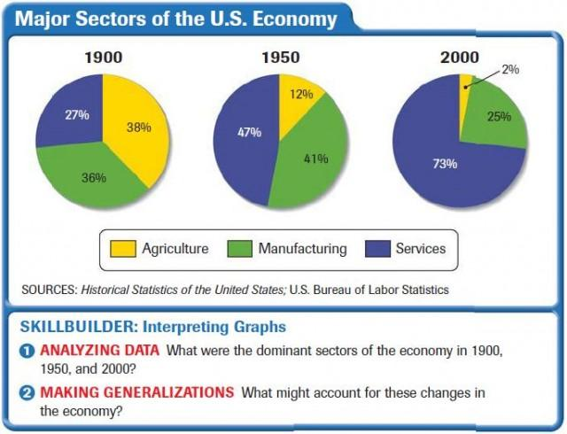

## Table of Contents

## What are the key industries that significantly impact the U.S. economy?

The U.S. economy is influenced by many industries, but some have a bigger impact than others. The technology industry is one of the most important. Companies like Apple, Microsoft, and Google create a lot of jobs and make a lot of money. They also help other businesses by providing tools and services that make them more efficient. The healthcare industry is another key player. It employs millions of people, from doctors and nurses to administrative staff. As the population grows and ages, the demand for healthcare services keeps increasing, making this sector crucial for the economy.

Another significant industry is finance. Banks, investment firms, and insurance companies are all part of this sector. They manage money, provide loans, and help businesses grow. The finance industry is essential for keeping the economy stable and helping it grow. Manufacturing is also very important. This industry makes products like cars, electronics, and machinery. It creates jobs and exports goods to other countries, which helps the U.S. economy. Together, these industries play a big role in shaping the economic health of the country.

## How does the technology sector contribute to the U.S. economy?

The technology sector is a big part of the U.S. economy. It creates many jobs for people who work in tech companies like Apple, Microsoft, and Google. These jobs help people earn money and spend it on things they need. Tech companies also make a lot of money from selling their products and services, like smartphones, computers, and software. This money helps the economy grow because it can be used to start new businesses or expand existing ones.

Tech companies also help other businesses by making them more efficient. For example, a small business can use software to manage its finances or sell products online. This helps the business save time and money, which is good for the economy. The technology sector also drives innovation, which means new ideas and inventions that can lead to new industries and jobs. Overall, the technology sector is important because it creates jobs, makes money, and helps other businesses succeed.

## What role does the healthcare industry play in the U.S. economic landscape?

The healthcare industry is a big part of the U.S. economy. It gives jobs to millions of people, like doctors, nurses, and people who work in hospitals and clinics. These jobs help people earn money and spend it on things they need. The healthcare industry also makes a lot of money from providing services like medical care and medicine. This money helps the economy grow because it can be used to start new businesses or expand existing ones.

As the population grows and gets older, more people need healthcare services. This means the healthcare industry keeps getting bigger and more important. It not only takes care of people's health but also helps the economy by creating jobs and making money. Overall, the healthcare industry is crucial because it supports people's well-being and helps the economy stay strong.

## How does the financial services sector influence the U.S. economy?

The financial services sector is really important for the U.S. economy. It includes banks, investment firms, and insurance companies. These businesses help manage money, give out loans, and help other businesses grow. When a company needs money to start or expand, they can get a loan from a bank. This helps businesses create jobs and make more products or services. The financial sector also helps people save and invest their money, which can lead to more money being spent in the economy.

The financial services sector also keeps the economy stable. It does this by managing risks and making sure money is used wisely. For example, insurance companies help people and businesses recover from unexpected events like accidents or natural disasters. This helps the economy stay strong because people can keep working and businesses can keep running. Overall, the financial services sector is key because it helps businesses grow, people save and invest, and the economy stay stable.

## What is the impact of the manufacturing industry on the U.S. economy?

The manufacturing industry is a big part of the U.S. economy. It makes things like cars, electronics, and machines. When these things are made, it creates jobs for a lot of people. These jobs help people earn money and spend it on things they need. The manufacturing industry also makes a lot of money from selling these products. Some of these products are sold in the U.S., and some are sent to other countries. When products are sold to other countries, it helps the U.S. economy because it brings in more money.

The manufacturing industry also helps other parts of the economy. For example, when a car factory needs parts, it buys them from other companies. This helps those companies grow and create more jobs. Manufacturing also helps with new ideas and inventions. When new products are made, it can lead to new businesses and more jobs. Overall, the manufacturing industry is important because it creates jobs, makes money, and helps other businesses succeed.

## How does the energy sector affect the U.S. economy, including both traditional and renewable sources?

The energy sector is a big part of the U.S. economy. It includes traditional sources like oil, gas, and coal, and renewable sources like wind, solar, and hydroelectric power. Traditional energy sources have been important for a long time. They create jobs for people who work in oil fields, coal mines, and power plants. These jobs help people earn money and spend it on things they need. Traditional energy also makes a lot of money from selling oil, gas, and coal. Some of this energy is used in the U.S., and some is sold to other countries. This helps the U.S. economy because it brings in more money.

Renewable energy sources are becoming more important. They create jobs for people who work in wind farms, solar panel installations, and hydroelectric plants. These jobs help people earn money and spend it on things they need. Renewable energy also makes money from selling clean power. As more people and businesses want to use clean energy, the renewable energy industry grows. This helps the U.S. economy because it creates new jobs and new ways to make money. Overall, the energy sector, both traditional and renewable, is important because it creates jobs, makes money, and helps the economy grow.

## What is the significance of the agriculture industry in the U.S. economy?

The agriculture industry is a big part of the U.S. economy. It includes farming, ranching, and growing crops like corn, wheat, and fruits. Farmers and ranchers work hard to produce food that people eat every day. This industry creates a lot of jobs for people who work on farms, in food processing, and in transportation. These jobs help people earn money and spend it on things they need. The agriculture industry also makes a lot of money from selling food. Some of this food is sold in the U.S., and some is sent to other countries. When food is sold to other countries, it helps the U.S. economy because it brings in more money.

The agriculture industry also helps other parts of the economy. For example, when farmers grow crops, they need equipment like tractors and seeds. They buy these things from other companies, which helps those companies grow and create more jobs. Agriculture also helps with new ideas and inventions. When new ways of farming are developed, it can lead to new businesses and more jobs. Overall, the agriculture industry is important because it creates jobs, makes money, and helps other businesses succeed.

## How do retail and consumer goods industries drive economic activity in the U.S.?

The retail and consumer goods industries are big parts of the U.S. economy. They include stores where people buy things like clothes, food, and electronics. These industries create a lot of jobs for people who work in stores, factories, and warehouses. These jobs help people earn money and spend it on things they need. Retail and consumer goods also make a lot of money from selling products. When people buy things, it helps the economy grow because it means more money is being used.

The retail and consumer goods industries also help other parts of the economy. For example, when a store sells clothes, it buys those clothes from a company that makes them. This helps that company grow and create more jobs. These industries also help with new ideas and inventions. When new products are made, it can lead to new businesses and more jobs. Overall, the retail and consumer goods industries are important because they create jobs, make money, and help other businesses succeed.

## What is the role of the transportation and logistics industry in the U.S. economy?

The transportation and logistics industry is really important for the U.S. economy. It includes things like trucks, trains, ships, and airplanes that move goods and people around. This industry creates a lot of jobs for drivers, pilots, and people who work in warehouses. These jobs help people earn money and spend it on things they need. The transportation and logistics industry also makes a lot of money from moving goods. When goods are moved from one place to another, it helps businesses sell their products and make more money.

The transportation and logistics industry also helps other parts of the economy. For example, when a factory makes cars, it needs to send them to stores. The transportation industry helps move those cars. This helps the factory and the stores make more money. The transportation and logistics industry also helps with new ideas and inventions. When new ways of moving goods are developed, it can lead to new businesses and more jobs. Overall, the transportation and logistics industry is important because it creates jobs, makes money, and helps other businesses succeed.

## How does the real estate market influence the U.S. economy?

The real estate market is a big part of the U.S. economy. It includes buying, selling, and renting homes, buildings, and land. When people buy or rent homes, it creates jobs for real estate [agents](/wiki/agents), builders, and people who work in banks. These jobs help people earn money and spend it on things they need. The real estate market also makes a lot of money from selling and renting properties. When people buy homes, it helps the economy grow because it means more money is being used.

The real estate market also helps other parts of the economy. For example, when someone buys a new home, they often need to buy furniture and appliances. This helps stores that sell these things make more money. The real estate market also helps with new ideas and inventions. When new types of homes or buildings are built, it can lead to new businesses and more jobs. Overall, the real estate market is important because it creates jobs, makes money, and helps other businesses succeed.

## What are the emerging industries that are expected to shape the future of the U.S. economy?

Emerging industries are new and growing sectors that will play a big role in the future of the U.S. economy. One of these is the green energy industry. This includes things like solar power, wind power, and electric cars. As more people care about the environment, these industries are growing fast. They create new jobs for people who work on solar panels, wind turbines, and electric vehicles. These jobs help people earn money and spend it on things they need. The green energy industry also makes money from selling clean power and electric cars. This helps the economy grow because it means more money is being used.

Another important emerging industry is biotechnology. This involves using science to make new medicines and treatments for diseases. As the population grows and gets older, the demand for new medicines and treatments is increasing. The biotechnology industry creates jobs for scientists, researchers, and people who work in labs. These jobs help people earn money and spend it on things they need. The biotechnology industry also makes money from selling new medicines and treatments. This helps the economy grow because it means more money is being used. Overall, the green energy and biotechnology industries are expected to shape the future of the U.S. economy by creating jobs and making money.

## How do government policies and regulations impact the performance and growth of key industries in the U.S.?

Government policies and regulations have a big impact on how key industries in the U.S. perform and grow. These policies can help or hurt industries. For example, if the government gives tax breaks to the technology industry, it can help those companies grow and create more jobs. On the other hand, if the government puts strict rules on the energy industry, it might be harder for those companies to make money and grow. The government can also spend money on things like building roads or schools, which helps industries like construction and education grow.

Regulations are also important because they can affect how businesses work. For example, rules about safety in the workplace can make it more expensive for companies to operate, but they also help keep workers safe. Rules about the environment can make it harder for some industries, like oil and gas, to do business, but they help protect the planet. Overall, government policies and regulations play a big role in shaping how well industries do and how fast they can grow. They can help industries by giving them money or making it easier to do business, or they can make it harder by putting strict rules in place.

## References & Further Reading

[1]: Bergstra, J., Bardenet, R., Bengio, Y., & Kégl, B. (2011). ["Algorithms for Hyper-Parameter Optimization."](https://dl.acm.org/doi/10.5555/2986459.2986743) Advances in Neural Information Processing Systems 24.

[2]: ["Advances in Financial Machine Learning"](https://www.amazon.com/Advances-Financial-Machine-Learning-Marcos/dp/1119482089) by Marcos Lopez de Prado

[3]: ["Evidence-Based Technical Analysis: Applying the Scientific Method and Statistical Inference to Trading Signals"](https://www.amazon.com/Evidence-Based-Technical-Analysis-Scientific-Statistical/dp/0470008741) by David Aronson

[4]: ["Machine Learning for Algorithmic Trading"](https://github.com/stefan-jansen/machine-learning-for-trading) by Stefan Jansen

[5]: ["Quantitative Trading: How to Build Your Own Algorithmic Trading Business"](https://www.amazon.com/Quantitative-Trading-Build-Algorithmic-Business/dp/1119800064) by Ernest P. Chan