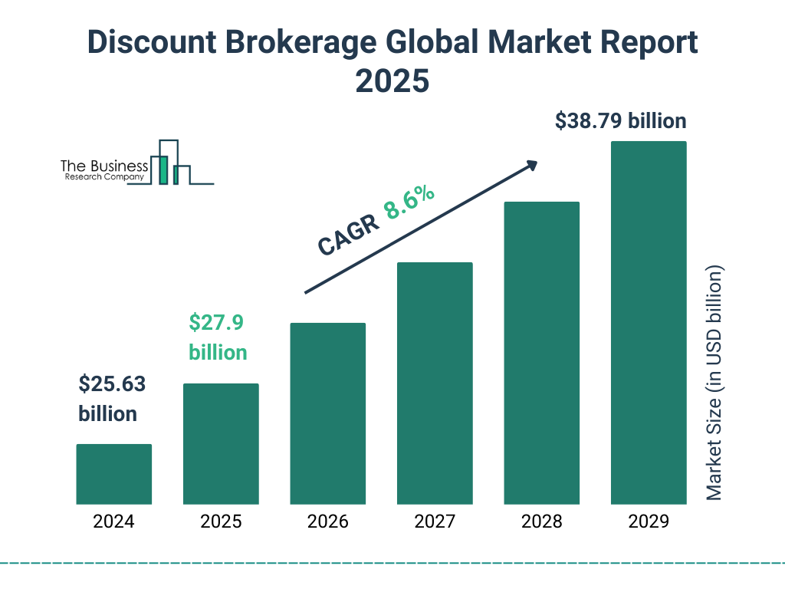

## Table of Contents

## What is a discount broker?

A discount broker is a type of brokerage firm that charges lower fees and commissions compared to traditional full-service brokers. They offer a platform for people to buy and sell stocks, bonds, and other investments at a reduced cost. Discount brokers usually do not provide investment advice or extensive research, focusing instead on providing a simple and cost-effective way for individuals to manage their own investments.

These brokers are popular among people who are comfortable making their own investment decisions and want to save money on fees. With the rise of the internet, discount brokers have become more accessible, allowing people to trade online from anywhere. Examples of well-known discount brokers include Robinhood, E*TRADE, and Charles Schwab. By using a discount broker, investors can keep more of their money working for them in the market rather than paying high fees to a broker.

## How do discount brokers differ from full-service brokers?

Discount brokers and full-service brokers are different in how they help people with their investments. Discount brokers charge less money for their services. They let people buy and sell stocks and other investments on their own, without giving much advice. This is good for people who know what they want to do with their money and want to save on fees. You can use a discount broker's website or app to make trades anytime you want.

Full-service brokers, on the other hand, charge more because they do a lot more for their clients. They give advice on what to buy and sell, do research for you, and help plan your investments. This is helpful if you don't know much about investing or if you want someone to manage your money for you. Full-service brokers are like having a personal guide for your investments, but you pay more for this extra help.

In short, if you want to save money and handle your investments yourself, a discount broker is a good choice. If you need more help and are willing to pay for it, a full-service broker might be better for you.

## What are the typical fees associated with discount brokers?

Discount brokers usually charge lower fees than full-service brokers. The main fee you'll see is the commission fee, which is what you pay every time you buy or sell a stock. Many discount brokers now offer commission-free trades for stocks and ETFs, but they might charge for other types of investments like options or mutual funds. For example, trading options might cost you a small fee per contract.

There are also other fees to watch out for. Some discount brokers charge a fee if you don't trade often enough, called an inactivity fee. Others might charge for transferring money in or out of your account, or for account maintenance. It's important to read the fine print and understand all the fees before you start using a discount broker. This way, you can make sure you're really saving money on your investments.

## What services can you expect from a discount broker?

When you use a discount broker, you can expect to be able to buy and sell stocks, bonds, and other investments on your own. They give you a platform, like a website or an app, where you can make these trades anytime you want. Discount brokers usually don't give you much advice on what to buy or sell. They focus on making it easy and cheap for you to manage your own investments.

You might also get some basic tools from a discount broker, like charts and data to help you make decisions. Some might offer educational resources, like articles or videos, to help you learn more about investing. But remember, the main thing with a discount broker is that you're in charge of your own investment choices, and they help you do that at a lower cost.

## How do you choose the right discount broker for your needs?

Choosing the right discount broker depends on what you need and want. First, think about how much you want to pay in fees. Some discount brokers let you trade stocks and ETFs for free, but might charge for other things like options or mutual funds. Look at all the fees, like inactivity fees or account maintenance fees, to make sure you're really saving money. Also, think about how easy the broker's website or app is to use. You want something that's simple and works well on your phone or computer.

Next, consider what tools and resources the broker offers. Some discount brokers give you basic charts and data, while others might have more advanced tools or educational resources to help you learn about investing. If you're new to investing, these extras might be helpful. Finally, think about customer service. If you have questions or run into problems, you'll want a broker that's easy to reach and helpful. By looking at these things, you can pick a discount broker that fits your needs and helps you manage your investments the way you want.

## What are the advantages of using a discount broker?

Using a discount broker has many advantages. One big advantage is that they charge lower fees than full-service brokers. This means you can save money every time you buy or sell stocks or other investments. Many discount brokers even offer commission-free trades for stocks and ETFs, which can really add up over time. This is great for people who want to keep more of their money in their investments instead of paying high fees.

Another advantage is that discount brokers give you more control over your investments. They let you make your own decisions without someone else telling you what to do. You can use their platform, like a website or app, to trade anytime you want. This is perfect for people who know what they're doing and want to manage their own money. Plus, many discount brokers offer tools and educational resources to help you learn and make smart choices about your investments.

## What are the potential drawbacks of using a discount broker?

One big drawback of using a discount broker is that you don't get much help or advice. Unlike full-service brokers, discount brokers don't usually give you personalized investment advice or do research for you. This can be a problem if you're new to investing or if you're not sure what to do with your money. You have to make all your own decisions, which can be hard and risky if you don't know much about the stock market.

Another potential drawback is that some discount brokers might have hidden fees. Even though they offer low or no commissions for trading stocks and ETFs, they might charge you for other things like trading options or mutual funds, or for not trading often enough. You have to read the fine print carefully to make sure you understand all the fees you might have to pay. If you're not careful, these fees can add up and make the discount broker less of a bargain than you thought.

## How has technology impacted the services offered by discount brokers?

Technology has made a big difference in what discount brokers can offer. Now, you can use their websites and apps to buy and sell stocks and other investments anytime, anywhere. This is much easier than having to call a broker on the phone or go to an office. Plus, technology lets discount brokers give you tools like real-time data, charts, and even practice accounts where you can learn without using real money. These tools help you make better decisions about your investments.

Also, because of technology, discount brokers can offer their services for less money. They don't need as many people to help customers, so they can charge lower fees. Many discount brokers now let you trade stocks and ETFs for free, which saves you a lot of money. And because everything is online, you can get help from customer service quickly through chat or email. Technology has made discount brokers a lot more useful and affordable for people who want to manage their own investments.

## What should beginners know before starting with a discount broker?

Before starting with a discount broker, beginners should know that they'll be making their own investment decisions. Discount brokers don't give much advice, so you need to learn about investing on your own. You can use the tools and educational resources they offer to help you, but it's up to you to decide what to buy and sell. It's a good idea to start with some research and maybe even practice with a fake account before using real money.

Also, beginners should pay attention to the fees. Even though discount brokers are cheaper than full-service brokers, there can still be fees for things like trading options or not trading often enough. Make sure to read all the details so you know what you might have to pay. Using a discount broker can be a great way to start investing if you're willing to learn and take control of your own money.

## How do discount brokers handle customer support and education?

Discount brokers usually offer customer support through their website or app. You can reach out to them by email, chat, or phone if you have questions or need help. They might not have as many people to help you as a full-service broker, but they still want to make sure you can get the help you need. Some discount brokers even have help centers with articles and FAQs to answer common questions quickly.

For education, discount brokers often have resources to help you learn about investing. They might have articles, videos, or even webinars that explain how to buy and sell stocks, what different investments are, and how to make smart choices. These resources are great for beginners who want to learn more before they start investing. But remember, discount brokers focus on letting you do things yourself, so you'll need to use these resources to educate yourself.

## What advanced trading tools do top discount brokers offer?

Top discount brokers often provide advanced trading tools to help you make better investment decisions. These tools can include real-time stock quotes, which show you the current price of stocks as they change throughout the day. They also offer detailed charts that let you see how a stock has performed over time, and technical indicators that help you predict where a stock might be heading. Some brokers even have screening tools that let you search for stocks based on specific criteria like price or industry, making it easier to find good investment opportunities.

In addition to these tools, many top discount brokers offer features like customizable watchlists, where you can keep track of stocks you're interested in. They might also have paper trading accounts, which let you practice buying and selling stocks without using real money. This can be a great way to learn without risking your own cash. Overall, these advanced tools help you manage your investments more effectively and make more informed decisions, even though you're doing it all on your own.

## How do regulatory requirements affect discount brokers and their clients?

Regulatory requirements are rules that discount brokers have to follow to keep things fair and safe for everyone. These rules are made by groups like the Securities and Exchange Commission (SEC) in the United States. They make sure that brokers tell you all the important information about your investments and don't do anything sneaky. For example, they have to be clear about the fees they charge and make sure your money is safe. If a broker doesn't follow these rules, they can get in big trouble, which protects you as a client.

For clients, these rules mean you can trust that your discount broker is playing by the rules. You know they have to be honest about what they're doing with your money and that there are people watching to make sure everything is fair. This helps you feel more confident about investing on your own. But it also means you have to follow some rules too, like reporting your earnings from investments to the tax office. Overall, these regulations help make investing with a discount broker safer and more transparent for everyone involved.

## References & Further Reading

[1]: Bergstra, J., Bardenet, R., Bengio, Y., & Kégl, B. (2011). ["Algorithms for Hyper-Parameter Optimization."](https://papers.nips.cc/paper/4443-algorithms-for-hyper-parameter-optimization) Advances in Neural Information Processing Systems 24.

[2]: ["Advances in Financial Machine Learning"](https://www.amazon.com/Advances-Financial-Machine-Learning-Marcos/dp/1119482089) by Marcos Lopez de Prado

[3]: ["Evidence-Based Technical Analysis: Applying the Scientific Method and Statistical Inference to Trading Signals"](https://www.amazon.com/Evidence-Based-Technical-Analysis-Scientific-Statistical/dp/0470008741) by David Aronson

[4]: ["Machine Learning for Algorithmic Trading"](https://github.com/stefan-jansen/machine-learning-for-trading) by Stefan Jansen

[5]: ["Quantitative Trading: How to Build Your Own Algorithmic Trading Business"](https://www.amazon.com/Quantitative-Trading-Build-Algorithmic-Business/dp/1119800064) by Ernest P. Chan