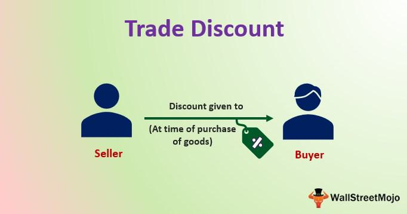

The landscape of financial services has transformed remarkably with the rise of technology, leading to the proliferation of discount brokers, financial services, and algorithmic trading. These components have become integral parts of the contemporary investment world, altering how investors engage with financial markets. This article intends to examine the pivotal role discount brokers play in the current financial environment, their interaction with algorithmic trading, and how they deliver cost-effective solutions to a broad array of investors. 

Discount brokers offer an essential service to active traders and those intrigued by automated trading strategies by providing budget-friendly trading solutions. They enable individual investors to access a range of financial services that were historically the preserve of institutional players and high-net-worth individuals. These platforms have democratized the investment process, crumbling barriers and making it more inclusive. Discount brokers offer varying levels of service, allowing investors to choose according to their needs and experience, from basic trading services to sophisticated algorithmic trading tools that cater to both seasoned and novice investors alike.



This article will guide you through the different services available and what investors can expect when utilizing these platforms, providing a clear understanding of their position and significance in the modern investment ecosystem. By the conclusion, you will be equipped with a comprehensive understanding of discount brokers, their relationship with algorithmic trading, and how they fit into the evolving financial landscape, empowering you to make informed decisions regarding your investment strategies.

In essence, the intersection of technology and finance represented by discount brokers and algorithmic trading is transforming investment paradigms, offering new opportunities and considerations for today's investors.

## Table of Contents

## Understanding Discount Brokers

Discount brokers are financial service providers that focus on offering basic brokerage services at reduced costs compared to traditional full-service brokers. They achieve lower costs by leveraging online trading platforms, which allow individual investors to execute buy-and-sell orders for securities efficiently. These platforms empower investors to manage their investments directly without the need for intermediaries, driving down the operational costs significantly. 

Unlike full-service brokers, discount brokers do not offer personalized investment advice or comprehensive financial planning services. They position themselves as facilitators for self-directed investors who prefer to make their own investment decisions without incurring the additional costs associated with advisory services. This absence of advisory services is a key differentiator from traditional brokers who often charge premium fees for personalized advice and tailored financial strategies.

Discount brokers charge lower fees for trading a wide array of financial instruments, including stocks, exchange-traded funds (ETFs), and mutual funds. This low-fee structure is particularly appealing to cost-conscious investors and is made possible by the digital nature of their operations, which reduces overhead expenses. As the financial landscape shifts towards digital solutions, many investors are attracted to the efficiency and cost-effectiveness that discount brokers provide.

The popularity of discount brokers is further fueled by their accessibility. With the rise of internet usage and mobile technology, investors can engage with financial markets more conveniently. This ease of access allows both novice and experienced investors to participate in market activities without the traditional barriers of entry, making financial market participation more democratic.

In summary, discount brokers play a crucial role in today's investment environment by offering low-cost and efficient trading solutions for investors. While they lack personalized advisory services, their cost-effective approach and accessibility make them an attractive choice for individuals looking to maintain control over their investment decisions.

## Financial Services Offered by Discount Brokers

Discount brokers have revolutionized the trading landscape by providing a suite of financial services designed to empower investors through cost-efficient and accessible platforms. A primary feature offered by these brokers is online trading, which encompasses a broad range of assets including stocks, exchange-traded funds (ETFs), options, and futures. These platforms typically provide intuitive interfaces that facilitate the seamless execution of trades.

An attractive aspect of these services is the low or zero commission structure on basic stock and [ETF](/wiki/etf-trading-strategies) trades, which makes them appealing to cost-sensitive investors. For certain complex securities, such as bonds and futures, some discount brokers might charge nominal fees. This pricing model allows traders to allocate more resources towards their investment capital rather than expenditure on transactional costs.

In addition to trading functionalities, discount brokers provide a wealth of educational resources and analytical tools designed to support investor decision-making. These can include webinars, tutorials, market research reports, and interactive tools that aid in refining trading strategies. Such resources are invaluable for both novice investors seeking foundational knowledge and experienced traders looking to enhance their strategies.

Advanced trading platforms offered by these brokers are equipped with [algorithmic trading](/wiki/algorithmic-trading) capabilities. Algorithmic trading involves using pre-programmed trading instructions to execute orders based on various factors such as timing, price, or [volume](/wiki/volume-trading-strategy). This feature attracts sophisticated traders who seek automation to enhance trading efficiency and precision. Algorithmic strategies can often be tested and refined using simulated environments provided by the brokers, which support back-testing with historical data.

Discount brokers also furnish comprehensive account management features that empower investors to monitor their portfolio performance effectively. These features may include real-time analytics, performance tracking, and customizable dashboards, enabling investors to make strategic adjustments in response to evolving market conditions. By offering a wide array of investment tools and services, discount brokers cater to the diverse needs of investors, ensuring they have full control over their trading activities and financial planning.

## The Rise of Algorithmic Trading

Algorithmic trading, also known as 'algo trading', refers to the use of computer programs and algorithms to automate and execute trades. This method harnesses sophisticated mathematical models and computational power to identify the most opportune moments to trade, optimizing the potential for profit. Strategic decision-making in algorithmic trading is generally based on an array of quantitative analyses, technical indicators, and statistical models, allowing for rapid execution that outpaces human capabilities.

Discount brokers, recognizing the demand for algorithmic trading, have increasingly integrated these capabilities into their platforms. This service expansion caters to both individual traders, who seek precision and speed, and institutional investors, who benefit from streamlined processes. Algo trading systems can rapidly assess multiple market variables and execute transactions much faster than human traders are able to, reducing the possibility of human error and the influence of emotional biases in trading decisions. By automating trade execution based on predefined criteria, traders can ensure consistent strategy implementation.

The accessibility of algorithmic trading tools provided by discount brokers has also opened the door for retail investors to deploy sophisticated trading strategies once exclusive to institutional players. Many brokers offer comprehensive platforms that include script-writing capabilities, analytics, back-testing, and real-time data feeds, thereby enabling traders to construct and refine their algorithmic strategies. For instance, languages such as Python, often integrated into broker platforms, allow traders to script custom algorithms using libraries like NumPy and pandas for data processing and analysis, and tools like Zipline for back-testing:

```python
import numpy as np
import pandas as pd
from zipline.api import order, record, symbol
from zipline import run_algorithm

def initialize(context):
    context.asset = symbol('AAPL')

def handle_data(context, data):
    order(context.asset, 10)
    record(AAPL=data.current(context.asset, "price"))

start = pd.Timestamp('2015-01-01', tz='utc')
end = pd.Timestamp('2016-01-01', tz='utc')

perf = run_algorithm(start=start,
                     end=end,
                     initialize=initialize,
                     handle_data=handle_data,
                     capital_base=10000)
```

This Python code snippet is a simple representation of an algorithm that executes buy orders for a specific asset. Such programs can be far more advanced, capable of complex decision-making based on real-time data and extensive market conditions.

To conclude, the rise of algorithmic trading has not only enhanced trading efficiency and reduced risks associated with manual trading but has also made high-frequency and complex strategies accessible to a broader range of market participants. Discount brokers continue to expand these offerings, bridging the gap between retail and institutional trading practices.

## Benefits of Using Discount Brokers for Algo Trading

Cost-effectiveness remains a central advantage of utilizing discount brokers for algorithmic trading. These brokers typically offer considerably lower commissions and fees compared to their full-service counterparts. This is particularly beneficial for traders engaged in high-frequency trading strategies, where the accumulation of transaction costs can otherwise significantly erode profits. By reducing expenses associated with each trade, discount brokers enable traders to preserve a higher portion of their earnings, enhancing the overall profitability of their strategies.

One of the distinguishing features of discount brokers is their provision of highly customizable trading platforms. These platforms are designed to support a diverse array of algorithmic trading strategies, catering to the needs of both novice and experienced traders. Such platforms often integrate robust analytical tools that assist users in strategy development and optimization. Additionally, they provide real-time data feeds, enabling the execution of trades based on the latest market conditions. This access to up-to-the-minute information is crucial for algorithmic traders who rely on timing and precision to capture market opportunities.

Back-testing capabilities are another essential service offered by discount brokers. Back-testing allows traders to evaluate their algorithms by testing them against historical market data before deploying them in live trading. This process is vital for refining trading strategies and ensuring they perform as expected across various market conditions. By analyzing past performance, traders can identify potential weaknesses in their strategies and make necessary adjustments to improve future outcomes.

Furthermore, algorithmic trading through discount broker platforms affords investors a significant degree of flexibility. Traders can automate their strategies to execute trades based on predefined criteria, such as price movements, technical indicators, or economic events. This automation reduces the potential for human error and emotional biases, enhancing the consistency and effectiveness of trades. Moreover, the ability to quickly respond to market fluctuations through automated systems is invaluable in maintaining competitiveness and capitalizing on transient opportunities.

In summary, the benefits of using discount brokers for algorithmic trading are multifaceted, offering cost savings, advanced technological tools, and increased trading efficiency. These advantages make discount brokers an appealing choice for traders seeking to maximize their algorithmic trading performance while minimizing operational costs.

## Potential Challenges and Considerations

While discount brokers provide considerable cost savings, they also present certain challenges and considerations that investors must be cognizant of. One primary limitation is the level of customer support and advice available. Unlike traditional brokers who offer personalized guidance and comprehensive financial planning, discount brokers primarily provide a platform for executing trades. Consequently, investors relying on these services should be prepared for minimal customer interaction and support. This can be a significant hurdle for novice traders who lack experience in financial markets.

Algorithmic trading, a service increasingly offered by discount platforms, poses additional complexities. Engaging in algorithmic trading requires a robust understanding of trading strategies, an acute awareness of market dynamics, and proficient use of technical software. Traders must possess both the analytic skills necessary to devise effective algorithms and the technical expertise to implement and monitor these systems correctly. Programming languages such as Python are frequently used to develop and deploy trading algorithms. Here is an example of a simple trading strategy implemented in Python:

```python
import numpy as np

def simple_moving_average(prices, window_size):
    return np.convolve(prices, np.ones(window_size), 'valid') / window_size

# Example price data
prices = [120, 121, 119, 122, 123, 124, 126, 127]

# Calculate SMA with a window size of 3
sma = simple_moving_average(prices, 3)
print(sma)
```

Risks inherent to algorithmic trading include system failures, programming errors, and rapid market movements. System failures can lead to missed trading opportunities or unexpected losses if the system is unable to execute trades as planned. Programming errors, such as bugs in the code, can result in incorrect trading decisions. Rapid market movements, particularly in highly volatile markets, can quickly invalidate trading strategies that are not sufficiently adaptive.

Investors should critically assess their own competence and the intricacy of their trading strategies before fully embracing algorithmic trading. The ability to understand and mitigate the risks associated with this approach is vital to avoiding significant financial setbacks.

Another crucial aspect is understanding the fee structures and service limitations of each discount broker. Often, the low trading fees come with additional charges that may not be immediately apparent. These could include fees for accessing real-time data feeds, charges for utilizing advanced trading tools, or costs associated with account maintenance. It is essential for investors to thoroughly read and comprehend these financial details to ensure they are not caught off guard by unexpected expenses.

In conclusion, while discount brokers present a valuable gateway into trading with modest costs, understanding their limitations and the intricacies of algorithmic trading is essential. Informed investors who carefully navigate these challenges can more effectively leverage the benefits that discount brokers and algorithmic trading have to offer.

## Conclusion and Final Thoughts

Discount brokers have fundamentally altered the landscape of financial markets by providing low-cost trading solutions. By leveraging technology, these brokers have made it easier for individual investors to access a wide range of financial instruments without the high fees associated with traditional brokerage services. This democratization of access has empowered more people to participate in investing, thereby increasing market participation and [liquidity](/wiki/liquidity-risk-premium).

The incorporation of algorithmic trading has further expanded the possibilities for investors. By utilizing sophisticated algorithms, traders can execute complex trades more efficiently and with greater precision. This technological advancement offers significant advantages, including reduced transaction costs and minimized human error, thereby facilitating the development of more effective trading strategies.

However, discount brokers primarily cater to independent traders who are knowledgeable and comfortable navigating financial markets on their own. These platforms typically offer limited personalized financial advice, making them less suitable for investors who require guidance and bespoke financial planning. Therefore, individuals considering using discount brokers should assess whether they have the requisite expertise to operate autonomously.

As the investment landscape evolves, it is expected that discount brokers will continue expanding their offerings and incorporating more advanced technology-driven solutions. This evolution will likely encompass enhanced algorithmic trading capabilities and the inclusion of innovative tools to support investor decision-making.

Ultimately, investors must evaluate their own needs, skills, and financial goals to decide whether the services provided by discount brokers and the use of algorithmic trading align with their investment strategies. By doing so, they can make informed decisions that leverage the advantages of these platforms while mitigating potential challenges.

## References & Further Reading

[1]: Bergstra, J., Bardenet, R., Bengio, Y., & Kégl, B. (2011). ["Algorithms for Hyper-Parameter Optimization."](https://papers.nips.cc/paper/4443-algorithms-for-hyper-parameter-optimization) Advances in Neural Information Processing Systems 24.

[2]: ["Advances in Financial Machine Learning"](https://www.amazon.com/Advances-Financial-Machine-Learning-Marcos/dp/1119482089) by Marcos Lopez de Prado

[3]: ["Evidence-Based Technical Analysis: Applying the Scientific Method and Statistical Inference to Trading Signals"](https://www.amazon.com/Evidence-Based-Technical-Analysis-Scientific-Statistical/dp/0470008741) by David Aronson

[4]: ["Machine Learning for Algorithmic Trading"](https://github.com/stefan-jansen/machine-learning-for-trading) by Stefan Jansen

[5]: ["Quantitative Trading: How to Build Your Own Algorithmic Trading Business"](https://www.amazon.com/Quantitative-Trading-Build-Algorithmic-Business/dp/1119800064) by Ernest P. Chan