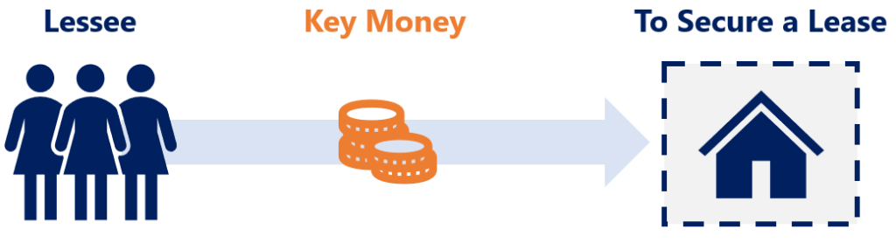

## Table of Contents

## What is key money?

Key money is a payment that a tenant sometimes has to make to a landlord before moving into a rental property. It's like a one-time fee that the tenant pays on top of the regular rent and security deposit. This practice is more common in some countries than others, and it can be controversial because it makes renting more expensive for tenants.

In places where key money is common, it might be used by landlords to cover the costs of preparing the property for a new tenant, like painting or repairs. However, it can also be seen as an unfair extra cost that makes it harder for people to afford a place to live. Some places have laws against key money to protect tenants from these extra fees.

## How does key money differ from traditional currency?

Key money is not like traditional currency that you use every day to buy things. Traditional currency, like dollars or euros, is used all over the world to pay for goods and services. You can use it to buy food, clothes, or pay for a bus ride. It's accepted everywhere and has a set value that everyone agrees on. Key money, on the other hand, is a special kind of payment that you only use when you want to rent a place to live. It's not something you can use at a store or to pay for a meal.

Key money is more like a one-time fee that you pay to a landlord before you move into a rental property. It's different from traditional currency because it's not used for everyday purchases and it's not accepted everywhere. Only certain landlords in certain places might ask for key money, and it's usually a big amount that you pay just once, not something you use little by little like regular money. This makes key money a unique kind of payment that's separate from the money you use every day.

## What are the origins of key money?

Key money started a long time ago in Japan. It was called "reikin" and it was a way for tenants to show thanks to their landlords. Back then, it was common for people to give a gift when they moved into a new home. Over time, this gift turned into a payment that tenants had to make before they could move in. It became a tradition in Japan and was seen as a way to help landlords cover the costs of getting the place ready for new tenants.

In other parts of the world, key money also popped up but for different reasons. In some places, landlords asked for key money because there were more people wanting to rent than there were homes available. This made it a competitive market, and landlords could ask for extra payments to choose who got to rent their property. Even though key money started for different reasons in different places, it's always been about tenants paying extra money to landlords before they can move into a rental home.

## In which countries or regions is key money commonly used?

Key money is most commonly used in Japan, where it is known as "reikin." It has been a part of the rental culture there for a long time. In Japan, when someone wants to rent an apartment or house, they often have to pay key money to the landlord before moving in. This payment is seen as a way to thank the landlord and help cover the costs of getting the place ready for the new tenant.

In some other countries, key money is also used but not as widely as in Japan. For example, in certain parts of South Korea, landlords might ask for key money, known as "jeonse," which is a large deposit that the tenant can get back at the end of the lease. In some cities in the United States, like New York, landlords might ask for key money, but it's not as common and can be against the law in some places. Overall, key money is more common in Asia, especially in Japan and South Korea, but it can be found in other places too.

## What are the legal implications of using key money?

The legal implications of using key money can vary a lot depending on where you are. In some places, like Japan, key money is a normal part of renting and it's legal for landlords to ask for it. But in other countries, like the United States, key money can be against the law. Some states and cities have rules that say landlords can't charge extra fees like key money before someone moves in. If a landlord breaks these rules, they could get in trouble and might have to pay money back to the tenant.

In places where key money is legal, there are still rules about how much a landlord can ask for. For example, in Japan, the amount of key money is often set at one or two months' rent. Landlords have to follow these rules, or they could face legal problems. It's important for both landlords and tenants to know the laws in their area so they can make sure they're doing things the right way. If someone isn't sure about the rules, they should talk to a lawyer or a local housing group to get help.

## How can key money be used in real estate transactions?

Key money can be used in real estate transactions as a way for tenants to secure a rental property. When someone wants to rent a home or apartment, the landlord might ask for key money before the tenant can move in. This payment is usually a one-time fee on top of the regular rent and security deposit. In places where key money is common, like Japan, it helps landlords cover the costs of getting the place ready for the new tenant. It's like a way for the tenant to show thanks to the landlord and make sure they get the rental.

In some cases, key money can also be used in real estate transactions to give the landlord extra money upfront. This can be helpful for the landlord if they need money to fix up the property or if they want to choose who gets to rent their place. But key money isn't used everywhere, and in some places, it's against the law. So, it's important for both landlords and tenants to know the rules in their area before they agree to use key money in a real estate deal.

## What are the advantages of using key money for tenants and landlords?

For landlords, key money can be a big help. It gives them extra money right away, which they can use to fix up the rental place or cover other costs. This can be really useful if the landlord needs money to get the place ready for a new tenant. Key money also lets landlords pick who gets to rent their property. If a lot of people want to rent the same place, the landlord can choose the person who is willing to pay key money. This can make the landlord feel more secure about who is moving in.

For tenants, key money might help them get a place to live in a busy rental market. If there are more people wanting to rent than there are homes available, paying key money can make a tenant stand out. It shows the landlord that the tenant is serious about renting the place and willing to pay extra to get it. But, key money can also be a problem for tenants because it makes renting more expensive. They have to come up with a big amount of money before they can move in, which can be hard if they don't have a lot of savings.

## What are the potential risks and drawbacks of key money?

Key money can make renting a home more expensive for tenants. They have to pay a big amount of money before they can move in, on top of the regular rent and security deposit. This can be really hard if they don't have a lot of savings. It can also be unfair because it makes it harder for people who can't afford to pay key money to find a place to live. If key money is against the law in some places, tenants might not know their rights and could end up paying money they don't have to.

For landlords, key money can also be risky. If they ask for key money where it's not allowed, they could get in trouble with the law. They might have to pay money back to the tenant or face other penalties. Also, if a landlord gets used to having key money, it might make it harder for them to rent their place if they can't find tenants willing to pay it. This could mean their property stays empty longer, which can cost them money in the end.

## How does key money impact the overall economy?

Key money can make it harder for people to find a place to live because it adds to the cost of renting. When tenants have to pay a big amount of money before moving in, it can use up their savings. This means they might not have as much money to spend on other things, like food or clothes. If a lot of people are spending their money on key money, it can slow down the economy because people aren't buying as much stuff. This can be bad for businesses that rely on people spending money.

On the other hand, key money can give landlords extra money right away. They can use this money to fix up their rental properties or pay for other costs. This can help keep rental homes in good shape, which is good for the economy. But if key money is against the law in some places, it can cause problems. Landlords might get in trouble, and this can lead to legal fees and other costs that can hurt the economy. So, key money can have both good and bad effects on the overall economy, depending on how it's used and where it's allowed.

## What are some innovative applications of key money in modern finance?

In modern finance, key money can be used in new ways to help both landlords and tenants. For example, some companies are turning key money into a kind of investment. Instead of just paying a one-time fee, tenants can put their key money into a special fund. This fund can then be used to help pay for things like home improvements or energy-saving upgrades. This way, the key money helps make the rental property better, which can be good for both the landlord and the tenant.

Another innovative use of key money is in rental platforms and apps. Some of these platforms let tenants pay key money in smaller amounts over time, instead of all at once. This can make it easier for tenants to afford moving into a new place. The platforms can also use the key money to offer extra services, like insurance or help with moving costs. This makes the whole renting process smoother and can help more people find a place to live.

## How can blockchain technology enhance the use of key money?

Blockchain technology can make using key money safer and easier for both landlords and tenants. With blockchain, all the payments and agreements can be recorded in a way that's hard to change or cheat. This means that when a tenant pays key money, there's a clear record of it that both the tenant and landlord can trust. It also helps make sure that the money goes where it's supposed to go, without any middlemen taking a cut. This can save money and make the whole process more fair.

Another way blockchain can help with key money is by making it easier to use in new and creative ways. For example, key money could be turned into a kind of digital token that tenants can buy and sell. This could let tenants use their key money for other things, like getting a better deal on their rent or helping to pay for home improvements. Blockchain makes it easy to track these tokens and make sure they're used fairly. This can make key money more useful and flexible, helping both tenants and landlords get more out of it.

## What future trends might affect the use and regulation of key money?

In the future, the way key money is used and regulated might change a lot. As more people learn about the problems with key money, like how it makes renting more expensive, governments might make new laws to stop landlords from asking for it. This could happen in places where key money is already against the law, but it might also spread to other countries. At the same time, new technology like blockchain could make key money safer and easier to use. This might mean that key money could be used in new ways, like turning it into digital tokens that tenants can trade or use for other things.

Another trend that could affect key money is the growing use of rental platforms and apps. These platforms might find new ways to make key money easier for tenants to pay, like letting them pay it in smaller amounts over time. This could help more people afford to move into a new place. But, these platforms will also have to follow the rules about key money, so they might push for changes in the law to make it easier for them to work. Overall, the future of key money will depend a lot on new laws, technology, and how people use rental platforms.

## References & Further Reading

[1]: ["Real Estate Finance and Investments"](https://www.mheducation.com/highered/product/Real-Estate-Finance-and-Investments-Brueggeman.html) by William B. Brueggeman and Jeffrey D. Fisher

[2]: ["Algorithmic Trading and DMA: An Introduction to Direct Access Trading Strategies"](https://www.amazon.com/Algorithmic-Trading-DMA-introduction-strategies/dp/0956399207) by Barry Johnson

[3]: Hendershott, T., Jones, C. M., & Menkveld, A. J. (2011). ["Does Algorithmic Trading Improve Liquidity?"](https://onlinelibrary.wiley.com/doi/full/10.1111/j.1540-6261.2010.01624.x) American Economic Review, 101(6), 275-295.

[4]: ["Applied Quantitative Finance for Equity Derivatives"](https://www.amazon.com/Applied-Quantitative-Finance-Equity-Derivatives/dp/B0CM9TL63J) by Jherek Healy

[5]: Anagnostopoulos, C. (2018). ["Machine Learning Applications in Real Estate Valuation Models."](https://www.sciencedirect.com/science/article/pii/S0957417422021650) Springer