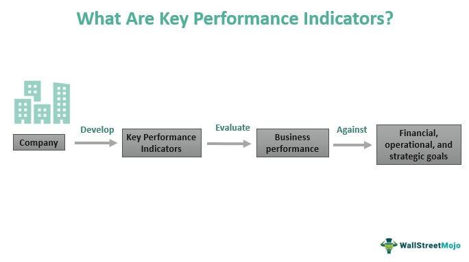

Understanding business performance metrics is crucial for the success of any business strategy. These metrics serve as the compass that guides companies through the complexities of modern markets, providing insights into efficiency, effectiveness, and profitability. At the core of these metrics are Key Performance Indicators (KPIs), which are essential tools used to assess the health of a business. KPIs offer a quantifiable means to evaluate progress toward strategic objectives, enabling organizations to make informed decisions and adjustments in their operations.

Algorithmic trading, a subset of financial markets, similarly relies on precise performance indicators to optimize trading strategies. This form of trading involves the use of computer algorithms to execute trade orders at high speeds based on predefined criteria. Here, performance metrics not only help in evaluating the efficiency of these algorithms but also play a pivotal role in risk management and strategy improvement.



In both traditional business environments and the unique context of algorithmic trading, the careful selection and continuous evaluation of KPIs are imperative. The following article will explore the critical KPIs that contribute to business success, while also highlighting specific metrics that are instrumental in algorithmic trading. This exploration will provide a comprehensive understanding of how strategic alignment of metrics can lead to enhanced performance and competitive advantage.

## Table of Contents

## What Are Business Metrics and KPIs?

Business metrics are quantifiable measures employed to track, evaluate, and manage various aspects of business processes. These metrics offer a means to gauge the effectiveness of initiatives, the efficiency of operations, and the overall health of a business. They can encompass a wide spectrum, including financial figures like revenue, operational efficiency stats such as production output, and customer-related data like satisfaction levels or retention rates.

Key Performance Indicators (KPIs) are specific types of business metrics that are intimately aligned with organizational goals and objectives. KPIs serve as navigational tools, guiding businesses in understanding how effectively they are progressing toward their strategic milestones. They translate abstract goals into concrete, measurable outcomes, making it easier for organizations to assess their performance. For instance, if a company’s objective is to enhance customer satisfaction, a potential KPI could be the Net Promoter Score (NPS), a metric that quantifies customer loyalty.

Aligning KPIs with business objectives is critical for tracking progress effectively. When KPIs are well-aligned with an organization’s strategic and operational goals, they can provide valuable insights into areas needing improvement, highlight successful strategies, and facilitate better decision-making. To illustrate, if a business objective is to increase market share by 10% within a year, a relevant KPI might be monthly sales growth percentage. By continuously monitoring this KPI, a company can determine if its strategies are effective, and make necessary adjustments to ensure the target is met.

In summary, business metrics and KPIs are crucial for evaluating business performance and determining whether strategic goals are being met. By selecting appropriate KPIs that align with business objectives, organizations can ensure they remain on track and responsive to the dynamic business environment.

## Types of Business Performance Indicators

Business performance indicators, commonly known as Key Performance Indicators (KPIs), serve as essential tools in measuring and evaluating the success of an organization's strategies and objectives. Below we discuss various categories of KPIs that encompass financial, customer experience, process performance, marketing, and IT metrics. Each type plays a significant role in providing a comprehensive view of an organization's health and performance.

### Financial KPIs

Financial KPIs are crucial for understanding the economic viability of a business. These metrics evaluate the company's financial performance and health. Examples include:

- **Revenue Growth**: Indicates the increase in revenue over a specific period and can be calculated using the formula:
$$
  \text{Revenue Growth (\%)} = \left( \frac{\text{Current Period Revenue} - \text{Previous Period Revenue}}{\text{Previous Period Revenue}} \right) \times 100

$$

- **Net Profit Margin**: Measures the percentage of revenue that remains as profit after all expenses. It is calculated as:
$$
  \text{Net Profit Margin (\%)} = \left( \frac{\text{Net Income}}{\text{Total Revenue}} \right) \times 100

$$

### Customer Experience Metrics

Customer experience KPIs focus on evaluating the satisfaction and engagement level of the customers, which directly impacts business reputation and customer loyalty. Examples include:

- **Customer Satisfaction Rating**: Often measured using surveys where customers rate their satisfaction on a scale, typically compiled into an average rating score.

- **Net Promoter Score (NPS)**: Assesses customer loyalty and likelihood of recommending the company to others. It is calculated as the difference between the percentage of promoters and detractors.

### Process Performance KPIs

These KPIs focus on the efficiency and effectiveness of business operations. They help in identifying bottlenecks and areas for improvement. Examples include:

- **Cycle Time**: Measures the total time taken from the beginning to the end of a process.

- **First Pass Yield (FPY)**: Represents the percentage of products or services that are completed and meet quality standards without rework. It is calculated as:
$$
  \text{FPY (\%)} = \left( \frac{\text{Number of Good Products or Services}}{\text{Total Number Produced}} \right) \times 100

$$

### Marketing Metrics

Marketing KPIs evaluate the effectiveness of marketing strategies and their impact on business growth. Examples include:

- **Return on Marketing Investment (ROMI)**: Quantifies the revenue generated as a result of marketing expenses.
$$
  \text{ROMI} = \frac{\text{Revenue from Marketing Activities} - \text{Cost of Marketing}}{\text{Cost of Marketing}}

$$

- **Customer Acquisition Cost (CAC)**: The cost associated with acquiring a new customer, calculated by dividing the total acquisition costs by the number of new customers acquired.

### IT Metrics

IT KPIs focus on the performance of information technology systems and their alignment with business goals. Examples include:

- **System Downtime**: The amount of time that systems or applications are unavailable.

- **Incident Resolution Time**: The average time taken to resolve an IT incident or issue. It can be represented as:
$$
  \text{Average Resolution Time} = \frac{\sum \text{Resolution Time for Each Incident}}{\text{Number of Incidents}}

$$

Each of these KPIs serves a distinct purpose in tracking and guiding various aspects of a business, ensuring that both strategic and operational objectives are met efficiently.

## Understanding Algorithmic Trading Metrics

Algorithmic trading employs complex computer programs to execute trades based on pre-established criteria. This method relies on precise performance metrics to evaluate and optimize strategies. These metrics help in assessing the effectiveness of algorithms, allowing traders to enhance their trading strategies and make data-driven decisions.

Algorithms in trading heavily rely on historical data, technical indicators, and mathematical models. Historical data provides a foundation for analyzing past market behavior, enabling the development and testing of trading strategies. Technical indicators, derived from historical prices and volumes, assist in identifying patterns and trends. Algorithms use mathematical models to predict future price movements and to automate trading decisions with speed and accuracy, far beyond human capabilities.

Key metrics in [algorithmic trading](/wiki/algorithmic-trading) include win rate, maximum drawdown, and the Sharpe ratio. Each of these metrics serves a crucial role in evaluating trading performances:

1. **Win Rate**: This metric indicates the proportion of winning trades out of the total number of trades executed. Calculated as:
$$
   \text{Win Rate} = \left( \frac{\text{Number of Winning Trades}}{\text{Total Number of Trades}} \right) \times 100

$$
   A high win rate suggests a successful trading strategy, but it should be considered alongside other metrics as it doesn't measure profitability.

2. **Maximum Drawdown**: Maximum drawdown shows the largest peak-to-trough decline in the value of a trading strategy before a new peak is attained. It is key for understanding the risk associated with a strategy:
$$
   \text{Maximum Drawdown} = \frac{\text{Peak Value} - \text{Trough Value}}{\text{Peak Value}}

$$
   Lower maximum drawdown values indicate lower risk and greater capital preservation.

3. **Sharpe Ratio**: The Sharpe ratio estimates the risk-adjusted return of a trading strategy. It is defined as the ratio of the excess return of the strategy to its standard deviation:
$$
   \text{Sharpe Ratio} = \frac{R_p - R_f}{\sigma_p}

$$
   where $R_p$ is the return of the portfolio, $R_f$ is the risk-free rate of return, and $\sigma_p$ is the standard deviation of the portfolio excess return. A higher Sharpe ratio indicates a more favorable risk-adjusted performance.

These metrics provide traders with insights into the effectiveness and risks associated with their trading algorithms. This understanding is pivotal for improving trading strategies and achieving better decision-making outcomes in financial markets.

## Key Algorithmic Trading KPIs

In algorithmic trading, the selection and analysis of Key Performance Indicators (KPIs) are vital for assessing the efficacy of trading strategies. These metrics provide quantitative evidence of performance, allowing traders to refine strategies and optimize outcomes. Here, we explore several critical KPIs integral to algorithmic trading success.

**Win Rate**: The win rate is a simple yet powerful metric that indicates the proportion of profitable trades over a given period. It is calculated using the formula:

$$
\text{Win Rate} = \left( \frac{\text{Number of Winning Trades}}{\text{Total Number of Trades}} \right) \times 100
$$

A higher win rate suggests a strategy that often results in profitable trades, but it must be evaluated alongside other metrics to fully understand its risk and return profile.

**Average Trade Return**: This metric measures the average profit or loss from each trade, providing insight into the profitability of a trading strategy. It is calculated as follows:

$$
\text{Average Trade Return} = \frac{\sum (\text{Profit or Loss of Each Trade})}{\text{Total Number of Trades}}
$$

A positive average trade return indicates that, on average, each trade generates a profit, while a negative value implies losses.

**Maximum Drawdown**: Maximum drawdown represents the largest peak-to-trough decline in a trading strategy's equity, reflecting the potential risk of loss. It is an essential measure of downside risk, defined mathematically by:

$$
\text{Maximum Drawdown} = \max \left( \frac{\text{Peak Value} - \text{Trough Value}}{\text{Peak Value}} \right) \times 100
$$

Traders aim for a low maximum drawdown, which indicates that the potential for reduced equity is limited, thereby embodying a lower risk strategy.

**Sharpe Ratio**: The Sharpe Ratio is a comprehensive metric that evaluates risk-adjusted returns compared to a risk-free rate, typically used to assess the trade-off between risk and return. It is expressed by:

$$
\text{Sharpe Ratio} = \frac{\text{Average Return of the Portfolio} - \text{Risk-Free Rate}}{\text{Standard Deviation of Portfolio Return}}
$$

A higher Sharpe Ratio signifies that a trading strategy provides a higher return per unit of risk, offering a balanced approach between achieving high returns and maintaining an acceptable level of risk.

These KPIs, when analyzed collectively, enable traders to gauge the overall effectiveness of their strategies, allowing for informed decision-making and iterative improvements. They represent a foundational aspect of managing and optimizing algorithmic trading performance.

## How to Improve KPIs in Algorithmic Trading

Improving Key Performance Indicators (KPIs) in algorithmic trading is essential for maintaining a competitive edge and optimizing trading strategies. A well-rounded approach involves refining algorithms, diversifying strategies, managing risks, and leveraging evaluation tools.

**Refining Trading Algorithms**

Algorithmic refinement is a continuous process that involves optimizing parameters and improving models. Employing techniques such as [machine learning](/wiki/machine-learning) can help in developing more accurate predictive models. Incorporating genetic algorithms or [reinforcement learning](/wiki/reinforcement-learning) can provide adaptive mechanisms to optimize trading strategies iteratively. Regularly updating the algorithm with new data ensures that it remains relevant in changing market conditions.

**Diversifying Strategies**

Diversification reduces risk exposure and enhances the stability of returns. By employing a variety of strategies — such as mean reversion, [momentum](/wiki/momentum) trading, and statistical [arbitrage](/wiki/arbitrage) — traders can mitigate the impact of adverse market movements. Each strategy responds differently to market stimuli, thereby balancing the overall trading performance. It's important to assess the correlation between strategies to maximize diversification benefits.

**Risk Management**

Risk management is critical in algorithmic trading for protecting capital and maintaining strategy resilience. Techniques like Value at Risk (VaR) and Conditional Value at Risk (CVaR) are commonly used to assess potential losses in portfolios. Implementing position sizing rules and stop-loss orders can prevent significant drawdowns. Hedging with options or futures can also be effective in managing risk associated with unexpected market shifts.

**Use of Performance Evaluation Tools**

To measure and improve KPIs effectively, traders should utilize robust performance evaluation and monitoring tools. Tools that track metrics such as return ratios, [volatility](/wiki/volatility-trading-strategies), and risk-adjusted performance (e.g., Sharpe ratio) provide insights into strategy efficacy. Simulation and [backtesting](/wiki/backtesting) are integral, where historical data is used to test strategies under various market conditions. This helps in identifying underperforming elements and enables necessary adjustments before deploying in live markets.

**Backtesting Strategies**

Backtesting plays a crucial role in validating trading strategies before live implementation. By analyzing historical data, traders can evaluate how their strategies would have performed in the past. This involves running simulations with historical price data to calculate potential returns and risks. Python, due to its extensive libraries like Pandas, NumPy, and backtesting.py, is highly effective for this purpose. A simple backtesting framework in Python might start with loading historical data and end with evaluating strategy performance metrics:

```python
import pandas as pd
import backtrader as bt

# Define strategy
class MyStrategy(bt.Strategy):
    def __init__(self):
        self.dataclose = self.datas[0].close

    def next(self):
        if self.dataclose[0] < self.dataclose[-1]:
            self.buy()
        elif self.dataclose[0] > self.dataclose[-1]:
            self.sell()

# Load data and run backtest
cerebro = bt.Cerebro()
data = bt.feeds.YahooFinanceData(dataname='AAPL', fromdate=pd.Timestamp('2020-01-01'), todate=pd.Timestamp('2021-01-01'))
cerebro.adddata(data)
cerebro.addstrategy(MyStrategy)
cerebro.run()
```

This blend of refining algorithms, diversifying strategies, implementing stringent risk management, and using performance evaluation tools sets a strong foundation for enhancing algorithmic trading KPIs. Regularly revisiting these strategies helps align with shifting market paradigms and technological advancements, ensuring sustained trading success.

## Challenges and Considerations in KPI Tracking

Tracking Key Performance Indicators (KPIs) presents several challenges, particularly in the context of algorithmic trading and data management, that necessitates careful consideration for effective implementation.

One of the primary challenges in algorithmic trading is overfitting. Overfitting occurs when a trading algorithm is excessively tailored to historical data, capturing noise instead of actual underlying patterns. This results in impressive backtested results that fail to generalize to future market conditions. The issue arises due to the inherent complexity and variability of financial markets, which cannot be entirely encapsulated by historical data alone. To mitigate overfitting, traders should utilize techniques such as cross-validation and out-of-sample testing. Cross-validation involves partitioning the dataset into multiple subsets, training the model on some and validating on others, ensuring the robustness of the model across different data samples.

For illustration, a basic Python example demonstrating cross-validation might involve using libraries such as `scikit-learn` to split the data:

```python
from sklearn.model_selection import KFold
import numpy as np

# Example data
data = np.array([1, 2, 3, 4, 5, 6, 7, 8, 9, 10])

# Define k-fold cross validation
kf = KFold(n_splits=5)

for train_index, test_index in kf.split(data):
    train, test = data[train_index], data[test_index]
    # Here you would train your model on 'train' and validate it on 'test'
    print(f"Train: {train}, Test: {test}")
```

Data management for KPI tracking poses another challenge, particularly regarding the accuracy, relevance, and timeliness of the data used. Poor data quality can lead to erroneous insights, resulting in misguided strategies and poor decision-making. Therefore, a robust data governance framework is essential, encompassing data acquisition, cleansing, and maintenance processes to ensure that the information on which KPIs are based is precise and actionable.

Another consideration is the limitation of relying solely on KPIs without a contextual understanding of the business environment. While KPIs offer valuable insights into performance metrics, they often lack the qualitative evaluation needed to fully comprehend underlying factors affecting those metrics. For instance, a decline in a particular trading KPI might not merely signal a flaw in the algorithm but could also be indicative of broader market shifts or unforeseen events. Therefore, it is crucial to complement KPI tracking with qualitative analyses, such as expert assessments and market trend evaluations, to obtain a holistic view of business performance.

In sum, the effective tracking and interpretation of KPIs require strategies to address the technical pitfalls of overfitting and ensure robust data management. Additionally, appreciating the broader business context is essential to avoid misconceptions that could arise from an over-reliance on quantitative indicators.

## Conclusion

Selecting appropriate Key Performance Indicators (KPIs) is essential for any business or algorithmic trading strategy to be successful. The right KPIs provide invaluable insights into both overall business performance and specific trading strategies, guiding decision-makers toward achieving their strategic goals. In the context of business management, KPIs help in measuring progress toward goals, optimizing operations, and making informed decisions to enhance growth and profitability. For algorithmic trading, KPIs serve as benchmarks to evaluate strategy effectiveness, manage risk, and ensure that trading activities align with the intended financial outcomes.

However, the dynamic nature of both business environments and financial markets necessitates ongoing evaluation and adaptation of these metrics. Economic, technological, and competitive factors are often in flux, rendering certain KPIs obsolete if not regularly updated. Businesses should ideally implement a feedback loop that fosters the continuous refinement of chosen KPIs. Similarly, algorithmic traders need to iteratively backtest and validate their strategies against current data, ensuring that the selected performance indicators remain relevant and actionable. This adaptability is crucial for staying competitive and achieving long-term success.

By continuously reassessing and updating KPIs, organizations and traders can maintain alignment with their evolving objectives, ultimately fostering resilience and strategic agility in an ever-changing landscape. Such ongoing evaluation not only mitigates risks associated with outdated or misaligned metrics but also facilitates proactive adjustments that can leverage emerging opportunities and counteract potential pitfalls.

## References & Further Reading

[1]: Bergstra, J., Bardenet, R., Bengio, Y., & Kégl, B. (2011). ["Algorithms for Hyper-Parameter Optimization."](https://dl.acm.org/doi/10.5555/2986459.2986743) Advances in Neural Information Processing Systems 24.

[2]: ["Advances in Financial Machine Learning"](https://www.amazon.com/Advances-Financial-Machine-Learning-Marcos/dp/1119482089) by Marcos Lopez de Prado

[3]: ["Evidence-Based Technical Analysis: Applying the Scientific Method and Statistical Inference to Trading Signals"](https://www.amazon.com/Evidence-Based-Technical-Analysis-Scientific-Statistical/dp/0470008741) by David Aronson

[4]: ["Machine Learning for Algorithmic Trading"](https://github.com/PacktPublishing/Machine-Learning-for-Algorithmic-Trading-Second-Edition) by Stefan Jansen

[5]: ["Quantitative Trading: How to Build Your Own Algorithmic Trading Business"](https://books.google.com/books/about/Quantitative_Trading.html?id=j70yEAAAQBAJ) by Ernest P. Chan