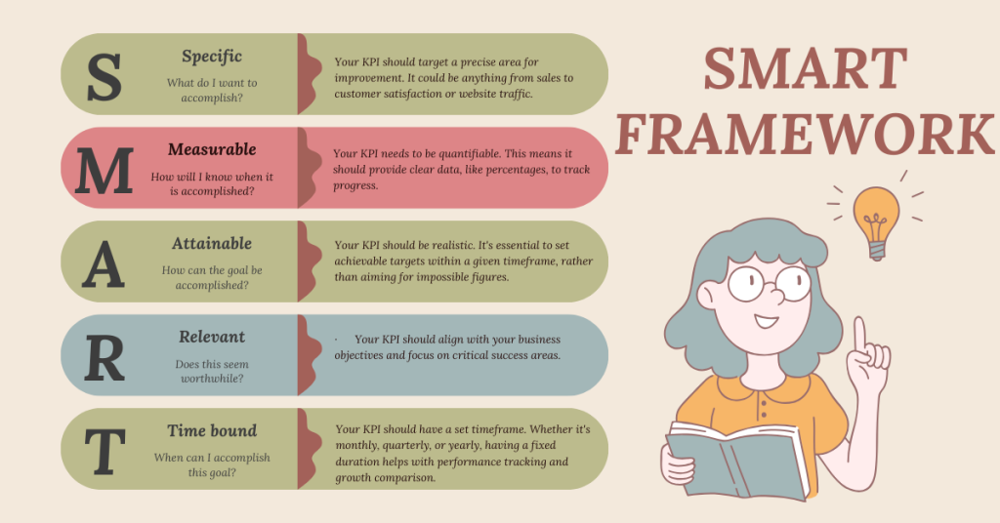

## Table of Contents

## What are Key Performance Indicators (KPIs)?

Key Performance Indicators, or KPIs, are like special tools that help people and businesses see how well they are doing. They are specific numbers or goals that show if you are reaching your targets. For example, a store might use the number of items sold each day as a KPI to see if they are selling enough.

KPIs are important because they help you focus on what matters most. By keeping an eye on these indicators, you can make better decisions and improve your work. If a KPI shows you're not doing well, you can figure out what to change to do better next time.

## Why are KPIs important for businesses?

KPIs are really important for businesses because they help show if the business is doing well or not. They give business owners and managers clear numbers to look at, so they can see if they are meeting their goals. For example, if a business wants to make more money, they can use a KPI like total sales to see if they are on track. This helps everyone in the business know what they need to focus on.

Also, KPIs help businesses make better decisions. When you can see the numbers, you can figure out what is working and what isn't. If a KPI shows that something isn't going well, the business can change its plans to fix the problem. This way, the business can keep improving and stay successful. Using KPIs is like having a map that guides the business to where it wants to go.

## How do you choose the right KPIs for your business?

Choosing the right KPIs for your business starts with understanding what your business goals are. You need to know what you want to achieve, like making more money, getting more customers, or improving the quality of your products. Once you know your goals, you can pick KPIs that will help you see if you are getting closer to those goals. For example, if your goal is to increase sales, a good KPI might be the total number of sales each month.

It's also important to make sure your KPIs are clear and easy to measure. They should be numbers that you can track over time, so you can see if things are getting better or worse. Don't choose too many KPIs, because it can be hard to keep track of them all. Stick to a few that really matter to your main goals. This way, you can focus on what's most important and make sure everyone in your business understands what they need to work on.

## What are the different types of KPIs?

There are different types of KPIs that businesses can use, and they are often grouped into categories based on what they measure. One type is quantitative KPIs, which are all about numbers. These include things like sales numbers, the number of new customers, or the amount of money made. Another type is qualitative KPIs, which look at things that are harder to measure with numbers, like customer satisfaction or employee happiness. These might be measured through surveys or feedback.

Another way to group KPIs is by how they relate to the business's goals. Leading KPIs are like early warning signs. They help predict future performance, so businesses can make changes before problems happen. For example, the number of new leads might be a leading KPI for future sales. Lagging KPIs, on the other hand, show what has already happened. They are good for looking back and seeing how well the business did. Total sales at the end of the month is a lagging KPI.

Lastly, KPIs can be divided into operational and strategic KPIs. Operational KPIs focus on the day-to-day running of the business. They help make sure everything is working smoothly, like measuring how long it takes to serve a customer or how many products are made each day. Strategic KPIs look at the bigger picture and long-term goals, like market share or overall company growth. Using a mix of these different types of KPIs helps businesses get a full picture of how they are doing.

## Can you provide examples of financial KPIs?

Financial KPIs are numbers that help businesses see how well they are doing with money. Some common financial KPIs are things like revenue, which is the total amount of money a business makes from selling its products or services. Another important one is net profit, which shows how much money is left after all the costs are paid. Businesses also look at gross profit margin, which tells them how much money they make from each sale after the cost of making the product is taken out.

Other financial KPIs include return on investment (ROI), which measures how much money a business makes from the money it spends. For example, if a business spends money on a new machine, ROI helps them see if that machine is helping them make more money. Another KPI is the debt-to-equity ratio, which shows how much of the business is funded by borrowed money compared to money from owners or shareholders. This helps the business understand if it is using too much debt. By keeping an eye on these financial KPIs, businesses can make smart decisions about money and plan for the future.

## What are some common customer-related KPIs?

Customer-related KPIs help businesses understand how well they are doing with their customers. Some common customer KPIs include customer satisfaction, which is often measured by surveys asking customers how happy they are with the products or services. Another important KPI is the customer retention rate, which shows how many customers keep coming back to buy more. This helps businesses see if they are doing a good job at keeping their customers happy.

Another useful KPI is the Net Promoter Score (NPS), which asks customers how likely they are to recommend the business to others. A high NPS means customers like the business enough to tell their friends about it. Customer acquisition cost is also important, as it shows how much money it takes to get a new customer. By looking at these KPIs, businesses can learn a lot about what their customers think and how to make them happier.

## How do process performance KPIs help in operational management?

Process performance KPIs help businesses see how well their day-to-day work is going. They look at things like how long it takes to do a job, how many products are made each day, and how well the machines are working. By keeping an eye on these KPIs, managers can find out if there are any problems in the way things are done. For example, if it's taking too long to make a product, they can figure out why and fix it. This helps make the work faster and more efficient.

Using process performance KPIs also helps managers make better decisions about how to use their resources. If a KPI shows that a machine is breaking down a lot, they might decide to fix it or get a new one. Or if they see that workers are doing a good job, they can reward them to keep them motivated. By watching these KPIs, businesses can keep their operations running smoothly and make sure they are always improving.

## What role do employee performance KPIs play in human resources?

Employee performance KPIs are important tools for human resources because they help managers see how well their workers are doing. These KPIs can include things like how many tasks an employee finishes, how well they meet their goals, and how happy they are at work. By looking at these numbers, managers can find out who is doing a good job and who might need more help or training. This helps make sure everyone is working well and the business is successful.

These KPIs also help with making decisions about employees. For example, if an employee's KPIs show they are doing really well, they might get a raise or a promotion. On the other hand, if someone's KPIs show they are struggling, managers can talk to them and find ways to help them improve. Using employee performance KPIs helps keep everyone on track and makes the workplace better for everyone.

## How can KPIs be used to measure marketing effectiveness?

KPIs help businesses see how well their marketing is working. They look at things like how many people visit the website, how many of those visitors turn into customers, and how much it costs to get each new customer. For example, if a business runs an ad on social media, they can use KPIs to see if more people are coming to their website because of that ad. This helps them know if their marketing money is being spent in the right way.

Another important KPI for marketing is the conversion rate, which shows how many people who see the marketing actually buy something. If the conversion rate is high, it means the marketing is doing a good job at convincing people to buy. Businesses can also look at the return on ad spend (ROAS), which tells them how much money they make for every dollar they spend on ads. By keeping an eye on these KPIs, businesses can make their marketing better and spend their money more wisely.

## What advanced techniques can be used to analyze KPI data?

Advanced techniques for analyzing KPI data include using data visualization tools like dashboards and charts. These tools help turn numbers into pictures, making it easier to see trends and patterns. For example, a line chart can show how sales have changed over time, while a pie chart can show what parts of the business are making the most money. By looking at these visual representations, businesses can quickly understand what is happening and make better decisions.

Another advanced technique is using predictive analytics. This involves using math and computer models to guess what might happen in the future based on past data. For example, if a business sees that sales go up every summer, predictive analytics can help them plan for this and maybe even guess how much more they might sell. This can help businesses be ready for what's coming and make smart choices about where to spend their money or how to grow.

Lastly, businesses can use machine learning to analyze KPI data. Machine learning is when computers learn from data and get better at finding patterns and making predictions over time. For example, machine learning can help a business see which customers are most likely to buy something again or which marketing campaigns work best for different groups of people. By using machine learning, businesses can keep improving their strategies and stay ahead of the competition.

## How do you set realistic KPI targets?

Setting realistic KPI targets starts with understanding your business and what you want to achieve. You need to look at past data to see how you've been doing. For example, if you want to increase sales, you should check how much you sold last year. Then, you can set a target that is a bit higher but still possible to reach. It's important to talk to your team and get their ideas because they know what's doable. They can tell you if a target seems too hard or too easy.

Once you have a good idea of what's realistic, you can set your KPI targets. Make sure they are clear and everyone understands them. It's also good to check your progress often and be ready to change your targets if things aren't going as planned. If you find that your targets are too high, don't be afraid to lower them a bit. The goal is to keep everyone motivated and moving in the right direction, not to set targets that are impossible to reach.

## What are the best practices for monitoring and reporting KPIs?

Monitoring and reporting KPIs works best when you do it regularly and keep it simple. Check your KPIs often, like every week or month, so you can see what's happening and make changes if you need to. Use a dashboard or a report that's easy to read, with clear numbers and charts. This way, everyone can understand the KPIs and see if the business is doing well. It's also good to use tools that update the numbers automatically, so you don't have to do it by hand and risk making mistakes.

When you report on KPIs, make sure to explain what the numbers mean and what you should do next. Don't just show the numbers; tell a story about what they mean for the business. For example, if sales are down, talk about why that might be and what you can do to fix it. Share the reports with everyone who needs to know, like managers and team members, so they can help make decisions. Keep the reports short and to the point, so people don't get lost in too much information.

## What are the Types of Business Performance Indicators?

Business performance indicators, commonly known as Key Performance Indicators (KPIs), serve as essential tools in measuring and evaluating the success of an organization's strategies and objectives. Below we discuss various categories of KPIs that encompass financial, customer experience, process performance, marketing, and IT metrics. Each type plays a significant role in providing a comprehensive view of an organization's health and performance.

### Financial KPIs

Financial KPIs are crucial for understanding the economic viability of a business. These metrics evaluate the company's financial performance and health. Examples include:

- **Revenue Growth**: Indicates the increase in revenue over a specific period and can be calculated using the formula:
$$
  \text{Revenue Growth (\%)} = \left( \frac{\text{Current Period Revenue} - \text{Previous Period Revenue}}{\text{Previous Period Revenue}} \right) \times 100

$$

- **Net Profit Margin**: Measures the percentage of revenue that remains as profit after all expenses. It is calculated as:
$$
  \text{Net Profit Margin (\%)} = \left( \frac{\text{Net Income}}{\text{Total Revenue}} \right) \times 100

$$

### Customer Experience Metrics

Customer experience KPIs focus on evaluating the satisfaction and engagement level of the customers, which directly impacts business reputation and customer loyalty. Examples include:

- **Customer Satisfaction Rating**: Often measured using surveys where customers rate their satisfaction on a scale, typically compiled into an average rating score.

- **Net Promoter Score (NPS)**: Assesses customer loyalty and likelihood of recommending the company to others. It is calculated as the difference between the percentage of promoters and detractors.

### Process Performance KPIs

These KPIs focus on the efficiency and effectiveness of business operations. They help in identifying bottlenecks and areas for improvement. Examples include:

- **Cycle Time**: Measures the total time taken from the beginning to the end of a process.

- **First Pass Yield (FPY)**: Represents the percentage of products or services that are completed and meet quality standards without rework. It is calculated as:
$$
  \text{FPY (\%)} = \left( \frac{\text{Number of Good Products or Services}}{\text{Total Number Produced}} \right) \times 100

$$

### Marketing Metrics

Marketing KPIs evaluate the effectiveness of marketing strategies and their impact on business growth. Examples include:

- **Return on Marketing Investment (ROMI)**: Quantifies the revenue generated as a result of marketing expenses.
$$
  \text{ROMI} = \frac{\text{Revenue from Marketing Activities} - \text{Cost of Marketing}}{\text{Cost of Marketing}}

$$

- **Customer Acquisition Cost (CAC)**: The cost associated with acquiring a new customer, calculated by dividing the total acquisition costs by the number of new customers acquired.

### IT Metrics

IT KPIs focus on the performance of information technology systems and their alignment with business goals. Examples include:

- **System Downtime**: The amount of time that systems or applications are unavailable.

- **Incident Resolution Time**: The average time taken to resolve an IT incident or issue. It can be represented as:
$$
  \text{Average Resolution Time} = \frac{\sum \text{Resolution Time for Each Incident}}{\text{Number of Incidents}}

$$

Each of these KPIs serves a distinct purpose in tracking and guiding various aspects of a business, ensuring that both strategic and operational objectives are met efficiently.

## What are the key metrics to understand in algorithmic trading?

Algorithmic trading employs complex computer programs to execute trades based on pre-established criteria. This method relies on precise performance metrics to evaluate and optimize strategies. These metrics help in assessing the effectiveness of algorithms, allowing traders to enhance their trading strategies and make data-driven decisions.

Algorithms in trading heavily rely on historical data, technical indicators, and mathematical models. Historical data provides a foundation for analyzing past market behavior, enabling the development and testing of trading strategies. Technical indicators, derived from historical prices and volumes, assist in identifying patterns and trends. Algorithms use mathematical models to predict future price movements and to automate trading decisions with speed and accuracy, far beyond human capabilities.

Key metrics in [algorithmic trading](/wiki/algorithmic-trading) include win rate, maximum drawdown, and the Sharpe ratio. Each of these metrics serves a crucial role in evaluating trading performances:

1. **Win Rate**: This metric indicates the proportion of winning trades out of the total number of trades executed. Calculated as:
$$
   \text{Win Rate} = \left( \frac{\text{Number of Winning Trades}}{\text{Total Number of Trades}} \right) \times 100

$$
   A high win rate suggests a successful trading strategy, but it should be considered alongside other metrics as it doesn't measure profitability.

2. **Maximum Drawdown**: Maximum drawdown shows the largest peak-to-trough decline in the value of a trading strategy before a new peak is attained. It is key for understanding the risk associated with a strategy:
$$
   \text{Maximum Drawdown} = \frac{\text{Peak Value} - \text{Trough Value}}{\text{Peak Value}}

$$
   Lower maximum drawdown values indicate lower risk and greater capital preservation.

3. **Sharpe Ratio**: The Sharpe ratio estimates the risk-adjusted return of a trading strategy. It is defined as the ratio of the excess return of the strategy to its standard deviation:
$$
   \text{Sharpe Ratio} = \frac{R_p - R_f}{\sigma_p}

$$
   where $R_p$ is the return of the portfolio, $R_f$ is the risk-free rate of return, and $\sigma_p$ is the standard deviation of the portfolio excess return. A higher Sharpe ratio indicates a more favorable risk-adjusted performance.

These metrics provide traders with insights into the effectiveness and risks associated with their trading algorithms. This understanding is pivotal for improving trading strategies and achieving better decision-making outcomes in financial markets.

## What are the key KPIs for algorithmic trading?

In algorithmic trading, the selection and analysis of Key Performance Indicators (KPIs) are vital for assessing the efficacy of trading strategies. These metrics provide quantitative evidence of performance, allowing traders to refine strategies and optimize outcomes. Here, we explore several critical KPIs integral to algorithmic trading success.

**Win Rate**: The win rate is a simple yet powerful metric that indicates the proportion of profitable trades over a given period. It is calculated using the formula:

$$
\text{Win Rate} = \left( \frac{\text{Number of Winning Trades}}{\text{Total Number of Trades}} \right) \times 100
$$

A higher win rate suggests a strategy that often results in profitable trades, but it must be evaluated alongside other metrics to fully understand its risk and return profile.

**Average Trade Return**: This metric measures the average profit or loss from each trade, providing insight into the profitability of a trading strategy. It is calculated as follows:

$$
\text{Average Trade Return} = \frac{\sum (\text{Profit or Loss of Each Trade})}{\text{Total Number of Trades}}
$$

A positive average trade return indicates that, on average, each trade generates a profit, while a negative value implies losses.

**Maximum Drawdown**: Maximum drawdown represents the largest peak-to-trough decline in a trading strategy's equity, reflecting the potential risk of loss. It is an essential measure of downside risk, defined mathematically by:

$$
\text{Maximum Drawdown} = \max \left( \frac{\text{Peak Value} - \text{Trough Value}}{\text{Peak Value}} \right) \times 100
$$

Traders aim for a low maximum drawdown, which indicates that the potential for reduced equity is limited, thereby embodying a lower risk strategy.

**Sharpe Ratio**: The Sharpe Ratio is a comprehensive metric that evaluates risk-adjusted returns compared to a risk-free rate, typically used to assess the trade-off between risk and return. It is expressed by:

$$
\text{Sharpe Ratio} = \frac{\text{Average Return of the Portfolio} - \text{Risk-Free Rate}}{\text{Standard Deviation of Portfolio Return}}
$$

A higher Sharpe Ratio signifies that a trading strategy provides a higher return per unit of risk, offering a balanced approach between achieving high returns and maintaining an acceptable level of risk.

These KPIs, when analyzed collectively, enable traders to gauge the overall effectiveness of their strategies, allowing for informed decision-making and iterative improvements. They represent a foundational aspect of managing and optimizing algorithmic trading performance.

## References & Further Reading

[1]: Bergstra, J., Bardenet, R., Bengio, Y., & Kégl, B. (2011). ["Algorithms for Hyper-Parameter Optimization."](https://dl.acm.org/doi/10.5555/2986459.2986743) Advances in Neural Information Processing Systems 24.

[2]: ["Advances in Financial Machine Learning"](https://www.amazon.com/Advances-Financial-Machine-Learning-Marcos/dp/1119482089) by Marcos Lopez de Prado

[3]: ["Evidence-Based Technical Analysis: Applying the Scientific Method and Statistical Inference to Trading Signals"](https://www.amazon.com/Evidence-Based-Technical-Analysis-Scientific-Statistical/dp/0470008741) by David Aronson

[4]: ["Machine Learning for Algorithmic Trading"](https://github.com/PacktPublishing/Machine-Learning-for-Algorithmic-Trading-Second-Edition) by Stefan Jansen

[5]: ["Quantitative Trading: How to Build Your Own Algorithmic Trading Business"](https://books.google.com/books/about/Quantitative_Trading.html?id=j70yEAAAQBAJ) by Ernest P. Chan