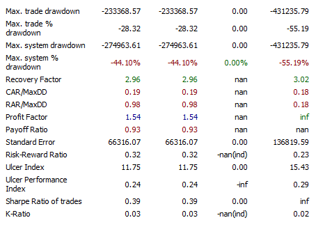

In the fast-paced world of financial markets, staying ahead requires more than just intuition and experience. This is where the importance of profit metrics, financial analysis, and algorithmic trading comes into play for investors. The integration of these concepts within an investment strategy allows investors to harness data-driven insights and make informed decisions. Financial markets are highly dynamic, with rapid fluctuations influenced by a multitude of factors ranging from economic reports to geopolitical events. In such an environment, the ability to accurately assess and predict market movements is a significant advantage.

Profit metrics serve as crucial indicators for evaluating the potential success of investments. Metrics such as gross profit margin, net profit margin, and return on investment (ROI) provide insights into the profitability and efficiency of financial endeavors. An understanding of these metrics enables investors to make strategic decisions that align with their financial goals. For instance, a high ROI may indicate a lucrative investment opportunity, whereas a declining net profit margin might signal underlying inefficiencies that require attention.



Simultaneously, financial analysis plays a vital role in the investment decision-making process. By dissecting financial statements through ratio analysis, trend analysis, and variance analysis, investors can glean insights into the stability, viability, and performance of different investments. This analytical approach reduces the risk of financial losses by offering an informed perspective on where and how to allocate resources effectively.

Algorithmic trading, or algo trading, represents a paradigm shift in how investors approach the markets. By employing advanced algorithms and automated systems, trades can be executed with unprecedented speed and precision. This technology not only enhances market efficiency but also opens up new avenues for maximizing profitability. Algorithms can analyze vast data sets in real-time to identify patterns and trends that would be impossible for a human to detect promptly.

Understanding these elements is key to maximizing returns and minimizing risks. Investors who leverage the interplay between profit metrics, financial analysis, and algorithmic trading are better positioned to achieve sustainable success. By embracing a data-driven approach, they can navigate the financial landscape with confidence and foresight.

Join us as we explore the symbiotic relationship between these components and their collective importance in modern trading practices. Whether you're an aspiring investor or a seasoned trader, grasping these concepts will empower you to make informed decisions that align with your investment objectives.

## Table of Contents

## Understanding Profit Metrics in Investment

Profit metrics are crucial indicators that help investors assess the potential success of their investments. These metrics provide a quantitative measure of various aspects of a business's financial performance, offering insights into the profitability, efficiency, and overall financial health of an investment. By understanding these metrics, investors can make more informed decisions about where to allocate their resources to maximize returns.

**Gross Profit Margin**: The gross profit margin is calculated by subtracting the cost of goods sold (COGS) from total revenue and then dividing the result by total revenue. This metric indicates how efficiently a company uses its resources to produce goods. The formula for the gross profit margin is:

$$
\text{Gross Profit Margin} = \left( \frac{\text{Revenue} - \text{COGS}}{\text{Revenue}} \right) \times 100
$$

A higher gross profit margin suggests that a company is more efficient at converting sales into actual profit.

**Net Profit Margin**: The net profit margin extends the gross profit margin by considering all expenses, taxes, and interest. It is calculated by dividing net profit by total revenue and represents the percentage of revenue that remains as profit after all costs are deducted. The formula is:

$$
\text{Net Profit Margin} = \left( \frac{\text{Net Profit}}{\text{Revenue}} \right) \times 100
$$

A robust net profit margin is often indicative of cost management and financial health, making it a vital metric for investors.

**Return on Investment (ROI)**: ROI measures the gain or loss generated by an investment relative to its cost. It's a simple formula that helps investors identify the efficiency of their capital investment:

$$
\text{ROI} = \left( \frac{\text{Gain from Investment} - \text{Cost of Investment}}{\text{Cost of Investment}} \right) \times 100
$$

ROI allows investors to compare the profitability of different investments and select the most rewarding options.

**Earnings Before Interest, Taxes, Depreciation, and Amortization (EBITDA)**: EBITDA provides a snapshot of a company's operating profitability by focusing on earnings before the deduction of interest, taxes, depreciation, and amortization. The formula is:

$$
\text{EBITDA} = \text{Net Income} + \text{Interest} + \text{Taxes} + \text{Depreciation} + \text{Amortization}
$$

By excluding non-operational expenses and non-cash items, EBITDA offers a clearer picture of a company's operational productivity.

These metrics, when used correctly, enable investors to evaluate profitability and operational success. For instance, an investor considering two companies might find that while both have a similar net profit, one has a higher gross profit margin, indicating better cost management. 

Real-world examples illustrate how strategic investments are guided by profit metrics. For example, if a company has a decreasing net profit margin over several quarters, this may signal rising costs or declining revenues, prompting investor scrutiny or action. Conversely, a steady increase in ROI across multiple projects might attract further investment as it reflects efficient capital use.

By integrating profit metrics into their analysis, investors can enhance their decision-making process, ensuring that their investment portfolio achieves desired financial outcomes.

## The Role of Financial Analysis in Investment Decision-Making

Financial analysis plays a pivotal role in investment decision-making, offering a thorough assessment of the financial stability, viability, and profitability of potential investments. By scrutinizing financial statements, investors can gain insights into an enterprise's performance and economic trends, which are critical for making informed investment choices. This analytical process helps in reducing the risk of financial losses by evaluating various aspects of the company's financial health through ratio analysis, trend analysis, and variance analysis.

### Key Components of Financial Analysis

1. **Ratio Analysis**: This is a quantitative method of gaining insight into a company's liquidity, operational efficiency, and profitability by comparing different numbers from the financial statements. Common ratios used include liquidity ratios like the Current Ratio and Quick Ratio, profitability ratios such as the Gross Profit Margin and Return on Equity (ROE), and solvency ratios like the Debt-to-Equity Ratio.

   **Example Python Code for Ratio Calculation:**
   ```python
   def current_ratio(current_assets, current_liabilities):
       return current_assets / current_liabilities

   def quick_ratio(current_assets, inventory, current_liabilities):
       return (current_assets - inventory) / current_liabilities

   # Usage
   current_assets = 50000
   inventory = 15000
   current_liabilities = 30000

   print("Current Ratio:", current_ratio(current_assets, current_liabilities))
   print("Quick Ratio:", quick_ratio(current_assets, inventory, current_liabilities))
   ```

2. **Trend Analysis**: This involves examining financial statements over a series of periods to detect patterns or trends in financial performance metrics. This analysis helps in forecasting future financial conditions and planning strategic actions. By reviewing changes in revenue, expenses, and profit margins over time, investors can identify whether a company's financial situation is improving or deteriorating.

3. **Variance Analysis**: This analytical tool compares actual financial outcomes to budgeted or expected performance. It helps in identifying discrepancies between planned financial goals and what is actually achieved, which can highlight areas that require management's attention. Significant variances may prompt a deeper investigation into the underlying causes, such as changes in market conditions or internal inefficiencies.

### Insights from Financial Analysis

Through these methods, investors can assess whether a company is financially sound, competitive in its industry, and capable of sustaining profitability. Ratio analysis offers a snapshot of relative performance and financial health, trend analysis provides a historical perspective of the company's financial trajectory, and variance analysis offers a detailed understanding of expected versus actual performance outcomes. Collectively, these analyses grant investors a comprehensive view of the company's operational and financial dynamics.

### Practical Application

To illustrate the practical application of financial analysis, consider a hypothetical case study of a technology company seeking investment. By conducting a thorough ratio analysis, investors might find that the company's profitability ratios are above industry averages, indicating efficient management and operations. Trend analysis could reveal consistent revenue growth over the past five years, suggesting a successful expansion strategy. However, a variance analysis might highlight a significant increase in operating expenses not aligned with budget projections, warranting further investigation into cost control measures.

In conclusion, financial analysis provides investors with vital insights necessary for making informed investment decisions. It allows them to navigate potential investments with a clearer understanding of financial health and prospects, thereby minimizing risks and optimizing returns.

## Investor Insights: Navigating the Financial Landscape

In a constantly evolving market environment, investors need insights that extend beyond basic financial metrics to make well-informed decisions and optimize their investment strategies. Acquiring a multifaceted understanding of macroeconomic trends, geopolitical events, and technological advancements is crucial in achieving this goal.

Macroeconomic trends provide a broad perspective on the overall economic environment, which can significantly influence investment choices. For instance, shifts in interest rates, inflation rates, and gross domestic product growth can impact the valuation of assets and the performance of various sectors. Staying informed about these trends helps investors anticipate market movements and adjust their portfolios accordingly. For example, an anticipated increase in interest rates might prompt investors to reduce exposure to sectors that are sensitive to borrowing costs, such as real estate and utilities.

Geopolitical events are another vital component of investor insights. Political stability, trade relations, and policy changes can have far-reaching effects on market conditions. Investors must monitor these developments to evaluate potential risks and opportunities. For example, trade negotiations between major economies might influence currency exchange rates, affecting multinational corporations' earnings that operate across borders. Understanding these dynamics allows investors to hedge against geopolitical risks or capitalize on emerging opportunities resulting from policy shifts.

Technological advancements have been a driving force behind the rapid transformation of industries and financial markets. Advancements in [artificial intelligence](/wiki/ai-artificial-intelligence), blockchain technology, and digital finance offer new avenues for investment as well as disrupt traditional businesses. By staying abreast of technological trends, investors can identify innovative companies poised for growth and assess the impact of technological changes on existing investments. For example, the rise of electric vehicles has significantly impacted investments in the automotive industry, presenting opportunities in battery technology and renewable energy sectors.

To leverage these insights effectively, investors can adopt strategies that incorporate diverse information sources. Engaging with expert analyses, attending industry conferences, and using data analytics tools can enhance their understanding of market conditions. Additionally, diversification across asset classes, sectors, and geographic regions can mitigate risks associated with specific trends or events, thereby strengthening portfolio resilience.

Practical advice from experienced investors underscores the importance of continuous learning and adaptability in navigating complex financial landscapes. They emphasize the necessity of maintaining a dynamic investment approach that responds to the latest economic indicators and industry shifts. By integrating a keen awareness of macroeconomic, geopolitical, and technological factors into their decision-making processes, investors can position themselves to capitalize on emerging opportunities and safeguard their investments against adverse developments.

The goal of gaining such comprehensive insights is to equip investors with the knowledge needed to navigate complex financial landscapes successfully, ultimately leading to more informed investment decisions and potentially higher returns.

## Algorithmic Trading: Revolutionizing Investment Strategies

Algorithmic trading, commonly referred to as algo trading, has transformed the landscape of investment strategies by leveraging advanced algorithms to automate the execution of trades. This approach enables transactions at high speed and accuracy, significantly enhancing market efficiency and potentially boosting profitability for investors.

The contribution of [algorithmic trading](/wiki/algorithmic-trading) to market efficiency is profound. By employing rapid trade executions, algo trading reduces the likelihood of human error and emotional bias in decision-making. It also helps in narrowing bid-ask spreads, increasing market [liquidity](/wiki/liquidity-risk-premium), and ensuring that prices reflect all available information almost instantaneously. This level of market precision is crucial for maintaining an efficient marketplace.

Different types of algorithms are utilized, each serving unique purposes and integrating seamlessly with trading platforms. Commonly used algorithms include:

1. **Trend-following algorithms:** These are simplistic in nature and rely on historical price data to predict future movements, utilizing indicators such as moving averages.

2. **Arbitrage algorithms:** These capitalize on price discrepancies across different markets or assets. By executing simultaneous buy and sell transactions, these algorithms exploit inefficiencies, thus ensuring price parity.

3. **Market-making algorithms:** These provide liquidity by continuously quoting buy and sell prices for assets. A market-making algorithm profits from the spread between the bid and ask price.

4. **Mean reversion algorithms:** These are based on the idea that asset prices tend to revert to their historical average over time. The algorithm buys when the price is low relative to its historical average and sells when it's high.

The integration of these algorithms into trading platforms is facilitated by API connections, which enable seamless data access and trade execution. Traders can write algorithms in languages such as Python using libraries like NumPy and Pandas for data analysis and Backtrader for [backtesting](/wiki/backtesting) strategies.

Backtesting is pivotal in algorithmic trading, as it involves simulating a trading strategy using past data to evaluate its effectiveness. It helps in identifying potential risks and rewards, thereby refining algorithms before they are deployed in live markets. A Python code snippet showcasing a simple backtesting framework is as follows:

```python
import backtrader as bt

class MyStrategy(bt.Strategy):
    def __init__(self):
        self.sma = bt.indicators.SimpleMovingAverage(self.data, period=15)

    def next(self):
        if self.sma > self.data.close:
            self.buy()
        elif self.sma < self.data.close:
            self.sell()

data = bt.feeds.YahooFinanceData(dataname='AAPL', fromdate=datetime(2020,1,1), todate=datetime(2021,1,1))
cerebro = bt.Cerebro()
cerebro.addstrategy(MyStrategy)
cerebro.adddata(data)
cerebro.run()
```

Risk management is equally critical within algorithmic trading. Algorithms must be programmed to react to market changes and anomalies, triggering stop-loss orders and adjusting portfolio allocations as necessary. Continuous optimization of algorithms is essential to account for evolving market conditions and technological advancements, ensuring sustained performance.

Real-world instances exemplify the transformative impact of algorithmic trading. High-frequency trading firms capitalize on fleeting opportunities unavailable to human traders due to their speed and [volume](/wiki/volume-trading-strategy) capabilities. Similarly, institutional investors employ complex algorithms to manage vast portfolios across global markets, illustrating the necessity of such technology in modern trading.

In conclusion, algorithmic trading stands as a cornerstone in revolutionizing investment strategies. By offering precise, efficient, and adaptive trading methodologies, it elevates investors' ability to navigate the complexities of modern financial markets effectively.

## Conclusion

Profit metrics, financial analysis, investor insights, and algorithmic trading form the bedrock of modern investment strategies. Understanding and effectively utilizing these components can significantly increase investors' chances of success in financial markets. Modern markets demand a data-driven approach, wherein investors quantify their portfolio performance using accurate profit metrics. Being well-versed in key metrics such as gross profit margin, net profit margin, return on investment (ROI), and EBITDA allows investors to evaluate the efficiency and profitability of their investments, ensuring optimal decision-making.

Simultaneously, financial analysis offers a deeper understanding of an entity's stability and growth prospects. Ratio analysis, trend examination, and variance analysis glean insights from financial statements, aiding investors in forecasting performance trends and identifying potential investment risks. As investors integrate these findings into their strategies, they can anticipate market dynamics and make informed choices that mitigate financial losses.

The evolving nature of technology, particularly in algorithmic trading, continues to reshape investment strategies. Algorithmic trading enhances market efficiency by executing trades at unprecedented speeds and with accuracy beyond human capability. Implementing algorithms that adapt to new data patterns ensures portfolio strategies remain robust and competitive. Importantly, the focus on backtesting and continuous optimization of algorithms is paramount, maximizing gains while controlling risks.

In an environment characterized by rapid technological advancements and changing economic conditions, staying educated and adaptive is essential. Continuous learning and refinement of strategies using all available tools—be it through leveraging financial analyses, harnessing algorithmic efficiencies, or drawing from seasoned investor insights—are critical for achieving greater profitability and security in the marketplace. We encourage investors to remain vigilant, embrace new technologies, and actively refine their investment approaches to thrive in the ever-changing financial landscape.

## References & Further Reading

[1]: Bergstra, J., Bardenet, R., Bengio, Y., & Kégl, B. (2011). ["Algorithms for Hyper-Parameter Optimization."](https://papers.nips.cc/paper/4443-algorithms-for-hyper-parameter-optimization) Advances in Neural Information Processing Systems 24.

[2]: ["Advances in Financial Machine Learning"](https://www.amazon.com/Advances-Financial-Machine-Learning-Marcos/dp/1119482089) by Marcos Lopez de Prado

[3]: ["Evidence-Based Technical Analysis: Applying the Scientific Method and Statistical Inference to Trading Signals"](https://www.amazon.com/Evidence-Based-Technical-Analysis-Scientific-Statistical/dp/0470008741) by David Aronson

[4]: ["Machine Learning for Algorithmic Trading"](https://github.com/stefan-jansen/machine-learning-for-trading) by Stefan Jansen

[5]: ["Quantitative Trading: How to Build Your Own Algorithmic Trading Business"](https://www.amazon.com/Quantitative-Trading-Build-Algorithmic-Business/dp/1119800064) by Ernest P. Chan