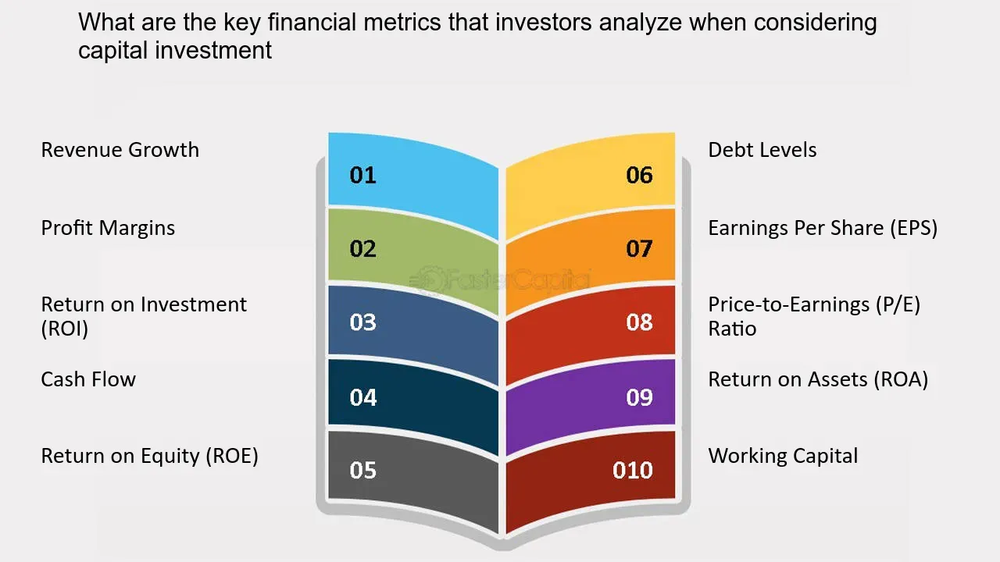

## Table of Contents

## What are profit metrics and why are they important for investors?

Profit metrics are numbers that show how much money a company is making. They help investors see if a business is doing well or not. Some common profit metrics are net profit, gross profit, and operating profit. These numbers tell investors how much money the company has left after paying for things like making products, running the business, and taxes.

These metrics are important for investors because they help them make smart choices about where to put their money. If a company has high profit metrics, it might be a good investment because it shows the company is making a lot of money. On the other hand, if the profit metrics are low, it might be a sign that the company is not doing well, and investors might want to be careful. By looking at these numbers, investors can decide if a company is worth investing in or if they should look for other opportunities.

## What is the difference between gross profit and net profit?

Gross profit and net profit are two important numbers that tell us about a company's money. Gross profit is what's left after a company pays for the things it needs to make its products or services. For example, if a company sells a toy for $20 and it costs $10 to make, the gross profit is $10. This number helps us see how well a company is doing at making and selling its products without thinking about other costs like rent or salaries.

Net profit, on the other hand, is what's left after the company pays for everything, not just the cost of making products. This includes things like rent, salaries, taxes, and other expenses. Using the same toy example, if the company has other costs that add up to $5, the net profit would be $5 ($10 gross profit minus $5 other costs). Net profit gives us a complete picture of how much money the company is really making after all its bills are paid. This is why investors often look at net profit to see if a company is doing well overall.

## How do you calculate the profit margin and what does it indicate?

To calculate the profit margin, you take the profit (either gross or net) and divide it by the total revenue, then multiply by 100 to get a percentage. For example, if a company makes $50,000 in profit and has $200,000 in total revenue, the profit margin is (50,000 / 200,000) * 100, which equals 25%. This percentage tells you how much of each dollar of revenue turns into profit.

The profit margin is important because it shows how efficiently a company is turning its sales into profit. A higher profit margin means the company is keeping more money from each sale after paying for everything. This can make the company more attractive to investors because it suggests the business is good at managing costs and making money. A lower profit margin might mean the company needs to find ways to cut costs or increase prices to improve its financial health.

## What is EBITDA and why is it a useful metric for investors?

EBITDA stands for Earnings Before Interest, Taxes, Depreciation, and Amortization. It's a way to measure how much money a company is making from its main business activities, without counting some other costs like interest on loans, taxes, and the wear and tear on equipment. To find EBITDA, you start with the company's earnings, then add back the money spent on interest, taxes, depreciation, and amortization.

EBITDA is useful for investors because it gives a clearer picture of a company's operating performance. By not including interest, taxes, depreciation, and amortization, investors can see how well the company is doing at its core business, without these other factors getting in the way. This makes it easier to compare different companies, even if they have different amounts of debt or different tax situations. It's a helpful tool for figuring out if a company is a good investment.

## How can Return on Equity (ROE) help in evaluating a company's profitability?

Return on Equity (ROE) is a number that shows how good a company is at making money from the money people have put into it. It tells you how much profit the company makes for each dollar of shareholder's equity. To find ROE, you take the company's net income and divide it by the shareholder's equity, then multiply by 100 to get a percentage. If a company has a high ROE, it means it's doing a great job at using the money it gets from investors to make more money.

ROE is important for investors because it helps them see if a company is a good place to put their money. A high ROE can mean the company is doing well and might be a good investment. But, it's also important to look at other things, like how much debt the company has, because a high ROE could sometimes be because of a lot of debt. By looking at ROE along with other numbers, investors can get a better idea of how profitable a company really is and make smarter choices about where to invest their money.

## What does Return on Assets (ROA) tell investors about a company's performance?

Return on Assets (ROA) tells investors how well a company is using its stuff to make money. It shows how much profit a company can make from each dollar of its assets, like buildings, machines, and money in the bank. To find ROA, you take the company's net income and divide it by its total assets, then multiply by 100 to get a percentage. A higher ROA means the company is good at turning its assets into profit.

ROA is important because it helps investors see if a company is using its resources well. If a company has a high ROA, it means it's doing a good job at making money from what it has. This can make the company more attractive to investors because it shows the business is efficient. But, it's also good to look at other numbers along with ROA to get a full picture of how the company is doing.

## How does the Price/Earnings (P/E) ratio relate to a company's profitability?

The Price/Earnings (P/E) ratio is a number that helps investors see how much they are paying for a company's earnings. It is found by dividing the price of a company's stock by its earnings per share. If a company's stock is $50 and its earnings per share are $5, the P/E ratio is 10. This means investors are willing to pay $10 for every dollar of the company's earnings. The P/E ratio doesn't directly measure a company's profitability, but it can tell investors if the stock is a good deal based on how much profit the company makes.

A low P/E ratio might mean the stock is a good buy because it's cheap compared to the company's earnings. But, it could also mean that investors think the company's future earnings will be low. A high P/E ratio might mean the stock is expensive, but it could also mean that investors expect the company to grow a lot and make more money in the future. So, while the P/E ratio doesn't show profitability directly, it helps investors understand how the market values the company's earnings and what they might expect in the future.

## What is the significance of the Operating Margin in assessing a company's financial health?

The Operating Margin is a number that shows how much money a company makes from its main business after paying for the costs of running that business. It's found by taking the operating income and dividing it by the total revenue, then multiplying by 100 to get a percentage. A high Operating Margin means the company is good at making money from what it does every day, without thinking about other costs like taxes or interest on loans. This is important because it shows how well the company is managing its day-to-day operations.

Investors look at the Operating Margin to see if a company is healthy and efficient. If the Operating Margin is high, it means the company is doing a good job at keeping costs down and making money from its main business. This can make the company more attractive to investors because it shows the business is strong and can handle its costs well. On the other hand, a low Operating Margin might mean the company needs to find ways to cut costs or increase prices to improve its financial health.

## How can investors use Free Cash Flow (FCF) to gauge a company's profitability?

Free Cash Flow (FCF) is the money a company has left after it pays for everything it needs to keep running and growing. It's what's left over after the company pays for things like making products, paying employees, and buying new equipment. Investors look at FCF to see how much money the company can use for other things, like paying off debts, giving money back to shareholders, or saving for the future. A high FCF means the company is making a lot of money and can do more with it, which is a good sign for investors.

FCF is important because it shows the real money a company is making, not just the numbers on paper. If a company has a lot of FCF, it means it's doing well at making money and managing its costs. This can make the company more attractive to investors because it shows the business is healthy and has the money to grow or pay dividends. On the other hand, if FCF is low or negative, it might mean the company is spending more than it's making, which could be a warning sign for investors.

## What are some advanced profit metrics used by expert investors?

Expert investors often look at advanced profit metrics like Economic Value Added (EVA) and Return on Invested Capital (ROIC) to get a deeper understanding of a company's performance. EVA measures how much value a company creates beyond the cost of its capital. It's found by taking the company's net operating profit after taxes and subtracting the cost of the capital used to make that profit. A positive EVA means the company is creating value for its shareholders, which is a good sign for investors. ROIC, on the other hand, shows how well a company is using the money it has invested in its business. It's calculated by dividing the company's net operating profit after taxes by the total capital invested. A high ROIC means the company is good at turning its investments into profits.

Another advanced metric that expert investors might use is the Cash Return on Capital Invested (CROCI). CROCI focuses on the cash flow generated by a company's operations relative to the capital invested in the business. It's a useful metric because it looks at actual cash flows rather than accounting profits, giving a clearer picture of a company's financial health. By using these advanced metrics, expert investors can make more informed decisions about a company's profitability and potential for growth. These metrics help them see beyond basic profit numbers and understand how effectively a company is using its resources to create value.

## How do sector-specific profit metrics influence investment decisions?

Sector-specific profit metrics are important numbers that help investors decide where to put their money in different industries. Each industry has its own way of making money and its own costs, so the numbers that matter can be different. For example, in the tech industry, investors might look at things like the ratio of research and development costs to revenue to see how much a company is spending on new ideas. In the retail sector, they might look at same-store sales growth to see if stores are doing better over time. By using these specific metrics, investors can get a better idea of how well a company is doing compared to others in the same industry.

These metrics help investors make smart choices because they show what's important in each sector. For example, in the energy sector, investors might look at the reserve replacement ratio to see if a company can keep finding new oil or gas to replace what it's using. If this number is high, it means the company is doing well and might be a good investment. On the other hand, if it's low, it might mean the company will have trouble in the future. By understanding these sector-specific metrics, investors can pick companies that are doing well in their industry and have a better chance of making money.

## What are the limitations of relying solely on profit metrics for investment analysis?

Profit metrics are helpful numbers that show how much money a company is making. But, if investors only look at these numbers, they might miss other important things about a company. For example, profit metrics don't tell you about the company's debt. A company might look like it's making a lot of money, but if it has a lot of debt, it might be in trouble. Also, profit metrics don't show if the company is growing or if it's losing customers. So, just looking at profit numbers might not give you the whole picture of how the company is doing.

Another problem with only using profit metrics is that they can be changed by things like accounting rules or one-time events. For example, a company might sell a building and show a big profit, but that doesn't mean it's doing well every day. Also, different countries have different rules for how to count profits, so comparing companies from different places can be hard. Investors need to look at other things, like how the company is run, what the market is doing, and what other people think about the company, to make the best choices about where to put their money.

## What are the key aspects of understanding profit metrics in investment?

Profit metrics are crucial indicators that help investors assess the potential success of their investments. These metrics provide a quantitative measure of various aspects of a business's financial performance, offering insights into the profitability, efficiency, and overall financial health of an investment. By understanding these metrics, investors can make more informed decisions about where to allocate their resources to maximize returns.

**Gross Profit Margin**: The gross profit margin is calculated by subtracting the cost of goods sold (COGS) from total revenue and then dividing the result by total revenue. This metric indicates how efficiently a company uses its resources to produce goods. The formula for the gross profit margin is:

$$
\text{Gross Profit Margin} = \left( \frac{\text{Revenue} - \text{COGS}}{\text{Revenue}} \right) \times 100
$$

A higher gross profit margin suggests that a company is more efficient at converting sales into actual profit.

**Net Profit Margin**: The net profit margin extends the gross profit margin by considering all expenses, taxes, and interest. It is calculated by dividing net profit by total revenue and represents the percentage of revenue that remains as profit after all costs are deducted. The formula is:

$$
\text{Net Profit Margin} = \left( \frac{\text{Net Profit}}{\text{Revenue}} \right) \times 100
$$

A robust net profit margin is often indicative of cost management and financial health, making it a vital metric for investors.

**Return on Investment (ROI)**: ROI measures the gain or loss generated by an investment relative to its cost. It's a simple formula that helps investors identify the efficiency of their capital investment:

$$
\text{ROI} = \left( \frac{\text{Gain from Investment} - \text{Cost of Investment}}{\text{Cost of Investment}} \right) \times 100
$$

ROI allows investors to compare the profitability of different investments and select the most rewarding options.

**Earnings Before Interest, Taxes, Depreciation, and Amortization (EBITDA)**: EBITDA provides a snapshot of a company's operating profitability by focusing on earnings before the deduction of interest, taxes, depreciation, and amortization. The formula is:

$$
\text{EBITDA} = \text{Net Income} + \text{Interest} + \text{Taxes} + \text{Depreciation} + \text{Amortization}
$$

By excluding non-operational expenses and non-cash items, EBITDA offers a clearer picture of a company's operational productivity.

These metrics, when used correctly, enable investors to evaluate profitability and operational success. For instance, an investor considering two companies might find that while both have a similar net profit, one has a higher gross profit margin, indicating better cost management. 

Real-world examples illustrate how strategic investments are guided by profit metrics. For example, if a company has a decreasing net profit margin over several quarters, this may signal rising costs or declining revenues, prompting investor scrutiny or action. Conversely, a steady increase in ROI across multiple projects might attract further investment as it reflects efficient capital use.

By integrating profit metrics into their analysis, investors can enhance their decision-making process, ensuring that their investment portfolio achieves desired financial outcomes.

## References & Further Reading

[1]: Bergstra, J., Bardenet, R., Bengio, Y., & Kégl, B. (2011). ["Algorithms for Hyper-Parameter Optimization."](https://papers.nips.cc/paper/4443-algorithms-for-hyper-parameter-optimization) Advances in Neural Information Processing Systems 24.

[2]: ["Advances in Financial Machine Learning"](https://www.amazon.com/Advances-Financial-Machine-Learning-Marcos/dp/1119482089) by Marcos Lopez de Prado

[3]: ["Evidence-Based Technical Analysis: Applying the Scientific Method and Statistical Inference to Trading Signals"](https://www.amazon.com/Evidence-Based-Technical-Analysis-Scientific-Statistical/dp/0470008741) by David Aronson

[4]: ["Machine Learning for Algorithmic Trading"](https://github.com/stefan-jansen/machine-learning-for-trading) by Stefan Jansen

[5]: ["Quantitative Trading: How to Build Your Own Algorithmic Trading Business"](https://www.amazon.com/Quantitative-Trading-Build-Algorithmic-Business/dp/1119800064) by Ernest P. Chan