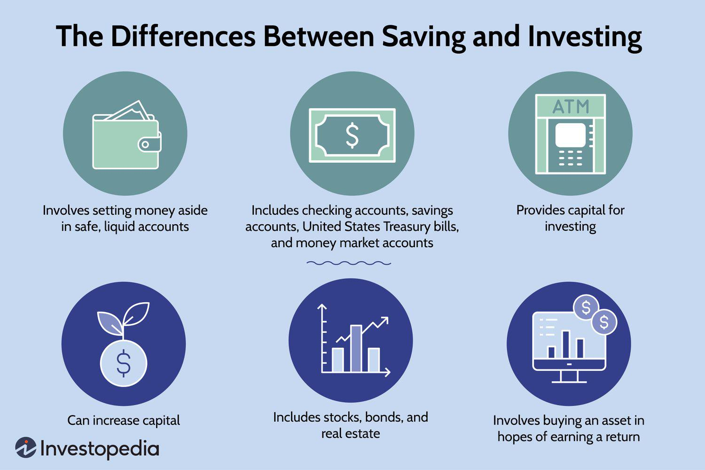

In the ever-evolving world of finance, understanding how to efficiently manage investments is crucial to building and preserving wealth. The landscape of investment is diverse and dynamic, offering a multitude of opportunities and challenges for individuals and institutions alike. At the core of successful investment management is the ability to adapt and integrate both traditional and modern strategies to optimize financial outcomes.

This article aims to explore the convergence of traditional investment methods like bonds with modern technologies such as algorithmic trading. Bonds have long been a staple in conservative investment portfolios due to their relative stability and predictable income streams. However, the rapid advancement of technology has introduced algorithmic trading—a technique that utilizes computerized systems to execute trades at optimal conditions—reshaping how investments are managed in today's financial markets.



We will explore the essentials of investing in bonds, highlighting their role in a balanced investment strategy, the potential risks involved, and strategies for maximizing their benefits. The role of financial advisors will also be examined to understand how they help investors navigate the complexities of bond markets by aligning investment choices with individual risk tolerances and financial objectives.

Simultaneously, algorithmic trading is transforming investment strategies by leveraging computational algorithms for speed and efficiency, thus opening new avenues for maximizing returns while minimizing risk. By embracing both traditional and innovative approaches, investors can craft strategies that effectively blend predictability with agility.

Our goal is to provide a comprehensive guide for both novice investors and experienced traders looking to enhance their portfolios using the latest tools and insights. This article seeks to empower readers with the knowledge needed to make informed investment decisions, balancing the stability of bonds with the innovation of algorithmic trading.

Let’s unravel the complexities of these investment avenues and see how they can align with your financial goals. By understanding and integrating these strategies, investors can position themselves to not only protect their wealth but also foster growth in a rapidly changing financial world.

## Table of Contents

## Understanding Bonds as an Investment

Bonds are fundamental instruments in finance, serving as a means for entities such as governments and corporations to raise capital. They represent a loan made by an investor to a borrower, typically characterized by a defined term and interest payments. Bonds are regarded for their ability to provide consistent income and relatively stable returns, making them a staple in conservative investment portfolios.

The nature of bonds can be exemplified by their structure. A typical bond consists of three main components: the principal, the coupon rate, and the maturity date. The principal, also known as the face value, is the amount the bond issuer agrees to repay the bondholder at the end of the bond term. The coupon rate is the annual [interest rate](/wiki/interest-rate-trading-strategies) paid on the bond's face value, expressed as a percentage, and the maturity date is when the bond's principal is due to be repaid.

Various types of bonds cater to different investment needs. Government bonds, such as U.S. Treasury bonds, are renowned for their safety, being backed by the full faith and credit of the issuing government. Corporate bonds, issued by companies, typically offer higher yields compared to government bonds due to the increased risk they [carry](/wiki/carry-trading). There also exist municipal bonds, offering tax advantages, and zero-coupon bonds, which do not pay periodic interest but are issued at a discount to their face value.

The risk-return tradeoff in bond investing is a critical consideration. Interest rate risk arises from the inverse relationship between bond prices and interest rates. When interest rates rise, bond prices typically fall and vice versa. This can have pronounced effects on the value of a bond portfolio, particularly for bonds with longer maturities. Credit risk reflects the possibility of the bond issuer defaulting on its payments. This risk is often assessed through credit ratings provided by agencies like Moody's and Standard & Poor's. Liquidity risk involves the ease with which a bond can be bought or sold without significantly affecting its price, which can be a concern for certain corporate or municipal bonds.

Additionally, investors must assess the maturity and callability of bonds. The maturity affects the bond's sensitivity to interest rate changes, with longer maturities generally introducing greater [volatility](/wiki/volatility-trading-strategies). Callable bonds give the issuer the option to repay the principal before maturity, typically in environments where interest rates have fallen. This can limit potential returns as the bonds may be called away when they are most beneficial to investors.

In summary, bonds can play a vital role in a diversified investment strategy, offering potential for steady income and risk management. When appropriately selected and managed, bonds can align with an investor’s financial goals, mitigating risks while providing a balanced approach to wealth preservation.

## Role of Financial Advisors in Bond Investing

Financial advisors are instrumental in guiding investors through the intricate process of bond investing. Their role is multifaceted, providing valuable insights and expertise to help investors navigate the complexities associated with fixed-income securities. One of the primary functions of financial advisors is to assess an individual's risk tolerance, a crucial step in ensuring that the chosen bonds align with the investor's financial goals. This involves evaluating the investor's capacity and willingness to endure price volatility and potential losses, allowing for the selection of bonds that provide an optimal balance between risk and return.

Credit quality assessment is another critical area where financial advisors offer their expertise. They evaluate the quality of bonds through credit ratings and issuer reliability, leveraging ratings from agencies such as Standard & Poor's, Moody's, and Fitch Ratings. These evaluations are essential for understanding the credit risk associated with a bond, which refers to the likelihood of the issuer defaulting on its debt obligations. Advisors provide insights into how these ratings translate into risk levels and potential yield, assisting investors in making informed decisions.

Additionally, financial advisors are adept at analyzing a bond's position within the issuer's capital structure, which is crucial for risk management in case of default. Bonds higher in the capital structure, such as secured bonds, often have a lower risk compared to subordinated or unsecured bonds. Understanding this hierarchy helps advisors recommend bonds that align with their clients' risk appetites.

Professional advisors also play a significant role in monitoring bond performance and making necessary adjustments to a portfolio. The bond market is dynamic, and factors such as interest rate fluctuations, economic conditions, and issuer-specific events can impact bond values. Advisors track these variables and make strategic changes to the bond holdings, ensuring the portfolio remains aligned with the investor’s overall financial objectives.

In summary, financial advisors offer indispensable services to investors engaging in bond investments. By evaluating risk tolerance, credit quality, and bond structure, and by actively managing portfolio performance, they provide tailored advice that helps optimize investment outcomes. This guidance is particularly valuable in the complex and often volatile landscape of bond investing.

## Algorithmic Trading: Transforming Investment Strategies

Algorithmic trading employs computational algorithms to automate trading activities, thereby providing enhanced speed and efficiency within financial markets. These algorithms analyze a multitude of market variables to decide when and how to execute trades, often far faster than a human could. One of the fundamental strategies used in [algorithmic trading](/wiki/algorithmic-trading) is [arbitrage](/wiki/arbitrage), which exploits the price differences of the same asset across different markets to gain profit. Market-making, another popular strategy, involves quoting both a buy and a sell price in a financial instrument, profiting from the bid-ask spread.

The integration of [artificial intelligence](/wiki/ai-artificial-intelligence) (AI) and [machine learning](/wiki/machine-learning) (ML) has significantly transformed algorithmic trading. AI and ML technologies enable the creation of adaptive trading algorithms that can learn and evolve based on market conditions. These advanced algorithms can process vast amounts of data quickly, identifying patterns and insights that would be invisible to traditional analysis methods. For instance, machine learning models can be trained to predict market trends based on historical data, enhancing the algorithm's decision-making process.

Despite the advantages, there are inherent risks in algorithmic trading. Technical failures, such as system errors or connectivity issues, can impede trade execution, leading to financial losses. Additionally, algorithms can contribute to market volatility, especially during rapid market movements, as seen in flash crashes. It is essential for investors to implement robust risk management strategies and regularly test their algorithms to mitigate these risks.

Individual investors have increasing access to algorithmic trading through various tools and platforms. These platforms provide user-friendly environments where investors can design and test their algorithms using historical data before deploying them in live markets. Some advanced platforms offer pre-built algorithms and customizable templates, allowing investors with limited programming skills to participate in algorithmic trading. Python, a popular programming language in finance, can be used for developing trading algorithms. A simple example of a moving average crossover strategy in Python is as follows:

```python
import pandas as pd

# Sample data
data = pd.read_csv('market_data.csv')

# Calculate moving averages
data['MA50'] = data['Close'].rolling(window=50).mean()
data['MA200'] = data['Close'].rolling(window=200).mean()

# Generate trading signals
data['Signal'] = 0
data['Signal'][50:] = np.where(data['MA50'][50:] > data['MA200'][50:], 1, -1)

# Backtest
data['Position'] = data['Signal'].shift()

# Calculate returns
data['Market Returns'] = data['Close'].pct_change()
data['Strategy Returns'] = data['Position'] * data['Market Returns']

# Performance metrics
cumulative_strategy_returns = (1 + data['Strategy Returns']).cumprod()
print('Cumulative Strategy Returns:', cumulative_strategy_returns.iloc[-1])
```

This script calculates the 50-day and 200-day moving averages and generates buy or sell signals based on their crossover. Such strategies, when rigorously tested and adapted, can constitute a crucial part of a sophisticated investment strategy, demonstrating the transformative potential of algorithmic trading.

## Integrating Bonds and Algorithmic Trading in a Portfolio

Combining traditional bond investing with algorithmic trading presents a sophisticated approach to optimizing portfolio performance. This integration allows investors to exploit the stability of bonds while leveraging the speed and efficiency of algorithmic trading strategies.

Balancing bond investments with algorithm-driven trades requires a nuanced understanding of both assets. Bonds offer predictable income through interest payments and are less volatile compared to equities. Conversely, algorithmic trading strategies can quickly react to market changes, providing opportunities for higher returns. To manage risk and return effectively, investors should allocate a portion of their portfolio to bonds, ensuring stability, while employing algorithmic trading to capture short-term gains and market efficiencies.

Diversification remains a cornerstone of investment strategy. By combining bonds with algorithmic trading, investors introduce both stability and flexibility into their portfolios. Bonds act as a hedge against market downturns, often maintaining their value or even appreciating during periods of equity market stress. Meanwhile, algorithmic trading can exploit inefficiencies and generate returns during both calm and volatile market conditions, reducing overall portfolio risk.

Understanding one's investment horizon is crucial in aligning bond maturities with algorithmic strategies. The investment horizon dictates the selection of bond maturities to ensure that assets are available when needed. Shorter horizons might favor shorter maturity bonds or those with higher [liquidity](/wiki/liquidity-risk-premium), thereby preserving flexibility. Algorithmic trading can complement this by providing dynamic adjustments that match market conditions with the investment horizon. For instance, shorter-term trading strategies may be more suitable for investors with shorter horizons, while longer-term algorithms can help those with extended horizons to capture trends over time.

Technology plays a vital role in monitoring and rebalancing investment portfolios. Modern platforms equipped with algorithmic tools allow for continuous assessment of market conditions and portfolio performance. Utilizing algorithms, investors can automate the rebalancing process, ensuring that their portfolios remain aligned with predetermined financial goals. This might involve periodically realigning the bond and equity components to maintain a desired risk profile or altering algorithmic parameters in response to evolving market dynamics.

In conclusion, aligning bond investments with algorithmic trading strategies offers a compelling method to enhance risk-adjusted returns and ensure a diversified approach to meet financial objectives. By leveraging the complementary strengths of bonds and algorithmic trading, investors can build portfolios that are resilient to market fluctuations while poised to capitalize on new opportunities.

## Conclusion

Investing in bonds and employing algorithmic trading strategies provides an intriguing blend of stability and innovation within an investment portfolio. Bonds, typically offering fixed income and reduced volatility, represent a stable investment vehicle, often sought for predictability and risk management. They serve as a solid foundation for wealth preservation, especially during volatile market periods. Algorithmic trading, on the other hand, introduces a modern twist, leveraging advanced computational tools to enhance trading efficiency and exploit market opportunities with precision. 

The distinct advantages of these approaches are evident in their contribution to a diversified investment strategy. Bonds offer the security of regular interest payments and principal protection, depending largely on the issuer's creditworthiness and the bond's maturity profile. Algorithmic trading, with its ability to process and react to market data at exceptional speeds, can capture momentary inefficiencies, optimizing trading outcomes. This synergy allows investors to mitigate risk through bonds while pursuing potentially higher returns via algorithmic strategies.

To succeed, it is crucial for investors to stay informed and flexible amidst the rapidly evolving financial environment. Technological advancements and market dynamics are continuously shaping investment strategies. By keeping abreast of these changes, investors can identify and harness new opportunities, adapting their portfolios to enhance financial outcomes. 

Embracing the potential of both bonds and algorithmic trading requires the right tools and knowledge. Investors equipped with comprehensive insights and access to innovative trading platforms can develop a balanced approach to meet diverse investment objectives. Whether aiming for income stability, capital growth, or a combination of both, this integrated strategy empowers investors to achieve desired financial goals. Together, bonds and algorithmic trading represent not just a coexistence of traditional and cutting-edge methods, but an effective means to navigate and thrive in today's complex markets.

## References & Further Reading

[1]: Fabozzi, F. J. (2012). ["Bond Markets, Analysis, and Strategies"](https://books.google.com/books/about/Bond_Markets_Analysis_and_Strategies_ten.html?id=bQpNEAAAQBAJ). Prentice Hall.

[2]: Cartea, Á., Jaimungal, S., & Penalva, J. (2015). ["Algorithmic and High-Frequency Trading"](https://assets.cambridge.org/97811070/91146/frontmatter/9781107091146_frontmatter.pdf). Cambridge University Press.

[3]: Lopez de Prado, M. (2018). ["Advances in Financial Machine Learning"](https://www.amazon.com/Advances-Financial-Machine-Learning-Marcos/dp/1119482089). Wiley.

[4]: Chan, E. (2009). ["Quantitative Trading: How to Build Your Own Algorithmic Trading Business"](https://github.com/ftvision/quant_trading_echan_book). Wiley.

[5]: Aronson, D. R. (2006). ["Evidence-Based Technical Analysis: Applying the Scientific Method and Statistical Inference to Trading Signals"](https://www.amazon.com/Evidence-Based-Technical-Analysis-Scientific-Statistical/dp/0470008741). Wiley.